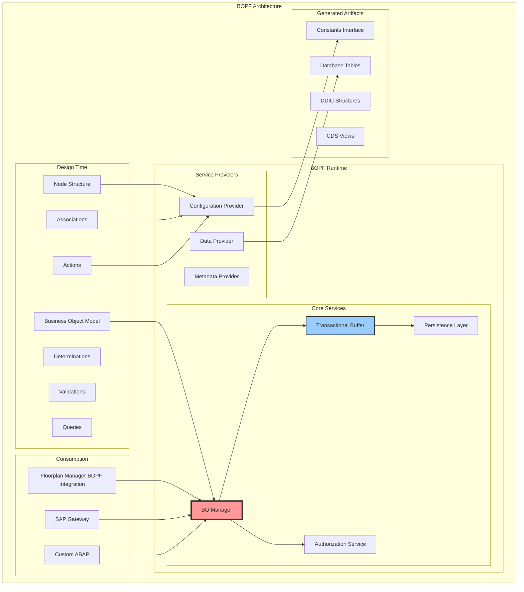
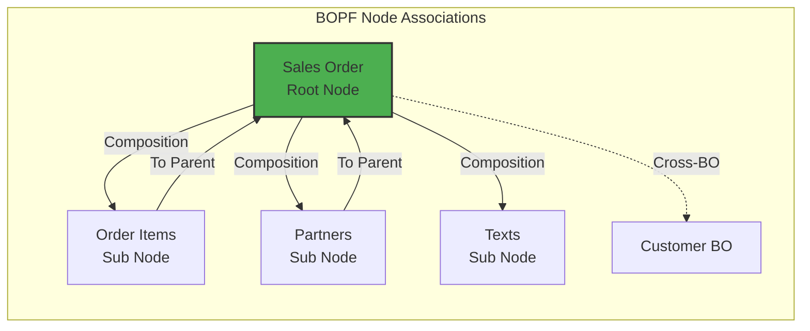
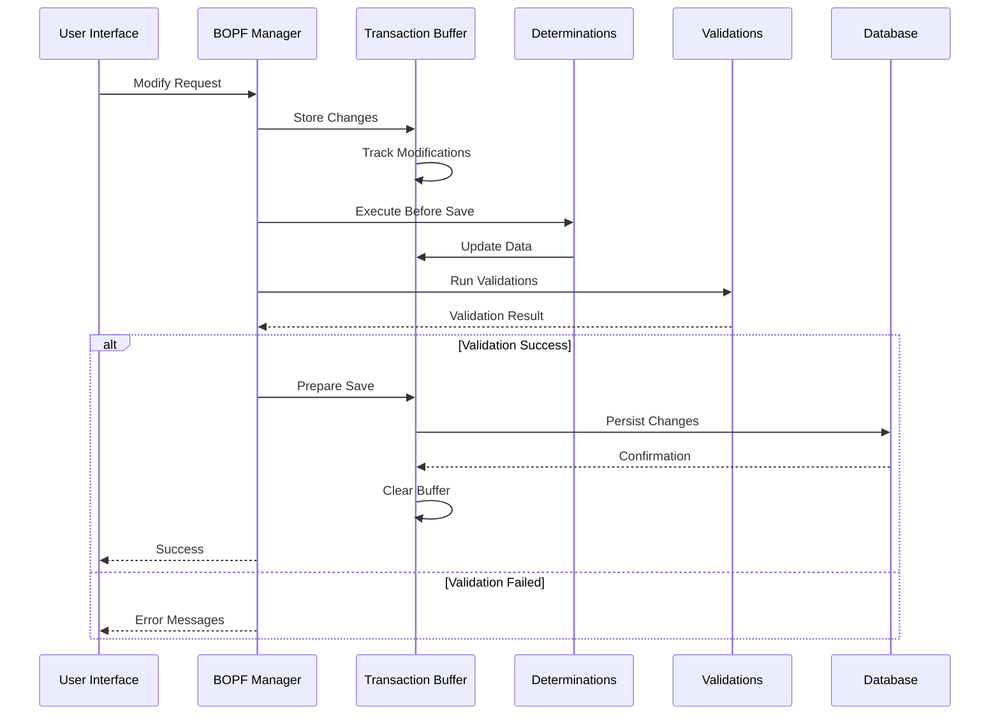
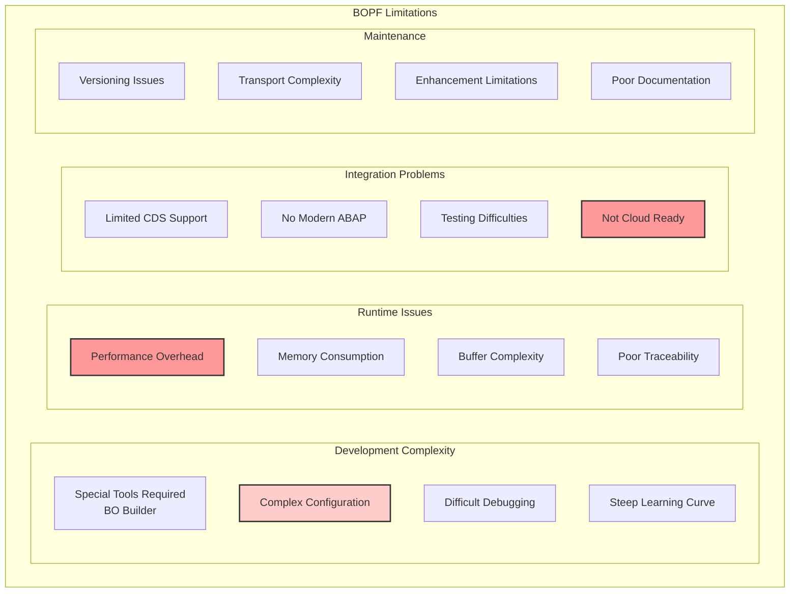
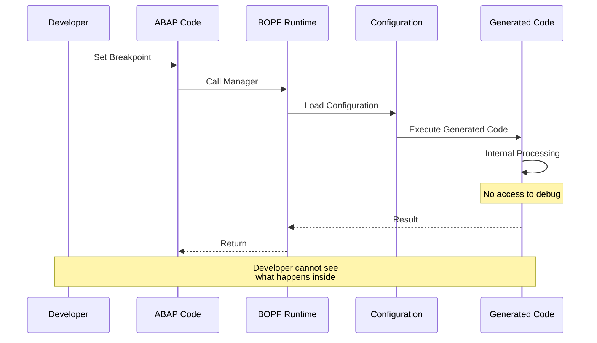
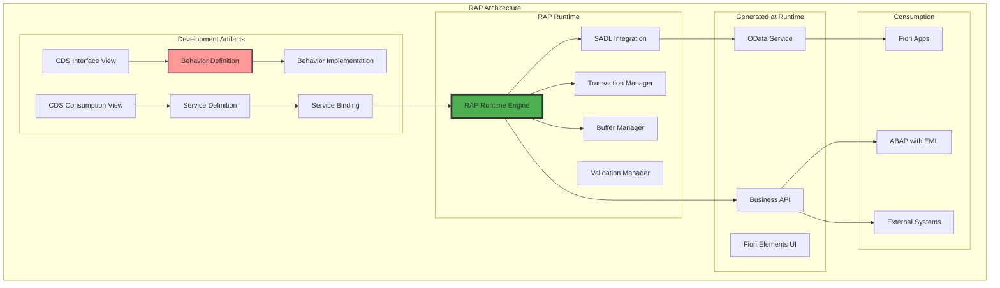
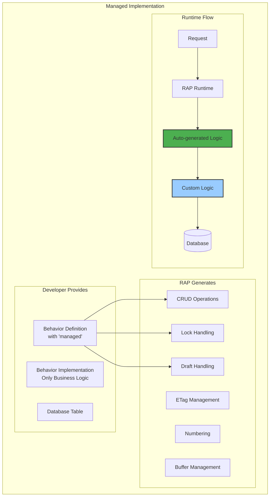
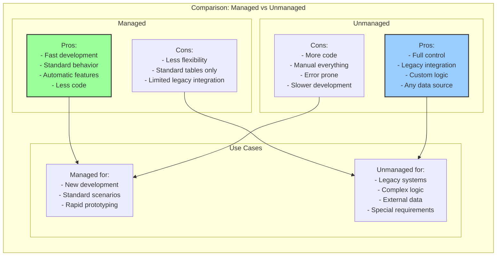
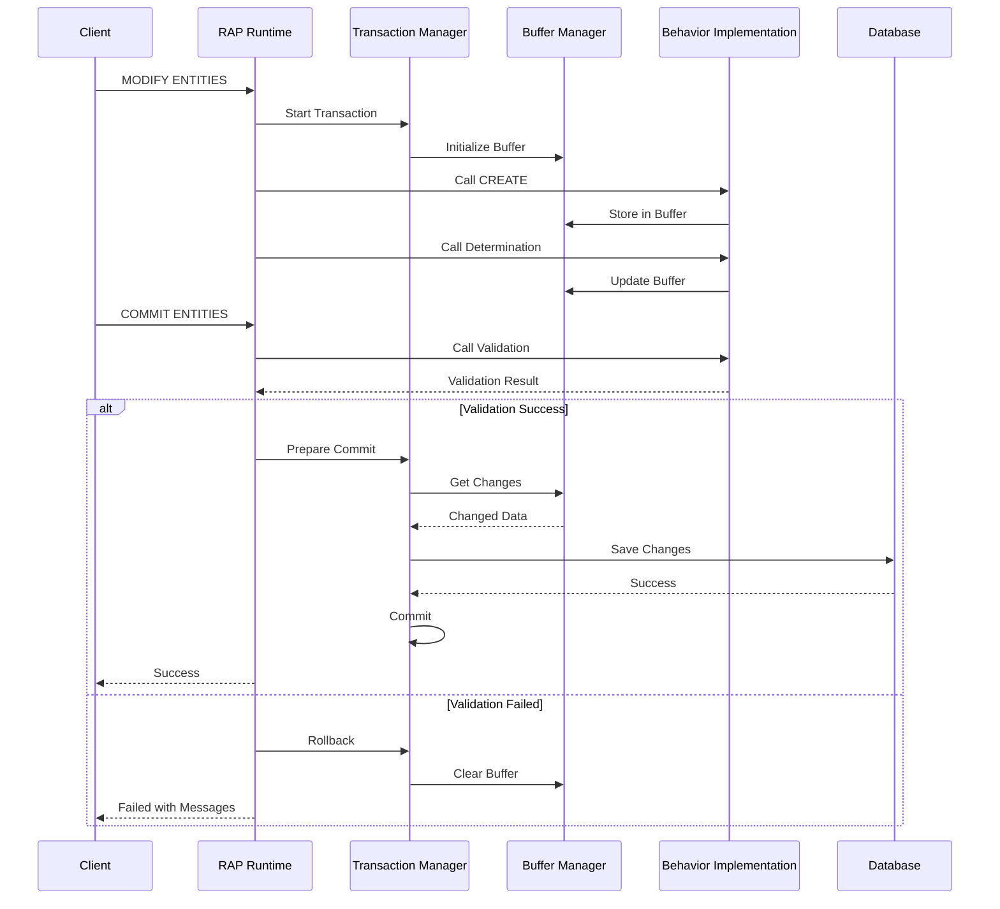
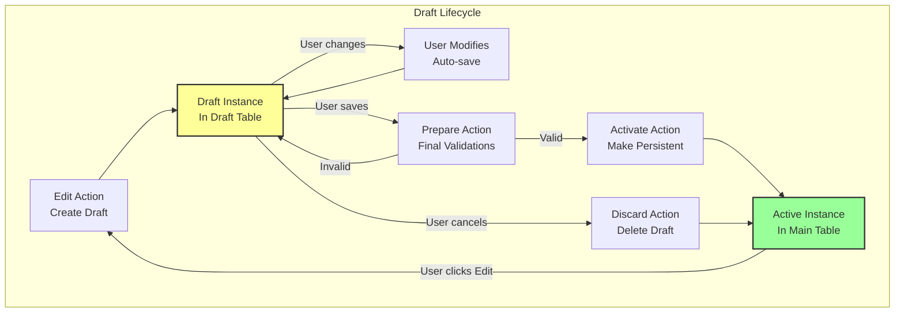

# Глава 10: От BOPF к RAP - эволюция бизнес-объектов

## 10.1. BOPF: конфигурационный подход

Business Object Processing Framework (BOPF) был представлен SAP как унифицированный фреймворк для создания и управления бизнес-объектами. Основная идея заключалась в декларативном подходе: разработчик конфигурирует бизнес-объект через специальные инструменты, а фреймворк генерирует необходимую инфраструктуру.

### Архитектура BOPF



### Основные концепции BOPF

**Узлы (Nodes)** - основные строительные блоки бизнес-объекта:

```abap
* Пример структуры узла BOPF
TYPES: BEGIN OF ts_sales_order_node,
         key         TYPE /bobf/conf_key,  " Технический ключ BOPF
         db_key      TYPE vbeln,           " Бизнес-ключ
         order_date  TYPE erdat,
         customer    TYPE kunnr,
         total_value TYPE netwr,
         currency    TYPE waerk,
         status      TYPE char2,
       END OF ts_sales_order_node.
```

**Ассоциации** связывают узлы между собой:



### Транзакционная модель BOPF



### Конфигурация бизнес-объекта

```abap
* Использование BOPF Manager
DATA: lo_manager      TYPE REF TO /bobf/if_tra_service_manager,
      lt_key          TYPE /bobf/t_frw_key,
      lt_sales_order  TYPE TABLE OF ts_sales_order_node,
      lo_message      TYPE REF TO /bobf/if_frw_message.

" Получение экземпляра менеджера
lo_manager = /bobf/cl_tra_serv_mgr_factory=>get_service_manager(
  /scmg/if_constant=>sc_bo_key ).

" Чтение данных
lo_manager->retrieve(
  EXPORTING
    iv_node_key     = /scmg/if_constant=>sc_node-root
    it_key          = lt_key
  IMPORTING
    et_data         = lt_sales_order
    eo_message      = lo_message ).

" Модификация данных
lo_manager->modify(
  EXPORTING
    iv_node_key     = /scmg/if_constant=>sc_node-root
    iv_key          = ls_key
    is_data         = ls_sales_order
    iv_root_key     = ls_root_key
  IMPORTING
    eo_message      = lo_message ).

" Сохранение транзакции
lo_manager->save(
  IMPORTING
    eo_message = lo_message
    ev_rejected = lv_rejected ).
```

### Действия и детерминации

```abap
* Пример детерминации BOPF
CLASS lcl_d_calculate_total IMPLEMENTATION.
  METHOD /bobf/if_frw_determination~execute.
    DATA: lt_sales_order TYPE TABLE OF ts_sales_order_node,
          lt_items       TYPE TABLE OF ts_item_node.
    
    " Получение данных корневого узла
    io_read->retrieve(
      EXPORTING
        iv_node   = is_ctx-node_key
        it_key    = it_key
      IMPORTING
        et_data   = lt_sales_order ).
    
    " Получение элементов через ассоциацию
    io_read->retrieve_by_association(
      EXPORTING
        iv_node                 = is_ctx-node_key
        it_key                  = it_key
        iv_association          = /scmg/if_constant=>sc_association-root-items
      IMPORTING
        et_data                 = lt_items ).
    
    " Расчет суммы
    LOOP AT lt_sales_order REFERENCE INTO DATA(lr_order).
      lr_order->total_value = 0.
      LOOP AT lt_items INTO DATA(ls_item) 
        WHERE parent_key = lr_order->key.
        lr_order->total_value += ls_item-net_value.
      ENDLOOP.
      
      " Обновление через modify
      io_modify->update(
        iv_node = is_ctx-node_key
        iv_key  = lr_order->key
        is_data = lr_order->* ).
    ENDLOOP.
  ENDMETHOD.
ENDCLASS.
```

## 10.2. Ограничения и проблемы BOPF

Несмотря на мощные возможности, BOPF имел ряд серьезных ограничений, которые привели к его устареванию:

### Архитектурные проблемы



### Проблемы производительности

```abap
* Типичный анти-паттерн BOPF - множественные вызовы retrieve
METHOD get_order_details_bopf.
  " Проблема 1: Отдельный вызов для каждого узла
  lo_manager->retrieve(
    EXPORTING iv_node_key = sc_node-root
              it_key      = lt_order_keys
    IMPORTING et_data     = lt_orders ).
  
  " Проблема 2: N+1 запросов для ассоциаций
  LOOP AT lt_orders INTO ls_order.
    lo_manager->retrieve_by_association(
      EXPORTING iv_node        = sc_node-root
                it_key         = VALUE #( ( key = ls_order-key ) )
                iv_association = sc_association-root-items
      IMPORTING et_data        = lt_items ).
    
    " Проблема 3: Еще больше вызовов для вложенных данных
    LOOP AT lt_items INTO ls_item.
      lo_manager->retrieve_by_association(
        EXPORTING iv_node        = sc_node-items  
                  it_key         = VALUE #( ( key = ls_item-key ) )
                  iv_association = sc_association-items-schedule_lines
        IMPORTING et_data        = lt_schedule ).
    ENDLOOP.
  ENDLOOP.
  " Результат: сотни запросов для простой операции
ENDMETHOD.
```

### Сложность отладки



### Несовместимость с современным ABAP

```abap
* BOPF не поддерживает современный синтаксис
" Это НЕ работает с BOPF:
SELECT FROM demo_sales_order
  FIELDS order_id,
         customer,
         total_value
  WHERE status = 'OPEN'
  INTO TABLE @DATA(lt_orders).

" Вместо этого приходится использовать:
DATA: lt_key TYPE /bobf/t_frw_key,
      lt_data TYPE TABLE OF ts_order.

lo_manager->query(
  EXPORTING
    iv_query_key    = sc_query-select_by_status
    it_filter_key   = VALUE #( ( attribute_name = 'STATUS' 
                                sign = 'I' 
                                option = 'EQ' 
                                low = 'OPEN' ) )
  IMPORTING
    et_key          = lt_key ).

lo_manager->retrieve(
  EXPORTING
    iv_node_key     = sc_node-root
    it_key          = lt_key
  IMPORTING
    et_data         = lt_data ).
```

## 10.3. RAP: код как конфигурация

RESTful ABAP Programming Model (RAP) представляет собой революционный подход, где бизнес-объекты определяются непосредственно в коде ABAP, а не через внешнюю конфигурацию.

### Архитектура RAP



### Базовая структура RAP

```abap
* 1. CDS Interface View
@AccessControl.authorizationCheck: #CHECK
@EndUserText.label: 'Sales Order Interface'
define root view entity ZI_SalesOrder
  as select from vbak
  composition [0..*] of ZI_SalesOrderItem as _Items
{
  key vbeln as SalesOrder,
      erdat as OrderDate,
      ernam as CreatedBy,
      kunnr as Customer,
      @Semantics.amount.currencyCode: 'Currency'
      netwr as TotalValue,
      waerk as Currency,
      
      /* Associations */
      _Items
}

* 2. CDS Projection View
@AccessControl.authorizationCheck: #CHECK
@EndUserText.label: 'Sales Order Projection'
@UI.headerInfo: { 
  typeName: 'Sales Order',
  typeNamePlural: 'Sales Orders',
  title: { value: 'SalesOrder' }
}
define root view entity ZC_SalesOrder
  provider contract transactional_query
  as projection on ZI_SalesOrder
{
  @UI.facet: [{ 
    id: 'OrderHeader',
    type: #IDENTIFICATION_REFERENCE,
    label: 'Order Information',
    position: 10 
  }]
  
  @UI.lineItem: [{ position: 10 }]
  @UI.identification: [{ position: 10 }]
  key SalesOrder,
  
  @UI.lineItem: [{ position: 20 }]
  @UI.identification: [{ position: 20 }]
  OrderDate,
  
  @UI.lineItem: [{ position: 30 }]
  @UI.identification: [{ position: 30 }]
  Customer,
  
  @UI.lineItem: [{ position: 40 }]
  @UI.identification: [{ position: 40 }]
  TotalValue,
  
  @UI.hidden: true
  Currency,
  
  /* Associations */
  _Items : redirected to composition child ZC_SalesOrderItem
}
```

### Behavior Definition

```abap
managed implementation in class zbp_i_salesorder unique;
strict ( 2 );
with draft;

define behavior for ZI_SalesOrder alias SalesOrder
persistent table vbak
draft table zd_salesorder
etag master LastChangedAt
lock master total etag CreatedAt
authorization master ( global )
{
  field ( readonly ) SalesOrder, CreatedAt, CreatedBy;
  field ( mandatory : create ) Customer;
  
  create;
  update;
  delete;
  
  draft action Edit;
  draft action Activate;
  draft action Discard;
  draft action Resume;
  draft determine action Prepare;
  
  determination calculateTotalValue on save { create; update; }
  validation validateCustomer on save { create; update; field Customer; }
  
  action ( features : instance ) confirmOrder result [1] $self;
  
  association _Items { create; with draft; }
  
  mapping for vbak
  {
    SalesOrder = vbeln;
    OrderDate = erdat;
    CreatedBy = ernam;
    Customer = kunnr;
    TotalValue = netwr;
    Currency = waerk;
  }
}

define behavior for ZI_SalesOrderItem alias Item
persistent table vbap
draft table zd_salesitem
etag master LastChangedAt
lock dependent by _Order
authorization dependent by _Order
{
  field ( readonly ) SalesOrder, ItemNumber;
  field ( readonly : update ) Material;
  
  update;
  delete;
  
  determination calculateItemValue on save { create; update; field Quantity, Price; }
  
  association _Order { with draft; }
  
  mapping for vbap
  {
    SalesOrder = vbeln;
    ItemNumber = posnr;
    Material = matnr;
    Quantity = kwmeng;
    Price = netpr;
    ItemValue = netwr;
  }
}
```

### Behavior Implementation

```abap
CLASS zbp_i_salesorder IMPLEMENTATION.

  METHOD calculateTotalValue.
    " Читаем все элементы для заказов
    READ ENTITIES OF zi_salesorder IN LOCAL MODE
      ENTITY SalesOrder
        FIELDS ( SalesOrder )
        WITH CORRESPONDING #( keys )
      RESULT DATA(orders)
      
      ENTITY SalesOrder BY \_Items
        FIELDS ( ItemValue )
        WITH CORRESPONDING #( keys )
      LINK DATA(order_items).
    
    " Вычисляем сумму
    LOOP AT orders INTO DATA(order).
      DATA(total) = REDUCE netwr( INIT sum = 0
                                  FOR item IN order_items 
                                  WHERE ( source-SalesOrder = order-SalesOrder )
                                  NEXT sum = sum + item-target-ItemValue ).
      
      APPEND VALUE #( %tky = order-%tky
                      TotalValue = total ) TO entities_update.
    ENDLOOP.
    
    " Обновляем заказы
    MODIFY ENTITIES OF zi_salesorder IN LOCAL MODE
      ENTITY SalesOrder
        UPDATE FIELDS ( TotalValue )
        WITH entities_update.
  ENDMETHOD.
  
  METHOD validateCustomer.
    " Читаем клиентов
    READ ENTITIES OF zi_salesorder IN LOCAL MODE
      ENTITY SalesOrder
        FIELDS ( Customer )
        WITH CORRESPONDING #( keys )
      RESULT DATA(orders).
    
    " Проверяем существование клиентов
    SELECT kunnr FROM kna1
      FOR ALL ENTRIES IN @orders
      WHERE kunnr = @orders-Customer
      INTO TABLE @DATA(valid_customers).
    
    " Формируем сообщения об ошибках
    LOOP AT orders INTO DATA(order).
      IF NOT line_exists( valid_customers[ kunnr = order-Customer ] ).
        APPEND VALUE #( %tky = order-%tky ) TO failed-salesorder.
        
        APPEND VALUE #( %tky = order-%tky
                        %msg = new_message_with_text(
                          severity = if_abap_behv_message=>severity-error
                          text = |Customer { order-Customer } does not exist| )
                        %element-Customer = if_abap_behv=>mk-on
                      ) TO reported-salesorder.
      ENDIF.
    ENDLOOP.
  ENDMETHOD.
  
  METHOD confirmOrder.
    " Изменяем статус заказа
    MODIFY ENTITIES OF zi_salesorder IN LOCAL MODE
      ENTITY SalesOrder
        UPDATE FIELDS ( Status )
        WITH VALUE #( FOR key IN keys
                      ( %tky = key-%tky
                        Status = 'CONFIRMED' ) ).
    
    " Возвращаем измененные экземпляры
    READ ENTITIES OF zi_salesorder IN LOCAL MODE
      ENTITY SalesOrder
        ALL FIELDS
        WITH CORRESPONDING #( keys )
      RESULT DATA(orders).
    
    result = VALUE #( FOR order IN orders
                      ( %tky = order-%tky
                        %param = order ) ).
  ENDMETHOD.

ENDCLASS.
```

## 10.4. Managed vs Unmanaged сценарии

### Managed сценарий

В managed сценарии RAP runtime автоматически генерирует всю инфраструктуру:



### Unmanaged сценарий

В unmanaged сценарии разработчик контролирует все аспекты:

```abap
CLASS zbp_i_legacy_order IMPLEMENTATION.

  METHOD create.
    LOOP AT entities INTO DATA(entity).
      " Собственная логика создания
      CALL FUNCTION 'SD_SALES_ORDER_CREATE'
        EXPORTING
          order_header = VALUE bapisdhd1( 
            doc_type = 'TA'
            sales_org = '1000'
            distr_chan = '01'
            division = '01'
            sold_to_party = entity-Customer )
        IMPORTING
          salesdocument = DATA(new_order)
        TABLES
          return = DATA(return_tab).
      
      IF line_exists( return_tab[ type = 'E' ] ).
        APPEND VALUE #( %cid = entity-%cid ) TO failed-salesorder.
        APPEND VALUE #( %cid = entity-%cid
                        %msg = new_message_with_text( 
                          text = return_tab[ type = 'E' ]-message ) 
                      ) TO reported-salesorder.
      ELSE.
        APPEND VALUE #( %cid = entity-%cid
                        SalesOrder = new_order ) TO mapped-salesorder.
      ENDIF.
    ENDLOOP.
  ENDMETHOD.
  
  METHOD read.
    " Собственная логика чтения
    SELECT * FROM vbak
      FOR ALL ENTRIES IN @keys
      WHERE vbeln = @keys-SalesOrder
      INTO CORRESPONDING FIELDS OF TABLE @result.
  ENDMETHOD.
  
  METHOD update.
    " Собственная логика обновления
    LOOP AT entities INTO DATA(entity).
      CALL FUNCTION 'SD_SALES_ORDER_CHANGE'
        EXPORTING
          salesdocument = entity-SalesOrder
          order_header_inx = VALUE bapisdhd1x( updateflag = 'U' )
        TABLES
          return = DATA(return_tab).
    ENDLOOP.
  ENDMETHOD.
  
  METHOD delete.
    " Собственная логика удаления - часто не реализуется
    APPEND VALUE #( %key = keys[ 1 ]
                    %msg = new_message_with_text( 
                      text = 'Deletion not allowed' )
                  ) TO reported-salesorder.
  ENDMETHOD.
  
  METHOD lock.
    " Собственная логика блокировки
    LOOP AT keys INTO DATA(key).
      CALL FUNCTION 'ENQUEUE_EVVBAKE'
        EXPORTING
          vbeln = key-SalesOrder
        EXCEPTIONS
          foreign_lock = 1
          OTHERS = 2.
          
      IF sy-subrc <> 0.
        APPEND VALUE #( %key = key ) TO failed-salesorder.
      ENDIF.
    ENDLOOP.
  ENDMETHOD.

ENDCLASS.
```

### Сравнение подходов



### Entity Manipulation Language (EML)

EML - это расширение ABAP для работы с RAP бизнес-объектами:

```abap
* Использование EML для работы с бизнес-объектами
METHOD process_orders_with_eml.
  " CREATE - создание новых заказов
  MODIFY ENTITIES OF zi_salesorder
    ENTITY SalesOrder
      CREATE FIELDS ( Customer OrderDate )
      WITH VALUE #( ( %cid = 'ORDER1'
                      Customer = '1000'
                      OrderDate = sy-datum ) )
      
    ENTITY SalesOrder
      CREATE BY \_Items
      FIELDS ( Material Quantity Price )
      WITH VALUE #( ( %cid_ref = 'ORDER1'
                      %target = VALUE #( 
                        ( %cid = 'ITEM1'
                          Material = 'MAT001'
                          Quantity = 10
                          Price = 100 ) ) ) )
                          
    MAPPED DATA(mapped)
    FAILED DATA(failed)
    REPORTED DATA(reported).
  
  " Проверка на ошибки
  IF failed IS NOT INITIAL.
    " Обработка ошибок
    LOOP AT reported-salesorder INTO DATA(msg).
      MESSAGE msg-%msg TYPE 'E'.
    ENDLOOP.
    RETURN.
  ENDIF.
  
  " COMMIT ENTITIES - сохранение с вызовом всех детерминаций
  COMMIT ENTITIES
    RESPONSE OF zi_salesorder
    FAILED DATA(failed_commit)
    REPORTED DATA(reported_commit).
  
  " READ - чтение созданных данных
  READ ENTITIES OF zi_salesorder
    ENTITY SalesOrder
      ALL FIELDS
      WITH VALUE #( ( SalesOrder = mapped-salesorder[ %cid = 'ORDER1' ]-SalesOrder ) )
    RESULT DATA(orders).
  
  " UPDATE - обновление
  MODIFY ENTITIES OF zi_salesorder
    ENTITY SalesOrder
      UPDATE FIELDS ( Status )
      WITH VALUE #( ( %key-SalesOrder = orders[ 1 ]-SalesOrder
                      Status = 'RELEASED' ) ).
  
  " ACTION - вызов действия
  MODIFY ENTITIES OF zi_salesorder
    ENTITY SalesOrder
      EXECUTE confirmOrder
      FROM VALUE #( ( %key-SalesOrder = orders[ 1 ]-SalesOrder ) )
    RESULT DATA(confirmation_result).
  
  " DELETE - удаление
  MODIFY ENTITIES OF zi_salesorder
    ENTITY SalesOrder
      DELETE FROM VALUE #( ( %key-SalesOrder = orders[ 1 ]-SalesOrder ) ).
ENDMETHOD.
```

### Транзакционная обработка в RAP



### Draft обработка

```abap
* Draft таблица для сохранения черновиков
@EndUserText.label : 'Draft table for ZI_SALESORDER'
@AbapCatalog.enhancement.category : #EXTENSIBLE_ANY
@AbapCatalog.tableCategory : #TRANSPARENT
@AbapCatalog.deliveryClass : #A
@AbapCatalog.dataMaintenance : #RESTRICTED
define table zd_salesorder {
  key mandt      : mandt not null;
  key salesorder : vbeln not null;
  orderdate      : erdat;
  customer       : kunnr;
  totalvalue     : netwr;
  currency       : waerk;
  
  "%admin"       : include sych_bdl_draft_admin_inc;
}
```



### Side Effects в RAP

```abap
* Определение side effects в behavior definition
define behavior for ZI_SalesOrder alias SalesOrder
{
  field ( features : instance ) Discount triggers DeterminePrice;
  
  determination DeterminePrice on modify { field Discount; }
  
  side effects
  {
    field Discount affects field TotalValue, field TaxAmount;
    field Customer affects entity _Items;
    action confirmOrder affects $self;
  }
}

* Реализация с учетом side effects
METHOD DeterminePrice.
  READ ENTITIES OF zi_salesorder IN LOCAL MODE
    ENTITY SalesOrder
      FIELDS ( Discount TotalValue )
      WITH CORRESPONDING #( keys )
    RESULT DATA(orders).
    
  MODIFY ENTITIES OF zi_salesorder IN LOCAL MODE
    ENTITY SalesOrder
      UPDATE FIELDS ( TotalValue TaxAmount )
      WITH VALUE #( FOR order IN orders
                    ( %tky = order-%tky
                      TotalValue = order-TotalValue * ( 1 - order-Discount / 100 )
                      TaxAmount = order-TotalValue * '0.19' ) ).
ENDMETHOD.
```

## Заключение

Переход от BOPF к RAP представляет собой фундаментальный сдвиг в подходе к созданию бизнес-объектов в SAP:

1. **От конфигурации к коду**: RAP использует ABAP код вместо внешних инструментов конфигурации
2. **Интеграция с CDS**: Нативная поддержка современных возможностей CDS views
3. **Гибкость выбора**: Managed для быстрой разработки, unmanaged для сложных сценариев
4. **Entity Manipulation Language**: Единый язык для работы с бизнес-объектами

Ключевые преимущества RAP:

- Прозрачность и отладка
- Использование современного ABAP
- Готовность к облаку (Steampunk)
- Автоматическая генерация OData сервисов
- Встроенная поддержка draft

RAP является основой для разработки современных приложений в S/4HANA и SAP BTP, обеспечивая единую модель от базы данных до пользовательского интерфейса. В следующей главе мы рассмотрим, как эта модель адаптирована для облачной среды в BTP ABAP Environment.