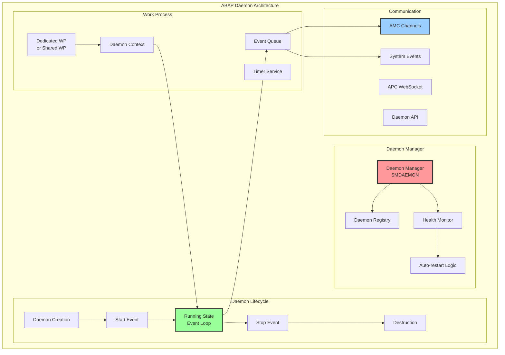
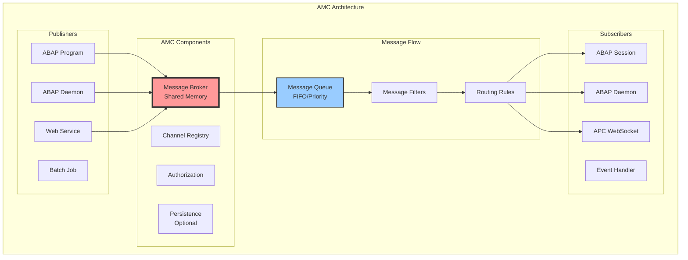
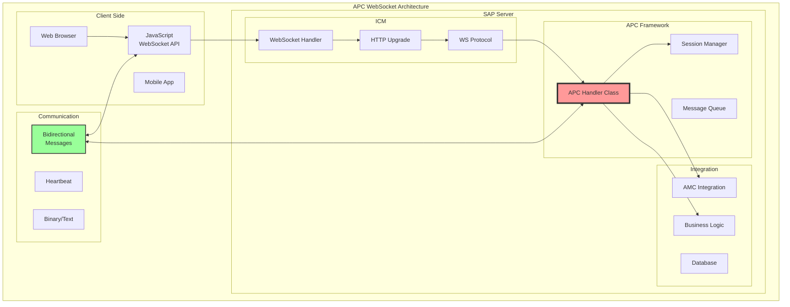
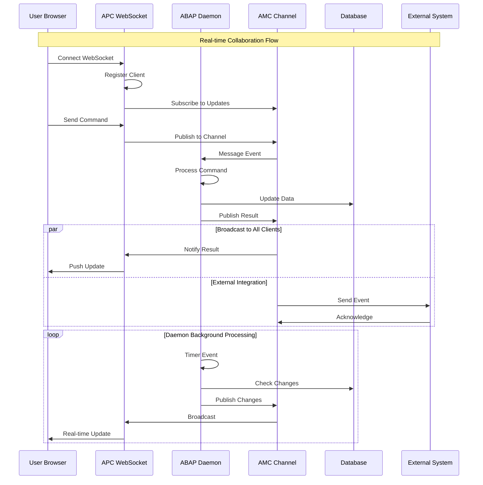

# Глава 11.1: ABAP Daemons и Channels - реактивная архитектура

### Требования к версии
- SAP NetWeaver 7.40 SP08 - AMC (ABAP Messaging Channels)
- SAP NetWeaver 7.40 SP05 - APC (ABAP Push Channels)
- SAP NetWeaver 7.52 - ABAP Daemon Framework
- SAP NetWeaver 7.54 - расширенные возможности daemons

## 11.1.1. ABAP Daemon Framework

ABAP Daemon Framework (ADF) представляет собой революционное расширение классической модели выполнения ABAP, позволяющее создавать долгоживущие фоновые процессы, которые могут реагировать на события в реальном времени.

### Архитектура ABAP Daemons



### Daemon Implementation Example

```abap
CLASS zcl_demo_daemon DEFINITION
  PUBLIC
  INHERITING FROM cl_abap_daemon_ext_base
  FINAL
  CREATE PUBLIC .

  PUBLIC SECTION.
    " Daemon name
    CLASS-DATA: gv_daemon_name TYPE string VALUE 'DEMO_DAEMON'.
    
    " Events
    EVENTS: data_received TYPE abap_daemon_event_type.
    
  PROTECTED SECTION.
    " Daemon lifecycle methods
    METHODS: on_event REDEFINITION,
             on_start REDEFINITION,
             on_stop REDEFINITION,
             on_restart REDEFINITION,
             on_error REDEFINITION.
             
  PRIVATE SECTION.
    DATA: mv_counter TYPE i,
          mo_timer TYPE REF TO if_abap_timer,
          mt_buffer TYPE TABLE OF string.
    
    METHODS: process_timer_event,
             process_message
               IMPORTING iv_message TYPE string,
             setup_timer.
ENDCLASS.

CLASS zcl_demo_daemon IMPLEMENTATION.
  METHOD on_start.
    " Вызывается при старте демона
    TRY.
        " Инициализация
        CLEAR: mv_counter, mt_buffer.
        
        " Подписка на AMC канал
        cl_amc_channel_manager=>create_message_consumer(
          i_application_id = 'ZAMC_DEMO'
          i_channel_id     = '/demo/events'
        )->start_message_delivery( i_receiver = me ).
        
        " Настройка таймера (каждые 30 секунд)
        setup_timer( ).
        
        " Логирование
        MESSAGE |Daemon { gv_daemon_name } started| TYPE 'I'.
        
      CATCH cx_amc_error INTO DATA(lx_amc).
        RAISE EXCEPTION TYPE cx_abap_daemon_error
          EXPORTING previous = lx_amc.
    ENDTRY.
  ENDMETHOD.
  
  METHOD on_event.
    " Обработка входящих событий
    TRY.
        CASE i_event_type.
          WHEN if_abap_daemon_extension=>co_event_type_timer.
            process_timer_event( ).
            
          WHEN if_abap_daemon_extension=>co_event_type_message.
            " AMC message received
            DATA(lo_message) = CAST if_amc_message_text(
              i_message_manager->get_message( ) ).
            process_message( lo_message->get_text( ) ).
            
          WHEN if_abap_daemon_extension=>co_event_type_system.
            " System event (shutdown, etc.)
            MESSAGE |System event received| TYPE 'I'.
            
        ENDCASE.
        
      CATCH cx_root INTO DATA(lx_error).
        " Обработка ошибок
        on_error( lx_error ).
    ENDTRY.
  ENDMETHOD.
  
  METHOD process_timer_event.
    " Периодическая обработка
    ADD 1 TO mv_counter.
    
    " Проверка буфера
    IF lines( mt_buffer ) > 0.
      " Batch processing
      DATA(lv_count) = lines( mt_buffer ).
      
      " Отправка accumulated данных
      TRY.
          cl_amc_channel_manager=>create_message_producer(
            i_application_id = 'ZAMC_DEMO'
            i_channel_id     = '/demo/results'
          )->send_message( |Processed { lv_count } messages| ).
          
          CLEAR mt_buffer.
          
        CATCH cx_amc_error.
          " Handle error
      ENDTRY.
    ENDIF.
    
    " Проверка здоровья
    IF mv_counter MOD 10 = 0.
      MESSAGE |Daemon health check: OK, counter = { mv_counter }| TYPE 'I'.
    ENDIF.
  ENDMETHOD.
  
  METHOD process_message.
    " Обработка входящего сообщения
    APPEND iv_message TO mt_buffer.
    
    " Немедленная обработка при достижении порога
    IF lines( mt_buffer ) >= 100.
      process_timer_event( ).
    ENDIF.
  ENDMETHOD.
  
  METHOD setup_timer.
    " Настройка периодического таймера
    mo_timer = cl_abap_timer_manager=>get_timer_manager( 
      )->start_timer(
        i_timeout = 30  " секунды
        i_timer_handler = me
    ).
  ENDMETHOD.
  
  METHOD on_stop.
    " Graceful shutdown
    IF mo_timer IS BOUND.
      mo_timer->stop( ).
    ENDIF.
    
    " Сохранение состояния если необходимо
    IF lines( mt_buffer ) > 0.
      " Persist buffered data
      process_timer_event( ).
    ENDIF.
    
    MESSAGE |Daemon { gv_daemon_name } stopped| TYPE 'I'.
  ENDMETHOD.
  
  METHOD on_error.
    " Централизованная обработка ошибок
    DATA(lv_error_text) = ix_error->get_text( ).
    MESSAGE lv_error_text TYPE 'E'.
    
    " Решение о продолжении работы
    IF ix_error IS INSTANCE OF cx_fatal_error.
      " Критическая ошибка - остановка демона
      RAISE EXCEPTION TYPE cx_abap_daemon_error
        EXPORTING previous = ix_error.
    ENDIF.
    " Иначе продолжаем работу
  ENDMETHOD.
ENDCLASS.
```

### Управление демонами

```abap
CLASS zcl_daemon_manager DEFINITION
  PUBLIC
  FINAL
  CREATE PUBLIC .

  PUBLIC SECTION.
    CLASS-METHODS:
      start_daemon
        IMPORTING
          iv_daemon_class TYPE seoclsname
          iv_name         TYPE string OPTIONAL
        RETURNING
          VALUE(ro_handle) TYPE REF TO if_abap_daemon_handle
        RAISING
          cx_abap_daemon_error,
          
      stop_daemon
        IMPORTING
          iv_name TYPE string
        RAISING
          cx_abap_daemon_error,
          
      get_daemon_info
        IMPORTING
          iv_name TYPE string
        RETURNING
          VALUE(rs_info) TYPE abap_daemon_info
        RAISING
          cx_abap_daemon_error,
          
      list_active_daemons
        RETURNING
          VALUE(rt_daemons) TYPE abap_daemon_info_table.
          
ENDCLASS.

CLASS zcl_daemon_manager IMPLEMENTATION.
  METHOD start_daemon.
    " Запуск демона с проверками
    DATA: lo_factory TYPE REF TO if_abap_daemon_factory.
    
    " Получение фабрики
    lo_factory = cl_abap_daemon_factory=>get_factory( ).
    
    " Проверка, не запущен ли уже
    TRY.
        DATA(ls_info) = get_daemon_info( iv_name ).
        IF ls_info-state = if_abap_daemon_factory=>co_state_running.
          RAISE EXCEPTION TYPE cx_abap_daemon_error
            EXPORTING textid = cx_abap_daemon_error=>daemon_already_running.
        ENDIF.
      CATCH cx_abap_daemon_error.
        " Daemon not found - OK to start
    ENDTRY.
    
    " Настройка параметров запуска
    DATA(lo_config) = cl_abap_daemon_config=>create( ).
    lo_config->set_restart_mode( if_abap_daemon_config=>co_restart_on_error ).
    lo_config->set_max_restart_count( 3 ).
    lo_config->set_restart_delay( 60 ). " секунды
    
    " Запуск демона
    ro_handle = lo_factory->start_daemon(
      i_class_name = iv_daemon_class
      i_name       = iv_name
      i_config     = lo_config
      i_parameter  = VALUE #( )  " Параметры запуска
    ).
    
    " Ожидание старта
    WAIT UP TO 2 SECONDS.
    
    " Проверка статуса
    ls_info = get_daemon_info( iv_name ).
    IF ls_info-state <> if_abap_daemon_factory=>co_state_running.
      RAISE EXCEPTION TYPE cx_abap_daemon_error
        EXPORTING textid = cx_abap_daemon_error=>daemon_start_failed.
    ENDIF.
  ENDMETHOD.
ENDCLASS.
```

## 11.1.2. AMC: Publish/Subscribe в ABAP

ABAP Messaging Channels (AMC) обеспечивают асинхронную коммуникацию между различными сессиями и процессами в SAP системе.

### Архитектура AMC



### AMC Implementation

```abap
" AMC Application definition (SE80 -> Create -> ABAP Messaging Channel Application)
" Application ID: ZAMC_DEMO
" Channels: /demo/events, /demo/commands, /demo/results

CLASS zcl_amc_demo DEFINITION
  PUBLIC
  FINAL
  CREATE PUBLIC .

  PUBLIC SECTION.
    INTERFACES: if_amc_message_receiver,
                if_amc_message_type_text.
    
    TYPES: BEGIN OF ty_event,
             event_type TYPE string,
             timestamp  TYPE timestampl,
             user       TYPE sy-uname,
             data       TYPE string,
           END OF ty_event.
    
    CLASS-METHODS:
      publish_event
        IMPORTING
          is_event TYPE ty_event
        RAISING
          cx_amc_error,
          
      subscribe_to_channel
        IMPORTING
          iv_channel_id TYPE string
          io_receiver   TYPE REF TO if_amc_message_receiver
        RAISING
          cx_amc_error.
          
  PRIVATE SECTION.
    DATA: mv_channel_id TYPE string.
    
ENDCLASS.

CLASS zcl_amc_demo IMPLEMENTATION.
  METHOD publish_event.
    " Публикация события в AMC канал
    TRY.
        " Создание producer
        DATA(lo_producer) = cl_amc_channel_manager=>create_message_producer(
          i_application_id = 'ZAMC_DEMO'
          i_channel_id     = '/demo/events'
        ).
        
        " Сериализация события
        DATA(lv_json) = /ui2/cl_json=>serialize(
          data = is_event
          pretty_name = /ui2/cl_json=>pretty_mode-low_case
        ).
        
        " Отправка сообщения
        lo_producer->send_message( lv_json ).
        
      CATCH cx_amc_error INTO DATA(lx_error).
        " Логирование ошибки
        MESSAGE lx_error->get_text( ) TYPE 'E'.
        RAISE EXCEPTION lx_error.
    ENDTRY.
  ENDMETHOD.
  
  METHOD subscribe_to_channel.
    " Подписка на AMC канал
    TRY.
        " Создание consumer
        DATA(lo_consumer) = cl_amc_channel_manager=>create_message_consumer(
          i_application_id = 'ZAMC_DEMO'
          i_channel_id     = iv_channel_id
        ).
        
        " Начало доставки сообщений
        lo_consumer->start_message_delivery( i_receiver = io_receiver ).
        
      CATCH cx_amc_error INTO DATA(lx_error).
        MESSAGE lx_error->get_text( ) TYPE 'E'.
        RAISE EXCEPTION lx_error.
    ENDTRY.
  ENDMETHOD.
  
  METHOD if_amc_message_receiver~receive.
    " Обработка полученного сообщения
    TRY.
        " Получение текстового сообщения
        DATA(lo_text_message) = CAST if_amc_message_text( i_message ).
        DATA(lv_json) = lo_text_message->get_text( ).
        
        " Десериализация
        DATA: ls_event TYPE ty_event.
        /ui2/cl_json=>deserialize(
          EXPORTING json = lv_json
          CHANGING  data = ls_event
        ).
        
        " Обработка события
        CASE ls_event-event_type.
          WHEN 'ORDER_CREATED'.
            " Process new order
            MESSAGE |New order created by { ls_event-user }| TYPE 'I'.
            
          WHEN 'STOCK_LOW'.
            " Alert handling
            MESSAGE |Low stock alert: { ls_event-data }| TYPE 'W'.
            
          WHEN OTHERS.
            " Unknown event
        ENDCASE.
        
      CATCH cx_root INTO DATA(lx_error).
        MESSAGE lx_error->get_text( ) TYPE 'E'.
    ENDTRY.
  ENDMETHOD.
ENDCLASS.
```

## 11.1.3. APC: WebSocket сервер в ABAP

ABAP Push Channels (APC) позволяют создавать WebSocket серверы непосредственно в ABAP, обеспечивая двунаправленную коммуникацию в реальном времени.

### Архитектура APC



### APC Implementation

```abap
CLASS zcl_apc_websocket_handler DEFINITION
  PUBLIC
  INHERITING FROM cl_apc_wsp_ext_stateless_base
  FINAL
  CREATE PUBLIC .

  PUBLIC SECTION.
    INTERFACES: if_apc_wsp_event_handler,
                if_apc_wsp_message_handler,
                if_amc_message_receiver.
    
  PRIVATE SECTION.
    TYPES: BEGIN OF ty_client,
             client_id    TYPE sysuuid_c32,
             session      TYPE REF TO if_apc_wsp_server_context,
             user         TYPE sy-uname,
             connected_at TYPE timestampl,
           END OF ty_client.
    
    CLASS-DATA: gt_clients TYPE HASHED TABLE OF ty_client
                           WITH UNIQUE KEY client_id.
    
    METHODS: handle_client_message
               IMPORTING
                 iv_message TYPE string
                 io_session TYPE REF TO if_apc_wsp_server_context,
                 
             broadcast_message
               IMPORTING
                 iv_message TYPE string
               RAISING
                 cx_apc_error,
                 
             register_client
               IMPORTING
                 io_session TYPE REF TO if_apc_wsp_server_context
               RETURNING
                 VALUE(rv_client_id) TYPE sysuuid_c32.
ENDCLASS.

CLASS zcl_apc_websocket_handler IMPLEMENTATION.
  METHOD if_apc_wsp_event_handler~on_open.
    " Новое WebSocket соединение
    TRY.
        " Регистрация клиента
        DATA(lv_client_id) = register_client( i_context ).
        
        " Подписка на AMC для этого клиента
        cl_amc_channel_manager=>create_message_consumer(
          i_application_id = 'ZAMC_DEMO'
          i_channel_id     = '/demo/broadcast'
        )->start_message_delivery( i_receiver = me ).
        
        " Отправка приветствия
        DATA(lo_message) = i_message_factory->create_message( ).
        lo_message->set_text(
          |Welcome! Your client ID is { lv_client_id }|
        ).
        i_context->send_message( lo_message ).
        
      CATCH cx_apc_error cx_amc_error INTO DATA(lx_error).
        MESSAGE lx_error->get_text( ) TYPE 'E'.
    ENDTRY.
  ENDMETHOD.
  
  METHOD if_apc_wsp_event_handler~on_close.
    " Закрытие соединения
    " Удаление клиента из таблицы
    LOOP AT gt_clients INTO DATA(ls_client).
      IF ls_client-session = i_context.
        DELETE gt_clients WHERE client_id = ls_client-client_id.
        EXIT.
      ENDIF.
    ENDLOOP.
    
    " Уведомление других клиентов
    TRY.
        broadcast_message( |Client disconnected| ).
      CATCH cx_apc_error.
        " Ignore errors during cleanup
    ENDTRY.
  ENDMETHOD.
  
  METHOD if_apc_wsp_message_handler~on_message.
    " Обработка входящего сообщения от клиента
    TRY.
        DATA(lv_text) = i_message->get_text( ).
        
        " Обработка команд
        handle_client_message(
          iv_message = lv_text
          io_session = i_context
        ).
        
      CATCH cx_apc_error INTO DATA(lx_error).
        " Отправка ошибки клиенту
        DATA(lo_error_msg) = i_message_factory->create_message( ).
        lo_error_msg->set_text( |Error: { lx_error->get_text( ) }| ).
        i_context->send_message( lo_error_msg ).
    ENDTRY.
  ENDMETHOD.
  
  METHOD handle_client_message.
    " Парсинг и обработка команд от клиента
    DATA: BEGIN OF ls_command,
            action TYPE string,
            data   TYPE string,
          END OF ls_command.
    
    TRY.
        " Десериализация JSON команды
        /ui2/cl_json=>deserialize(
          EXPORTING json = iv_message
          CHANGING  data = ls_command
        ).
        
        CASE ls_command-action.
          WHEN 'SUBSCRIBE'.
            " Подписка на определенный топик
            MESSAGE |Client subscribed to { ls_command-data }| TYPE 'I'.
            
          WHEN 'PUBLISH'.
            " Публикация сообщения всем клиентам
            broadcast_message( ls_command-data ).
            
          WHEN 'PING'.
            " Heartbeat response
            DATA(lo_pong) = cl_apc_wsp_message_factory=>create_message( ).
            lo_pong->set_text( 'PONG' ).
            io_session->send_message( lo_pong ).
            
        ENDCASE.
        
      CATCH cx_root INTO DATA(lx_error).
        MESSAGE lx_error->get_text( ) TYPE 'E'.
    ENDTRY.
  ENDMETHOD.
  
  METHOD broadcast_message.
    " Отправка сообщения всем подключенным клиентам
    DATA(lo_message) = cl_apc_wsp_message_factory=>create_message( ).
    lo_message->set_text( iv_message ).
    
    LOOP AT gt_clients INTO DATA(ls_client).
      TRY.
          ls_client-session->send_message( lo_message ).
        CATCH cx_apc_error.
          " Client disconnected - remove
          DELETE gt_clients WHERE client_id = ls_client-client_id.
      ENDTRY.
    ENDLOOP.
  ENDMETHOD.
  
  METHOD if_amc_message_receiver~receive.
    " Получение сообщения из AMC и broadcast через WebSocket
    TRY.
        DATA(lo_text_message) = CAST if_amc_message_text( i_message ).
        broadcast_message( lo_text_message->get_text( ) ).
        
      CATCH cx_root INTO DATA(lx_error).
        MESSAGE lx_error->get_text( ) TYPE 'E'.
    ENDTRY.
  ENDMETHOD.
ENDCLASS.
```

## 11.1.4. Collaboration scenario

### Интеграция Daemons, AMC и APC



### Complete Example: Real-time Dashboard

```abap
" Daemon для мониторинга системы
CLASS zcl_dashboard_daemon DEFINITION
  PUBLIC
  INHERITING FROM cl_abap_daemon_ext_base
  FINAL
  CREATE PUBLIC .

  PUBLIC SECTION.
    TYPES: BEGIN OF ty_metrics,
             timestamp    TYPE timestampl,
             cpu_usage    TYPE decfloat16,
             memory_usage TYPE decfloat16,
             active_users TYPE i,
             response_time TYPE decfloat16,
           END OF ty_metrics.
           
  PROTECTED SECTION.
    METHODS: on_event REDEFINITION,
             on_start REDEFINITION.
             
  PRIVATE SECTION.
    METHODS: collect_metrics
               RETURNING VALUE(rs_metrics) TYPE ty_metrics,
             publish_metrics
               IMPORTING is_metrics TYPE ty_metrics.
ENDCLASS.

CLASS zcl_dashboard_daemon IMPLEMENTATION.
  METHOD on_start.
    " Запуск сбора метрик каждые 5 секунд
    cl_abap_timer_manager=>get_timer_manager( )->start_timer(
      i_timeout = 5
      i_timer_handler = me
    ).
  ENDMETHOD.
  
  METHOD on_event.
    IF i_event_type = if_abap_daemon_extension=>co_event_type_timer.
      " Сбор и публикация метрик
      DATA(ls_metrics) = collect_metrics( ).
      publish_metrics( ls_metrics ).
    ENDIF.
  ENDMETHOD.
  
  METHOD collect_metrics.
    GET TIME STAMP FIELD rs_metrics-timestamp.
    
    " Симуляция сбора метрик (в реальности - из ST06, SM50, etc.)
    rs_metrics-cpu_usage = cl_abap_random_decfloat16=>create(
      min = '20.0'
      max = '80.0'
    )->get_next( ).
    
    rs_metrics-memory_usage = cl_abap_random_decfloat16=>create(
      min = '40.0'
      max = '90.0'
    )->get_next( ).
    
    " Активные пользователи из SM04
    SELECT COUNT(*) FROM usr41
      WHERE termid NE space
      INTO @rs_metrics-active_users.
    
    rs_metrics-response_time = cl_abap_random_decfloat16=>create(
      min = '50.0'
      max = '500.0'
    )->get_next( ).
  ENDMETHOD.
  
  METHOD publish_metrics.
    TRY.
        " Публикация в AMC
        DATA(lv_json) = /ui2/cl_json=>serialize( data = is_metrics ).
        
        cl_amc_channel_manager=>create_message_producer(
          i_application_id = 'ZAMC_DASHBOARD'
          i_channel_id     = '/metrics/realtime'
        )->send_message( lv_json ).
        
      CATCH cx_amc_error INTO DATA(lx_error).
        MESSAGE lx_error->get_text( ) TYPE 'E'.
    ENDTRY.
  ENDMETHOD.
ENDCLASS.
```

### Архитектурные паттерны

```mermaid
graph TB
    subgraph "Reactive Architecture Patterns"
        subgraph "Event-Driven"
            EVENT_SRC[Event Sources<br/>DB Triggers<br/>User Actions<br/>System Events]
            EVENT_BUS[AMC Event Bus]
            EVENT_PROC[Event Processors<br/>Daemons]
        end
        
        subgraph "Push Notifications"
            CHANGE[State Change]
            NOTIFY[AMC Notification]
            PUSH[APC Push]
            CLIENT[Client Update]
        end
        
        subgraph "Background Processing"
            QUEUE[Task Queue]
            DAEMON_POOL[Daemon Pool]
            ASYNC[Async Execution]
            CALLBACK[Result Callback]
        end
        
        subgraph "Real-time Analytics"
            STREAM[Data Stream]
            WINDOW[Time Window]
            AGGREGATE[Aggregation]
            DASHBOARD[Live Dashboard]
        end
        
        EVENT_SRC --> EVENT_BUS
        EVENT_BUS --> EVENT_PROC
        
        CHANGE --> NOTIFY
        NOTIFY --> PUSH
        PUSH --> CLIENT
        
        QUEUE --> DAEMON_POOL
        DAEMON_POOL --> ASYNC
        ASYNC --> CALLBACK
        
        STREAM --> WINDOW
        WINDOW --> AGGREGATE
        AGGREGATE --> DASHBOARD
    end
    
    style EVENT_BUS fill:#ff9999,stroke:#333,stroke-width:2px
    style DAEMON_POOL fill:#99ff99,stroke:#333,stroke-width:2px
    style PUSH fill:#99ccff,stroke:#333,stroke-width:2px
```



## Заключение

Реактивная архитектура в ABAP представляет собой революционное расширение классической модели выполнения:

**Ключевые компоненты**:
- **ABAP Daemons** обеспечивают долгоживущие фоновые процессы
- **AMC (ABAP Messaging Channels)** предоставляет pub/sub messaging
- **APC (ABAP Push Channels)** включает WebSocket коммуникации
- Интеграция всех компонентов создает полноценную event-driven архитектуру

**Новые возможности**:
- Real-time приложения в ABAP
- Event-driven архитектуры
- Асинхронная обработка событий
- Современные паттерны интеграции
- Push-уведомления и двунаправленная связь

Эта архитектура особенно важна для современных сценариев IoT, real-time analytics и collaborative приложений.

В следующей главе мы рассмотрим инструменты анализа и отладки, которые помогают понять и оптимизировать работу всех рассмотренных компонентов архитектуры SAP.