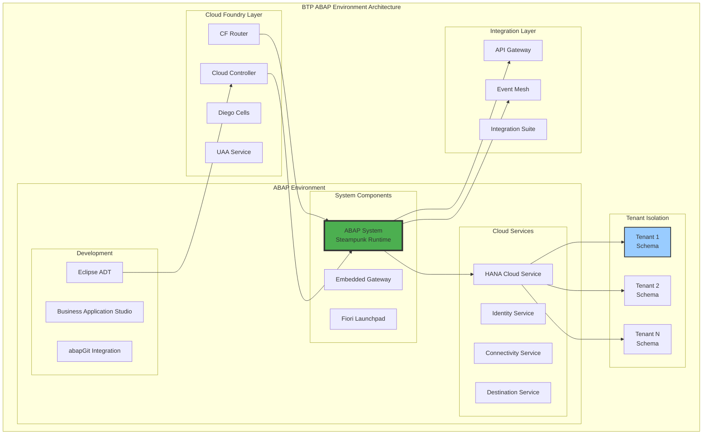
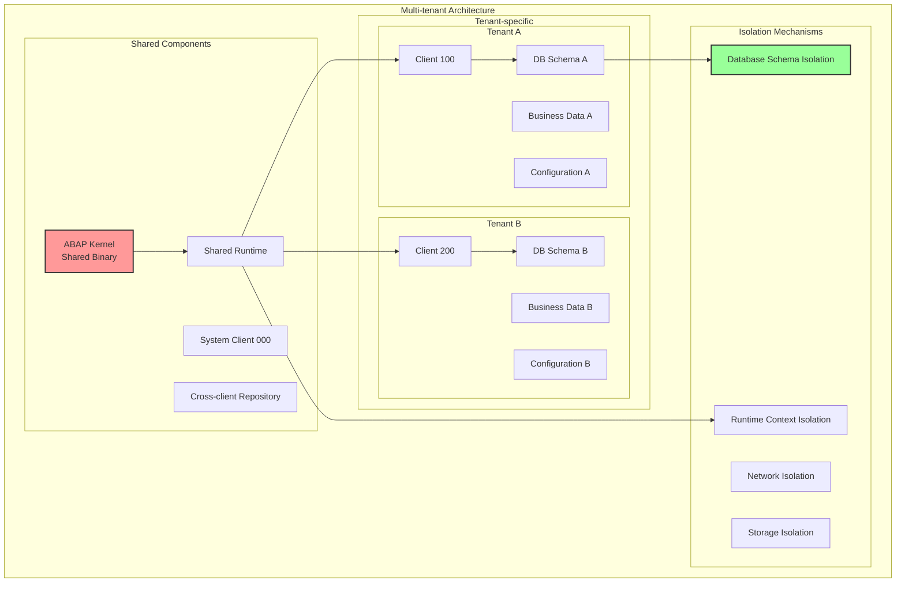
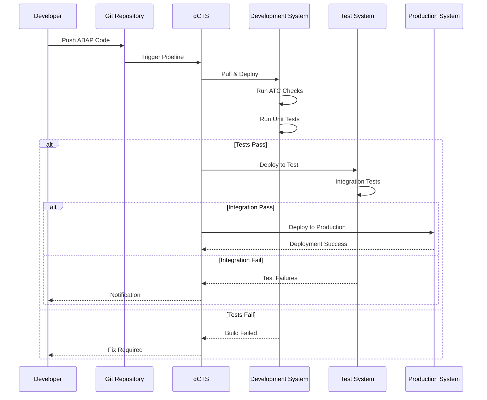
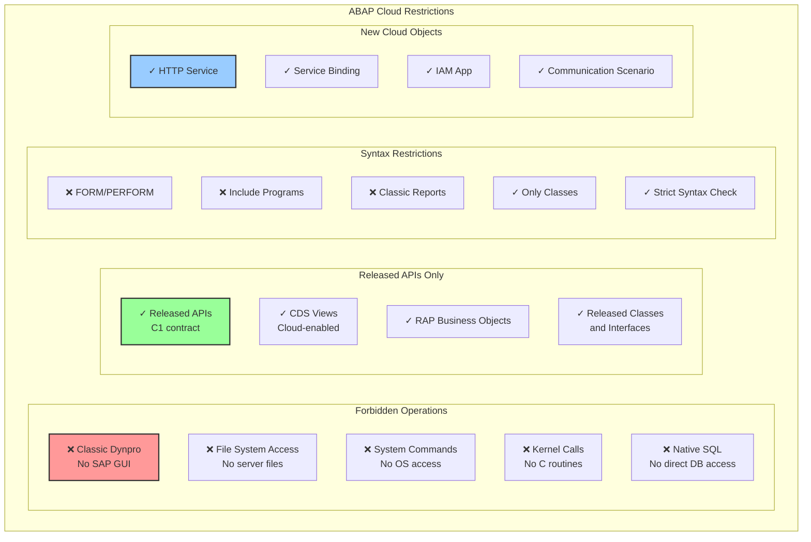
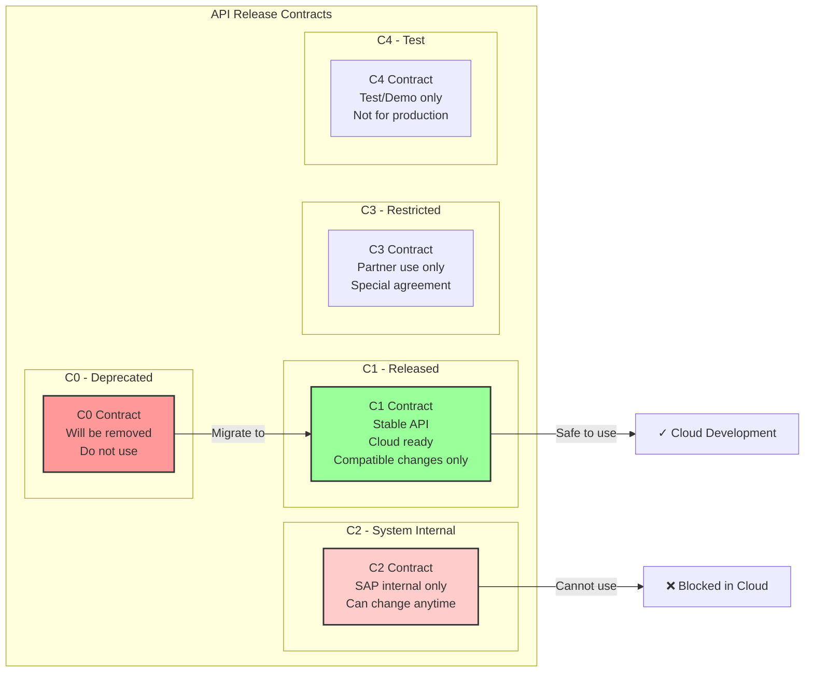
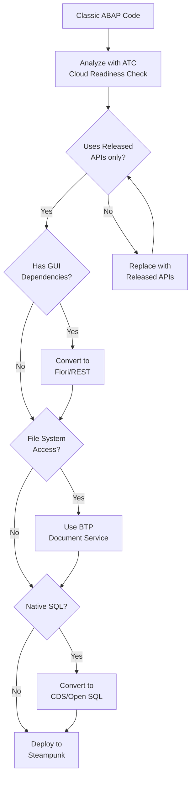
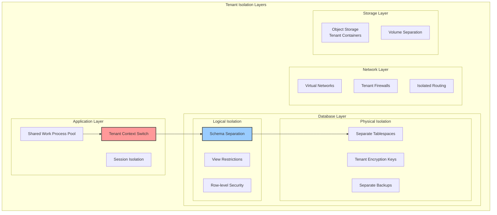
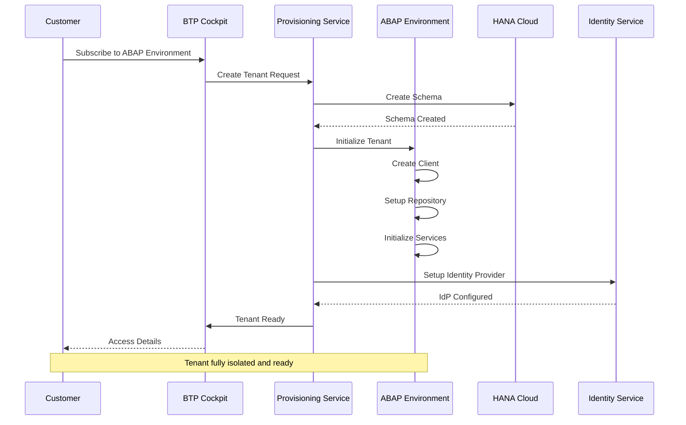
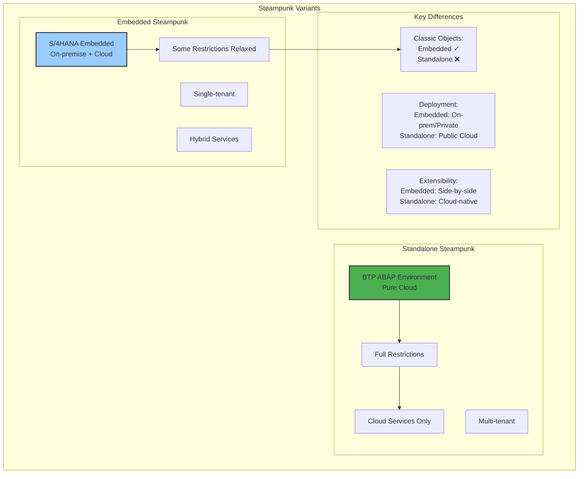
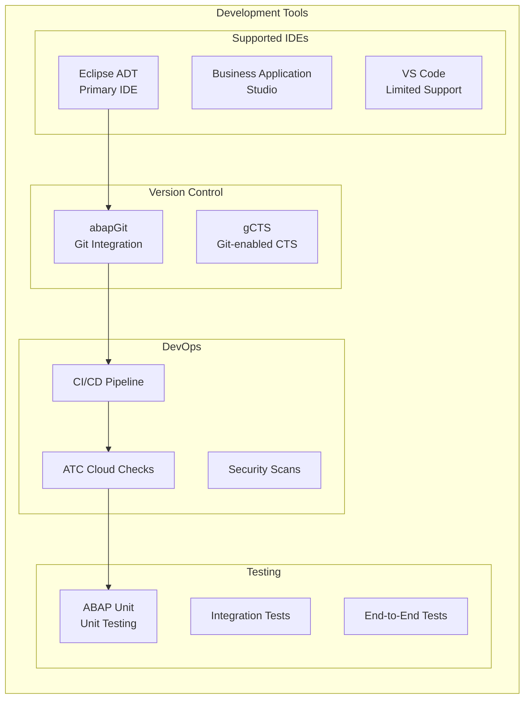

# Глава 11: BTP и Steampunk - ABAP в облаке

## 11.1. Архитектура BTP ABAP Environment

SAP Business Technology Platform (BTP) ABAP Environment, также известная под кодовым названием "Steampunk", представляет собой революционный подход к запуску ABAP в облаке. Это не просто перенос традиционного ABAP в cloud, а фундаментальное переосмысление платформы для cloud-native разработки.

### Архитектура BTP ABAP Environment

### Multi-tenancy в Steampunk

### Lifecycle Management

## 11.2. Ограничения ABAP языка в облаке

Steampunk вводит строгие ограничения на использование ABAP для обеспечения cloud-совместимости, безопасности и изоляции tenant'ов.

### Released APIs и Cloud Readiness

### API Classification System

### Code Migration к Cloud

## 11.3. Multi-tenancy и изоляция

### Архитектура изоляции tenant'ов

### Tenant Onboarding Process

## 11.4. Embedded Steampunk vs Steampunk

### Deployment Models Comparison

### Developer Experience

## Заключение

BTP ABAP Environment (Steampunk) представляет собой фундаментальную трансформацию платформы ABAP для облачной эры:

**Ключевые характеристики**:
- Полностью cloud-native архитектура на базе Cloud Foundry
- Строгие ограничения языка для обеспечения безопасности и изоляции
- Multi-tenant архитектура с полной изоляцией данных
- Современные инструменты разработки и DevOps практики

**Преимущества**:
- Автоматическое масштабирование и управление инфраструктурой
- Встроенная высокая доступность
- Непрерывные обновления без простоев
- Интеграция с облачными сервисами BTP

**Вызовы**:
- Необходимость миграции существующего кода
- Обучение разработчиков новым ограничениям
- Переосмысление архитектуры приложений

В следующей главе мы рассмотрим реактивную архитектуру ABAP с использованием Daemons и Channels, которая открывает новые возможности для создания современных event-driven приложений.