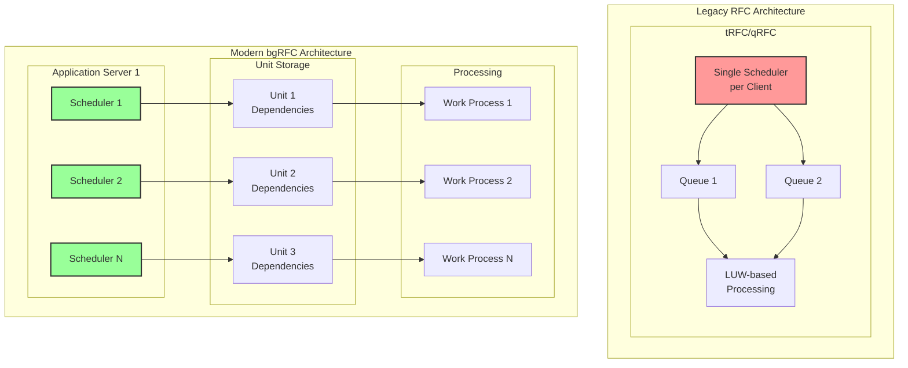
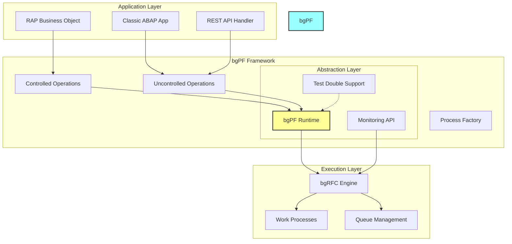
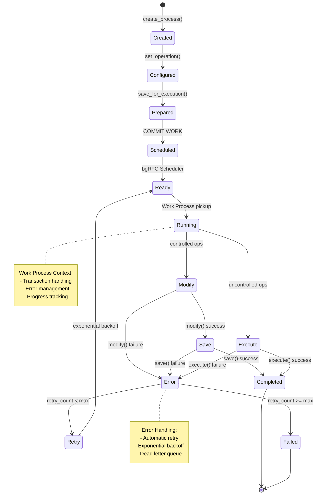
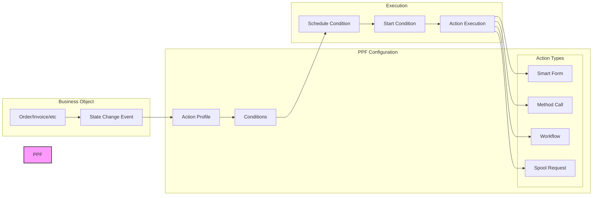
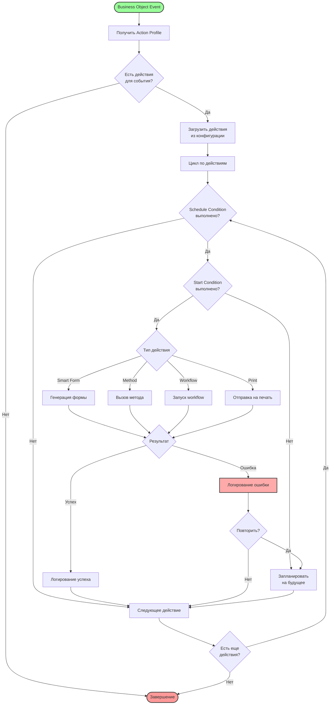
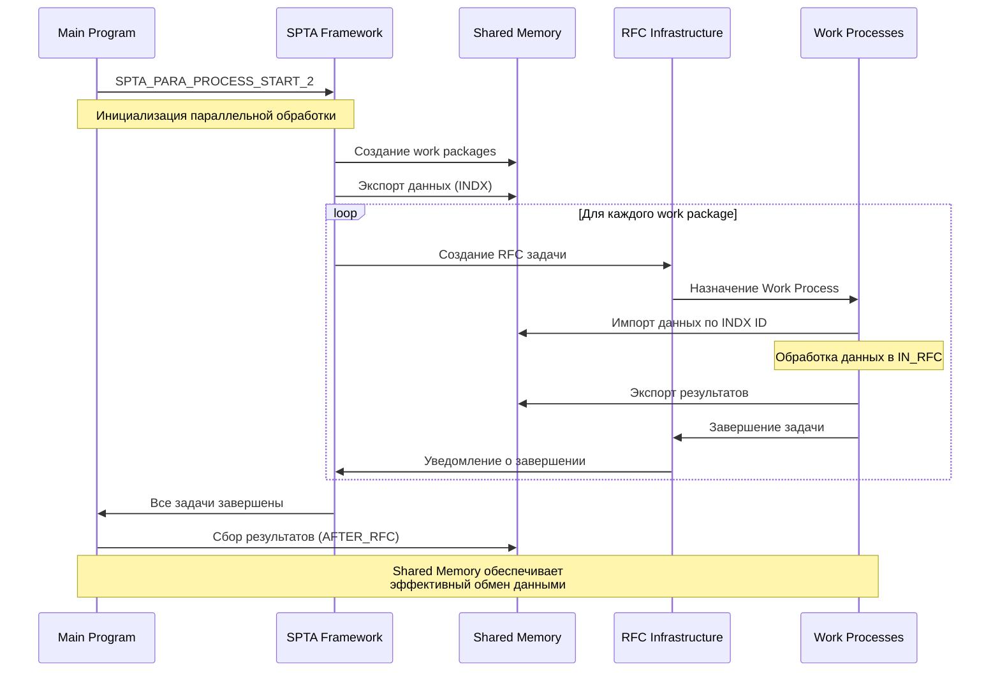
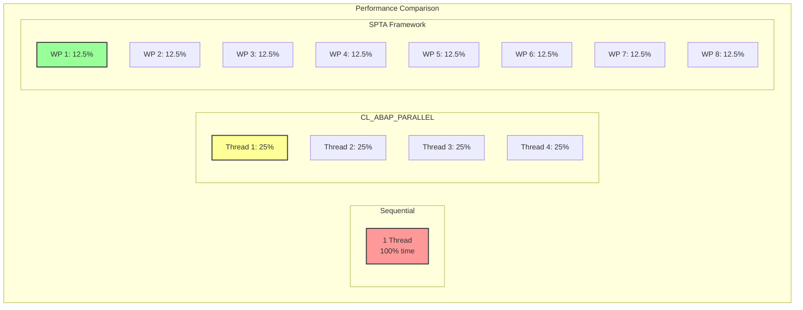
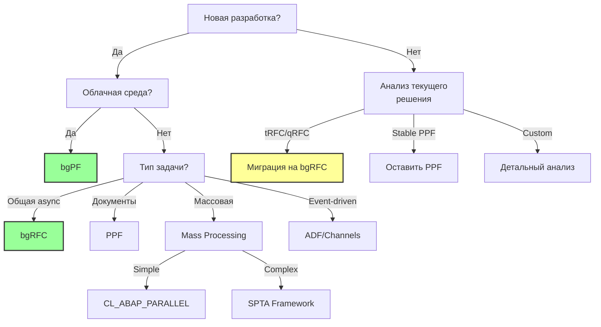

# Глава 11.2: Фреймворки фоновой обработки ABAP - эволюция асинхронности

В современном ландшафте SAP-разработки производительность и отзывчивость приложений стали критически важными факторами успеха. Пользователи ожидают мгновенной реакции системы даже при выполнении сложных операций. Именно здесь на сцену выходят фреймворки фоновой обработки - технологии, позволяющие разделить взаимодействие с пользователем и тяжелые вычисления.

В этой главе мы исследуем эволюцию подходов к асинхронной обработке в SAP: от классических tRFC до современного Background Processing Framework (bgPF), рассмотрим специализированные решения для различных отраслей и дадим рекомендации по выбору оптимального подхода.

## 11.2.1. Эволюция RFC: от tRFC к bgRFC и bgPF

История асинхронной обработки в SAP началась с появления **tRFC (Transactional RFC)** в R/3. Эта технология гарантировала однократное выполнение удаленного вызова функции, но имела серьезные архитектурные ограничения.

### tRFC - первый шаг к асинхронности

```abap
* Классический вызов tRFC
CALL FUNCTION 'Z_PROCESS_ORDER'
  IN BACKGROUND TASK
  DESTINATION 'RFC_DEST'
  EXPORTING
    iv_order_id = lv_order_id.

COMMIT WORK.
```

**Архитектурные особенности tRFC:**
- Единственный планировщик на клиент
- Обработка в порядке COMMIT, без гарантии последовательности
- Ограниченные возможности мониторинга (SM58)
- Сложности с обработкой ошибок

### qRFC - добавление упорядоченности

**qRFC (Queued RFC)** расширил tRFC возможностью упорядоченной обработки:

```abap
* Вызов qRFC с указанием очереди
CALL FUNCTION 'Z_PROCESS_ORDER' 
  IN BACKGROUND TASK
  AS SEPARATE UNIT
  DESTINATION 'RFC_DEST'
  EXPORTING
    qname = 'ORDER_QUEUE_001'
    iv_order_id = lv_order_id.
```

Однако ограничение "один планировщик на destination" создавало узкое место при высоких нагрузках.

### bgRFC - современная архитектура

В 2004 году с выходом SAP NetWeaver 7.0 появился **bgRFC (Background RFC)** - полностью переработанная архитектура:

```abap
* Современный подход с bgRFC
DATA(lo_dest) = cl_bgrfc_destination_inbound=>create( 'MYDEST' ).
DATA(lo_unit) = lo_dest->create_trfc_unit( ).

CALL FUNCTION 'Z_PROCESS_ORDER'
  IN BACKGROUND UNIT lo_unit
  EXPORTING
    iv_order_id = lv_order_id.

lo_unit->set_qrfc_info( 
  queue_name = 'ORDER_QUEUE'
  queue_counter = 1 ).

COMMIT WORK.
```

**Революционные изменения в bgRFC:**
- **Множественные планировщики** на сервер приложений
- **Unit-based модель** вместо LUW-based
- **Разрешение зависимостей** на этапе сохранения
- **Расширенный мониторинг** через SBGRFCMON



### Производительность bgRFC vs Legacy

Тесты SAP показывают впечатляющие результаты:
- **До 10x** улучшение пропускной способности
- **Снижение latency** на 40-60%
- **Линейная масштабируемость** с добавлением серверов

## 11.2.2. bgRFC: производительность через архитектуру

### Внутреннее устройство bgRFC

bgRFC использует sophisticated подход к управлению единицами обработки:

```abap
CLASS lcl_bgrfc_processor DEFINITION.
  PUBLIC SECTION.
    METHODS: process_with_dependencies.
  
  PRIVATE SECTION.
    DATA: mo_dest TYPE REF TO if_bgrfc_destination_inbound.
ENDCLASS.

CLASS lcl_bgrfc_processor IMPLEMENTATION.
  METHOD process_with_dependencies.
    " Создание destination
    mo_dest = cl_bgrfc_destination_inbound=>create( 
      destination = 'NONE' 
      supervisor_dest = 'SUPERVISOR' ).
    
    " Создание зависимых единиц
    DATA(lo_unit_parent) = mo_dest->create_qrfc_unit( ).
    DATA(lo_unit_child1) = mo_dest->create_qrfc_unit( ).
    DATA(lo_unit_child2) = mo_dest->create_qrfc_unit( ).
    
    " Настройка зависимостей
    lo_unit_child1->add_predecessor( lo_unit_parent ).
    lo_unit_child2->add_predecessor( lo_unit_parent ).
    
    " Вызовы функций
    CALL FUNCTION 'Z_PARENT_PROCESS'
      IN BACKGROUND UNIT lo_unit_parent.
      
    CALL FUNCTION 'Z_CHILD_PROCESS_1'
      IN BACKGROUND UNIT lo_unit_child1.
      
    CALL FUNCTION 'Z_CHILD_PROCESS_2'
      IN BACKGROUND UNIT lo_unit_child2.
    
    COMMIT WORK.
  ENDMETHOD.
ENDCLASS.
```

### Конфигурация и оптимизация

Ключевые параметры bgRFC:
- **bgRFC/scheduler_count**: количество планировщиков (default: 5)
- **bgRFC/max_queue_length**: максимальная длина очереди
- **bgRFC/timeout**: таймаут обработки единицы

### Мониторинг через SBGRFCMON

```abap
* Программный доступ к статистике bgRFC
DATA: lt_statistics TYPE TABLE OF bgrfc_stat.

CALL FUNCTION 'BGRFC_DEST_GET_STATISTICS'
  EXPORTING
    dest_name = 'MY_DESTINATION'
  IMPORTING
    statistics = lt_statistics.

LOOP AT lt_statistics INTO DATA(ls_stat).
  WRITE: / 'Units processed:', ls_stat-units_processed,
         / 'Average time:', ls_stat-avg_processing_time.
ENDLOOP.
```

(дополнительные инструменты анализа и мониторинга производительности см. в Главе 12: Performance Analysis Tools)

## 11.2.3. bgPF: облачная абстракция над bgRFC

### Background Processing Framework - новая эра

В 2023 году SAP представила **bgPF** - framework, оптимизированный для облачных сред и RAP-приложений.

```abap
* bgPF Uncontrolled variant - простой пример
CLASS zcl_bgpf_order_processor DEFINITION
  PUBLIC
  CREATE PUBLIC.
  
  PUBLIC SECTION.
    INTERFACES if_bgmc_op_single_tx_uncontr.
    
    METHODS constructor
      IMPORTING
        iv_order_id TYPE vbeln.
        
  PRIVATE SECTION.
    DATA: mv_order_id TYPE vbeln.
ENDCLASS.

CLASS zcl_bgpf_order_processor IMPLEMENTATION.
  METHOD constructor.
    mv_order_id = iv_order_id.
  ENDMETHOD.
  
  METHOD if_bgmc_op_single_tx_uncontr~execute.
    " Асинхронная обработка заказа
    DATA: ls_order TYPE vbak.
    
    SELECT SINGLE * FROM vbak
      INTO @ls_order
      WHERE vbeln = @mv_order_id.
      
    IF sy-subrc = 0.
      " Сложная бизнес-логика
      perform_credit_check( ls_order ).
      calculate_delivery_date( ls_order ).
      send_notifications( ls_order ).
    ENDIF.
  ENDMETHOD.
ENDCLASS.
```

### Controlled vs Uncontrolled варианты

**Controlled (для RAP):**
```abap
CLASS zcl_bgpf_controlled DEFINITION
  PUBLIC
  CREATE PUBLIC.
  
  PUBLIC SECTION.
    INTERFACES if_bgmc_op_single.
    
    " Разделение на фазы modify/save
    METHODS if_bgmc_op_single~modify.
    METHODS if_bgmc_op_single~save.
ENDCLASS.
```

**Uncontrolled (общего назначения):**
```abap
CLASS zcl_bgpf_uncontrolled DEFINITION
  PUBLIC
  CREATE PUBLIC.
  
  PUBLIC SECTION.
    INTERFACES if_bgmc_op_single_tx_uncontr.
    
    " Единый метод execute
    METHODS if_bgmc_op_single_tx_uncontr~execute.
ENDCLASS.
```

### Запуск bgPF процессов

```abap
CLASS zcl_bgpf_starter DEFINITION
  PUBLIC
  FINAL
  CREATE PUBLIC.
  
  PUBLIC SECTION.
    CLASS-METHODS start_background_processing
      IMPORTING
        iv_order_id TYPE vbeln.
ENDCLASS.

CLASS zcl_bgpf_starter IMPLEMENTATION.
  METHOD start_background_processing.
    TRY.
        DATA(lo_factory) = cl_bgmc_process_factory=>get_default( ).
        DATA(lo_process) = lo_factory->create( ).
        
        " Создание операции
        DATA(lo_operation) = NEW zcl_bgpf_order_processor( iv_order_id ).
        
        " Конфигурация процесса
        lo_process->set_name( |Order processing { iv_order_id }| ).
        lo_process->set_operation_tx_uncontrolled( lo_operation ).
        
        " Сохранение для выполнения
        lo_process->save_for_execution( ).
        
        COMMIT WORK.
        
      CATCH cx_bgmc INTO DATA(lx_bgmc).
        MESSAGE lx_bgmc->get_text( ) TYPE 'E'.
    ENDTRY.
  ENDMETHOD.
ENDCLASS.
```

### Архитектурные преимущества bgPF



### Детальный поток выполнения bgPF



## 11.2.4. PPF: событийно-ориентированная обработка документов

### Post Processing Framework - другая философия

В отличие от RFC-based фреймворков, **PPF** использует принципиально иной подход - обработка на основе условий и действий.

```abap
* Конфигурация PPF action
DATA: ls_ppf_context TYPE ppfdcntxt,
      lo_manager     TYPE REF TO cl_manager_ppf.

" Получение PPF manager
lo_manager = cl_manager_ppf=>get_instance( ).

" Создание контекста
ls_ppf_context-applctn = 'CRM_ORDER'.
ls_ppf_context-guid    = lv_order_guid.

" Определение действия
DATA(lo_action) = lo_manager->create_action(
  ip_ppf_context = ls_ppf_context
  ip_action_def  = 'SEND_ORDER_CONF' ).

" Проверка условий запуска
IF lo_action->check_conditions( ) = abap_true.
  lo_action->execute( ).
ENDIF.
```

### Архитектура PPF



### Детальный алгоритм определения PPF действий



### Banking-specific PPF

Банковский сектор расширил стандартный PPF специализированными возможностями:

```abap
* Banking PPF с параллельной обработкой
CALL FUNCTION 'BCA_AM_PPF_PARALLEL_PROCESS'
  EXPORTING
    it_guids         = lt_document_guids
    iv_applctn       = 'BCA_LOAN'
    iv_max_parallel  = 10
  IMPORTING
    et_processed     = lt_processed
    et_errors        = lt_errors.
```

**Особенности Banking PPF:**
- Встроенная поддержка больших объемов
- Compliance-ready логирование
- Интеграция с банковскими модулями

## 11.2.5. Массовая обработка: SPTA и параллельные фреймворки

### SPTA Framework - максимальная производительность

**SPTA (Shared Memory Programming for Parallel Tasks)** остается самым эффективным способом массовой параллельной обработки:

```abap
FORM start_parallel_processing.
  DATA: lt_data TYPE TABLE OF my_data_type,
        lt_work_packages TYPE spta_t_indxtab.
  
  " Подготовка данных
  SELECT * FROM my_table INTO TABLE @lt_data.
  
  " Разбиение на пакеты
  PERFORM create_work_packages USING lt_data
                               CHANGING lt_work_packages.
  
  " Запуск параллельной обработки
  CALL FUNCTION 'SPTA_PARA_PROCESS_START_2'
    EXPORTING
      server_group             = 'parallel_generators'
      max_no_of_tasks          = 10
      before_rfc_callback_form = 'BEFORE_RFC'
      in_rfc_callback_form     = 'IN_RFC'
      after_rfc_callback_form  = 'AFTER_RFC'
      callback_prog            = sy-repid
    CHANGING
      user_param               = lt_work_packages
    EXCEPTIONS
      OTHERS                   = 1.
ENDFORM.

FORM before_rfc USING p_before_rfc_imp TYPE spta_t_before_rfc_imp
                CHANGING pt_work_packages TYPE spta_t_indxtab
                         p_before_rfc_exp TYPE spta_t_before_rfc_exp.
  " Подготовка перед RFC
  p_before_rfc_exp-server_group = 'parallel_generators'.
  p_before_rfc_exp-max_no_of_tasks = 10.
ENDFORM.

FORM in_rfc USING p_in_rfc_imp TYPE spta_t_in_rfc_imp
            CHANGING p_in_rfc_exp TYPE spta_t_in_rfc_exp.
  " Обработка в параллельном процессе
  DATA: lt_package_data TYPE TABLE OF my_data_type.
  
  " Импорт данных пакета
  IMPORT data = lt_package_data 
    FROM DATABASE indx(st) 
    ID p_in_rfc_imp-indx_key.
  
  " Обработка данных
  LOOP AT lt_package_data INTO DATA(ls_data).
    PERFORM process_single_record USING ls_data.
  ENDLOOP.
  
  " Экспорт результатов
  EXPORT result = lt_results
    TO DATABASE indx(st)
    ID p_in_rfc_imp-indx_key.
ENDFORM.

FORM after_rfc USING p_after_rfc_imp TYPE spta_t_after_rfc_imp
               CHANGING p_after_rfc_exp TYPE spta_t_after_rfc_exp.
  " Сбор результатов
  DATA: lt_all_results TYPE TABLE OF result_type.
  
  LOOP AT p_after_rfc_imp-taskinfo INTO DATA(ls_task).
    IMPORT result = lt_results
      FROM DATABASE indx(st)
      ID ls_task-indx_key.
    APPEND LINES OF lt_results TO lt_all_results.
  ENDLOOP.
  
  " Финальная обработка
  PERFORM finalize_results USING lt_all_results.
ENDFORM.
```

### CL_ABAP_PARALLEL - упрощенная альтернатива

Для менее требовательных сценариев SAP предоставляет более простой API:

```abap
DATA(lo_parallel) = NEW cl_abap_parallel( 
  p_num_tasks = 5
  p_percentage = 50 ).  " Использовать 50% доступных WP

" Определение обработчика
CLASS lcl_parallel_handler DEFINITION.
  PUBLIC SECTION.
    INTERFACES if_abap_parallel.
ENDCLASS.

CLASS lcl_parallel_handler IMPLEMENTATION.
  METHOD if_abap_parallel~do_processing.
    " Обработка порции данных
    DATA: lt_input TYPE TABLE OF string.
    lt_input = p_in_tab.
    
    LOOP AT lt_input INTO DATA(lv_item).
      " Обработка элемента
      APPEND |Processed: { lv_item }| TO p_out_tab.
    ENDLOOP.
  ENDMETHOD.
ENDCLASS.

" Запуск
DATA(lo_handler) = NEW lcl_parallel_handler( ).
lo_parallel->run( 
  EXPORTING
    p_in_tab  = lt_input_data
    p_inst    = lo_handler
  IMPORTING
    p_out_tab = lt_results ).
```

### Детальная архитектура распределения SPTA



### Сравнение производительности



**Результаты тестов (1 млн записей):**
- Sequential: 1000 секунд
- CL_ABAP_PARALLEL (4 tasks): 280 секунд
- SPTA (8 WP): 140 секунд

## 11.2.6. Отраслевые решения: Banking PPF и RMCA Events

### Mass Activity Framework

Стандартизированный подход для массовых операций в различных модулях:

```abap
* Конфигурация Mass Activity
DATA: lo_mass_activity TYPE REF TO if_mass_activity.

CREATE OBJECT lo_mass_activity TYPE cl_mass_activity_handler
  EXPORTING
    iv_activity_type = 'INVOICE_RUN'
    iv_parallel_proc = abap_true
    iv_num_processes = 5.

" Настройка параметров
lo_mass_activity->set_selection_criteria(
  it_bukrs = lt_company_codes
  it_date_range = lt_date_range ).

" Запуск с мониторингом
lo_mass_activity->execute(
  IMPORTING
    ev_run_id = DATA(lv_run_id)
    et_statistics = DATA(lt_stats) ).
```

### RMCA FQE Events - телеком и утилиты

**RMCA (Revenue Management and Contract Accounting)** использует систему событий для кастомизации:

```abap
* Реализация FICA события
FUNCTION z_fica_event_0010.
*"----------------------------------------------------------------------
*"*"Local Interface:
*"  IMPORTING
*"     REFERENCE(I_FKKKO) TYPE  FKKKO
*"     REFERENCE(I_FKKOP) TYPE  FKKOP_TAB
*"  CHANGING
*"     REFERENCE(C_FKKKO) TYPE  FKKKO
*"     REFERENCE(C_FKKOP) TYPE  FKKOP_TAB
*"----------------------------------------------------------------------

  " Event 0010: Before posting document
  LOOP AT c_fkkop INTO DATA(ls_item).
    " Специфичная логика для телеком
    IF ls_item-hvorg = 'TEL_USAGE'.
      PERFORM calculate_telecom_discount 
        CHANGING ls_item-betrw.
      MODIFY c_fkkop FROM ls_item.
    ENDIF.
  ENDLOOP.

ENDFUNCTION.
```

**Ключевые события FICA:**
- **0010**: Перед проводкой документа
- **0020**: После проводки документа
- **1400**: Массовый запуск активности

### Banking PPF - специализация для финансов

```abap
* Banking PPF с улучшенной безопасностью
CLASS lcl_banking_ppf_handler DEFINITION.
  PUBLIC SECTION.
    METHODS: process_loan_documents
      IMPORTING
        it_loan_guids TYPE bca_t_loan_guid.
        
  PRIVATE SECTION.
    METHODS: apply_compliance_checks
      IMPORTING
        is_document TYPE bca_s_loan_doc
      RETURNING
        VALUE(rv_compliant) TYPE abap_bool.
ENDCLASS.

CLASS lcl_banking_ppf_handler IMPLEMENTATION.
  METHOD process_loan_documents.
    " Использование банковского PPF
    CALL FUNCTION 'BCA_AM_BASIS_PP_CB'
      EXPORTING
        it_guids          = it_loan_guids
        iv_parallel_tasks = 10
        iv_compliance_chk = abap_true
      IMPORTING
        et_processed      = DATA(lt_processed)
        et_failed         = DATA(lt_failed).
    
    " Обработка результатов с аудитом
    LOOP AT lt_processed INTO DATA(ls_proc).
      CALL FUNCTION 'BCA_AUDIT_LOG_WRITE'
        EXPORTING
          iv_process = 'LOAN_PPF'
          iv_guid    = ls_proc-guid
          iv_status  = 'SUCCESS'.
    ENDLOOP.
  ENDMETHOD.
  
  METHOD apply_compliance_checks.
    " Проверки соответствия требованиям
    rv_compliant = abap_true.
    
    " Anti-money laundering проверка
    IF is_document-amount > 10000.
      CALL FUNCTION 'BCA_AML_CHECK'
        EXPORTING
          is_document = is_document
        IMPORTING
          ev_passed   = rv_compliant.
    ENDIF.
  ENDMETHOD.
ENDCLASS.
```

## 11.2.7. Миграционные стратегии и выбор фреймворка

### Матрица принятия решений



### Пошаговая миграция с tRFC на bgRFC

```abap
* Шаг 1: Обертка для совместимости
CLASS lcl_rfc_migration_wrapper DEFINITION.
  PUBLIC SECTION.
    CLASS-METHODS: execute_compatible
      IMPORTING
        iv_function TYPE funcname
        it_params   TYPE abap_func_parmbind_tab
        iv_use_bgrfc TYPE abap_bool DEFAULT abap_false.
ENDCLASS.

CLASS lcl_rfc_migration_wrapper IMPLEMENTATION.
  METHOD execute_compatible.
    IF iv_use_bgrfc = abap_true.
      " Новый подход
      DATA(lo_dest) = cl_bgrfc_destination_inbound=>create( 'NONE' ).
      DATA(lo_unit) = lo_dest->create_trfc_unit( ).
      
      CALL FUNCTION iv_function
        IN BACKGROUND UNIT lo_unit
        PARAMETER-TABLE it_params.
    ELSE.
      " Старый подход для обратной совместимости
      CALL FUNCTION iv_function
        IN BACKGROUND TASK
        PARAMETER-TABLE it_params.
    ENDIF.
    
    COMMIT WORK.
  ENDMETHOD.
ENDCLASS.
```

### Паттерны миграции

**1. Incremental Migration Pattern:**
```abap
* Постепенная миграция с feature toggle
IF zcl_feature_toggle=>is_active( 'USE_BGRFC' ).
  NEW zcl_bgrfc_processor( )->process( lt_data ).
ELSE.
  NEW zcl_trfc_processor( )->process( lt_data ).
ENDIF.
```

**2. Parallel Run Pattern:**
```abap
* Параллельный запуск для валидации
TRY.
    " Новая реализация
    DATA(lo_result_new) = NEW zcl_bgrfc_impl( )->execute( ).
    
    " Старая реализация для сравнения
    DATA(lo_result_old) = NEW zcl_trfc_impl( )->execute( ).
    
    " Сравнение результатов
    IF lo_result_new <> lo_result_old.
      zcl_monitoring=>log_discrepancy(
        iv_old = lo_result_old
        iv_new = lo_result_new ).
    ENDIF.
    
  CATCH cx_root INTO DATA(lx_error).
    " Fallback на старую реализацию
    lo_result_old = NEW zcl_trfc_impl( )->execute( ).
ENDTRY.
```

### Рекомендации по выбору

**Используйте bgPF когда:**
- Разрабатываете для ABAP Cloud/Steampunk (ограничения Steampunk описаны в Главе 11: BTP и Steampunk)
- Работаете с RAP
- Нужна простота и поддержка от SAP
- Важно тестирование (test doubles)

**Используйте bgRFC когда:**
- Нужен максимальный контроль
- Сложные требования к планированию
- Критична производительность
- On-premise окружение

**Используйте PPF когда:**
- Документо-ориентированная обработка
- Сложные условия запуска
- Интеграция с формами/печатью
- Существующие PPF кастомизации

**Используйте SPTA/Mass Processing когда:**
- Обработка больших объемов данных
- Можно разбить на независимые пакеты
- Критично время выполнения

**Используйте ADF/Channels когда:**
- Event-driven архитектура
- Долгоживущие процессы
- Real-time коммуникация
- Push-уведомления

(подробнее об ABAP Daemons и AMC/APC см. Главу 11.1: ABAP Daemons и Channels)

### Контрольный чек-лист миграции

- [ ] Анализ текущего использования фреймворков
- [ ] Оценка объемов и производительности
- [ ] Выбор целевого фреймворка
- [ ] Создание migration wrapper'ов
- [ ] Пилотирование на некритичных процессах
- [ ] Параллельный запуск для валидации
- [ ] Мониторинг и оптимизация
- [ ] Полная миграция с fallback планом
- [ ] Удаление legacy кода

## Выводы

Эволюция фреймворков фоновой обработки в SAP отражает общий тренд развития платформы: от монолитных решений к распределенным, от синхронной обработки к асинхронной, от on-premise к cloud-ready архитектурам.

Современный разработчик должен понимать не только как использовать эти фреймворки, но и когда применять каждый из них. bgPF представляет будущее для облачных приложений, bgRFC остается рабочей лошадкой для on-premise систем, а специализированные решения вроде PPF и SPTA продолжают занимать свои ниши.

Ключ к успеху - правильный выбор инструмента для конкретной задачи и грамотная стратегия миграции, учитывающая особенности существующей кодовой базы и требования бизнеса.

## Лабораторная работа

**Цель**: Практическое сравнение производительности различных фреймворков фоновой обработки.

**Задания**:

1. **bgRFC vs tRFC**
   - Создайте простую функцию обработки данных
   - Реализуйте вызов через tRFC и bgRFC
   - Сравните производительность через SBGRFCMON и SM58

2. **bgPF Implementation**
   - Реализуйте uncontrolled bgPF операцию
   - Добавьте обработку ошибок
   - Проверьте мониторинг через SBGRFCMON

3. **Parallel Processing**
   - Обработайте 100,000 записей sequential
   - Реализуйте через CL_ABAP_PARALLEL
   - Реализуйте через SPTA
   - Сравните время выполнения

4. **PPF Configuration**
   - Настройте PPF action для отправки email
   - Добавьте schedule и start conditions
   - Протестируйте immediate и delayed execution

**Ожидаемые результаты**: Понимание практических различий между фреймворками и умение выбирать оптимальный подход для конкретных задач.