# Глава 12: Инструменты анализа - заглядываем внутрь

## 12.1. SQL Trace и анализ доступа к БД

SQL Trace (транзакция ST05) является фундаментальным инструментом для анализа взаимодействия ABAP-приложений с базой данных. В отличие от простого логирования SQL-запросов, ST05 предоставляет глубокую интеграцию с Database Interface, позволяя увидеть полную картину происходящего между ABAP и СУБД.

### Архитектура SQL Trace

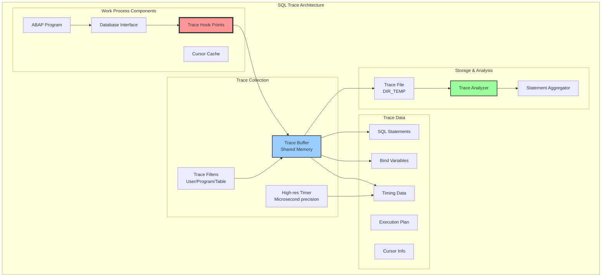
```mermaid
graph TB
    subgraph "SQL Trace Architecture"
        subgraph "Work Process Components"
            ABAP[ABAP Program]
            DBI[Database Interface]
            TRACE_HOOK[Trace Hook Points]
            CURSOR[Cursor Cache]
        end
        
        subgraph "Trace Collection"
            BUFFER[Trace Buffer<br/>Shared Memory]
            FILTER[Trace Filters<br/>User/Program/Table]
            TIMER[High-res Timer<br/>Microsecond precision]
        end
        
        subgraph "Trace Data"
            SQL_STMT[SQL Statements]
            BIND_VAR[Bind Variables]
            EXEC_PLAN[Execution Plan]
            TIMING[Timing Data]
            CURSOR_INFO[Cursor Info]
        end
        
        subgraph "Storage & Analysis"
            TRACE_FILE[Trace File<br/>DIR_TEMP]
            ANALYZER[Trace Analyzer]
            AGGREGATOR[Statement Aggregator]
        end
        
        ABAP --> DBI
        DBI --> TRACE_HOOK
        TRACE_HOOK --> BUFFER
        
        BUFFER --> SQL_STMT
        BUFFER --> BIND_VAR
        BUFFER --> TIMING
        
        FILTER --> BUFFER
        TIMER --> TIMING
        
        BUFFER --> TRACE_FILE
        TRACE_FILE --> ANALYZER
        ANALYZER --> AGGREGATOR
    end
    
    style TRACE_HOOK fill:#ff9999,stroke:#333,stroke-width:4px
    style BUFFER fill:#99ccff,stroke:#333,stroke-width:2px
    style ANALYZER fill:#99ff99,stroke:#333,stroke-width:2px
```

### Внутренний механизм перехвата

ST05 использует специальные hook points внутри Database Interface для перехвата всех операций с БД:

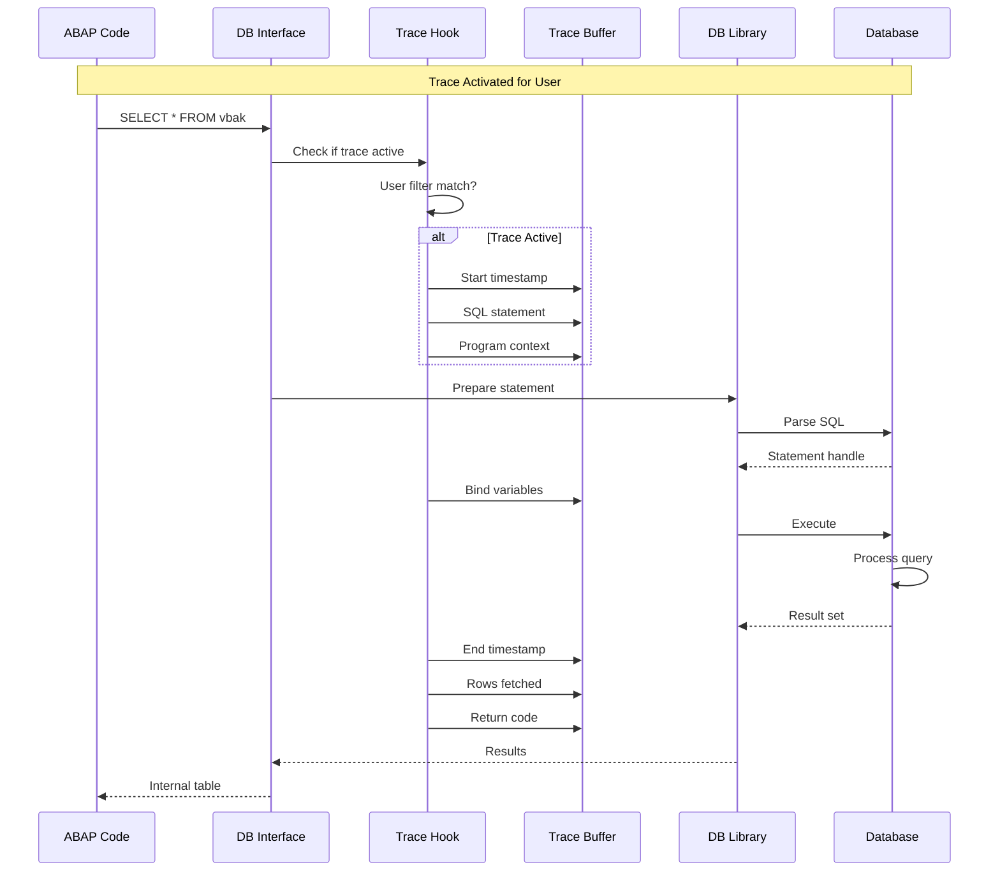
```mermaid
sequenceDiagram
    participant ABAP as ABAP Code
    participant DBI as DB Interface
    participant HOOK as Trace Hook
    participant BUFFER as Trace Buffer
    participant LIB as DB Library
    participant DB as Database
    
    Note over ABAP,DB: Trace Activated for User
    
    ABAP->>DBI: SELECT * FROM vbak
    DBI->>HOOK: Check if trace active
    HOOK->>HOOK: User filter match?
    
    alt Trace Active
        HOOK->>BUFFER: Start timestamp
        HOOK->>BUFFER: SQL statement
        HOOK->>BUFFER: Program context
    end
    
    DBI->>LIB: Prepare statement
    LIB->>DB: Parse SQL
    DB-->>LIB: Statement handle
    
    HOOK->>BUFFER: Bind variables
    
    LIB->>DB: Execute
    DB->>DB: Process query
    DB-->>LIB: Result set
    
    HOOK->>BUFFER: End timestamp
    HOOK->>BUFFER: Rows fetched
    HOOK->>BUFFER: Return code
    
    LIB-->>DBI: Results
    DBI-->>ABAP: Internal table
```

### Структура trace записи

Каждая запись в SQL trace содержит детальную информацию:

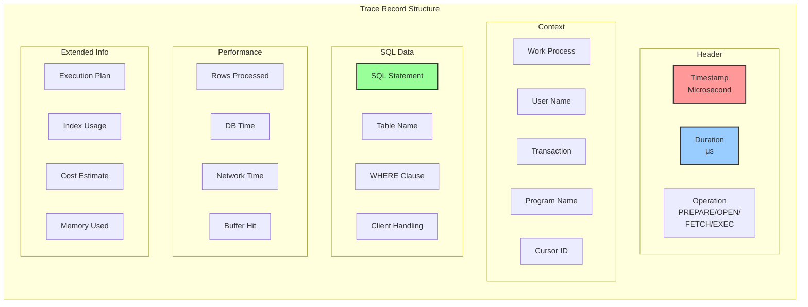
```mermaid
graph LR
    subgraph "Trace Record Structure"
        subgraph "Header"
            TIMESTAMP[Timestamp<br/>Microsecond]
            DURATION[Duration<br/>μs]
            OPERATION[Operation<br/>PREPARE/OPEN/<br/>FETCH/EXEC]
        end
        
        subgraph "Context"
            WP_NO[Work Process]
            USER[User Name]
            TCODE[Transaction]
            PROGRAM[Program Name]
            CURSOR_ID[Cursor ID]
        end
        
        subgraph "SQL Data"
            STATEMENT[SQL Statement]
            TABLE[Table Name]
            WHERE_CLAUSE[WHERE Clause]
            CLIENT[Client Handling]
        end
        
        subgraph "Performance"
            ROWS[Rows Processed]
            DB_TIME[DB Time]
            NETWORK[Network Time]
            BUFFER_HIT[Buffer Hit]
        end
        
        subgraph "Extended Info"
            EXEC_PLAN[Execution Plan]
            INDEX_USED[Index Usage]
            COST[Cost Estimate]
            MEMORY[Memory Used]
        end
    end
    
    style TIMESTAMP fill:#ff9999,stroke:#333,stroke-width:2px
    style DURATION fill:#99ccff,stroke:#333,stroke-width:2px
    style STATEMENT fill:#99ff99,stroke:#333,stroke-width:2px
```

### Анализ производительности запросов

ST05 предоставляет мощные возможности анализа:

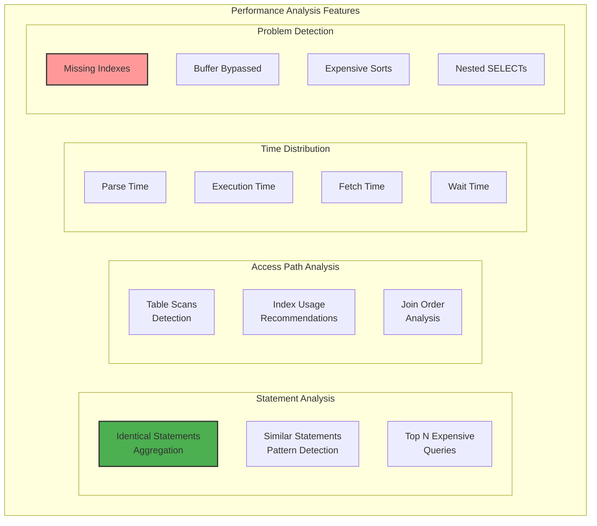
```mermaid
graph TB
    subgraph "Performance Analysis Features"
        subgraph "Statement Analysis"
            IDENTICAL[Identical Statements<br/>Aggregation]
            SIMILAR[Similar Statements<br/>Pattern Detection]
            TOP_N[Top N Expensive<br/>Queries]
        end
        
        subgraph "Access Path Analysis"
            FULL_SCAN[Table Scans<br/>Detection]
            INDEX_ANALYSIS[Index Usage<br/>Recommendations]
            JOIN_ORDER[Join Order<br/>Analysis]
        end
        
        subgraph "Time Distribution"
            PARSE_TIME[Parse Time]
            EXEC_TIME[Execution Time]
            FETCH_TIME[Fetch Time]
            WAIT_TIME[Wait Time]
        end
        
        subgraph "Problem Detection"
            MISSING_INDEX[Missing Indexes]
            BUFFER_BYPASS[Buffer Bypassed]
            EXPENSIVE_SORT[Expensive Sorts]
            NESTED_SELECT[Nested SELECTs]
        end
    end
    
    style IDENTICAL fill:#4CAF50,stroke:#333,stroke-width:2px
    style MISSING_INDEX fill:#ff9999,stroke:#333,stroke-width:2px
```

### HANA-специфичные расширения

Для HANA ST05 включает дополнительные возможности:

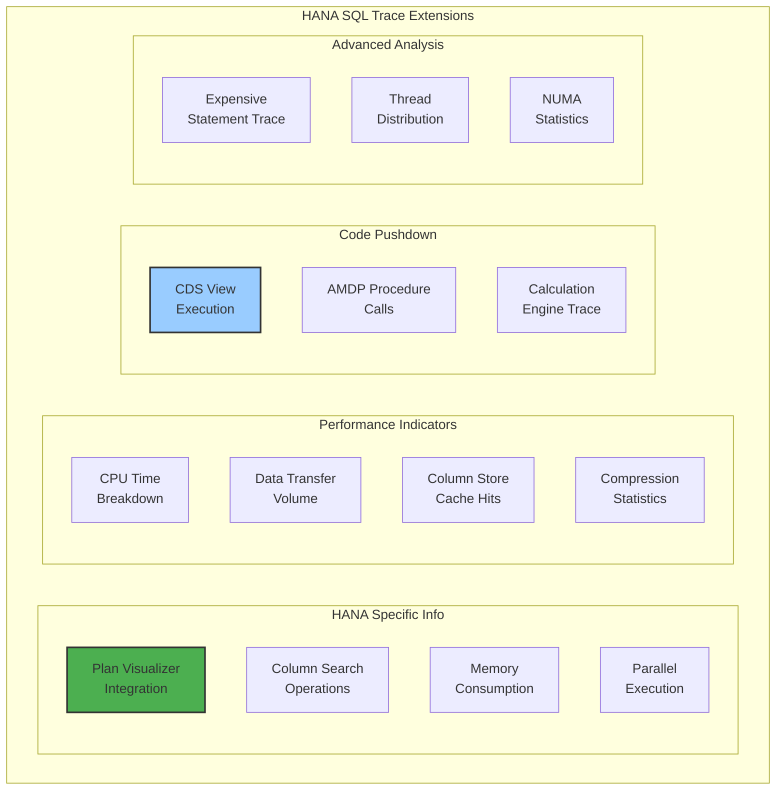
```mermaid
graph TB
    subgraph "HANA SQL Trace Extensions"
        subgraph "HANA Specific Info"
            PLAN_VIZ[Plan Visualizer<br/>Integration]
            COLUMN_SEARCH[Column Search<br/>Operations]
            MEMORY_TRACKING[Memory<br/>Consumption]
            PARALLELISM[Parallel<br/>Execution]
        end
        
        subgraph "Performance Indicators"
            CPU_TIME[CPU Time<br/>Breakdown]
            DATA_TRANSFER[Data Transfer<br/>Volume]
            CACHE_HIT[Column Store<br/>Cache Hits]
            COMPRESSION[Compression<br/>Statistics]
        end
        
        subgraph "Code Pushdown"
            CDS_TRACE[CDS View<br/>Execution]
            AMDP_TRACE[AMDP Procedure<br/>Calls]
            CALC_ENGINE[Calculation<br/>Engine Trace]
        end
        
        subgraph "Advanced Analysis"
            EXPENSIVE_STMT[Expensive<br/>Statement Trace]
            THREAD_ANALYSIS[Thread<br/>Distribution]
            NUMA_STATS[NUMA<br/>Statistics]
        end
    end
    
    style PLAN_VIZ fill:#4CAF50,stroke:#333,stroke-width:2px
    style CDS_TRACE fill:#99ccff,stroke:#333,stroke-width:2px
```

## 12.2. ABAP Runtime Analysis

ABAP Runtime Analysis (SAT, ранее SE30) предоставляет детальный анализ выполнения ABAP-кода на уровне отдельных операций виртуальной машины.

### Архитектура Runtime Analysis

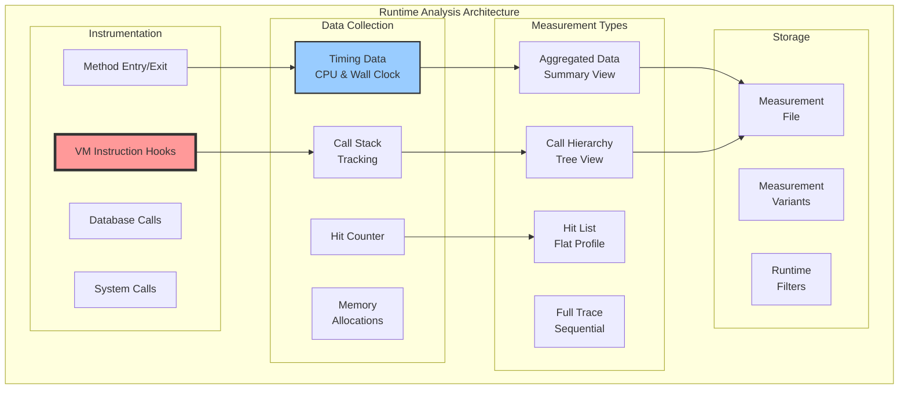
```mermaid
graph TB
    subgraph "Runtime Analysis Architecture"
        subgraph "Instrumentation"
            VM_HOOKS[VM Instruction Hooks]
            METHOD_ENTRY[Method Entry/Exit]
            DB_CALLS[Database Calls]
            SYSTEM_CALLS[System Calls]
        end
        
        subgraph "Data Collection"
            CALL_STACK[Call Stack<br/>Tracking]
            TIMING_DATA[Timing Data<br/>CPU & Wall Clock]
            MEMORY_ALLOC[Memory<br/>Allocations]
            HIT_COUNT[Hit Counter]
        end
        
        subgraph "Measurement Types"
            AGGREGATED[Aggregated Data<br/>Summary View]
            HIERARCHICAL[Call Hierarchy<br/>Tree View]
            HIT_LIST[Hit List<br/>Flat Profile]
            TRACE[Full Trace<br/>Sequential]
        end
        
        subgraph "Storage"
            MEASUREMENT[Measurement<br/>File]
            VARIANTS[Measurement<br/>Variants]
            FILTERS[Runtime<br/>Filters]
        end
        
        VM_HOOKS --> CALL_STACK
        METHOD_ENTRY --> TIMING_DATA
        
        CALL_STACK --> HIERARCHICAL
        TIMING_DATA --> AGGREGATED
        HIT_COUNT --> HIT_LIST
        
        AGGREGATED --> MEASUREMENT
        HIERARCHICAL --> MEASUREMENT
    end
    
    style VM_HOOKS fill:#ff9999,stroke:#333,stroke-width:4px
    style TIMING_DATA fill:#99ccff,stroke:#333,stroke-width:2px
```

### Механизм профилирования

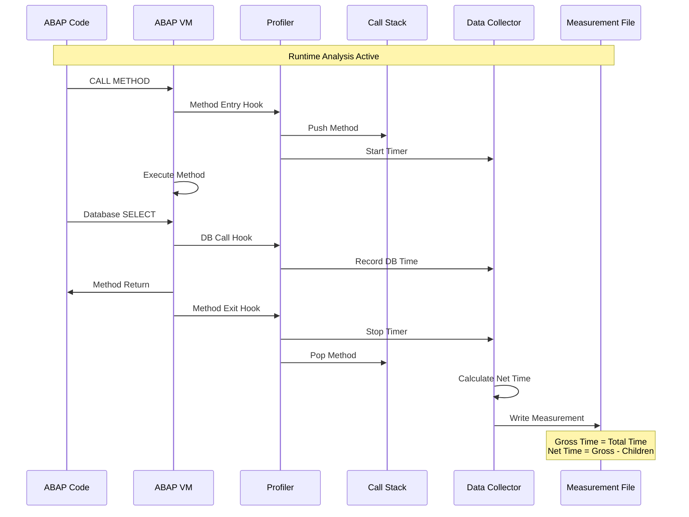
```mermaid
sequenceDiagram
    participant CODE as ABAP Code
    participant VM as ABAP VM
    participant PROFILER as Profiler
    participant STACK as Call Stack
    participant COLLECTOR as Data Collector
    participant FILE as Measurement File
    
    Note over CODE,FILE: Runtime Analysis Active
    
    CODE->>VM: CALL METHOD
    VM->>PROFILER: Method Entry Hook
    PROFILER->>STACK: Push Method
    PROFILER->>COLLECTOR: Start Timer
    
    VM->>VM: Execute Method
    
    CODE->>VM: Database SELECT
    VM->>PROFILER: DB Call Hook
    PROFILER->>COLLECTOR: Record DB Time
    
    VM->>CODE: Method Return
    VM->>PROFILER: Method Exit Hook
    PROFILER->>COLLECTOR: Stop Timer
    PROFILER->>STACK: Pop Method
    
    COLLECTOR->>COLLECTOR: Calculate Net Time
    COLLECTOR->>FILE: Write Measurement
    
    Note over FILE: Gross Time = Total Time<br/>Net Time = Gross - Children
```

### Типы измерений и их особенности

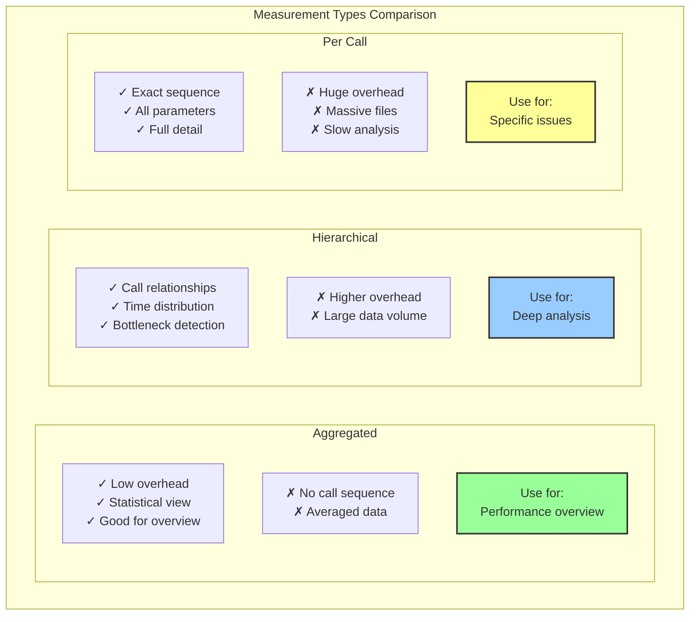
```mermaid
graph TB
    subgraph "Measurement Types Comparison"
        subgraph "Aggregated"
            AGG_PROS[✓ Low overhead<br/>✓ Statistical view<br/>✓ Good for overview]
            AGG_CONS[✗ No call sequence<br/>✗ Averaged data]
            AGG_USE[Use for:<br/>Performance overview]
        end
        
        subgraph "Hierarchical"
            HIER_PROS[✓ Call relationships<br/>✓ Time distribution<br/>✓ Bottleneck detection]
            HIER_CONS[✗ Higher overhead<br/>✗ Large data volume]
            HIER_USE[Use for:<br/>Deep analysis]
        end
        
        subgraph "Per Call"
            CALL_PROS[✓ Exact sequence<br/>✓ All parameters<br/>✓ Full detail]
            CALL_CONS[✗ Huge overhead<br/>✗ Massive files<br/>✗ Slow analysis]
            CALL_USE[Use for:<br/>Specific issues]
        end
    end
    
    style AGG_USE fill:#99ff99,stroke:#333,stroke-width:2px
    style HIER_USE fill:#99ccff,stroke:#333,stroke-width:2px
    style CALL_USE fill:#ffff99,stroke:#333,stroke-width:2px
```

### Анализ горячих точек (Hot Spots)

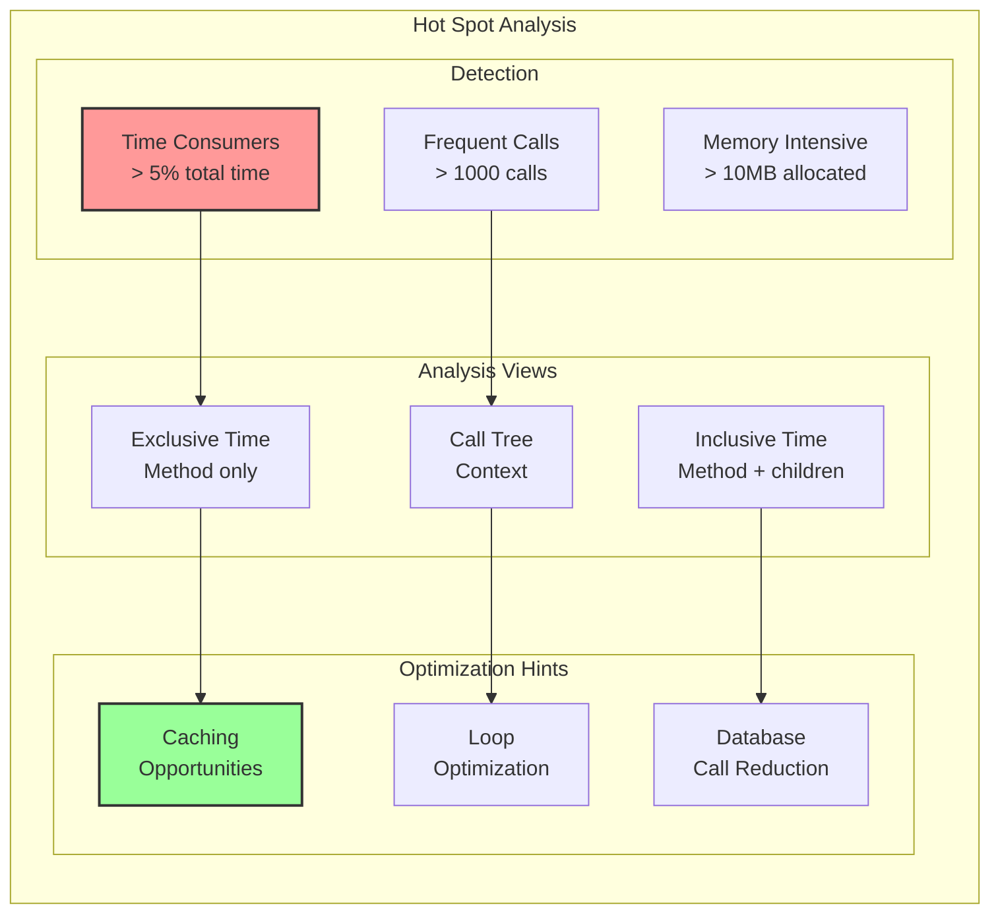
```mermaid
graph LR
    subgraph "Hot Spot Analysis"
        subgraph "Detection"
            TIME_CONSUMER[Time Consumers<br/>> 5% total time]
            FREQ_CALLS[Frequent Calls<br/>> 1000 calls]
            MEMORY_HOG[Memory Intensive<br/>> 10MB allocated]
        end
        
        subgraph "Analysis Views"
            EXCLUSIVE[Exclusive Time<br/>Method only]
            INCLUSIVE[Inclusive Time<br/>Method + children]
            CALL_TREE[Call Tree<br/>Context]
        end
        
        subgraph "Optimization Hints"
            CACHE_SUGGEST[Caching<br/>Opportunities]
            LOOP_OPTIMIZE[Loop<br/>Optimization]
            DB_REDUCE[Database<br/>Call Reduction]
        end
        
        TIME_CONSUMER --> EXCLUSIVE
        FREQ_CALLS --> CALL_TREE
        
        EXCLUSIVE --> CACHE_SUGGEST
        CALL_TREE --> LOOP_OPTIMIZE
        INCLUSIVE --> DB_REDUCE
    end
    
    style TIME_CONSUMER fill:#ff9999,stroke:#333,stroke-width:2px
    style CACHE_SUGGEST fill:#99ff99,stroke:#333,stroke-width:2px
```

### Интеграция с ABAP VM

Runtime Analysis тесно интегрирован с виртуальной машиной ABAP:

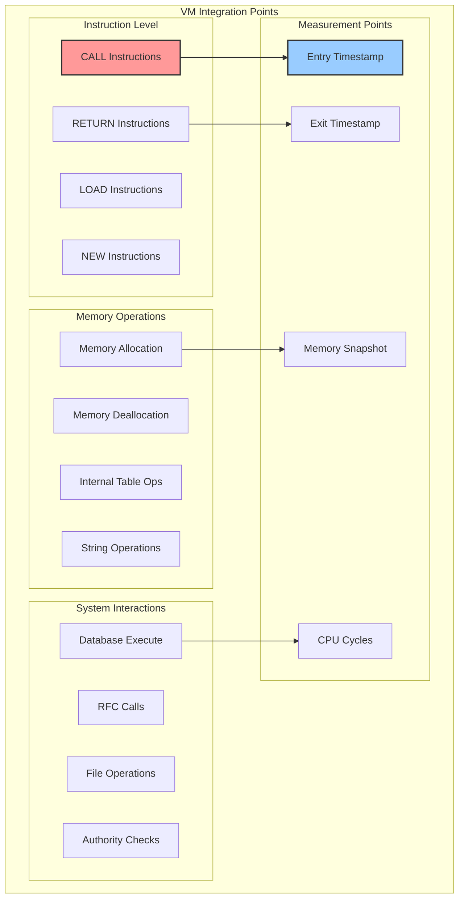
```mermaid
graph TB
    subgraph "VM Integration Points"
        subgraph "Instruction Level"
            LOAD_INSTR[LOAD Instructions]
            CALL_INSTR[CALL Instructions]
            RETURN_INSTR[RETURN Instructions]
            NEW_INSTR[NEW Instructions]
        end
        
        subgraph "Memory Operations"
            ALLOC[Memory Allocation]
            DEALLOC[Memory Deallocation]
            TABLE_OPS[Internal Table Ops]
            STRING_OPS[String Operations]
        end
        
        subgraph "System Interactions"
            DB_EXEC[Database Execute]
            RFC_CALL[RFC Calls]
            FILE_IO[File Operations]
            AUTH_CHECK[Authority Checks]
        end
        
        subgraph "Measurement Points"
            ENTRY_POINT[Entry Timestamp]
            EXIT_POINT[Exit Timestamp]
            CPU_CYCLES[CPU Cycles]
            MEMORY_SNAP[Memory Snapshot]
        end
        
        CALL_INSTR --> ENTRY_POINT
        RETURN_INSTR --> EXIT_POINT
        
        ALLOC --> MEMORY_SNAP
        DB_EXEC --> CPU_CYCLES
    end
    
    style CALL_INSTR fill:#ff9999,stroke:#333,stroke-width:2px
    style ENTRY_POINT fill:#99ccff,stroke:#333,stroke-width:2px
```

## 12.3. Memory Inspector

Memory Inspector (транзакция S_MEMORY_INSPECTOR) предоставляет детальный анализ использования памяти в ABAP-программах, позволяя обнаружить утечки памяти и неэффективное использование ресурсов.

### Архитектура Memory Inspector

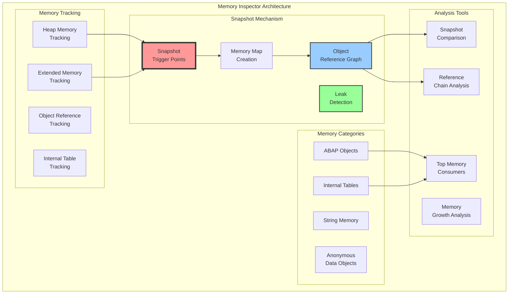
```mermaid
graph TB
    subgraph "Memory Inspector Architecture"
        subgraph "Memory Tracking"
            HEAP_TRACK[Heap Memory<br/>Tracking]
            EM_TRACK[Extended Memory<br/>Tracking]
            OBJECT_TRACK[Object Reference<br/>Tracking]
            TABLE_TRACK[Internal Table<br/>Tracking]
        end
        
        subgraph "Snapshot Mechanism"
            SNAP_TRIGGER[Snapshot<br/>Trigger Points]
            MEMORY_MAP[Memory Map<br/>Creation]
            OBJECT_GRAPH[Object<br/>Reference Graph]
            LEAK_DETECT[Leak<br/>Detection]
        end
        
        subgraph "Analysis Tools"
            COMPARE[Snapshot<br/>Comparison]
            TOP_CONSUMER[Top Memory<br/>Consumers]
            GROWTH[Memory<br/>Growth Analysis]
            REFERENCE[Reference<br/>Chain Analysis]
        end
        
        subgraph "Memory Categories"
            ABAP_OBJECTS[ABAP Objects]
            INTERNAL_TABLES[Internal Tables]
            STRINGS[String Memory]
            ANONYMOUS[Anonymous<br/>Data Objects]
        end
        
        HEAP_TRACK --> SNAP_TRIGGER
        EM_TRACK --> SNAP_TRIGGER
        
        SNAP_TRIGGER --> MEMORY_MAP
        MEMORY_MAP --> OBJECT_GRAPH
        
        OBJECT_GRAPH --> COMPARE
        OBJECT_GRAPH --> REFERENCE
        
        ABAP_OBJECTS --> TOP_CONSUMER
        INTERNAL_TABLES --> TOP_CONSUMER
    end
    
    style SNAP_TRIGGER fill:#ff9999,stroke:#333,stroke-width:4px
    style OBJECT_GRAPH fill:#99ccff,stroke:#333,stroke-width:2px
    style LEAK_DETECT fill:#99ff99,stroke:#333,stroke-width:2px
```

### Механизм создания снимков памяти

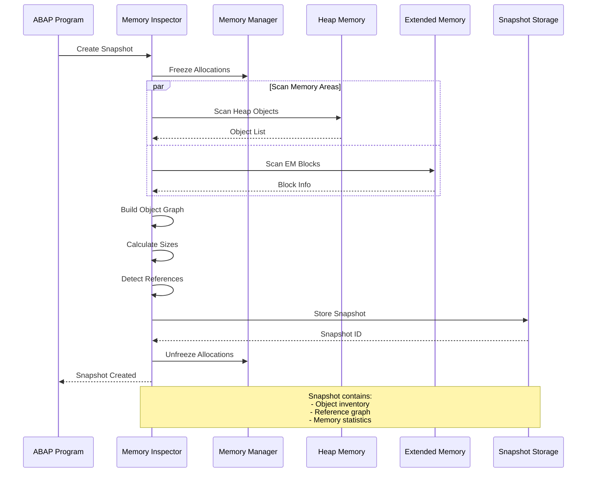
```mermaid
sequenceDiagram
    participant ABAP as ABAP Program
    participant MI as Memory Inspector
    participant MM as Memory Manager
    participant HEAP as Heap Memory
    participant EM as Extended Memory
    participant SNAP as Snapshot Storage
    
    ABAP->>MI: Create Snapshot
    MI->>MM: Freeze Allocations
    
    par Scan Memory Areas
        MI->>HEAP: Scan Heap Objects
        HEAP-->>MI: Object List
    and
        MI->>EM: Scan EM Blocks
        EM-->>MI: Block Info
    end
    
    MI->>MI: Build Object Graph
    MI->>MI: Calculate Sizes
    MI->>MI: Detect References
    
    MI->>SNAP: Store Snapshot
    SNAP-->>MI: Snapshot ID
    
    MI->>MM: Unfreeze Allocations
    MI-->>ABAP: Snapshot Created
    
    Note over MI,SNAP: Snapshot contains:<br/>- Object inventory<br/>- Reference graph<br/>- Memory statistics
```

### Анализ утечек памяти

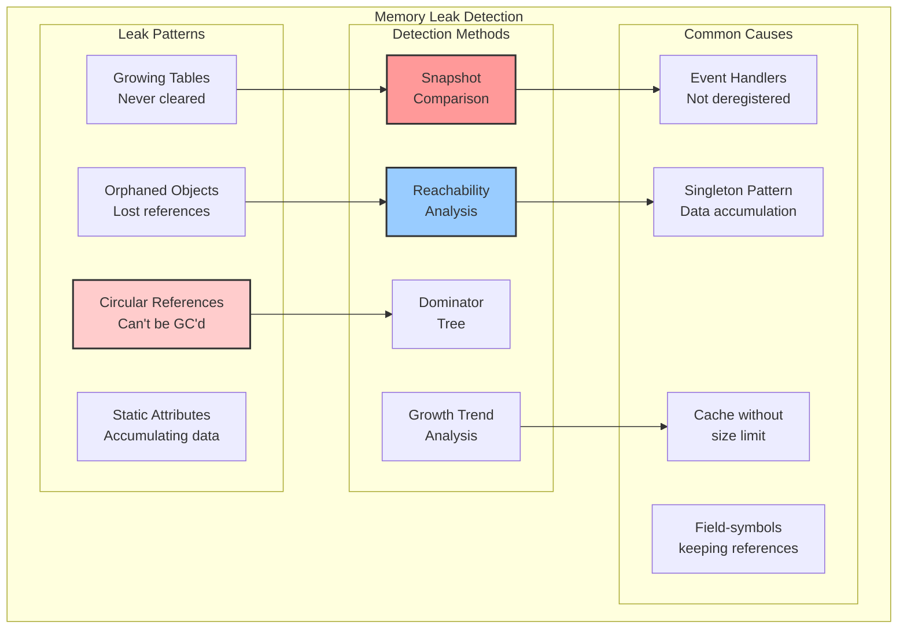
```mermaid
graph TB
    subgraph "Memory Leak Detection"
        subgraph "Leak Patterns"
            GROWING_TABLES[Growing Tables<br/>Never cleared]
            ORPHAN_OBJECTS[Orphaned Objects<br/>Lost references]
            CIRCULAR_REF[Circular References<br/>Can't be GC'd]
            STATIC_ATTR[Static Attributes<br/>Accumulating data]
        end
        
        subgraph "Detection Methods"
            SNAPSHOT_DIFF[Snapshot<br/>Comparison]
            GROWTH_TREND[Growth Trend<br/>Analysis]
            REACHABILITY[Reachability<br/>Analysis]
            DOMINATOR[Dominator<br/>Tree]
        end
        
        subgraph "Common Causes"
            EVENT_HANDLER[Event Handlers<br/>Not deregistered]
            SINGLETON[Singleton Pattern<br/>Data accumulation]
            CACHE_OVERFLOW[Cache without<br/>size limit]
            FIELD_SYMBOL[Field-symbols<br/>keeping references]
        end
        
        GROWING_TABLES --> SNAPSHOT_DIFF
        ORPHAN_OBJECTS --> REACHABILITY
        CIRCULAR_REF --> DOMINATOR
        
        SNAPSHOT_DIFF --> EVENT_HANDLER
        REACHABILITY --> SINGLETON
        GROWTH_TREND --> CACHE_OVERFLOW
    end
    
    style SNAPSHOT_DIFF fill:#ff9999,stroke:#333,stroke-width:2px
    style REACHABILITY fill:#99ccff,stroke:#333,stroke-width:2px
    style CIRCULAR_REF fill:#ffcccc,stroke:#333,stroke-width:2px
```

### Детальный анализ объектов

```mermaid
graph LR
    subgraph "Object Analysis Features"
        subgraph "Object Info"
            TYPE_INFO[Type Information<br/>Class/Structure]
            SIZE_INFO[Memory Size<br/>Shallow/Deep]
            CREATE_STACK[Creation<br/>Call Stack]
            REF_COUNT[Reference<br/>Count]
        end
        
        subgraph "Reference Analysis"
            INCOMING[Incoming<br/>References<br/>"Who points to me?"]
            OUTGOING[Outgoing<br/>References<br/>"What do I point to?"]
            PATH_TO_ROOT[Path to<br/>Root Set]
        end
        
        subgraph "Memory Breakdown"
            HEADER_SIZE[Object Header]
            FIELD_SIZE[Field Memory]
            VTABLE[Virtual Table]
            PADDING[Alignment Padding]
        end
        
        TYPE_INFO --> SIZE_INFO
        SIZE_INFO --> HEADER_SIZE
        SIZE_INFO --> FIELD_SIZE
        
        REF_COUNT --> INCOMING
        INCOMING --> PATH_TO_ROOT
    end
    
    style SIZE_INFO fill:#99ff99,stroke:#333,stroke-width:2px
    style PATH_TO_ROOT fill:#99ccff,stroke:#333,stroke-width:2px
```

### Интеграция с Memory Management

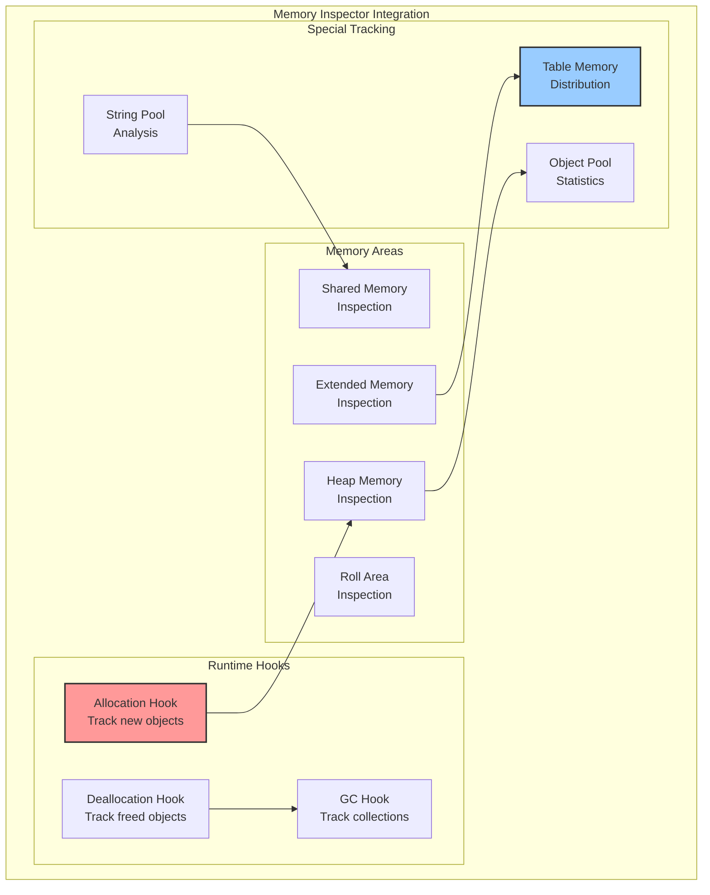
```mermaid
graph TB
    subgraph "Memory Inspector Integration"
        subgraph "Runtime Hooks"
            ALLOC_HOOK[Allocation Hook<br/>Track new objects]
            DEALLOC_HOOK[Deallocation Hook<br/>Track freed objects]
            GC_HOOK[GC Hook<br/>Track collections]
        end
        
        subgraph "Memory Areas"
            ROLL_INSPECT[Roll Area<br/>Inspection]
            EM_INSPECT[Extended Memory<br/>Inspection]
            HEAP_INSPECT[Heap Memory<br/>Inspection]
            SHARED_INSPECT[Shared Memory<br/>Inspection]
        end
        
        subgraph "Special Tracking"
            STRING_POOL[String Pool<br/>Analysis]
            TABLE_MEMORY[Table Memory<br/>Distribution]
            OBJECT_POOL[Object Pool<br/>Statistics]
        end
        
        ALLOC_HOOK --> HEAP_INSPECT
        DEALLOC_HOOK --> GC_HOOK
        
        HEAP_INSPECT --> OBJECT_POOL
        EM_INSPECT --> TABLE_MEMORY
        STRING_POOL --> SHARED_INSPECT
    end
    
    style ALLOC_HOOK fill:#ff9999,stroke:#333,stroke-width:2px
    style TABLE_MEMORY fill:#99ccff,stroke:#333,stroke-width:2px
```

## 12.4. Kernel Snapshot Analyzer

Kernel Snapshot Analyzer - это низкоуровневый инструмент для анализа внутреннего состояния SAP kernel, позволяющий диагностировать сложные проблемы производительности и стабильности.

### Архитектура Kernel Snapshot

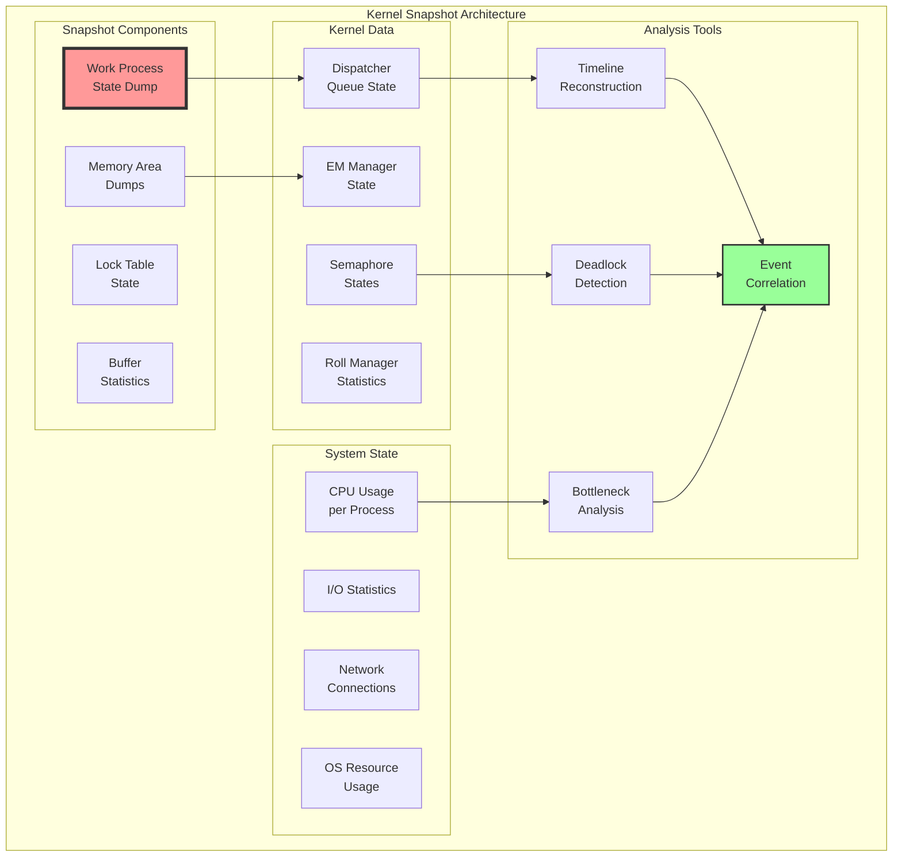
```mermaid
graph TB
    subgraph "Kernel Snapshot Architecture"
        subgraph "Snapshot Components"
            WP_STATE[Work Process<br/>State Dump]
            MEMORY_DUMP[Memory Area<br/>Dumps]
            LOCK_STATE[Lock Table<br/>State]
            BUFFER_STATE[Buffer<br/>Statistics]
        end
        
        subgraph "Kernel Data"
            DISPATCHER[Dispatcher<br/>Queue State]
            ROLL_MANAGER[Roll Manager<br/>Statistics]
            EM_MANAGER[EM Manager<br/>State]
            SEMAPHORES[Semaphore<br/>States]
        end
        
        subgraph "System State"
            CPU_INFO[CPU Usage<br/>per Process]
            IO_STATS[I/O Statistics]
            NETWORK[Network<br/>Connections]
            OS_RESOURCES[OS Resource<br/>Usage]
        end
        
        subgraph "Analysis Tools"
            TIMELINE[Timeline<br/>Reconstruction]
            DEADLOCK[Deadlock<br/>Detection]
            BOTTLENECK[Bottleneck<br/>Analysis]
            CORRELATION[Event<br/>Correlation]
        end
        
        WP_STATE --> DISPATCHER
        MEMORY_DUMP --> EM_MANAGER
        
        DISPATCHER --> TIMELINE
        SEMAPHORES --> DEADLOCK
        CPU_INFO --> BOTTLENECK
        
        TIMELINE --> CORRELATION
        DEADLOCK --> CORRELATION
        BOTTLENECK --> CORRELATION
    end
    
    style WP_STATE fill:#ff9999,stroke:#333,stroke-width:4px
    style CORRELATION fill:#99ff99,stroke:#333,stroke-width:2px
```

### Механизм создания Kernel Snapshot

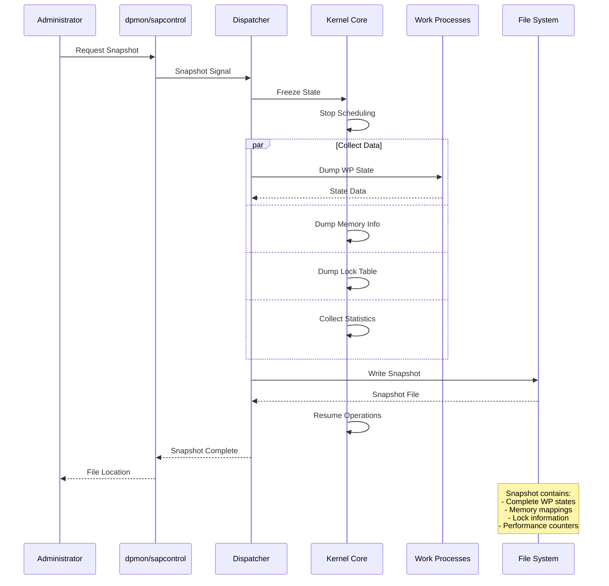
```mermaid
sequenceDiagram
    participant ADMIN as Administrator
    participant DPMON as dpmon/sapcontrol
    participant DISPATCHER as Dispatcher
    participant KERNEL as Kernel Core
    participant WPS as Work Processes
    participant FS as File System
    
    ADMIN->>DPMON: Request Snapshot
    DPMON->>DISPATCHER: Snapshot Signal
    
    DISPATCHER->>KERNEL: Freeze State
    KERNEL->>KERNEL: Stop Scheduling
    
    par Collect Data
        DISPATCHER->>WPS: Dump WP State
        WPS-->>DISPATCHER: State Data
    and
        KERNEL->>KERNEL: Dump Memory Info
    and
        KERNEL->>KERNEL: Dump Lock Table
    and
        KERNEL->>KERNEL: Collect Statistics
    end
    
    DISPATCHER->>FS: Write Snapshot
    FS-->>DISPATCHER: Snapshot File
    
    KERNEL->>KERNEL: Resume Operations
    DISPATCHER-->>DPMON: Snapshot Complete
    DPMON-->>ADMIN: File Location
    
    Note over FS: Snapshot contains:<br/>- Complete WP states<br/>- Memory mappings<br/>- Lock information<br/>- Performance counters
```

### Анализ Work Process состояний

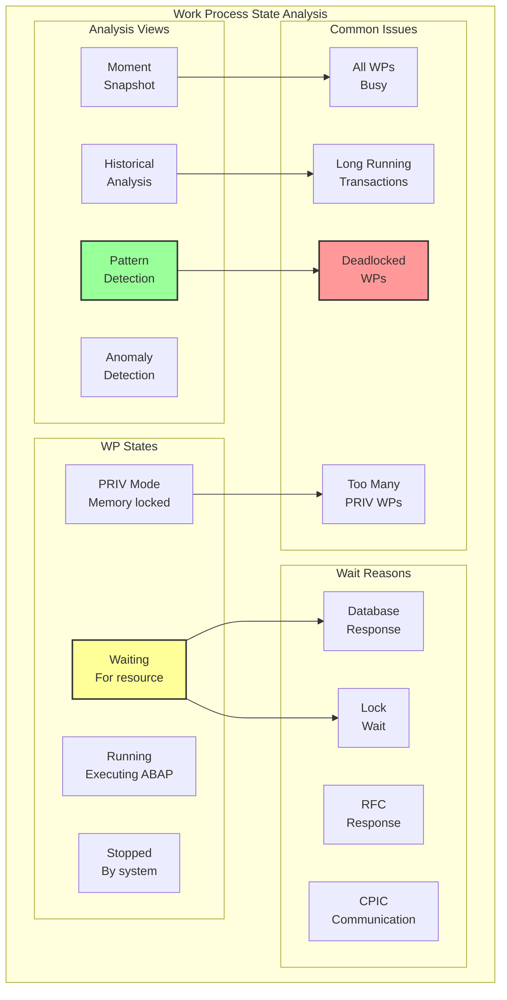
```mermaid
graph TB
    subgraph "Work Process State Analysis"
        subgraph "WP States"
            RUNNING[Running<br/>Executing ABAP]
            WAITING[Waiting<br/>For resource]
            STOPPED[Stopped<br/>By system]
            PRIV[PRIV Mode<br/>Memory locked]
        end
        
        subgraph "Wait Reasons"
            DB_WAIT[Database<br/>Response]
            RFC_WAIT[RFC<br/>Response]
            LOCK_WAIT[Lock<br/>Wait]
            CPIC_WAIT[CPIC<br/>Communication]
        end
        
        subgraph "Analysis Views"
            SNAPSHOT_MOMENT[Moment<br/>Snapshot]
            HISTORY_VIEW[Historical<br/>Analysis]
            PATTERN_DETECT[Pattern<br/>Detection]
            ANOMALY[Anomaly<br/>Detection]
        end
        
        subgraph "Common Issues"
            ALL_BUSY[All WPs<br/>Busy]
            LONG_RUNNER[Long Running<br/>Transactions]
            DEADLOCK_WP[Deadlocked<br/>WPs]
            PRIV_OVERFLOW[Too Many<br/>PRIV WPs]
        end
        
        WAITING --> DB_WAIT
        WAITING --> LOCK_WAIT
        
        SNAPSHOT_MOMENT --> ALL_BUSY
        HISTORY_VIEW --> LONG_RUNNER
        PATTERN_DETECT --> DEADLOCK_WP
        PRIV --> PRIV_OVERFLOW
    end
    
    style WAITING fill:#ffff99,stroke:#333,stroke-width:2px
    style DEADLOCK_WP fill:#ff9999,stroke:#333,stroke-width:2px
    style PATTERN_DETECT fill:#99ff99,stroke:#333,stroke-width:2px
```

### Низкоуровневый анализ памяти

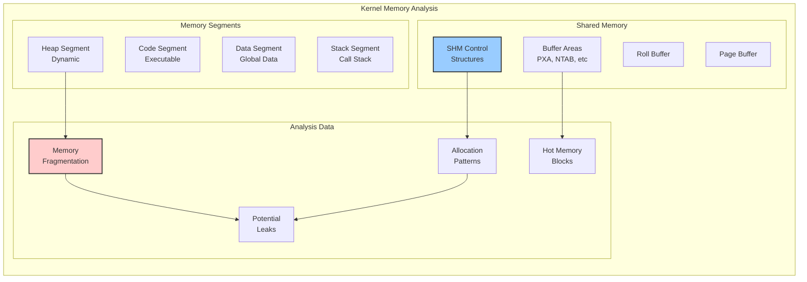
```mermaid
graph LR
    subgraph "Kernel Memory Analysis"
        subgraph "Memory Segments"
            CODE_SEG[Code Segment<br/>Executable]
            DATA_SEG[Data Segment<br/>Global Data]
            HEAP_SEG[Heap Segment<br/>Dynamic]
            STACK_SEG[Stack Segment<br/>Call Stack]
        end
        
        subgraph "Shared Memory"
            SHM_CONTROL[SHM Control<br/>Structures]
            BUFFER_AREAS[Buffer Areas<br/>PXA, NTAB, etc]
            ROLL_BUFFER[Roll Buffer]
            PAGE_BUFFER[Page Buffer]
        end
        
        subgraph "Analysis Data"
            FRAGMENTATION[Memory<br/>Fragmentation]
            ALLOCATION[Allocation<br/>Patterns]
            HOT_BLOCKS[Hot Memory<br/>Blocks]
            LEAK_SUSPECT[Potential<br/>Leaks]
        end
        
        HEAP_SEG --> FRAGMENTATION
        SHM_CONTROL --> ALLOCATION
        BUFFER_AREAS --> HOT_BLOCKS
        
        FRAGMENTATION --> LEAK_SUSPECT
        ALLOCATION --> LEAK_SUSPECT
    end
    
    style SHM_CONTROL fill:#99ccff,stroke:#333,stroke-width:2px
    style FRAGMENTATION fill:#ffcccc,stroke:#333,stroke-width:2px
```

### Семафоры и синхронизация

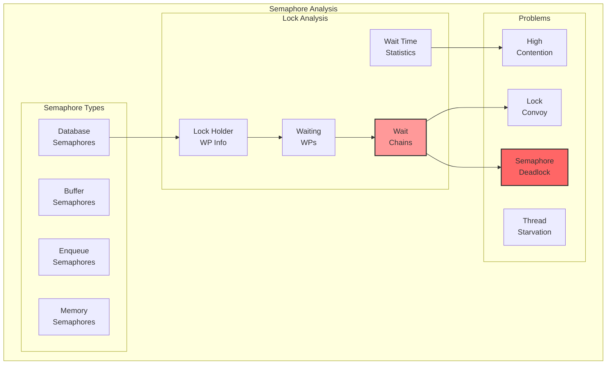
```mermaid
graph TB
    subgraph "Semaphore Analysis"
        subgraph "Semaphore Types"
            DB_SEM[Database<br/>Semaphores]
            BUFFER_SEM[Buffer<br/>Semaphores]
            ENQUEUE_SEM[Enqueue<br/>Semaphores]
            MEMORY_SEM[Memory<br/>Semaphores]
        end
        
        subgraph "Lock Analysis"
            HOLDER[Lock Holder<br/>WP Info]
            WAITERS[Waiting<br/>WPs]
            WAIT_TIME[Wait Time<br/>Statistics]
            CHAIN[Wait<br/>Chains]
        end
        
        subgraph "Problems"
            CONTENTION[High<br/>Contention]
            CONVOY[Lock<br/>Convoy]
            STARVATION[Thread<br/>Starvation]
            DEADLOCK_SEM[Semaphore<br/>Deadlock]
        end
        
        DB_SEM --> HOLDER
        HOLDER --> WAITERS
        WAITERS --> CHAIN
        
        CHAIN --> CONVOY
        WAIT_TIME --> CONTENTION
        CHAIN --> DEADLOCK_SEM
    end
    
    style CHAIN fill:#ff9999,stroke:#333,stroke-width:2px
    style DEADLOCK_SEM fill:#ff6666,stroke:#333,stroke-width:2px
```

### Интеграция с OS-level инструментами

```mermaid
graph TB
    subgraph "OS Integration"
        subgraph "Linux Tools"
            STRACE[strace<br/>System Calls]
            PERF[perf<br/>CPU Profiling]
            PMAP[pmap<br/>Memory Map]
            LSOF[lsof<br/>Open Files]
        end
        
        subgraph "Windows Tools"
            PROCMON[Process Monitor]
            WINDBG[WinDbg<br/>Kernel Debug]
            PERFMON[Performance<br/>Monitor]
            VMMAP[VMMap]
        end
        
        subgraph "Correlation"
            KSNAP[Kernel<br/>Snapshot]
            OS_DATA[OS Level<br/>Data]
            COMBINED[Combined<br/>Analysis]
        end
        
        STRACE --> OS_DATA
        PERF --> OS_DATA
        PROCMON --> OS_DATA
        
        KSNAP --> COMBINED
        OS_DATA --> COMBINED
    end
    
    style KSNAP fill:#99ccff,stroke:#333,stroke-width:2px
    style COMBINED fill:#99ff99,stroke:#333,stroke-width:2px
```

### Практические сценарии использования

```mermaid
graph TB
    subgraph "Usage Scenarios"
        subgraph "Performance Issues"
            SLOW_SYSTEM[System<br/>Slowdown]
            HIGH_CPU[High CPU<br/>Usage]
            MEMORY_ISSUE[Memory<br/>Problems]
        end
        
        subgraph "Stability Issues"
            CRASHES[System<br/>Crashes]
            HANGS[System<br/>Hangs]
            CORRUPTION[Data<br/>Corruption]
        end
        
        subgraph "Analysis Flow"
            COLLECT[Collect<br/>Snapshot]
            ANALYZE[Analyze<br/>Data]
            IDENTIFY[Identify<br/>Root Cause]
            RESOLVE[Apply<br/>Solution]
        end
        
        SLOW_SYSTEM --> COLLECT
        CRASHES --> COLLECT
        
        COLLECT --> ANALYZE
        ANALYZE --> IDENTIFY
        IDENTIFY --> RESOLVE
    end
    
    style COLLECT fill:#ff9999,stroke:#333,stroke-width:2px
    style IDENTIFY fill:#99ff99,stroke:#333,stroke-width:2px
```

## Заключение

Инструменты анализа SAP представляют собой мощный арсенал для диагностики и оптимизации системы на всех уровнях - от SQL-запросов до внутренностей kernel:

1. **SQL Trace (ST05)** - незаменим для оптимизации доступа к данным, особенно важен при работе с HANA для анализа code pushdown

2. **Runtime Analysis (SAT)** - позволяет найти узкие места в ABAP-коде через детальное профилирование на уровне VM

3. **Memory Inspector** - критически важен для обнаружения утечек памяти и оптимизации использования памяти

4. **Kernel Snapshot Analyzer** - последняя инстанция для диагностики сложных системных проблем

Ключевые принципы эффективного анализа:

- **Комплексный подход**: использование нескольких инструментов для полной картины
- **Понимание архитектуры**: знание внутреннего устройства помогает правильно интерпретировать данные
- **Систематичность**: регулярный мониторинг предотвращает проблемы
- **Документирование**: фиксация baseline показателей для сравнения

Мастерство использования этих инструментов отличает эксперта по производительности SAP от обычного разработчика. В эпоху S/4HANA и облачных решений эти навыки становятся еще более критичными для обеспечения оптимальной работы систем.