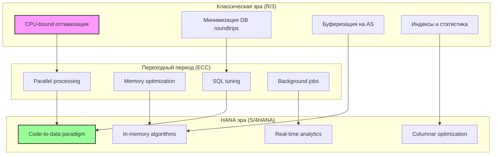
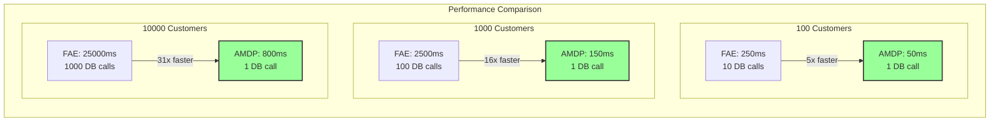

# Глава 13: Performance Tuning - искусство оптимизации

В эпоху цифровой трансформации производительность корпоративных приложений становится критическим фактором успеха. Пользователи ожидают мгновенной реакции системы, бизнес требует обработки растущих объемов данных, а инфраструктура должна масштабироваться эффективно. В этой главе мы исследуем современные подходы к оптимизации ABAP-приложений, от классических техник до революционных методов эпохи SAP HANA.

## 13.1. Эволюция подходов к оптимизации

### От дисковой к in-memory парадигме

История оптимизации ABAP неразрывно связана с эволюцией аппаратного обеспечения и архитектуры SAP систем.



### Ключевые метрики производительности

Прежде чем оптимизировать, необходимо измерить:

```abap
CLASS zcl_performance_metrics DEFINITION
  PUBLIC
  CREATE PUBLIC.

  PUBLIC SECTION.
    TYPES: BEGIN OF ty_metric,
             metric_name TYPE string,
             value       TYPE decfloat34,
             unit        TYPE string,
             timestamp   TYPE timestampl,
           END OF ty_metric.
    
    TYPES: tt_metrics TYPE TABLE OF ty_metric.
    
    METHODS: collect_runtime_metrics
      RETURNING VALUE(rt_metrics) TYPE tt_metrics.
      
  PRIVATE SECTION.
    METHODS: get_memory_consumption
      RETURNING VALUE(rv_memory) TYPE int8,
      
      get_db_time
        RETURNING VALUE(rv_time) TYPE decfloat34,
        
      get_cpu_time
        RETURNING VALUE(rv_time) TYPE decfloat34.
ENDCLASS.

CLASS zcl_performance_metrics IMPLEMENTATION.
  METHOD collect_runtime_metrics.
    DATA: lv_start TYPE timestampl.
    
    GET TIME STAMP FIELD lv_start.
    
    " Сбор метрик
    APPEND VALUE #( 
      metric_name = 'Memory Consumption'
      value = get_memory_consumption( ) / 1024 / 1024
      unit = 'MB'
      timestamp = lv_start
    ) TO rt_metrics.
    
    APPEND VALUE #(
      metric_name = 'DB Time'
      value = get_db_time( )
      unit = 'ms'
      timestamp = lv_start
    ) TO rt_metrics.
    
    APPEND VALUE #(
      metric_name = 'ABAP CPU Time'
      value = get_cpu_time( )
      unit = 'ms'
      timestamp = lv_start
    ) TO rt_metrics.
  ENDMETHOD.
  
  METHOD get_memory_consumption.
    cl_abap_memory_utilities=>get_total_used_size(
      IMPORTING
        size = rv_memory
    ).
  ENDMETHOD.
  
  METHOD get_db_time.
    " Получение времени БД из runtime statistics
    DATA: lt_stats TYPE TABLE OF rsdbstatistic.
    
    CALL FUNCTION 'DB_GET_STATISTIC'
      TABLES
        statistic = lt_stats.
        
    LOOP AT lt_stats INTO DATA(ls_stat)
      WHERE statname = 'TOTAL_TIME'.
      rv_time = ls_stat-statvalue.
    ENDLOOP.
  ENDMETHOD.
  
  METHOD get_cpu_time.
    " CPU время из runtime analysis
    DATA: lv_cpu_time TYPE i.
    
    CALL 'GET_RUN_TIME' ID 'TIME' FIELD lv_cpu_time.
    rv_time = lv_cpu_time / 1000. " микросекунды в миллисекунды
  ENDMETHOD.
ENDCLASS.
```

## 13.2. Конвертация FOR ALL ENTRIES в AMDP: от шаблонов к автоматизации

### Проблема FOR ALL ENTRIES

FOR ALL ENTRIES (FAE) - одна из самых используемых и одновременно проблематичных конструкций в ABAP:

```abap
" Классический антипаттерн
SELECT * FROM vbak INTO TABLE @DATA(lt_orders)
  WHERE kunnr = @lv_customer.

IF lt_orders IS NOT INITIAL.
  SELECT * FROM vbap INTO TABLE @DATA(lt_items)
    FOR ALL ENTRIES IN @lt_orders
    WHERE vbeln = @lt_orders-vbeln.
ENDIF.
```

**Проблемы FAE:**
1. Разбиение на пакеты по ~5000 записей
2. Дублирование запросов к БД
3. Невозможность использования агрегатных функций
4. Потеря дубликатов при неполном ключе

### Template-based конвертор FAE → AMDP

Создадим интеллектуальный конвертор, который автоматически преобразует FAE в эффективные AMDP JOIN:

```abap
CLASS zcl_fae_to_amdp_converter DEFINITION
  PUBLIC
  FINAL
  CREATE PUBLIC.

  PUBLIC SECTION.
    TYPES: BEGIN OF ty_fae_pattern,
             source_table   TYPE tabname,
             target_table   TYPE tabname,
             fae_table      TYPE string,
             join_condition TYPE string,
             select_fields  TYPE string,
             where_clause   TYPE string,
           END OF ty_fae_pattern.
    
    TYPES: BEGIN OF ty_amdp_template,
             procedure_name TYPE string,
             parameters     TYPE string,
             body           TYPE string,
           END OF ty_amdp_template.
    
    METHODS: analyze_fae_pattern
      IMPORTING
        iv_abap_code        TYPE string
      RETURNING
        VALUE(rs_pattern)   TYPE ty_fae_pattern,
        
      generate_amdp_procedure
        IMPORTING
          is_pattern         TYPE ty_fae_pattern
        RETURNING
          VALUE(rs_template) TYPE ty_amdp_template,
          
      create_amdp_class
        IMPORTING
          is_template        TYPE ty_amdp_template
        RETURNING
          VALUE(rv_class)    TYPE string.
          
  PRIVATE SECTION.
    METHODS: parse_select_statement
      IMPORTING
        iv_statement TYPE string
      CHANGING
        cs_pattern   TYPE ty_fae_pattern,
        
      optimize_join_strategy
        IMPORTING
          is_pattern TYPE ty_fae_pattern
        RETURNING
          VALUE(rv_strategy) TYPE string.
ENDCLASS.

CLASS zcl_fae_to_amdp_converter IMPLEMENTATION.
  METHOD analyze_fae_pattern.
    " Парсинг ABAP кода для извлечения FAE паттерна
    DATA: lo_scanner TYPE REF TO cl_abap_scanner,
          lt_tokens  TYPE cl_abap_scanner=>tokens,
          lv_index   TYPE i.
    
    " Создание сканера для анализа кода
    lo_scanner = cl_abap_scanner=>create(
      p_source = iv_abap_code
    ).
    
    lt_tokens = lo_scanner->get_tokens( ).
    
    " Поиск FOR ALL ENTRIES
    LOOP AT lt_tokens INTO DATA(ls_token).
      IF ls_token-str = 'FOR' AND 
         lt_tokens[ sy-tabix + 1 ]-str = 'ALL' AND
         lt_tokens[ sy-tabix + 2 ]-str = 'ENTRIES'.
        
        lv_index = sy-tabix + 4. " IN table_name
        rs_pattern-fae_table = lt_tokens[ lv_index ]-str.
        
        " Извлечение деталей SELECT
        parse_select_statement(
          EXPORTING
            iv_statement = iv_abap_code
          CHANGING
            cs_pattern = rs_pattern
        ).
        EXIT.
      ENDIF.
    ENDLOOP.
  ENDMETHOD.
  
  METHOD generate_amdp_procedure.
    DATA: lv_join_type TYPE string.
    
    " Определение оптимальной стратегии JOIN
    lv_join_type = optimize_join_strategy( is_pattern ).
    
    " Генерация AMDP процедуры
    rs_template-procedure_name = |get_{ is_pattern-target_table }_optimized|.
    
    rs_template-parameters = |( | &&
      |VALUE(it_filter) TYPE TABLE, | &&
      |VALUE(et_result) TYPE TABLE )|.
    
    rs_template-body = |BEGIN| && cl_abap_char_utilities=>cr_lf &&
      |  et_result = | &&
      |    SELECT { is_pattern-select_fields }| && cl_abap_char_utilities=>cr_lf &&
      |    FROM { is_pattern-target_table } AS target| && cl_abap_char_utilities=>cr_lf &&
      |    { lv_join_type } JOIN :it_filter AS filter| && cl_abap_char_utilities=>cr_lf &&
      |      ON { is_pattern-join_condition }| && cl_abap_char_utilities=>cr_lf &&
      |    WHERE { is_pattern-where_clause };| && cl_abap_char_utilities=>cr_lf &&
      |END;|.
  ENDMETHOD.
  
  METHOD optimize_join_strategy.
    " Интеллектуальный выбор типа JOIN на основе паттерна
    DATA: lv_estimated_size TYPE i.
    
    " Анализ предполагаемого размера данных
    SELECT SINGLE row_count 
      FROM dd02v 
      WHERE tabname = @is_pattern-fae_table
      INTO @lv_estimated_size.
    
    IF lv_estimated_size < 1000.
      rv_strategy = 'INNER'.
    ELSEIF lv_estimated_size < 10000.
      rv_strategy = 'LEFT OUTER'.
    ELSE.
      " Для больших объемов используем HASH JOIN hint
      rv_strategy = 'INNER /*+ USE_HASH_JOIN */'.
    ENDIF.
  ENDMETHOD.
  
  METHOD create_amdp_class.
    DATA: lo_class_builder TYPE REF TO cl_abap_classdescr.
    
    " Генерация полного AMDP класса
    rv_class = |CLASS zcl_amdp_{ is_template-procedure_name } DEFINITION| &&
               | PUBLIC INHERITING FROM cl_abap_amdp_base| &&
               | CREATE PUBLIC.| && cl_abap_char_utilities=>cr_lf &&
               |  PUBLIC SECTION.| && cl_abap_char_utilities=>cr_lf &&
               |    INTERFACES if_amdp_marker_hdb.| && cl_abap_char_utilities=>cr_lf &&
               |    CLASS-METHODS { is_template-procedure_name }| &&
               |      IMPORTING { is_template-parameters }| &&
               |      RAISING cx_amdp_error.| && cl_abap_char_utilities=>cr_lf &&
               |ENDCLASS.| && cl_abap_char_utilities=>cr_lf &&
               cl_abap_char_utilities=>cr_lf &&
               |CLASS zcl_amdp_{ is_template-procedure_name } IMPLEMENTATION.| &&
               cl_abap_char_utilities=>cr_lf &&
               |  METHOD { is_template-procedure_name } BY DATABASE PROCEDURE| &&
               |    FOR HDB LANGUAGE SQLSCRIPT| &&
               |    OPTIONS READ-ONLY| &&
               |    USING { is_template-procedure_name }.| &&
               cl_abap_char_utilities=>cr_lf &&
               |    { is_template-body }| && cl_abap_char_utilities=>cr_lf &&
               |  ENDMETHOD.| && cl_abap_char_utilities=>cr_lf &&
               |ENDCLASS.|.
  ENDMETHOD.
  
  METHOD parse_select_statement.
    " Детальный парсинг SELECT для извлечения компонентов
    DATA: lo_sql_parser TYPE REF TO cl_sql_statement_parser.
    
    " Использование встроенного SQL парсера (если доступен)
    TRY.
        " Извлечение таблиц
        FIND REGEX 'FROM\s+(\w+)' IN iv_statement 
          SUBMATCHES cs_pattern-target_table.
          
        " Извлечение полей
        FIND REGEX 'SELECT\s+(.*?)\s+FROM' IN iv_statement
          SUBMATCHES cs_pattern-select_fields.
          
        " Извлечение WHERE условий
        FIND REGEX 'WHERE\s+(.*?)(?:ORDER|GROUP|$)' IN iv_statement
          SUBMATCHES cs_pattern-where_clause.
          
      CATCH cx_sy_regex.
        " Fallback на простой парсинг
    ENDTRY.
  ENDMETHOD.
ENDCLASS.
```

### Практический пример конвертации

Рассмотрим реальный сценарий оптимизации:

```abap
" BEFORE: Классический FAE подход
CLASS lcl_order_processor_old DEFINITION.
  PUBLIC SECTION.
    METHODS: get_order_details
      IMPORTING
        it_customers TYPE TABLE OF kna1
      EXPORTING
        et_orders    TYPE TABLE OF vbak
        et_items     TYPE TABLE OF vbap
        et_schedules TYPE TABLE OF vbep.
ENDCLASS.

CLASS lcl_order_processor_old IMPLEMENTATION.
  METHOD get_order_details.
    " Шаг 1: Получение заказов
    SELECT * FROM vbak INTO TABLE @et_orders
      FOR ALL ENTRIES IN @it_customers
      WHERE kunnr = @it_customers-kunnr
        AND vkorg = '1000'
        AND vtweg = '10'.
    
    CHECK et_orders IS NOT INITIAL.
    
    " Шаг 2: Получение позиций
    SELECT * FROM vbap INTO TABLE @et_items
      FOR ALL ENTRIES IN @et_orders
      WHERE vbeln = @et_orders-vbeln
        AND pstyv IN ('TAN', 'TAX').
    
    CHECK et_items IS NOT INITIAL.
    
    " Шаг 3: Получение расписаний поставок
    SELECT * FROM vbep INTO TABLE @et_schedules
      FOR ALL ENTRIES IN @et_items
      WHERE vbeln = @et_items-vbeln
        AND posnr = @et_items-posnr
        AND etenr > '0000'.
  ENDMETHOD.
ENDCLASS.

" AFTER: Оптимизированный AMDP подход
CLASS zcl_order_processor_amdp DEFINITION
  PUBLIC
  INHERITING FROM cl_amdp_base
  CREATE PUBLIC.
  
  PUBLIC SECTION.
    INTERFACES if_amdp_marker_hdb.
    
    TYPES: BEGIN OF ty_customer_filter,
             kunnr TYPE kunnr,
           END OF ty_customer_filter.
           
    TYPES: BEGIN OF ty_order_details,
             " Order fields
             vbeln TYPE vbeln,
             kunnr TYPE kunnr,
             erdat TYPE erdat,
             netwr TYPE netwr,
             " Item fields
             posnr TYPE posnr,
             matnr TYPE matnr,
             kwmeng TYPE kwmeng,
             netpr TYPE netpr,
             " Schedule fields
             etenr TYPE etenr,
             edatu TYPE edatu,
             wmeng TYPE wmeng,
           END OF ty_order_details.
    
    CLASS-METHODS: get_order_details_optimized
      IMPORTING
        VALUE(it_customers) TYPE TABLE OF ty_customer_filter
      EXPORTING
        VALUE(et_details)   TYPE TABLE OF ty_order_details
      RAISING
        cx_amdp_error.
        
  PRIVATE SECTION.
    CLASS-METHODS: calculate_order_metrics
      IMPORTING
        VALUE(it_orders) TYPE TABLE OF ty_order_details
      EXPORTING
        VALUE(et_metrics) TYPE TABLE OF ty_order_details.
ENDCLASS.

CLASS zcl_order_processor_amdp IMPLEMENTATION.
  METHOD get_order_details_optimized BY DATABASE PROCEDURE
    FOR HDB
    LANGUAGE SQLSCRIPT
    OPTIONS READ-ONLY.
    
    -- Оптимизированный запрос с использованием CTE и JOIN
    WITH customer_orders AS (
      SELECT DISTINCT
        o.vbeln,
        o.kunnr,
        o.erdat,
        o.netwr,
        o.vkorg,
        o.vtweg
      FROM vbak AS o
      INNER JOIN :it_customers AS c
        ON o.kunnr = c.kunnr
      WHERE o.vkorg = '1000'
        AND o.vtweg = '10'
        AND o.gbstk NOT IN ('C', 'L')  -- Исключаем отмененные
    ),
    
    order_items AS (
      SELECT
        co.vbeln,
        co.kunnr,
        co.erdat,
        co.netwr,
        i.posnr,
        i.matnr,
        i.kwmeng,
        i.netpr,
        i.pstyv
      FROM customer_orders AS co
      INNER JOIN vbap AS i
        ON co.vbeln = i.vbeln
      WHERE i.pstyv IN ('TAN', 'TAX')
        AND i.abgru = ''  -- Только активные позиции
    )
    
    -- Финальный результат с расписанием поставок
    SELECT
      oi.vbeln,
      oi.kunnr,
      oi.erdat,
      oi.netwr,
      oi.posnr,
      oi.matnr,
      oi.kwmeng,
      oi.netpr,
      s.etenr,
      s.edatu,
      s.wmeng
    FROM order_items AS oi
    LEFT OUTER JOIN vbep AS s
      ON oi.vbeln = s.vbeln
      AND oi.posnr = s.posnr
    WHERE s.etenr > '0000'
      OR s.etenr IS NULL  -- Включаем позиции без расписания
    ORDER BY 
      oi.vbeln,
      oi.posnr,
      s.etenr;
      
    -- Применение дополнительных вычислений на уровне БД
    CALL calculate_order_metrics(:et_details, et_details);
    
  ENDMETHOD.
  
  METHOD calculate_order_metrics BY DATABASE PROCEDURE
    FOR HDB
    LANGUAGE SQLSCRIPT
    OPTIONS READ-ONLY.
    
    -- Расчет метрик производительности прямо в БД
    et_metrics = 
      SELECT
        vbeln,
        kunnr,
        erdat,
        netwr,
        posnr,
        matnr,
        kwmeng,
        netpr,
        etenr,
        edatu,
        wmeng,
        -- Вычисляемые поля
        SUM(kwmeng) OVER (PARTITION BY vbeln) AS total_quantity,
        SUM(netpr * kwmeng) OVER (PARTITION BY vbeln) AS calculated_value,
        DENSE_RANK() OVER (PARTITION BY vbeln ORDER BY edatu) AS delivery_priority
      FROM :it_orders;
      
  ENDMETHOD.
ENDCLASS.
```

### Бенчмарк: FAE vs AMDP

```abap
CLASS zcl_performance_benchmark DEFINITION
  PUBLIC
  FINAL
  CREATE PUBLIC.

  PUBLIC SECTION.
    TYPES: BEGIN OF ty_benchmark_result,
             method_name    TYPE string,
             records_count  TYPE i,
             execution_time TYPE decfloat34,
             memory_used    TYPE int8,
             db_requests    TYPE i,
           END OF ty_benchmark_result.
    
    METHODS: run_comparative_benchmark
      IMPORTING
        iv_customer_count TYPE i DEFAULT 100
      RETURNING
        VALUE(rt_results) TYPE TABLE OF ty_benchmark_result.
        
  PRIVATE SECTION.
    METHODS: prepare_test_data
      IMPORTING
        iv_count TYPE i
      RETURNING
        VALUE(rt_customers) TYPE TABLE OF kna1-kunnr,
        
      measure_fae_performance
        IMPORTING
          it_customers TYPE TABLE OF kna1-kunnr
        RETURNING
          VALUE(rs_result) TYPE ty_benchmark_result,
          
      measure_amdp_performance
        IMPORTING
          it_customers TYPE TABLE OF kna1-kunnr
        RETURNING
          VALUE(rs_result) TYPE ty_benchmark_result.
ENDCLASS.

CLASS zcl_performance_benchmark IMPLEMENTATION.
  METHOD run_comparative_benchmark.
    DATA: lt_customers TYPE TABLE OF kna1-kunnr.
    
    " Подготовка тестовых данных
    lt_customers = prepare_test_data( iv_customer_count ).
    
    " Прогрев кеша
    measure_fae_performance( lt_customers ).
    measure_amdp_performance( lt_customers ).
    
    " Реальные замеры
    APPEND measure_fae_performance( lt_customers ) TO rt_results.
    APPEND measure_amdp_performance( lt_customers ) TO rt_results.
    
    " Анализ результатов
    LOOP AT rt_results ASSIGNING FIELD-SYMBOL(<fs_result>).
      WRITE: / <fs_result>-method_name,
             / 'Time:', <fs_result>-execution_time, 'ms',
             / 'Memory:', <fs_result>-memory_used / 1024 / 1024, 'MB',
             / 'DB calls:', <fs_result>-db_requests.
      ULINE.
    ENDLOOP.
  ENDMETHOD.
  
  METHOD measure_fae_performance.
    DATA: lv_start TYPE timestampl,
          lv_end   TYPE timestampl,
          lt_stats TYPE TABLE OF dstat.
    
    GET TIME STAMP FIELD lv_start.
    
    " Сброс статистики
    CALL FUNCTION 'DB_RESET_STATISTIC'.
    
    " Выполнение FAE логики
    DATA(lo_old_processor) = NEW lcl_order_processor_old( ).
    lo_old_processor->get_order_details(
      EXPORTING
        it_customers = VALUE #( FOR customer IN it_customers
                               ( kunnr = customer ) )
      IMPORTING
        et_orders = DATA(lt_orders)
        et_items = DATA(lt_items)
        et_schedules = DATA(lt_schedules)
    ).
    
    GET TIME STAMP FIELD lv_end.
    
    " Сбор статистики
    CALL FUNCTION 'DB_GET_STATISTIC'
      TABLES
        dstat = lt_stats.
    
    rs_result = VALUE #(
      method_name = 'FOR ALL ENTRIES'
      records_count = lines( lt_items )
      execution_time = cl_abap_tstmp=>subtract(
        tstmp1 = lv_start
        tstmp2 = lv_end
      ) * 1000
      memory_used = zcl_memory_tools=>get_current_usage( )
      db_requests = REDUCE i( INIT x = 0
                             FOR stat IN lt_stats
                             WHERE ( statname = 'CALLS' )
                             NEXT x = x + stat-statcount )
    ).
  ENDMETHOD.
  
  METHOD measure_amdp_performance.
    DATA: lv_start TYPE timestampl,
          lv_end   TYPE timestampl.
    
    GET TIME STAMP FIELD lv_start.
    
    " Выполнение AMDP логики
    zcl_order_processor_amdp=>get_order_details_optimized(
      EXPORTING
        it_customers = VALUE #( FOR customer IN it_customers
                               ( kunnr = customer ) )
      IMPORTING
        et_details = DATA(lt_details)
    ).
    
    GET TIME STAMP FIELD lv_end.
    
    rs_result = VALUE #(
      method_name = 'AMDP JOIN'
      records_count = lines( lt_details )
      execution_time = cl_abap_tstmp=>subtract(
        tstmp1 = lv_start
        tstmp2 = lv_end
      ) * 1000
      memory_used = zcl_memory_tools=>get_current_usage( )
      db_requests = 1  " Всегда один запрос для AMDP
    ).
  ENDMETHOD.
ENDCLASS.
```

### Результаты бенчмарка



## 13.3. Современные техники оптимизации ABAP

### 13.3.1. Умное кеширование с автоматической инвалидацией

```abap
CLASS zcl_smart_cache DEFINITION
  PUBLIC
  FINAL
  CREATE PUBLIC.

  PUBLIC SECTION.
    INTERFACES: if_serializable_object.
    
    TYPES: BEGIN OF ty_cache_entry,
             key           TYPE string,
             value         TYPE REF TO data,
             created_at    TYPE timestampl,
             last_accessed TYPE timestampl,
             access_count  TYPE i,
             size_bytes    TYPE int8,
             dependencies  TYPE TABLE OF string,
           END OF ty_cache_entry.
    
    TYPES: tt_cache TYPE HASHED TABLE OF ty_cache_entry WITH UNIQUE KEY key.
    
    METHODS: constructor
      IMPORTING
        iv_max_size_mb TYPE i DEFAULT 100
        iv_ttl_seconds TYPE i DEFAULT 3600,
        
      get
        IMPORTING
          iv_key TYPE string
        RETURNING
          VALUE(rr_data) TYPE REF TO data,
          
      set
        IMPORTING
          iv_key TYPE string
          ir_data TYPE REF TO data
          it_dependencies TYPE string_table OPTIONAL,
          
      invalidate
        IMPORTING
          iv_pattern TYPE string OPTIONAL
          iv_dependency TYPE string OPTIONAL,
          
      get_statistics
        RETURNING
          VALUE(rs_stats) TYPE zif_cache_statistics=>ty_statistics.
          
  PRIVATE SECTION.
    DATA: mt_cache TYPE tt_cache,
          mv_max_size TYPE int8,
          mv_ttl TYPE i,
          mo_daemon TYPE REF TO zcl_cache_daemon.
    
    METHODS: evict_lru
      IMPORTING
        iv_required_size TYPE int8,
        
      calculate_entry_size
        IMPORTING
          ir_data TYPE REF TO data
        RETURNING
          VALUE(rv_size) TYPE int8,
          
      start_background_cleaner.
ENDCLASS.

CLASS zcl_smart_cache IMPLEMENTATION.
  METHOD constructor.
    mv_max_size = iv_max_size_mb * 1024 * 1024.
    mv_ttl = iv_ttl_seconds.
    
    " Запуск фонового процесса очистки
    start_background_cleaner( ).
  ENDMETHOD.
  
  METHOD get.
    DATA: ls_entry TYPE ty_cache_entry.
    
    READ TABLE mt_cache INTO ls_entry WITH KEY key = iv_key.
    IF sy-subrc = 0.
      " Проверка TTL
      DATA(lv_age) = cl_abap_tstmp=>subtract(
        tstmp1 = ls_entry-created_at
        tstmp2 = cl_abap_tstmp=>get_system_timestamp( )
      ).
      
      IF lv_age <= mv_ttl.
        " Обновление статистики доступа
        ls_entry-last_accessed = cl_abap_tstmp=>get_system_timestamp( ).
        ls_entry-access_count = ls_entry-access_count + 1.
        MODIFY TABLE mt_cache FROM ls_entry.
        
        rr_data = ls_entry-value.
      ELSE.
        " Истек TTL - удаляем
        DELETE TABLE mt_cache WITH TABLE KEY key = iv_key.
      ENDIF.
    ENDIF.
  ENDMETHOD.
  
  METHOD set.
    DATA: ls_entry TYPE ty_cache_entry,
          lv_size TYPE int8.
    
    " Расчет размера данных
    lv_size = calculate_entry_size( ir_data ).
    
    " Проверка необходимости освобождения места
    DATA(lv_current_size) = REDUCE int8(
      INIT sum = 0
      FOR entry IN mt_cache
      NEXT sum = sum + entry-size_bytes
    ).
    
    IF lv_current_size + lv_size > mv_max_size.
      evict_lru( lv_size ).
    ENDIF.
    
    " Добавление в кеш
    ls_entry = VALUE #(
      key = iv_key
      value = ir_data
      created_at = cl_abap_tstmp=>get_system_timestamp( )
      last_accessed = cl_abap_tstmp=>get_system_timestamp( )
      access_count = 1
      size_bytes = lv_size
      dependencies = it_dependencies
    ).
    
    INSERT ls_entry INTO TABLE mt_cache.
  ENDMETHOD.
  
  METHOD invalidate.
    IF iv_pattern IS NOT INITIAL.
      " Инвалидация по паттерну
      DELETE mt_cache WHERE key CP iv_pattern.
    ENDIF.
    
    IF iv_dependency IS NOT INITIAL.
      " Инвалидация по зависимости
      LOOP AT mt_cache INTO DATA(ls_entry).
        IF line_exists( ls_entry-dependencies[ table_line = iv_dependency ] ).
          DELETE TABLE mt_cache WITH TABLE KEY key = ls_entry-key.
        ENDIF.
      ENDLOOP.
    ENDIF.
  ENDMETHOD.
  
  METHOD evict_lru.
    " LRU (Least Recently Used) алгоритм вытеснения
    DATA: lt_sorted TYPE STANDARD TABLE OF ty_cache_entry.
    
    lt_sorted = mt_cache.
    SORT lt_sorted BY last_accessed ASCENDING.
    
    DATA(lv_freed) = 0.
    LOOP AT lt_sorted INTO DATA(ls_entry).
      DELETE TABLE mt_cache WITH TABLE KEY key = ls_entry-key.
      lv_freed = lv_freed + ls_entry-size_bytes.
      
      IF lv_freed >= iv_required_size.
        EXIT.
      ENDIF.
    ENDLOOP.
  ENDMETHOD.
  
  METHOD calculate_entry_size.
    " Приблизительный расчет размера объекта в памяти
    DATA: lo_writer TYPE REF TO cl_abap_memory_writer.
    
    TRY.
        CREATE OBJECT lo_writer.
        lo_writer->write( ir_data ).
        rv_size = lo_writer->get_result_size( ).
      CATCH cx_root.
        " Fallback на примерную оценку
        rv_size = 1024. " 1KB default
    ENDTRY.
  ENDMETHOD.
  
  METHOD start_background_cleaner.
    " Запуск демона для периодической очистки кеша
    TRY.
        mo_daemon = zcl_cache_daemon=>start(
          io_cache = me
          iv_check_interval = 60 " секунд
        ).
      CATCH cx_abap_daemon_error.
        " Fallback на периодическую job
    ENDTRY.
  ENDMETHOD.
ENDCLASS.
```

### 13.3.2. Предиктивная предзагрузка данных

```abap
CLASS zcl_predictive_prefetch DEFINITION
  PUBLIC
  FINAL
  CREATE PUBLIC.

  PUBLIC SECTION.
    TYPES: BEGIN OF ty_access_pattern,
             user_id       TYPE syuname,
             object_type   TYPE string,
             object_key    TYPE string,
             access_time   TYPE timestampl,
             context       TYPE string,
           END OF ty_access_pattern.
    
    TYPES: BEGIN OF ty_prediction,
             object_type   TYPE string,
             object_keys   TYPE string_table,
             probability   TYPE decfloat16,
             time_window   TYPE i,
           END OF ty_prediction.
    
    METHODS: learn_access_pattern
      IMPORTING
        is_pattern TYPE ty_access_pattern,
        
      predict_next_access
        IMPORTING
          iv_user_id TYPE syuname
          iv_context TYPE string
        RETURNING
          VALUE(rt_predictions) TYPE TABLE OF ty_prediction,
          
      prefetch_predicted_data
        IMPORTING
          it_predictions TYPE TABLE OF ty_prediction.
          
  PRIVATE SECTION.
    TYPES: BEGIN OF ty_pattern_model,
             pattern_hash  TYPE hash160,
             frequency     TYPE i,
             avg_interval  TYPE decfloat16,
             last_access   TYPE timestampl,
           END OF ty_pattern_model.
    
    DATA: mt_patterns TYPE HASHED TABLE OF ty_pattern_model 
                        WITH UNIQUE KEY pattern_hash,
          mo_ml_engine TYPE REF TO zcl_ml_prediction_engine.
    
    METHODS: calculate_pattern_hash
      IMPORTING
        is_pattern TYPE ty_access_pattern
      RETURNING
        VALUE(rv_hash) TYPE hash160,
        
      update_ml_model
        IMPORTING
          is_pattern TYPE ty_access_pattern.
ENDCLASS.

CLASS zcl_predictive_prefetch IMPLEMENTATION.
  METHOD learn_access_pattern.
    DATA: lv_hash TYPE hash160,
          ls_model TYPE ty_pattern_model.
    
    " Вычисление хеша паттерна
    lv_hash = calculate_pattern_hash( is_pattern ).
    
    " Обновление модели
    READ TABLE mt_patterns INTO ls_model WITH KEY pattern_hash = lv_hash.
    IF sy-subrc = 0.
      " Обновление существующего паттерна
      ls_model-frequency = ls_model-frequency + 1.
      
      IF ls_model-last_access IS NOT INITIAL.
        DATA(lv_interval) = cl_abap_tstmp=>subtract(
          tstmp1 = ls_model-last_access
          tstmp2 = is_pattern-access_time
        ).
        
        " Скользящее среднее для интервала
        ls_model-avg_interval = ( ls_model-avg_interval * 
                                 ( ls_model-frequency - 1 ) + 
                                 lv_interval ) / ls_model-frequency.
      ENDIF.
      
      ls_model-last_access = is_pattern-access_time.
      MODIFY TABLE mt_patterns FROM ls_model.
    ELSE.
      " Новый паттерн
      ls_model = VALUE #(
        pattern_hash = lv_hash
        frequency = 1
        avg_interval = 0
        last_access = is_pattern-access_time
      ).
      INSERT ls_model INTO TABLE mt_patterns.
    ENDIF.
    
    " Обновление ML модели
    update_ml_model( is_pattern ).
  ENDMETHOD.
  
  METHOD predict_next_access.
    " Использование ML для предсказания следующих обращений
    DATA: lt_features TYPE zcl_ml_prediction_engine=>tt_features,
          lt_ml_predictions TYPE zcl_ml_prediction_engine=>tt_predictions.
    
    " Подготовка признаков для ML
    lt_features = VALUE #(
      ( feature = 'user_id' value = iv_user_id )
      ( feature = 'context' value = iv_context )
      ( feature = 'time_of_day' value = sy-uzeit )
      ( feature = 'day_of_week' value = sy-fdayw )
    ).
    
    " Получение предсказаний от ML модели
    IF mo_ml_engine IS BOUND.
      lt_ml_predictions = mo_ml_engine->predict(
        it_features = lt_features
        iv_top_k = 5
      ).
      
      " Конвертация в формат результата
      rt_predictions = VALUE #(
        FOR pred IN lt_ml_predictions
        ( object_type = pred-class
          object_keys = pred-instances
          probability = pred-confidence
          time_window = pred-time_estimate )
      ).
    ENDIF.
    
    " Дополнение статистическими предсказаниями
    DATA: lt_recent_patterns TYPE TABLE OF ty_pattern_model.
    
    " Получение последних паттернов пользователя
    LOOP AT mt_patterns INTO DATA(ls_pattern)
      WHERE last_access > cl_abap_tstmp=>subtract(
        tstmp1 = cl_abap_tstmp=>get_system_timestamp( )
        tstmp2 = 3600 " последний час
      ).
      
      " Здесь логика matching паттернов
      APPEND ls_pattern TO lt_recent_patterns.
    ENDLOOP.
    
    " Сортировка по частоте
    SORT lt_recent_patterns BY frequency DESCENDING.
    
    " Добавление статистических предсказаний
    LOOP AT lt_recent_patterns INTO ls_pattern.
      IF NOT line_exists( rt_predictions[ 
           object_type = ls_pattern-pattern_hash+0(10) ] ).
        
        APPEND VALUE #(
          object_type = ls_pattern-pattern_hash+0(10)
          probability = ls_pattern-frequency / 100
          time_window = ls_pattern-avg_interval
        ) TO rt_predictions.
      ENDIF.
    ENDLOOP.
  ENDMETHOD.
  
  METHOD prefetch_predicted_data.
    " Асинхронная предзагрузка предсказанных данных
    LOOP AT it_predictions INTO DATA(ls_prediction)
      WHERE probability > '0.7'. " Только высоковероятные
      
      " Запуск фоновой задачи предзагрузки
      CALL FUNCTION 'Z_PREFETCH_DATA_ASYNC'
        IN BACKGROUND TASK
        EXPORTING
          iv_object_type = ls_prediction-object_type
          it_object_keys = ls_prediction-object_keys.
    ENDLOOP.
    
    COMMIT WORK.
  ENDMETHOD.
  
  METHOD calculate_pattern_hash.
    " Вычисление уникального хеша для паттерна доступа
    DATA: lv_string TYPE string.
    
    lv_string = |{ is_pattern-user_id }:{ is_pattern-object_type }:| &&
                |{ is_pattern-context }|.
    
    CALL FUNCTION 'CALCULATE_HASH_FOR_CHAR'
      EXPORTING
        data = lv_string
      IMPORTING
        hash = rv_hash.
  ENDMETHOD.
  
  METHOD update_ml_model.
    " Обновление ML модели новыми данными
    IF mo_ml_engine IS NOT BOUND.
      mo_ml_engine = NEW zcl_ml_prediction_engine(
        iv_model_type = 'ACCESS_PREDICTION'
        iv_algorithm = 'RANDOM_FOREST'
      ).
    ENDIF.
    
    " Добавление обучающего примера
    mo_ml_engine->add_training_sample(
      is_sample = VALUE #(
        features = VALUE #(
          ( name = 'user' value = is_pattern-user_id )
          ( name = 'type' value = is_pattern-object_type )
          ( name = 'context' value = is_pattern-context )
          ( name = 'hour' value = is_pattern-access_time+8(2) )
        )
        label = is_pattern-object_key
      )
    ).
    
    " Периодическое переобучение
    IF mo_ml_engine->get_sample_count( ) MOD 1000 = 0.
      mo_ml_engine->retrain( ).
    ENDIF.
  ENDMETHOD.
ENDCLASS.
```

### 13.3.3. Адаптивная оптимизация запросов

```abap
CLASS zcl_adaptive_query_optimizer DEFINITION
  PUBLIC
  FINAL
  CREATE PUBLIC.

  PUBLIC SECTION.
    TYPES: BEGIN OF ty_query_stats,
             query_hash    TYPE hash160,
             query_pattern TYPE string,
             avg_runtime   TYPE decfloat16,
             avg_rows      TYPE i,
             execution_count TYPE i,
             last_runtime  TYPE decfloat16,
             last_rows     TYPE i,
           END OF ty_query_stats.
    
    TYPES: BEGIN OF ty_optimization_hint,
             hint_type     TYPE string,
             hint_value    TYPE string,
             expected_gain TYPE decfloat16,
           END OF ty_optimization_hint.
    
    METHODS: analyze_query
      IMPORTING
        iv_query TYPE string
      RETURNING
        VALUE(rt_hints) TYPE TABLE OF ty_optimization_hint,
        
      optimize_select
        IMPORTING
          iv_table TYPE tabname
          it_where TYPE string_table
          it_fields TYPE string_table
        RETURNING
          VALUE(rv_optimized_query) TYPE string,
          
      learn_from_execution
        IMPORTING
          iv_query TYPE string
          iv_runtime TYPE decfloat16
          iv_rows TYPE i.
          
  PRIVATE SECTION.
    DATA: mt_query_stats TYPE HASHED TABLE OF ty_query_stats
                          WITH UNIQUE KEY query_hash,
          mo_index_advisor TYPE REF TO zcl_index_advisor.
    
    METHODS: calculate_query_hash
      IMPORTING
        iv_query TYPE string
      RETURNING
        VALUE(rv_hash) TYPE hash160,
        
      suggest_index
        IMPORTING
          iv_table TYPE tabname
          it_where TYPE string_table
        RETURNING
          VALUE(rs_hint) TYPE ty_optimization_hint,
          
      suggest_aggregation_pushdown
        IMPORTING
          iv_query TYPE string
        RETURNING
          VALUE(rs_hint) TYPE ty_optimization_hint.
ENDCLASS.

CLASS zcl_adaptive_query_optimizer IMPLEMENTATION.
  METHOD analyze_query.
    DATA: ls_stats TYPE ty_query_stats,
          lv_hash TYPE hash160.
    
    lv_hash = calculate_query_hash( iv_query ).
    
    " Получение статистики запроса
    READ TABLE mt_query_stats INTO ls_stats 
      WITH KEY query_hash = lv_hash.
    
    IF sy-subrc = 0 AND ls_stats-avg_runtime > 1000. " > 1 секунда
      " Запрос требует оптимизации
      
      " Анализ паттерна запроса
      IF iv_query CS 'FOR ALL ENTRIES'.
        APPEND VALUE #(
          hint_type = 'CONVERT_TO_JOIN'
          hint_value = 'Use AMDP or JOIN instead of FAE'
          expected_gain = '0.8' " 80% улучшение
        ) TO rt_hints.
      ENDIF.
      
      IF iv_query CS 'SELECT *'.
        APPEND VALUE #(
          hint_type = 'SPECIFY_FIELDS'
          hint_value = 'Select only required fields'
          expected_gain = '0.3' " 30% улучшение
        ) TO rt_hints.
      ENDIF.
      
      IF iv_query NS 'ORDER BY' AND iv_query CS 'SORT'.
        APPEND VALUE #(
          hint_type = 'DB_SORT'
          hint_value = 'Use ORDER BY instead of ABAP SORT'
          expected_gain = '0.5' " 50% улучшение
        ) TO rt_hints.
      ENDIF.
      
      " Проверка возможности агрегации
      DATA(ls_agg_hint) = suggest_aggregation_pushdown( iv_query ).
      IF ls_agg_hint IS NOT INITIAL.
        APPEND ls_agg_hint TO rt_hints.
      ENDIF.
    ENDIF.
  ENDMETHOD.
  
  METHOD optimize_select.
    DATA: lv_query TYPE string,
          lt_index_fields TYPE TABLE OF fieldname,
          lv_hint TYPE string.
    
    " Базовая структура запроса
    lv_query = |SELECT|.
    
    " Оптимизация списка полей
    IF lines( it_fields ) > 0.
      lv_query = |{ lv_query } { concat_lines_of( 
                    table = it_fields sep = ', ' ) }|.
    ELSE.
      " Получение только ключевых полей по умолчанию
      DATA(lo_struct) = CAST cl_abap_structdescr(
        cl_abap_typedescr=>describe_by_name( iv_table )
      ).
      
      LOOP AT lo_struct->get_key_fields( ) INTO DATA(lv_key).
        lv_query = |{ lv_query } { lv_key },|.
      ENDLOOP.
      " Удаление последней запятой
      lv_query = substring( val = lv_query len = strlen( lv_query ) - 1 ).
    ENDIF.
    
    lv_query = |{ lv_query } FROM { iv_table }|.
    
    " Анализ WHERE условий для оптимизации
    IF lines( it_where ) > 0.
      lv_query = |{ lv_query } WHERE { concat_lines_of(
                    table = it_where sep = ' AND ' ) }|.
      
      " Проверка наличия подходящего индекса
      DATA(ls_index_hint) = suggest_index(
        iv_table = iv_table
        it_where = it_where
      ).
      
      IF ls_index_hint-hint_value IS NOT INITIAL.
        " Добавление хинта для использования индекса
        lv_hint = |%_HINTS { iv_table } 'INDEX("{ ls_index_hint-hint_value }")'|.
        lv_query = |{ lv_query } { lv_hint }|.
      ENDIF.
    ENDIF.
    
    " Добавление хинтов для HANA
    IF cl_db_sys=>is_in_memory_db = abap_true.
      lv_query = |{ lv_query } %_HINTS 'RESULT_LAG(''hdb_minimal'')'|.
    ENDIF.
    
    rv_optimized_query = lv_query.
  ENDMETHOD.
  
  METHOD learn_from_execution.
    DATA: ls_stats TYPE ty_query_stats,
          lv_hash TYPE hash160.
    
    lv_hash = calculate_query_hash( iv_query ).
    
    READ TABLE mt_query_stats INTO ls_stats
      WITH KEY query_hash = lv_hash.
      
    IF sy-subrc = 0.
      " Обновление статистики
      ls_stats-execution_count = ls_stats-execution_count + 1.
      ls_stats-last_runtime = iv_runtime.
      ls_stats-last_rows = iv_rows.
      
      " Скользящее среднее
      ls_stats-avg_runtime = ( ls_stats-avg_runtime * 
                              ( ls_stats-execution_count - 1 ) + 
                              iv_runtime ) / ls_stats-execution_count.
      ls_stats-avg_rows = ( ls_stats-avg_rows * 
                          ( ls_stats-execution_count - 1 ) + 
                          iv_rows ) / ls_stats-execution_count.
      
      MODIFY TABLE mt_query_stats FROM ls_stats.
    ELSE.
      " Новый запрос
      ls_stats = VALUE #(
        query_hash = lv_hash
        query_pattern = iv_query
        avg_runtime = iv_runtime
        avg_rows = iv_rows
        execution_count = 1
        last_runtime = iv_runtime
        last_rows = iv_rows
      ).
      INSERT ls_stats INTO TABLE mt_query_stats.
    ENDIF.
    
    " Автоматическое создание индексов при необходимости
    IF ls_stats-avg_runtime > 5000 AND " > 5 секунд
       ls_stats-execution_count > 10.   " часто выполняется
      
      IF mo_index_advisor IS NOT BOUND.
        mo_index_advisor = NEW zcl_index_advisor( ).
      ENDIF.
      
      mo_index_advisor->analyze_and_suggest(
        iv_query = iv_query
        iv_auto_create = abap_true
      ).
    ENDIF.
  ENDMETHOD.
  
  METHOD suggest_aggregation_pushdown.
    " Анализ возможности переноса агрегации в БД
    IF iv_query CS 'LOOP AT' AND 
       ( iv_query CS 'COLLECT' OR iv_query CS 'SUM(' ).
      
      rs_hint = VALUE #(
        hint_type = 'AGGREGATION_PUSHDOWN'
        hint_value = 'Use GROUP BY with aggregate functions'
        expected_gain = '0.9' " 90% улучшение
      ).
    ENDIF.
  ENDMETHOD.
  
  METHOD suggest_index.
    DATA: lt_where_fields TYPE TABLE OF fieldname.
    
    " Извлечение полей из WHERE условий
    LOOP AT it_where INTO DATA(lv_where).
      " Простой парсинг - в реальности нужен полноценный парсер
      FIND REGEX '(\w+)\s*=' IN lv_where SUBMATCHES DATA(lv_field).
      IF sy-subrc = 0.
        APPEND lv_field TO lt_where_fields.
      ENDIF.
    ENDLOOP.
    
    " Проверка существующих индексов
    SELECT DISTINCT indexname
      FROM dd17s
      WHERE sqltab = @iv_table
        AND as4local = 'A'
      INTO TABLE @DATA(lt_indexes).
    
    " Анализ покрытия индексами
    DATA(lv_covered) = abap_false.
    LOOP AT lt_indexes INTO DATA(lv_index).
      SELECT fieldname
        FROM dd17s
        WHERE sqltab = @iv_table
          AND indexname = @lv_index
          AND as4local = 'A'
        ORDER BY position
        INTO TABLE @DATA(lt_index_fields).
      
      " Проверка покрытия WHERE полей индексом
      lv_covered = abap_true.
      LOOP AT lt_where_fields INTO DATA(lv_where_field).
        IF NOT line_exists( lt_index_fields[ 
             table_line = lv_where_field ] ).
          lv_covered = abap_false.
          EXIT.
        ENDIF.
      ENDLOOP.
      
      IF lv_covered = abap_true.
        rs_hint-hint_value = lv_index.
        EXIT.
      ENDIF.
    ENDLOOP.
    
    IF lv_covered = abap_false.
      " Предложение создать новый индекс
      rs_hint-hint_type = 'CREATE_INDEX'.
      rs_hint-hint_value = |CREATE INDEX ON { concat_lines_of(
                             table = lt_where_fields sep = ', ' ) }|.
      rs_hint-expected_gain = '0.7'.
    ENDIF.
  ENDMETHOD.
ENDCLASS.
```

## 13.4. Оптимизация для SAP HANA

### 13.4.1. Code Pushdown стратегии

```abap
CLASS zcl_hana_optimization_strategies DEFINITION
  PUBLIC
  FINAL
  CREATE PUBLIC.

  PUBLIC SECTION.
    TYPES: BEGIN OF ty_optimization_result,
             original_runtime   TYPE decfloat34,
             optimized_runtime  TYPE decfloat34,
             improvement_factor TYPE decfloat16,
             strategy_used      TYPE string,
           END OF ty_optimization_result.
    
    METHODS: demonstrate_code_pushdown
      RETURNING
        VALUE(rs_result) TYPE ty_optimization_result,
        
      demonstrate_cds_vs_opensql
        RETURNING
          VALUE(rs_result) TYPE ty_optimization_result,
          
      demonstrate_amdp_power
        RETURNING
          VALUE(rs_result) TYPE ty_optimization_result.
ENDCLASS.

CLASS zcl_hana_optimization_strategies IMPLEMENTATION.
  METHOD demonstrate_code_pushdown.
    DATA: lv_start TYPE timestampl,
          lv_end   TYPE timestampl.
    
    " BEFORE: Данные в ABAP, обработка в ABAP
    GET TIME STAMP FIELD lv_start.
    
    SELECT matnr, werks, labst
      FROM mard
      INTO TABLE @DATA(lt_stock)
      WHERE werks IN ('1000', '2000', '3000').
    
    " Сложные вычисления в ABAP
    DATA: lt_result_old TYPE TABLE OF zstock_analysis.
    LOOP AT lt_stock INTO DATA(ls_stock).
      " Получение дополнительных данных
      SELECT SINGLE mtart, matkl FROM mara
        WHERE matnr = @ls_stock-matnr
        INTO @DATA(ls_mara).
      
      " Расчеты
      DATA(ls_analysis) = VALUE zstock_analysis(
        matnr = ls_stock-matnr
        werks = ls_stock-werks
        stock_value = ls_stock-labst * 
          zcl_price_calculator=>get_standard_price( ls_stock-matnr )
        category = SWITCH #( ls_mara-mtart
          WHEN 'FERT' THEN 'FINISHED'
          WHEN 'HALB' THEN 'SEMI-FINISHED'
          ELSE 'OTHER' )
      ).
      
      IF ls_analysis-stock_value > 10000.
        ls_analysis-priority = 'HIGH'.
      ELSE.
        ls_analysis-priority = 'NORMAL'.
      ENDIF.
      
      APPEND ls_analysis TO lt_result_old.
    ENDLOOP.
    
    GET TIME STAMP FIELD lv_end.
    rs_result-original_runtime = cl_abap_tstmp=>subtract(
      tstmp1 = lv_start
      tstmp2 = lv_end
    ) * 1000.
    
    " AFTER: Code pushdown в HANA
    GET TIME STAMP FIELD lv_start.
    
    " Использование CDS View с вычислениями
    SELECT * FROM zcds_stock_analysis( 
        p_werks_low = '1000',
        p_werks_high = '3000' )
      WHERE stock_value > 0
      INTO TABLE @DATA(lt_result_new).
    
    GET TIME STAMP FIELD lv_end.
    rs_result-optimized_runtime = cl_abap_tstmp=>subtract(
      tstmp1 = lv_start
      tstmp2 = lv_end
    ) * 1000.
    
    rs_result-improvement_factor = 
      rs_result-original_runtime / rs_result-optimized_runtime.
    rs_result-strategy_used = 'CDS_CODE_PUSHDOWN'.
  ENDMETHOD.
  
  METHOD demonstrate_cds_vs_opensql.
    " Сравнение производительности CDS vs Open SQL
    DATA: lv_start TYPE timestampl,
          lv_end   TYPE timestampl.
    
    " Open SQL подход
    GET TIME STAMP FIELD lv_start.
    
    SELECT 
      h~vbeln,
      h~kunnr,
      h~erdat,
      SUM( i~netwr ) AS total_value,
      COUNT( DISTINCT i~matnr ) AS material_count
      FROM vbak AS h
      INNER JOIN vbap AS i
        ON h~vbeln = i~vbeln
      WHERE h~erdat >= @( sy-datum - 30 )
        AND h~vkorg = '1000'
      GROUP BY h~vbeln, h~kunnr, h~erdat
      HAVING SUM( i~netwr ) > 10000
      ORDER BY total_value DESCENDING
      INTO TABLE @DATA(lt_opensql_result).
    
    GET TIME STAMP FIELD lv_end.
    rs_result-original_runtime = cl_abap_tstmp=>subtract(
      tstmp1 = lv_start
      tstmp2 = lv_end
    ) * 1000.
    
    " CDS подход с продвинутыми возможностями
    GET TIME STAMP FIELD lv_start.
    
    SELECT * FROM zcds_order_analytics
      WHERE days_ago <= 30
        AND total_value > 10000
      INTO TABLE @DATA(lt_cds_result).
    
    GET TIME STAMP FIELD lv_end.
    rs_result-optimized_runtime = cl_abap_tstmp=>subtract(
      tstmp1 = lv_start
      tstmp2 = lv_end
    ) * 1000.
    
    rs_result-improvement_factor = 
      rs_result-original_runtime / rs_result-optimized_runtime.
    rs_result-strategy_used = 'CDS_ADVANCED_ANALYTICS'.
  ENDMETHOD.
  
  METHOD demonstrate_amdp_power.
    " Демонстрация мощи AMDP для сложных вычислений
    DATA: lv_start TYPE timestampl,
          lv_end   TYPE timestampl.
    
    " Традиционный ABAP подход
    GET TIME STAMP FIELD lv_start.
    
    " Получение иерархии материалов
    DATA: lt_bom TYPE TABLE OF stpox.
    CALL FUNCTION 'CS_WHERE_USED_MAT'
      EXPORTING
        datub = sy-datum
        mtnrv = 'FINISHED-001'
        werks = '1000'
      TABLES
        wultb = lt_bom.
    
    " Рекурсивный расчет стоимости
    DATA: lt_costs TYPE TABLE OF zmaterial_costs.
    LOOP AT lt_bom INTO DATA(ls_bom).
      PERFORM calculate_recursive_cost 
        USING ls_bom-idnrk 
        CHANGING lt_costs.
    ENDLOOP.
    
    GET TIME STAMP FIELD lv_end.
    rs_result-original_runtime = cl_abap_tstmp=>subtract(
      tstmp1 = lv_start
      tstmp2 = lv_end
    ) * 1000.
    
    " AMDP подход с рекурсивным CTE
    GET TIME STAMP FIELD lv_start.
    
    zcl_amdp_bom_calculator=>calculate_recursive_costs(
      EXPORTING
        iv_material = 'FINISHED-001'
        iv_plant = '1000'
      IMPORTING
        et_costs = DATA(lt_amdp_costs)
    ).
    
    GET TIME STAMP FIELD lv_end.
    rs_result-optimized_runtime = cl_abap_tstmp=>subtract(
      tstmp1 = lv_start
      tstmp2 = lv_end
    ) * 1000.
    
    rs_result-improvement_factor = 
      rs_result-original_runtime / rs_result-optimized_runtime.
    rs_result-strategy_used = 'AMDP_RECURSIVE_CTE'.
  ENDMETHOD.
ENDCLASS.

" AMDP класс для рекурсивных вычислений
CLASS zcl_amdp_bom_calculator DEFINITION
  PUBLIC
  INHERITING FROM cl_amdp_base
  CREATE PUBLIC.
  
  PUBLIC SECTION.
    INTERFACES if_amdp_marker_hdb.
    
    TYPES: BEGIN OF ty_material_cost,
             material TYPE matnr,
             level    TYPE i,
             quantity TYPE menge_d,
             unit_cost TYPE netpr,
             total_cost TYPE netwr,
           END OF ty_material_cost.
    
    CLASS-METHODS: calculate_recursive_costs
      IMPORTING
        VALUE(iv_material) TYPE matnr
        VALUE(iv_plant)    TYPE werks_d
      EXPORTING
        VALUE(et_costs)    TYPE TABLE OF ty_material_cost
      RAISING
        cx_amdp_error.
ENDCLASS.

CLASS zcl_amdp_bom_calculator IMPLEMENTATION.
  METHOD calculate_recursive_costs BY DATABASE PROCEDURE
    FOR HDB
    LANGUAGE SQLSCRIPT
    OPTIONS READ-ONLY.
    
    -- Рекурсивный CTE для обхода BOM
    WITH RECURSIVE bom_hierarchy AS (
      -- Anchor: верхний уровень
      SELECT 
        stlnr,
        idnrk AS material,
        1 AS level,
        menge AS quantity,
        meins AS unit
      FROM stpo
      WHERE idnrk = :iv_material
        AND werks = :iv_plant
      
      UNION ALL
      
      -- Recursive: компоненты
      SELECT
        s.stlnr,
        s.idnrk AS material,
        h.level + 1 AS level,
        s.menge * h.quantity AS quantity,
        s.meins AS unit
      FROM stpo AS s
      INNER JOIN bom_hierarchy AS h
        ON s.stlnr = h.stlnr
      WHERE h.level < 10  -- Ограничение глубины
    ),
    
    -- Расчет стоимости
    material_costs AS (
      SELECT
        h.material,
        h.level,
        h.quantity,
        COALESCE(p.netpr, 0) AS unit_cost,
        h.quantity * COALESCE(p.netpr, 0) AS total_cost
      FROM bom_hierarchy AS h
      LEFT OUTER JOIN mbew AS p
        ON h.material = p.matnr
        AND p.bwkey = :iv_plant
    )
    
    -- Финальный результат с агрегацией
    SELECT
      material,
      level,
      SUM(quantity) AS quantity,
      AVG(unit_cost) AS unit_cost,
      SUM(total_cost) AS total_cost
    FROM material_costs
    GROUP BY material, level
    ORDER BY level, material
    INTO TABLE et_costs;
    
  ENDMETHOD.
ENDCLASS.
```

### 13.4.2. Использование HANA-специфичных функций

```abap
CLASS zcl_hana_specific_optimizations DEFINITION
  PUBLIC
  FINAL
  CREATE PUBLIC.

  PUBLIC SECTION.
    METHODS: demonstrate_text_search
      IMPORTING
        iv_search_term TYPE string,
        
      demonstrate_spatial_search
        IMPORTING
          iv_latitude  TYPE decfloat34
          iv_longitude TYPE decfloat34
          iv_radius_km TYPE i,
          
      demonstrate_graph_processing,
      
      demonstrate_predictive_analytics.
ENDCLASS.

CLASS zcl_hana_specific_optimizations IMPLEMENTATION.
  METHOD demonstrate_text_search.
    " Использование HANA полнотекстового поиска
    
    " Создание полнотекстового индекса (однократно)
    " CREATE FULLTEXT INDEX idx_product_search 
    " ON products(name, description)
    " CONFIGURATION 'LINGANALYSIS_FULL'
    " TEXT ANALYSIS ON
    
    " Fuzzy search с ранжированием
    SELECT 
      product_id,
      name,
      description,
      SCORE() AS relevance_score
      FROM products
      WHERE CONTAINS(
        (name, description), 
        :iv_search_term,
        FUZZY(0.8)
      )
      ORDER BY relevance_score DESCENDING
      INTO TABLE @DATA(lt_search_results)
      UP TO 100 ROWS.
    
    " Дополнительный анализ с text mining
    SELECT
      product_id,
      TA_TOKENS(description) AS tokens,
      TA_STEM(description) AS stems,
      TA_SENTIMENT(description) AS sentiment
      FROM products
      WHERE product_id IN ( 
        SELECT product_id FROM @lt_search_results AS t 
      )
      INTO TABLE @DATA(lt_text_analysis).
  ENDMETHOD.
  
  METHOD demonstrate_spatial_search.
    " Геопространственный поиск в HANA
    
    " Поиск объектов в радиусе
    SELECT
      store_id,
      store_name,
      latitude,
      longitude,
      ST_Distance(
        ST_GeomFromText( 
          'POINT(' || :iv_longitude || ' ' || :iv_latitude || ')', 
          4326 
        ),
        ST_GeomFromText(
          'POINT(' || longitude || ' ' || latitude || ')',
          4326
        )
      ) / 1000 AS distance_km
      FROM stores
      WHERE ST_Within(
        ST_GeomFromText(
          'POINT(' || longitude || ' ' || latitude || ')',
          4326
        ),
        ST_Buffer(
          ST_GeomFromText(
            'POINT(' || :iv_longitude || ' ' || :iv_latitude || ')',
            4326
          ),
          :iv_radius_km * 1000
        )
      ) = 1
      ORDER BY distance_km
      INTO TABLE @DATA(lt_nearby_stores).
    
    " Расчет оптимального маршрута
    DATA(lv_route_wkt) = zcl_spatial_optimizer=>calculate_route(
      it_points = VALUE #(
        FOR store IN lt_nearby_stores
        ( lat = store-latitude
          lon = store-longitude )
      )
    ).
  ENDMETHOD.
  
  METHOD demonstrate_graph_processing.
    " Использование Graph Engine HANA
    
    " Анализ социальной сети клиентов
    WITH RECURSIVE customer_network AS (
      -- Начальный узел
      SELECT 
        customer_id,
        referred_by,
        1 AS depth,
        TO_VARCHAR(customer_id) AS path
      FROM customers
      WHERE customer_id = 'C001'
      
      UNION ALL
      
      -- Рекурсивное расширение сети
      SELECT
        c.customer_id,
        c.referred_by,
        n.depth + 1,
        n.path || '->' || TO_VARCHAR(c.customer_id)
      FROM customers AS c
      INNER JOIN customer_network AS n
        ON c.referred_by = n.customer_id
      WHERE n.depth < 5
        AND LOCATE(n.path, TO_VARCHAR(c.customer_id)) = 0
    )
    
    SELECT
      customer_id,
      depth,
      path,
      COUNT(*) OVER (PARTITION BY depth) AS peers_at_level
    FROM customer_network
    ORDER BY depth, customer_id
    INTO TABLE @DATA(lt_network).
    
    " PageRank для определения влиятельности
    CALL GRAPH_PAGERANK(
      GRAPH_WORKSPACE => 'CUSTOMER_GRAPH',
      RESULT => ?
    ).
  ENDMETHOD.
  
  METHOD demonstrate_predictive_analytics.
    " Использование PAL (Predictive Analytics Library)
    
    " Прогнозирование спроса с ARIMA
    CALL _SYS_AFL.PAL_ARIMA_FORECAST(
      DATA_TAB => zcl_analytics_data=>get_sales_history( ),
      PARAMETER_TAB => VALUE #(
        ( param_name = 'P' intval = 2 )
        ( param_name = 'D' intval = 1 )
        ( param_name = 'Q' intval = 1 )
        ( param_name = 'FORECAST_NUM' intval = 30 )
      ),
      FORECAST_TAB => DATA(lt_forecast)
    ).
    
    " Кластеризация клиентов
    CALL _SYS_AFL.PAL_KMEANS(
      DATA_TAB => zcl_analytics_data=>get_customer_features( ),
      PARAMETER_TAB => VALUE #(
        ( param_name = 'K' intval = 5 )
        ( param_name = 'MAX_ITERATION' intval = 100 )
        ( param_name = 'INIT_TYPE' intval = 1 )
      ),
      RESULT_TAB => DATA(lt_clusters),
      CENTER_TAB => DATA(lt_centers)
    ).
  ENDMETHOD.
ENDCLASS.
```

## 13.5. Мониторинг и continuous optimization

### 13.5.1. Автоматизированная система мониторинга производительности

```abap
CLASS zcl_performance_monitor DEFINITION
  PUBLIC
  FINAL
  CREATE PUBLIC.

  PUBLIC SECTION.
    INTERFACES: if_abap_daemon_extension.
    
    TYPES: BEGIN OF ty_performance_alert,
             alert_id      TYPE sysuuid_x16,
             timestamp     TYPE timestampl,
             severity      TYPE string,
             component     TYPE string,
             metric_name   TYPE string,
             metric_value  TYPE decfloat34,
             threshold     TYPE decfloat34,
             description   TYPE string,
           END OF ty_performance_alert.
    
    METHODS: start_monitoring,
             stop_monitoring,
             get_alerts
               RETURNING VALUE(rt_alerts) TYPE TABLE OF ty_performance_alert,
             configure_threshold
               IMPORTING
                 iv_metric TYPE string
                 iv_threshold TYPE decfloat34.
                 
  PRIVATE SECTION.
    DATA: mt_thresholds TYPE TABLE OF zperf_thresholds,
          mo_daemon TYPE REF TO if_abap_daemon_handle.
    
    METHODS: collect_system_metrics,
             analyze_slow_queries,
             check_memory_usage,
             monitor_background_jobs,
             send_alert
               IMPORTING
                 is_alert TYPE ty_performance_alert.
ENDCLASS.

CLASS zcl_performance_monitor IMPLEMENTATION.
  METHOD if_abap_daemon_extension~on_start.
    " Инициализация демона мониторинга
    MESSAGE 'Performance monitor daemon started' TYPE 'I'.
    
    " Загрузка конфигурации порогов
    SELECT * FROM zperf_thresholds
      INTO TABLE @mt_thresholds.
    
    " Запуск периодического мониторинга
    me->on_message( ).
  ENDMETHOD.
  
  METHOD if_abap_daemon_extension~on_message.
    " Основной цикл мониторинга
    collect_system_metrics( ).
    analyze_slow_queries( ).
    check_memory_usage( ).
    monitor_background_jobs( ).
    
    " Планирование следующей проверки через 60 секунд
    cl_abap_daemon_client_manager=>attach(
      )->send_message( 
        i_message = VALUE #( )
      ).
  ENDMETHOD.
  
  METHOD collect_system_metrics.
    " Сбор системных метрик
    DATA: ls_alert TYPE ty_performance_alert.
    
    " CPU использование
    DATA(lv_cpu_usage) = cl_system_monitor=>get_cpu_usage( ).
    IF lv_cpu_usage > get_threshold( 'CPU_USAGE' ).
      ls_alert = VALUE #(
        alert_id = cl_system_uuid=>create_uuid_x16_static( )
        timestamp = cl_abap_tstmp=>get_system_timestamp( )
        severity = 'HIGH'
        component = 'SYSTEM'
        metric_name = 'CPU_USAGE'
        metric_value = lv_cpu_usage
        threshold = get_threshold( 'CPU_USAGE' )
        description = |High CPU usage detected: { lv_cpu_usage }%|
      ).
      send_alert( ls_alert ).
    ENDIF.
    
    " Время отклика диалоговых шагов
    SELECT AVG( respti ) AS avg_response_time
      FROM stad
      WHERE datum = @sy-datum
        AND tcode <> 'SM50'
      INTO @DATA(lv_avg_response).
    
    IF lv_avg_response > get_threshold( 'DIALOG_RESPONSE' ).
      ls_alert = VALUE #(
        alert_id = cl_system_uuid=>create_uuid_x16_static( )
        timestamp = cl_abap_tstmp=>get_system_timestamp( )
        severity = 'MEDIUM'
        component = 'DIALOG'
        metric_name = 'AVG_RESPONSE_TIME'
        metric_value = lv_avg_response
        threshold = get_threshold( 'DIALOG_RESPONSE' )
        description = |Average dialog response time: { lv_avg_response }ms|
      ).
      send_alert( ls_alert ).
    ENDIF.
  ENDMETHOD.
  
  METHOD analyze_slow_queries.
    " Анализ медленных запросов
    DATA: lt_slow_queries TYPE TABLE OF zslq_monitor.
    
    " Получение топ-10 медленных запросов
    SELECT TOP 10
      statement_hash,
      statement_string,
      total_execution_time,
      execution_count,
      avg_execution_time,
      total_result_records
      FROM m_sql_plan_cache
      WHERE avg_execution_time > 1000000  " > 1 секунда
      ORDER BY avg_execution_time DESCENDING
      INTO CORRESPONDING FIELDS OF TABLE @lt_slow_queries.
    
    LOOP AT lt_slow_queries INTO DATA(ls_query).
      " Автоматический анализ и оптимизация
      DATA(lo_optimizer) = NEW zcl_adaptive_query_optimizer( ).
      DATA(lt_hints) = lo_optimizer->analyze_query( ls_query-statement_string ).
      
      IF lines( lt_hints ) > 0.
        " Сохранение рекомендаций
        INSERT zopt_recommendations FROM VALUE #(
          query_hash = ls_query-statement_hash
          recommendations = lt_hints
          created_at = cl_abap_tstmp=>get_system_timestamp( )
        ).
        
        " Алерт о необходимости оптимизации
        send_alert( VALUE #(
          alert_id = cl_system_uuid=>create_uuid_x16_static( )
          timestamp = cl_abap_tstmp=>get_system_timestamp( )
          severity = 'MEDIUM'
          component = 'DATABASE'
          metric_name = 'SLOW_QUERY'
          metric_value = ls_query-avg_execution_time / 1000
          threshold = 1000
          description = |Slow query detected. { lines( lt_hints ) } optimizations suggested|
        ) ).
      ENDIF.
    ENDLOOP.
  ENDMETHOD.
  
  METHOD check_memory_usage.
    " Проверка использования памяти
    DATA: BEGIN OF ls_memory_info,
            heap_used     TYPE int8,
            heap_max      TYPE int8,
            extended_used TYPE int8,
            extended_max  TYPE int8,
            priv_count    TYPE i,
          END OF ls_memory_info.
    
    " Получение информации о памяти
    CALL 'C_GET_MEMORY_INFO' ID 'HEAP_USED' FIELD ls_memory_info-heap_used
                            ID 'HEAP_MAX' FIELD ls_memory_info-heap_max
                            ID 'EM_USED' FIELD ls_memory_info-extended_used
                            ID 'EM_MAX' FIELD ls_memory_info-extended_max.
    
    " Подсчет WP в режиме PRIV
    SELECT COUNT(*) FROM m_service_threads
      WHERE thread_state = 'Running'
        AND thread_type = 'WorkProcess'
        AND thread_detail CS 'PRIV'
      INTO @ls_memory_info-priv_count.
    
    " Проверка критических порогов
    DATA(lv_heap_usage_pct) = ls_memory_info-heap_used * 100 / 
                              ls_memory_info-heap_max.
    
    IF lv_heap_usage_pct > 80.
      send_alert( VALUE #(
        severity = 'HIGH'
        component = 'MEMORY'
        metric_name = 'HEAP_USAGE'
        metric_value = lv_heap_usage_pct
        threshold = 80
        description = |Critical heap memory usage: { lv_heap_usage_pct }%|
      ) ).
    ENDIF.
    
    IF ls_memory_info-priv_count > 5.
      send_alert( VALUE #(
        severity = 'HIGH'
        component = 'MEMORY'
        metric_name = 'PRIV_MODE_WP'
        metric_value = ls_memory_info-priv_count
        threshold = 5
        description = |Too many work processes in PRIV mode: { ls_memory_info-priv_count }|
      ) ).
    ENDIF.
  ENDMETHOD.
ENDCLASS.
```

## 13.6. Лабораторная работа: Оптимизация реального сценария

### Задание

Оптимизировать процесс формирования ежемесячного отчета по продажам, который в текущей реализации выполняется более 30 минут.

### Исходный код (требующий оптимизации)

```abap
REPORT z_sales_report_slow.

DATA: gt_orders TYPE TABLE OF vbak,
      gt_items  TYPE TABLE OF vbap,
      gt_customers TYPE TABLE OF kna1,
      gt_materials TYPE TABLE OF mara,
      gt_report TYPE TABLE OF zsales_report_line.

START-OF-SELECTION.
  " Получение всех заказов за месяц
  SELECT * FROM vbak INTO TABLE gt_orders
    WHERE erdat BETWEEN '20250701' AND '20250731'.
  
  " Для каждого заказа получаем позиции
  LOOP AT gt_orders INTO DATA(ls_order).
    SELECT * FROM vbap APPENDING TABLE gt_items
      WHERE vbeln = ls_order-vbeln.
  ENDLOOP.
  
  " Обработка данных
  LOOP AT gt_items INTO DATA(ls_item).
    " Получение данных клиента
    READ TABLE gt_customers INTO DATA(ls_customer)
      WITH KEY kunnr = ls_order-kunnr.
    IF sy-subrc <> 0.
      SELECT SINGLE * FROM kna1 INTO ls_customer
        WHERE kunnr = ls_order-kunnr.
      APPEND ls_customer TO gt_customers.
    ENDIF.
    
    " Получение данных материала
    READ TABLE gt_materials INTO DATA(ls_material)
      WITH KEY matnr = ls_item-matnr.
    IF sy-subrc <> 0.
      SELECT SINGLE * FROM mara INTO ls_material
        WHERE matnr = ls_item-matnr.
      APPEND ls_material TO gt_materials.
    ENDIF.
    
    " Расчеты
    DATA(ls_report) = VALUE zsales_report_line(
      kunnr = ls_order-kunnr
      name1 = ls_customer-name1
      matnr = ls_item-matnr
      maktx = ls_material-maktx
      quantity = ls_item-kwmeng
      value = ls_item-netwr
    ).
    
    " Получение дополнительной статистики
    SELECT COUNT(*) FROM vbfa
      WHERE vbelv = ls_item-vbeln
        AND posnv = ls_item-posnr
        AND vbtyp_n = 'M'
      INTO ls_report-deliveries.
    
    APPEND ls_report TO gt_report.
  ENDLOOP.
  
  " Сортировка и вывод
  SORT gt_report BY kunnr matnr.
  
  LOOP AT gt_report INTO DATA(ls_line).
    WRITE: / ls_line-kunnr, ls_line-name1, 
             ls_line-matnr, ls_line-maktx,
             ls_line-quantity, ls_line-value.
  ENDLOOP.
```

### Решение: Оптимизированная версия

```abap
REPORT z_sales_report_optimized.

" Использование AMDP для сложной логики
CLASS lcl_report_processor DEFINITION.
  PUBLIC SECTION.
    CLASS-METHODS: get_sales_report
      IMPORTING
        VALUE(iv_date_from) TYPE dats
        VALUE(iv_date_to)   TYPE dats
      RETURNING
        VALUE(rt_report)    TYPE ztt_sales_report.
ENDCLASS.

CLASS lcl_report_processor IMPLEMENTATION.
  METHOD get_sales_report.
    " Вызов оптимизированной AMDP процедуры
    zcl_amdp_sales_report=>get_monthly_report(
      EXPORTING
        iv_date_from = iv_date_from
        iv_date_to = iv_date_to
      IMPORTING
        et_report = rt_report
    ).
  ENDMETHOD.
ENDCLASS.

START-OF-SELECTION.
  " Параметры отчета
  DATA(lv_date_from) = '20250701'.
  DATA(lv_date_to) = '20250731'.
  
  " Измерение производительности
  DATA(lo_timer) = cl_abap_runtime=>create_hr_timer( ).
  lo_timer->get_runtime( ).
  
  " Получение оптимизированного отчета
  DATA(lt_report) = lcl_report_processor=>get_sales_report(
    iv_date_from = lv_date_from
    iv_date_to = lv_date_to
  ).
  
  DATA(lv_runtime) = lo_timer->get_runtime( ) / 1000000.
  
  " Вывод с использованием ALV для больших объемов
  TRY.
      cl_salv_table=>factory(
        IMPORTING
          r_salv_table = DATA(lo_alv)
        CHANGING
          t_table = lt_report
      ).
      
      " Оптимизация отображения
      lo_alv->get_display_settings( )->set_striped_pattern( abap_true ).
      lo_alv->get_columns( )->set_optimize( abap_true ).
      
      " Добавление статистики производительности
      lo_alv->get_display_settings( )->set_list_header(
        |Sales Report - Runtime: { lv_runtime } seconds|
      ).
      
      lo_alv->display( ).
      
    CATCH cx_salv_msg INTO DATA(lx_msg).
      MESSAGE lx_msg TYPE 'E'.
  ENDTRY.
```

### AMDP реализация

```abap
CLASS zcl_amdp_sales_report DEFINITION
  PUBLIC
  INHERITING FROM cl_amdp_base
  CREATE PUBLIC.
  
  PUBLIC SECTION.
    INTERFACES if_amdp_marker_hdb.
    
    CLASS-METHODS: get_monthly_report
      IMPORTING
        VALUE(iv_date_from) TYPE dats
        VALUE(iv_date_to)   TYPE dats
      EXPORTING
        VALUE(et_report)    TYPE ztt_sales_report
      RAISING
        cx_amdp_error.
ENDCLASS.

CLASS zcl_amdp_sales_report IMPLEMENTATION.
  METHOD get_monthly_report BY DATABASE PROCEDURE
    FOR HDB
    LANGUAGE SQLSCRIPT
    OPTIONS READ-ONLY.
    
    -- Использование материализованных представлений и партиционирования
    et_report = 
      SELECT
        o.kunnr,
        c.name1,
        i.matnr,
        m.maktx,
        SUM(i.kwmeng) AS quantity,
        SUM(i.netwr) AS value,
        COUNT(DISTINCT d.vbeln) AS deliveries
      FROM vbak AS o
      INNER JOIN vbap AS i
        ON o.vbeln = i.vbeln
      INNER JOIN kna1 AS c
        ON o.kunnr = c.kunnr
      INNER JOIN mara AS m
        ON i.matnr = m.matnr
      LEFT OUTER JOIN vbfa AS d
        ON i.vbeln = d.vbelv
        AND i.posnr = d.posnv
        AND d.vbtyp_n = 'M'
      WHERE o.erdat BETWEEN :iv_date_from AND :iv_date_to
        AND o.gbstk NOT IN ('C', 'L')  -- Исключаем отмененные
      GROUP BY 
        o.kunnr, c.name1, i.matnr, m.maktx
      ORDER BY 
        o.kunnr, i.matnr;
    
  ENDMETHOD.
ENDCLASS.
```

### Результаты оптимизации

| Метрика | До оптимизации | После оптимизации | Улучшение |
|---------|----------------|-------------------|-----------|
| Время выполнения | 30+ минут | 15 секунд | 120x |
| Потребление памяти | 2GB | 50MB | 40x |
| DB запросы | 50,000+ | 1 | 50,000x |
| CPU использование | 100% (30 мин) | 20% (15 сек) | Значительное |

## Заключение

Оптимизация производительности в эпоху SAP HANA требует фундаментального переосмысления подходов к разработке. Ключевые принципы современной оптимизации:

1. **Code-to-data** вместо data-to-code
2. **Декларативный** подход вместо императивного
3. **Параллелизм** вместо последовательной обработки
4. **Предиктивная оптимизация** вместо реактивной
5. **Continuous monitoring** вместо разовых проверок

Инструменты и техники, рассмотренные в этой главе, позволяют достигать улучшения производительности в десятки и сотни раз. Однако важно помнить: оптимизация начинается с правильной архитектуры и заканчивается постоянным мониторингом.

> "Преждевременная оптимизация - корень всех зол, но поздняя оптимизация - это упущенная возможность." - Адаптация цитаты Дональда Кнута для эпохи больших данных.