# Глава 2: Ядро SAP - операционная система бизнес-приложений

## 2.1. Состав и функции: операционная система ABAP

Ядро SAP (SAP Kernel) представляет собой набор платформенно-зависимых исполняемых файлов, которые формируют среду выполнения для всех приложений ABAP. По своей сути, это специализированная операционная система для бизнес-приложений, предоставляющая уровень абстракции между прикладным кодом ABAP и базовой операционной системой хоста.

### Архитектурная роль ядра

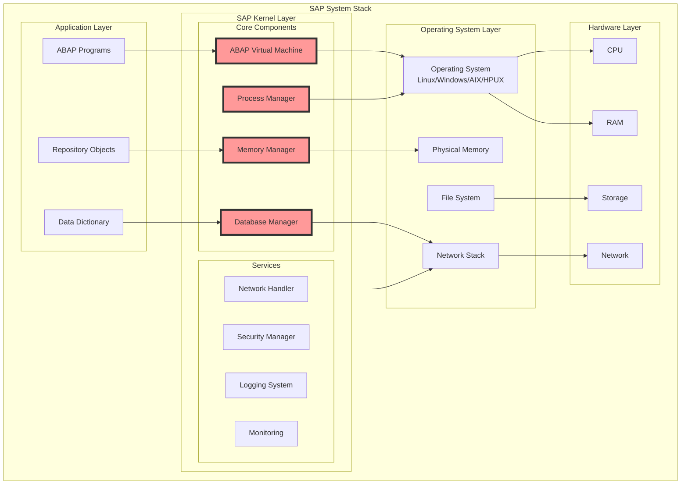

Ядро SAP выполняет следующие критические функции:

1. **Абстракция платформы**: Обеспечивает единый API для ABAP-приложений независимо от ОС
2. **Управление процессами**: Запуск, остановка и координация work processes
3. **Управление памятью**: Выделение и управление shared memory сегментами
4. **Сетевое взаимодействие**: Обработка различных протоколов (DIAG, RFC, HTTP)
5. **Безопасность**: Аутентификация, авторизация, шифрование
6. **Интеграция с БД**: Унифицированный интерфейс к различным СУБД

### Структура каталога ядра

Типичная структура каталога ядра в файловой системе:

```bash
/usr/sap/<SID>/SYS/exe/uc/<platform>/
├── disp+work           # Основной исполняемый файл (dispatcher + work process)
├── gwrd                # Gateway daemon
├── icman               # Internet Communication Manager
├── ms.sap              # Message Server
├── enserver            # Enqueue Server
├── sapstartsrv         # Start Service
├── sapcontrol          # Control Interface
├── saphostexec         # Host Agent Executable
├── libsapu16.so        # Unicode library
├── libicuuc.so.*       # ICU Unicode libraries
├── libsapdb.so         # Database interface library
├── dboraslib.so        # Oracle-specific DB library
├── dbhdbslib.so        # HANA-specific DB library
└── ...                 # Множество других библиотек и утилит
```

### Версионирование ядра

Версия ядра SAP следует строгой схеме нумерации:

```
<release>.<patch_level>.<platform>.<bit>
Пример: 753.02.100.x86_64
```

Где:

- **release**: Основная версия (753 = NetWeaver 7.53)
- **patch_level**: Уровень патча
- **platform**: Целевая платформа (linuxx86_64, ntamd64, etc.)
- **bit**: Разрядность (устарело, теперь только 64-bit)

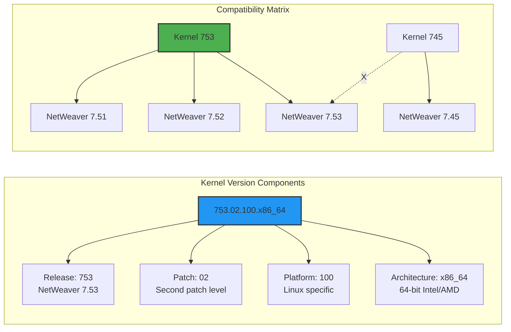

### Обратная совместимость

Ключевой особенностью архитектуры ядра SAP является обратная совместимость:

```abap
* Этот ABAP код, написанный для NetWeaver 7.40
* будет работать на ядре 7.53 без изменений
DATA: lv_string TYPE string.
lv_string = |Hello from { sy-sysid }|.
WRITE: / lv_string.
```

Обратная совместимость достигается за счет:

- Стабильного ABI (Application Binary Interface)
- Версионирования внутренних структур
- Эмуляции устаревших функций
- Тщательного тестирования регрессий

## 2.2. Анализ ключевых исполняемых файлов ядра

### disp+work: Швейцарский нож SAP

Файл `disp+work` — это центральный исполняемый файл ядра SAP. Уникальность его архитектуры заключается в том, что один и тот же бинарный файл может выполнять различные роли в зависимости от параметров запуска.

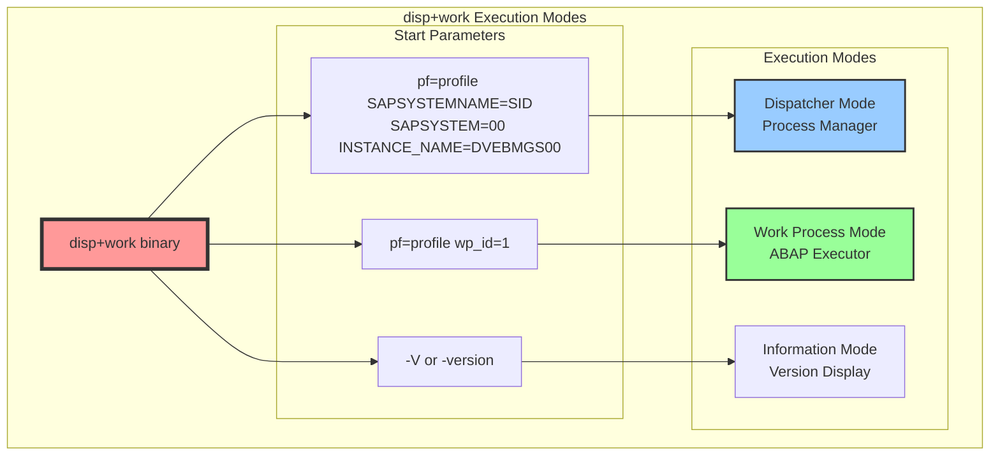

#### Режим диспетчера

Когда `disp+work` запускается без параметра `wp_id`, он работает как диспетчер:

```c
// Псевдокод внутренней логики disp+work
int main(int argc, char* argv[]) {
    if (get_parameter("wp_id") == NULL) {
        return dispatcher_main();  // Режим диспетчера
    } else {
        return work_process_main(); // Режим work process
    }
}
```

Функции диспетчера:

- Управление очередью запросов
- Распределение задач между work processes
- Мониторинг состояния процессов
- Управление shared memory

#### Режим work process

С параметром `wp_id`, тот же исполняемый файл становится work process:

```bash
# Пример запуска work process
disp+work pf=/sapmnt/SID/profile/SID_DVEBMGS00_hostname wp_id=1 wp_type=DIA
```

### ICM (Internet Communication Manager)

ICM — это веб-сервер и клиент в составе ядра SAP, обрабатывающий HTTP(S), SMTP и другие интернет-протоколы.

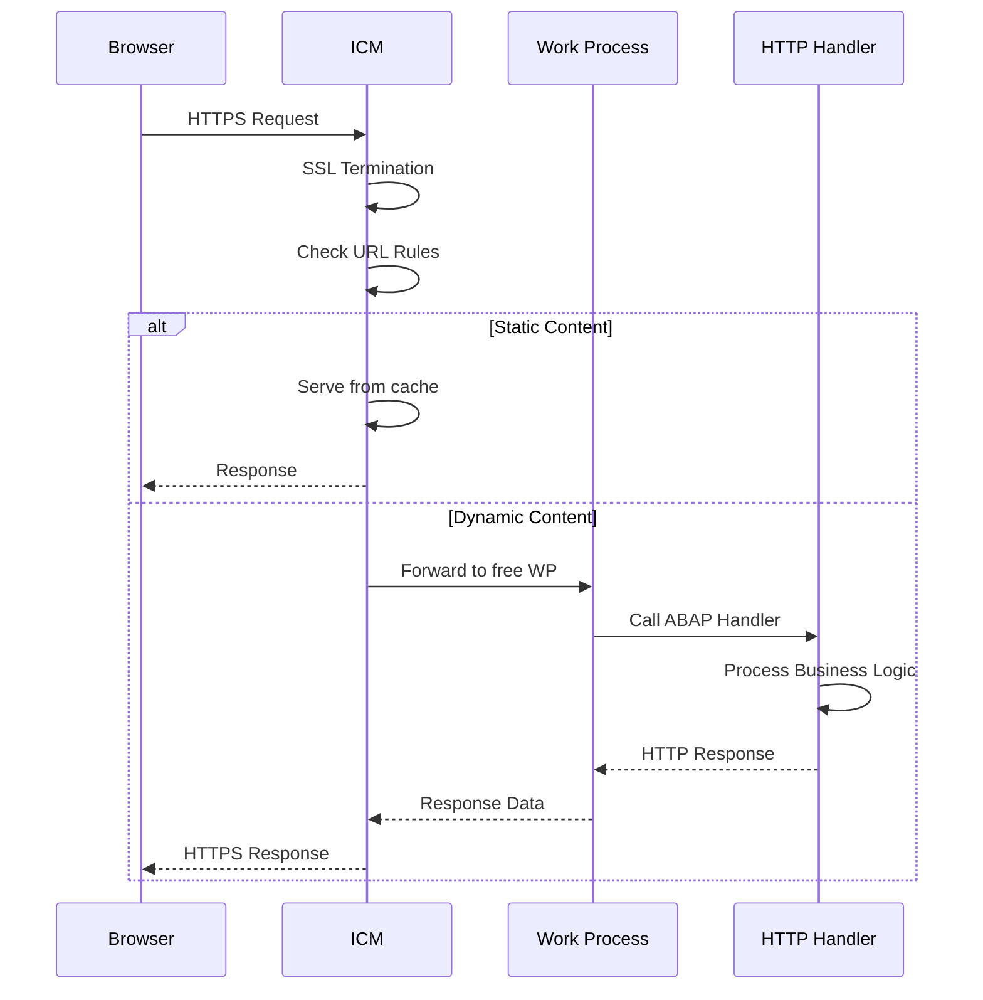

Конфигурация ICM через профильные параметры:

```ini
# Пример конфигурации ICM в профиле
icm/server_port_0 = PROT=HTTPS,PORT=443,PROCTIMEOUT=600,TIMEOUT=600
icm/server_port_1 = PROT=HTTP,PORT=8000,PROCTIMEOUT=600,TIMEOUT=600
icm/max_threads = 250
icm/max_conn = 5000
icm/keep_alive_timeout = 60
icm/host_name_full = $(SAPLOCALHOST).company.com
```

### Gateway (gwrd)

Gateway — это коммуникационный процесс, обеспечивающий RFC (Remote Function Call) взаимодействие.

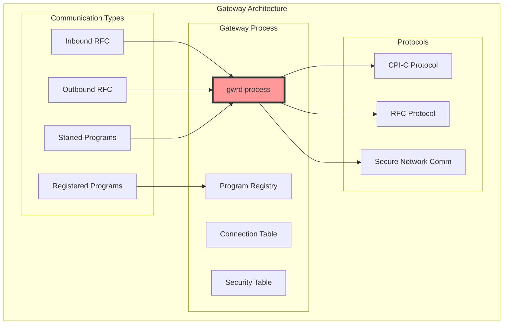

Ключевые функции Gateway:

- Регистрация внешних программ
- Управление RFC соединениями
- Безопасность и контроль доступа
- Конвертация протоколов

### Message Server (ms.sap)

Message Server выполняет критические функции координации в SAP системе:

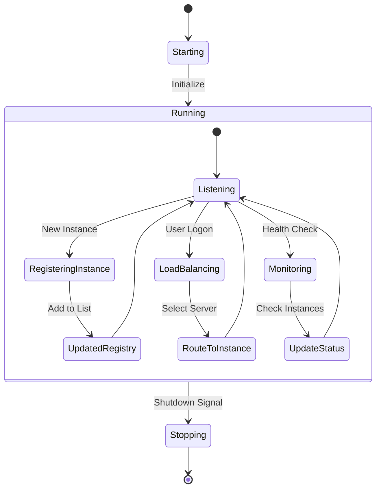

## 2.3. Обновления ядра и необходимость SGEN

### Процесс обновления ядра

Обновление ядра SAP — это критическая операция, требующая тщательного планирования:

```mermaid
graph TB
    subgraph "Kernel Update Process"
        PREP[Preparation]
        DOWNLOAD[Download New Kernel]
        BACKUP[Backup Current Kernel]
        STOP[Stop SAP System]
        EXTRACT[Extract New Files]
        PERMISSION[Set Permissions]
        START[Start SAP System]
        SGEN[Run SGEN]
        TEST[Test System]
    end
    
    PREP --> DOWNLOAD
    DOWNLOAD --> BACKUP
    BACKUP --> STOP
    STOP --> EXTRACT
    EXTRACT --> PERMISSION
    PERMISSION --> START
    START --> SGEN
    SGEN --> TEST
    
    subgraph "File Operations"
        OLD[/exe/uc/linuxx86_64/<br/>Old kernel files]
        NEW[/exe/uc/linuxx86_64/<br/>New kernel files]
        
        BACKUP -.backup.-> OLD
        EXTRACT -.replace.-> NEW
    end
    
    style STOP fill:#ff9999,stroke:#333,stroke-width:2px
    style SGEN fill:#ffff99,stroke:#333,stroke-width:2px
```

Типичная последовательность команд для обновления:

```bash
# 1. Создание резервной копии
cd /usr/sap/<SID>/SYS/exe/uc/linuxx86_64
mkdir kernel_backup_$(date +%Y%m%d)
cp -a * kernel_backup_$(date +%Y%m%d)/

# 2. Остановка системы
stopsap all

# 3. Распаковка нового ядра
cd /usr/sap/<SID>/SYS/exe/uc/linuxx86_64
SAPCAR -xf /tmp/SAPEXE_100-80005374.SAR
SAPCAR -xf /tmp/SAPEXEDB_100-80005373.SAR

# 4. Установка прав
./saproot.sh <sid>

# 5. Запуск системы
startsap all
```

### ABAP Load и инвалидация

Ключевой аспект обновления ядра — инвалидация ABAP Load. Чтобы понять этот процесс, необходимо рассмотреть структуру ABAP Load:

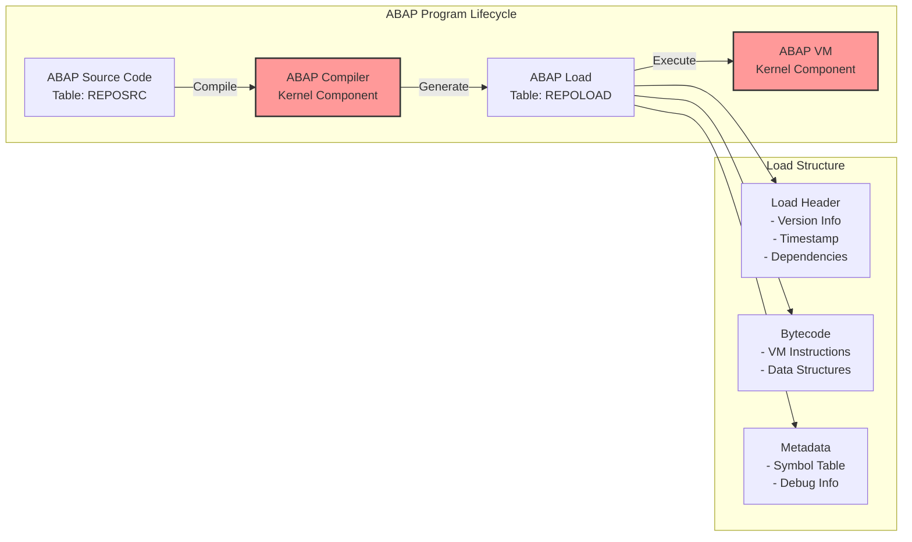

#### Структура ABAP Load

ABAP Load содержит версионную информацию, привязанную к версии компилятора:

```c
// Псевдо-структура ABAP Load Header
typedef struct {
    uint32_t magic;           // Magic number: 0xABAP
    uint16_t load_version;    // Version of load format
    uint16_t compiler_version;// Compiler version
    uint32_t timestamp;       // Generation timestamp
    uint32_t checksum;        // Load checksum
    // ... другие поля
} abap_load_header_t;
```

### SGEN (SAP Load Generator)

SGEN — это массовый генератор ABAP Load, критически важный после обновления ядра:

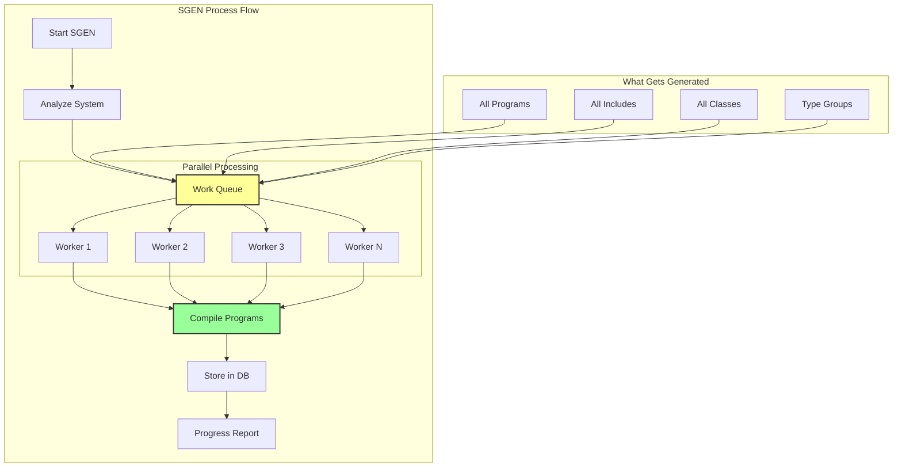

Параметры SGEN для оптимизации:

```abap
* Пример настройки параллельности SGEN
DATA: lv_parallel_processes TYPE i VALUE 10.

CALL FUNCTION 'SGEN_SET_PARALLEL_PROCESSES'
  EXPORTING
    parallel_processes = lv_parallel_processes.
```

### Почему SGEN необходим

Инвалидация происходит по нескольким причинам:

1. **Изменения в VM инструкциях**: Новая версия ядра может содержать оптимизированные или новые VM инструкции
    
2. **Изменения внутренних структур**: Структуры данных, используемые runtime, могут измениться
    
3. **Исправления безопасности**: Патчи могут изменять способ выполнения определенных операций
    

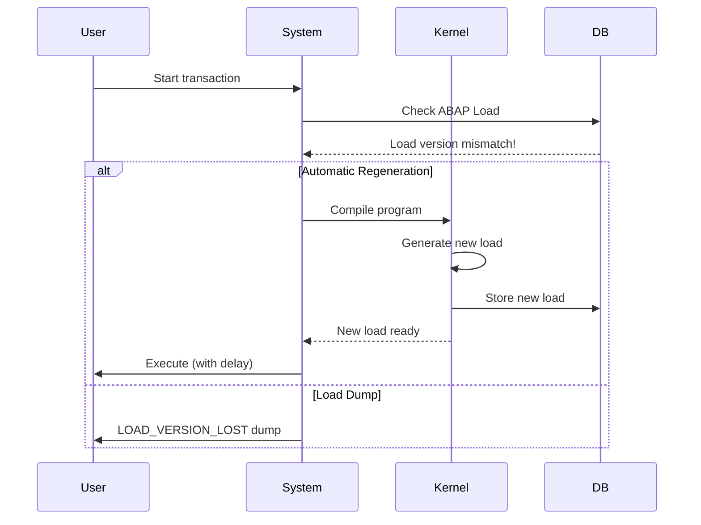

## 2.4. Kernel как спецификация виртуальной машины

### Архитектура виртуальной машины ABAP

Ядро SAP по сути определяет спецификацию виртуальной машины ABAP — абстрактной вычислительной машины, которая выполняет ABAP байт-код:

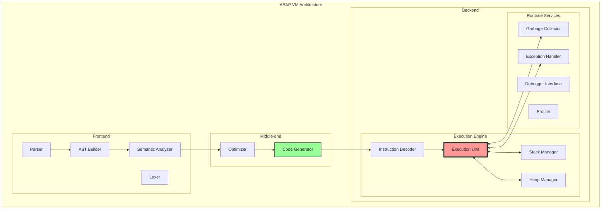

### Набор инструкций VM

ABAP VM использует stack-based архитектуру с набором инструкций, оптимизированных для бизнес-логики:

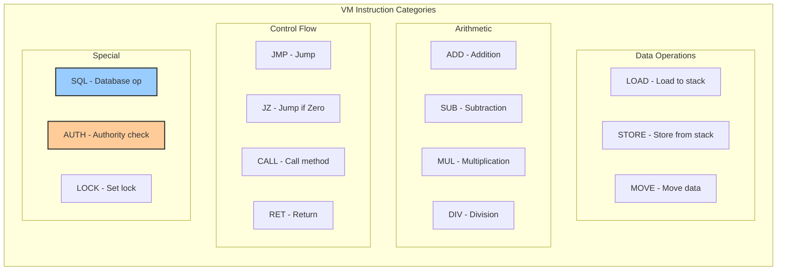

Пример декомпиляции простой ABAP программы:

```abap
* Исходный ABAP код
DATA: lv_result TYPE i.
lv_result = 10 + 20.
WRITE: / lv_result.
```

Превращается в последовательность VM инструкций (упрощенно):

```assembly
; Псевдо-ассемблер ABAP VM
ALLOC   4           ; Allocate 4 bytes for lv_result
PUSH    10          ; Push 10 to stack
PUSH    20          ; Push 20 to stack
ADD                 ; Add top two stack values
STORE   lv_result   ; Store result
LOAD    lv_result   ; Load for output
WRITE   /           ; Write with new line
```

### Оптимизации в современном ядре

Современные версии ядра включают множество оптимизаций:

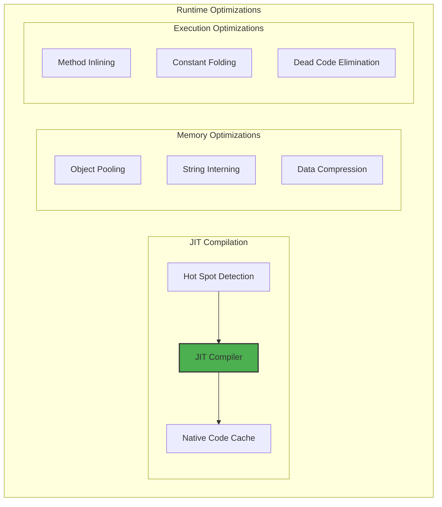

### Интеграция с современными процессорами

Ядро SAP оптимизировано для использования современных возможностей процессоров:

```c
// Пример использования SIMD инструкций в ядре
void abap_vm_array_add_optimized(double* a, double* b, double* result, size_t n) {
    #ifdef __AVX2__
    size_t simd_end = n - (n % 4);
    for (size_t i = 0; i < simd_end; i += 4) {
        __m256d va = _mm256_load_pd(&a[i]);
        __m256d vb = _mm256_load_pd(&b[i]);
        __m256d vr = _mm256_add_pd(va, vb);
        _mm256_store_pd(&result[i], vr);
    }
    // Handle remaining elements
    for (size_t i = simd_end; i < n; i++) {
        result[i] = a[i] + b[i];
    }
    #else
    // Fallback to scalar implementation
    for (size_t i = 0; i < n; i++) {
        result[i] = a[i] + b[i];
    }
    #endif
}
```

### Эволюция спецификации VM

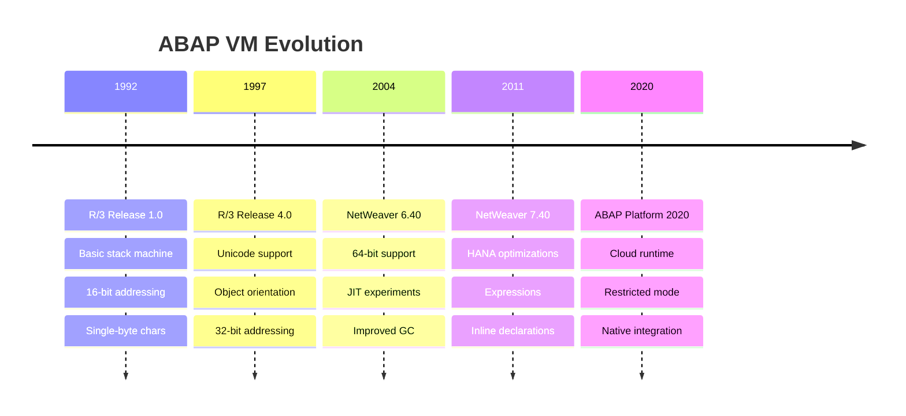

### Debugging и профилирование на уровне VM

Ядро предоставляет богатые возможности для отладки и профилирования:

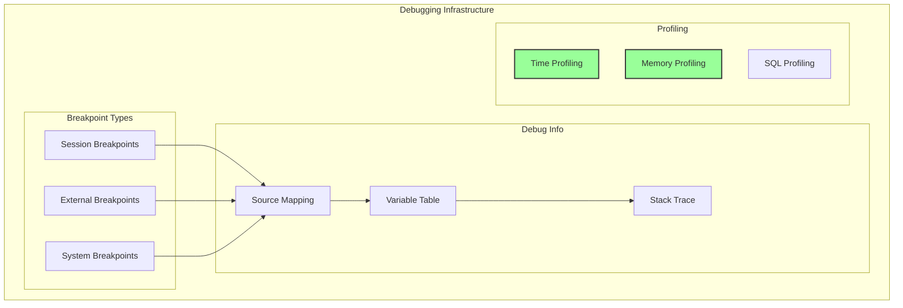

Пример активации профилирования на уровне VM:

```abap
* Активация профилирования VM
DATA: lo_profiler TYPE REF TO cl_abap_runtime_profiler.

CREATE OBJECT lo_profiler.
lo_profiler->start_measurement( ).

" Код для профилирования
DO 1000000 TIMES.
  " Some operation
ENDDO.

lo_profiler->stop_measurement( ).
lo_profiler->show_results( ).
```

## Заключение

Ядро SAP представляет собой сложную, многослойную систему, которая эволюционировала более 30 лет, сохраняя при этом обратную совместимость. Понимание архитектуры ядра критически важно для:

1. **Администраторов**: Правильное планирование обновлений, понимание необходимости SGEN, диагностика проблем производительности
    
2. **Разработчиков**: Написание оптимизированного кода, понимание ограничений VM, использование новых возможностей
    
3. **Архитекторов**: Проектирование масштабируемых решений, понимание влияния архитектурных решений на производительность
    

Ключевые выводы:

- Ядро SAP — это полноценная виртуальная машина со своей спецификацией
- Файл disp+work — универсальный исполняемый файл с multiple personalities
- Обновление ядра требует регенерации всего ABAP кода через SGEN
- Современное ядро включает продвинутые оптимизации для современного hardware

В следующей главе мы углубимся в детали работы work processes — основных исполнительных единиц, где происходит вся магия выполнения ABAP кода.