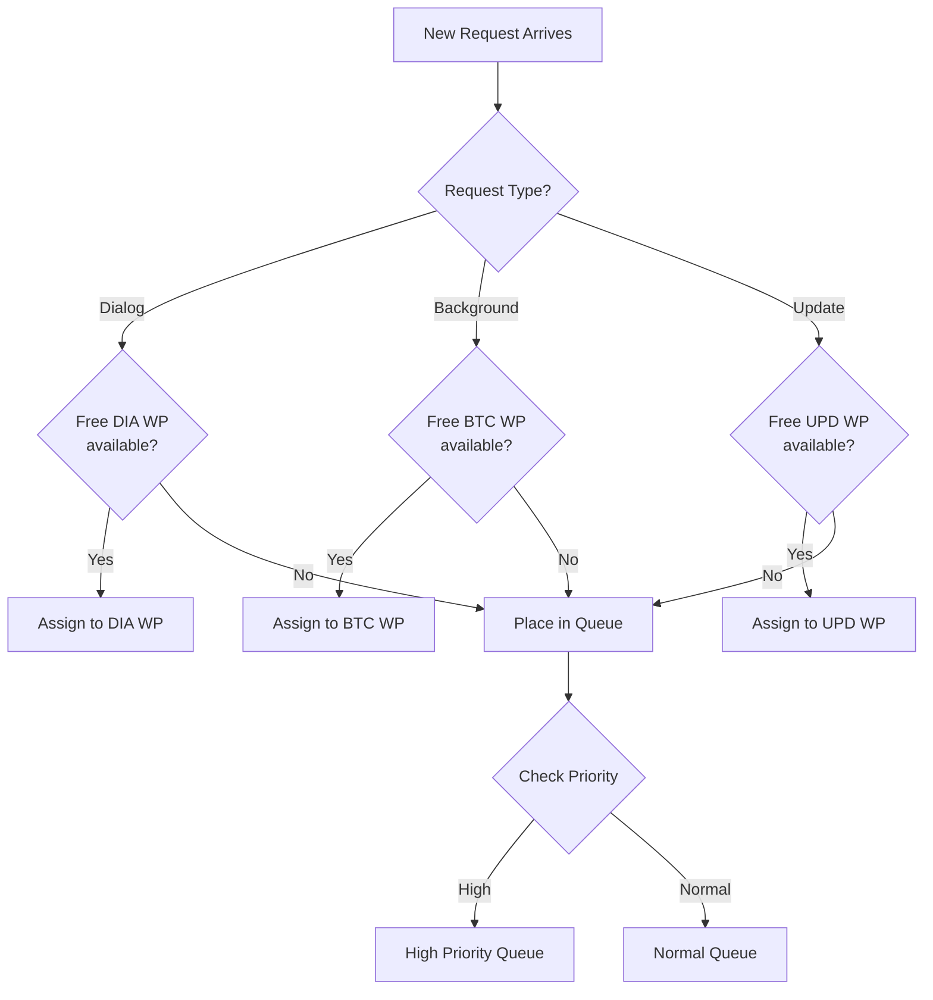
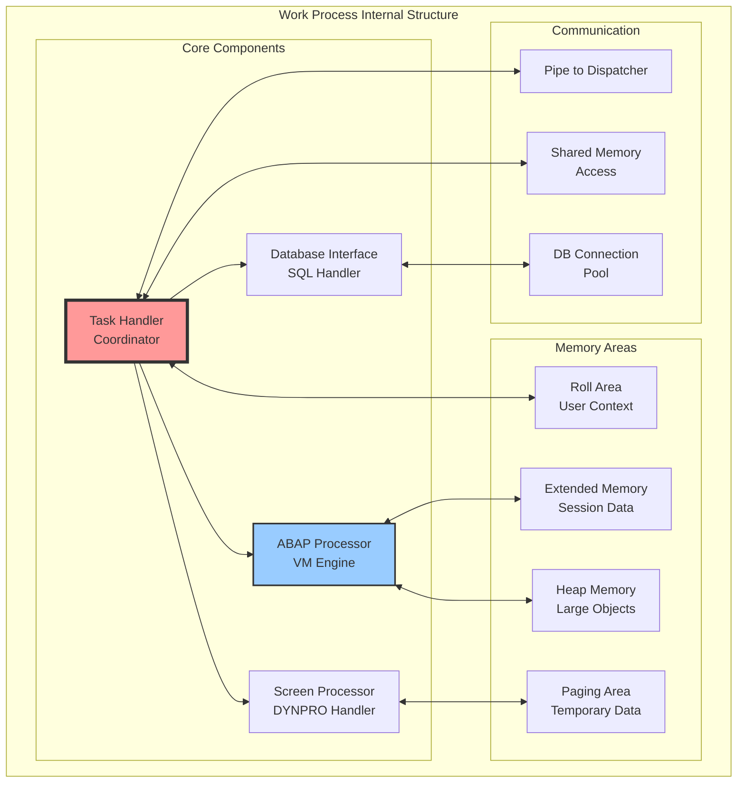
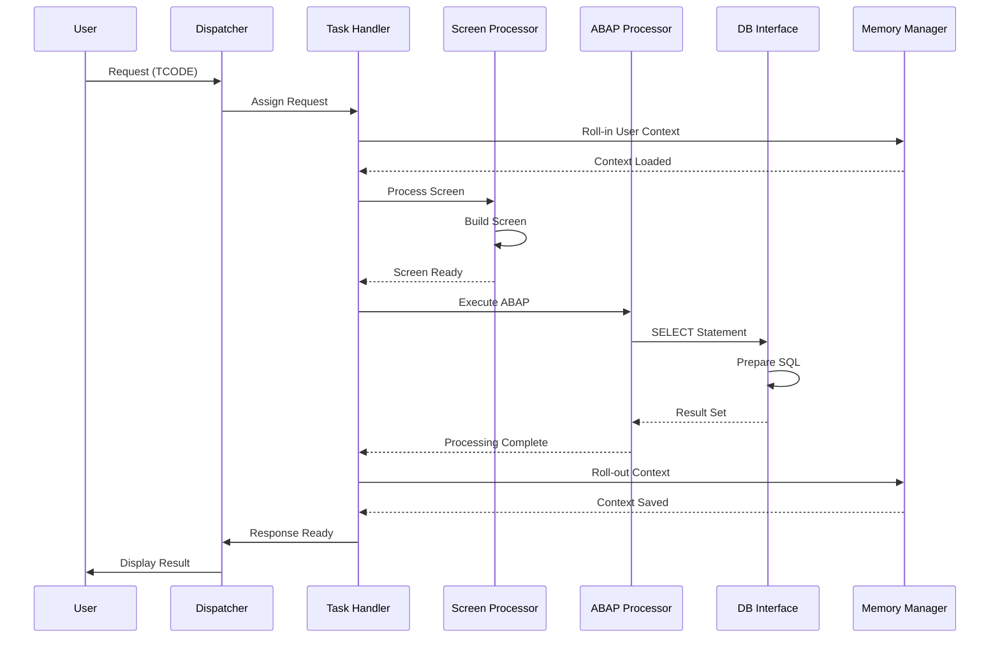
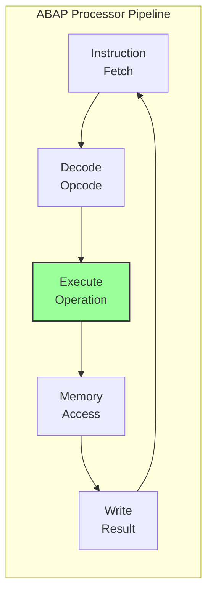
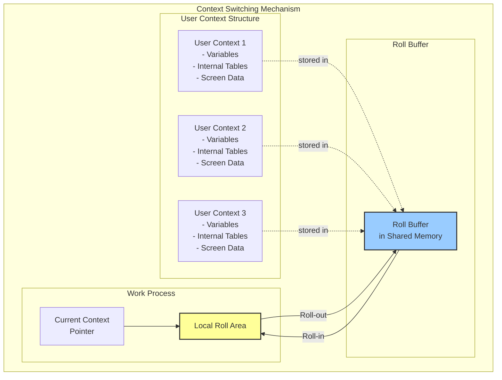
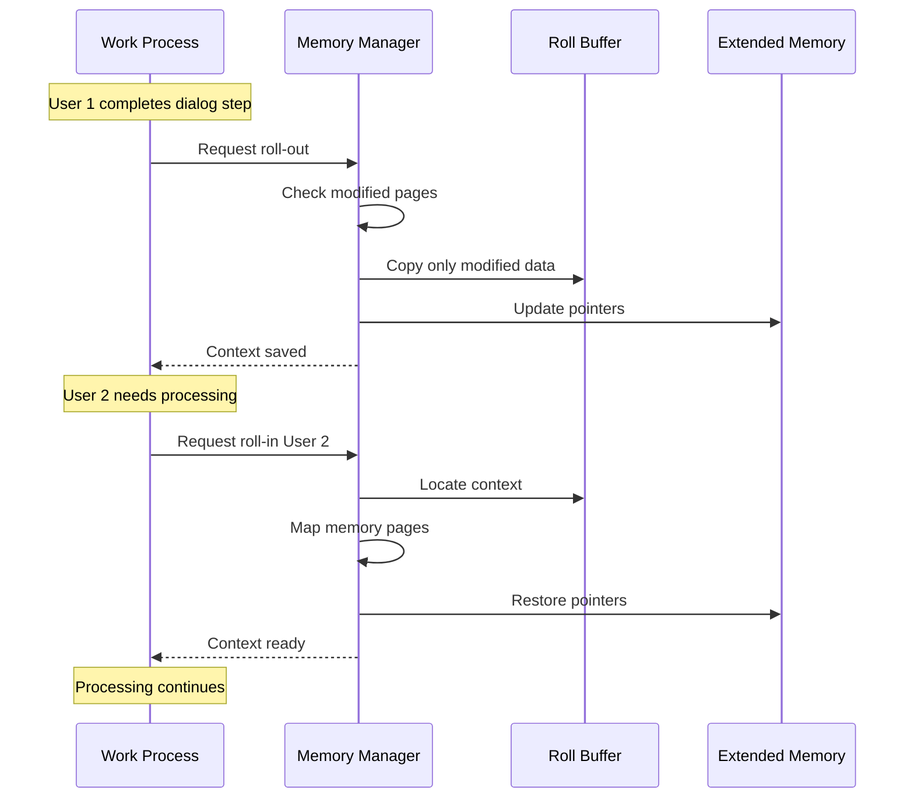
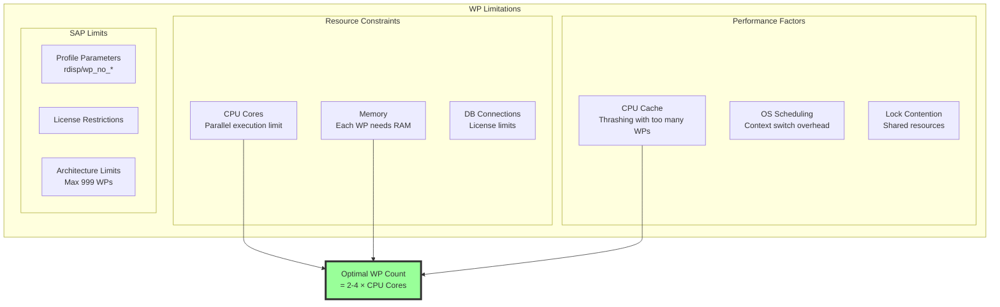
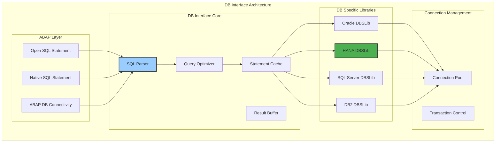
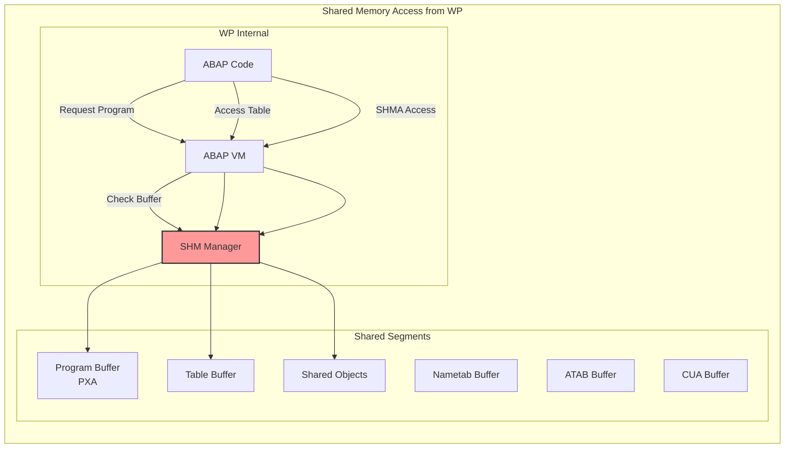
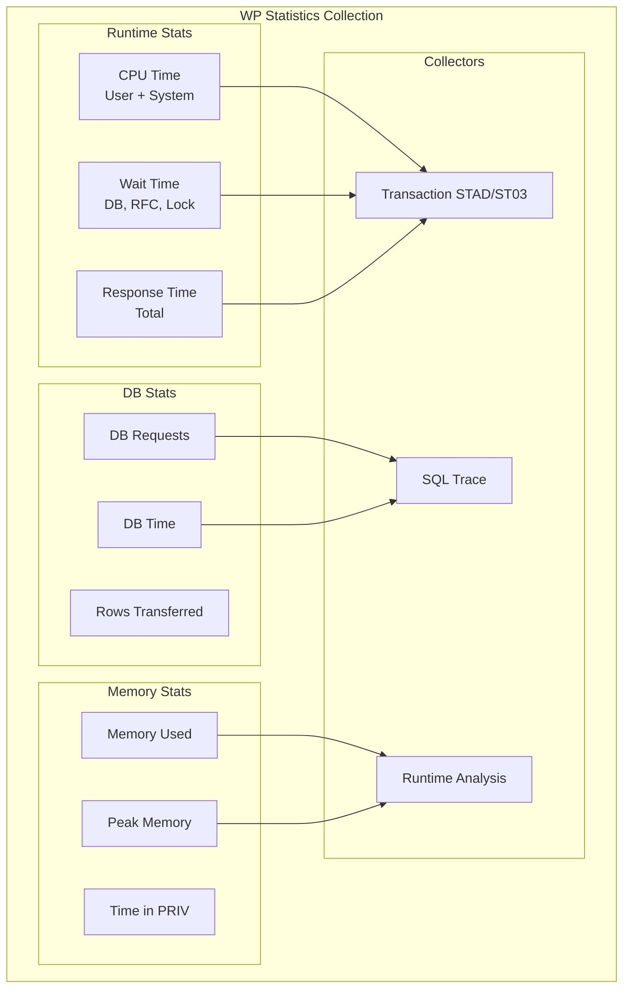

## Краткое содержание глав 1 и 2

### Глава 1: Анатомия SAP системы

Первая глава раскрывает фундаментальную архитектуру SAP систем через призму эволюции от R/3 до S/4HANA. Основное внимание уделяется неизменному принципу трёхуровневой архитектуры (Presentation, Application, Database), который остаётся константой несмотря на радикальные изменения в технологиях.

Детально исследуется современная модель инстанций с разделением на ASCS (stateful компоненты: Message Server, Enqueue Server) и множество диалоговых инстанций (stateless Work Processes). Объясняется механизм высокой доступности через Enqueue Replication Server и эволюция от ENSA1 к ENSA2.

Кульминацией главы является анализ парадигмального сдвига от "data-to-code" (R/3) к "code-to-data" (S/4HANA), где база данных из пассивного хранилища превращается в активный вычислительный слой.

### Глава 2: Ядро SAP - операционная система бизнес-приложений

Вторая глава погружается в архитектуру ядра SAP как специализированной операционной системы для ABAP-приложений. Раскрывается уникальная природа файла `disp+work`, который может работать как в режиме диспетчера, так и в режиме work process в зависимости от параметров запуска.

Подробно анализируются ключевые компоненты: ICM (веб-сервер), Gateway (RFC коммуникации), Message Server (координация системы). Особое внимание уделяется процессу обновления ядра и критической необходимости SGEN для перегенерации всего ABAP байт-кода из-за привязки к версии компилятора.

Глава завершается рассмотрением ядра как спецификации виртуальной машины ABAP с анализом набора инструкций, оптимизаций и интеграции с современными процессорами.


---

# Глава 3: Work Process - микрокосм выполнения

## 3.1. Прием и диспетчеризация запросов

Work Process (WP) — это фундаментальная единица выполнения в архитектуре SAP Application Server. Каждый WP представляет собой отдельный процесс операционной системы, способный выполнять ABAP код независимо от других процессов. Чтобы понять, как запрос пользователя превращается в исполняемый код, необходимо проследить весь путь от момента нажатия клавиши Enter в SAP GUI до получения результата на экране.

### Архитектура диспетчеризации

## Платформенные различия

| Компонент | Unix/Linux | Windows |
|-----------|------------|---------|
| Процесс Work Process | Отдельный процесс ОС | Поток в disp+work.exe |
| Исполняемый файл | disp+work | disp+work.exe |
| Мониторинг | ps -ef, top | Task Manager, Process Explorer |
| Trace файлы | /usr/sap/<SID>/DVEBMGS00/work/dev_w* | <drive>:\\usr\\sap\\<SID>\\DVEBMGS00\\work\\dev_w* |

## Типы Work Process

| Тип | Название | Назначение | Параметр |
|-----|----------|------------|----------|
| DIA | Dialog | Интерактивные запросы пользователей | rdisp/wp_no_dia |
| BTC | Background | Фоновые задания (jobs) | rdisp/wp_no_btc |
| UPD | Update | Синхронные обновления V1 | rdisp/wp_no_upd |
| UPD2 | Update 2 | Асинхронные обновления V2 | rdisp/wp_no_upd2 |
| ENQ | Enqueue | Управление блокировками SAP | rdisp/wp_no_enq |
| SPO | Spool | Обработка печати и вывода | rdisp/wp_no_spo |

## PRIV (Private) режим Work Process

Work Process переходит в режим PRIV когда:
1. Выделяется Heap Memory (после исчерпания Extended Memory)
2. Параметр: abap/heap_area_dia = 2000000000 (2 GB для 32-bit)

Последствия PRIV режима:
- WP закрепляется за пользователем до конца транзакции
- Другие пользователи не могут использовать этот WP
- После завершения транзакции WP перезапускается
- Может привести к нехватке свободных WP

Мониторинг:
- SM50: статус "PRIV" в колонке Status
- ST02: счетчик "Priv. Memory" в разделе SAP Memory

```mermaid
graph TB
    subgraph "Request Flow Architecture"
        subgraph "Frontend"
            GUI[SAP GUI]
            DIAG[DIAG Protocol]
        end
        
        subgraph "Application Server"
            subgraph "Dispatcher Process"
                LISTENER[Network Listener<br/>Port 32NN (где NN - номер инстанции 00-99, например 3200 для instance 00)]
                QUEUE[Request Queue<br/>Shared Memory]
                SCHEDULER[WP Scheduler]
                MONITOR[WP Monitor]
            end
            
            subgraph "Work Processes"
                WP1[WP 1<br/>Status: FREE]
                WP2[WP 2<br/>Status: BUSY]
                WP3[WP 3<br/>Status: PRIV]
                WP4[WP 4<br/>Status: HOLD]
            end
        end
        
        GUI --> DIAG
        DIAG --> LISTENER
        LISTENER --> QUEUE
        QUEUE --> SCHEDULER
        SCHEDULER --> WP1
        MONITOR -.monitor.-> WP1
        MONITOR -.monitor.-> WP2
        MONITOR -.monitor.-> WP3
        MONITOR -.monitor.-> WP4
    end
    
    style QUEUE fill:#ffff99,stroke:#333,stroke-width:2px
    style WP1 fill:#99ff99,stroke:#333,stroke-width:2px
    style WP2 fill:#ff9999,stroke:#333,stroke-width:2px
    style WP3 fill:#ffcccc,stroke:#333,stroke-width:2px
```

### Статусы Work Process

Work Process может находиться в следующих состояниях:
- **FREE**: Свободен, ожидает запросов
- **RUNNING**: Выполняет запрос пользователя
- **WAITING**: Ожидает ресурс (RFC, DB, блокировку)
- **HOLD**: Удерживается для пользователя (при вызове экрана)
- **PRIV**: Приватный режим (выделена heap память)
- **STOPPED**: Остановлен администратором
- **SLEEP**: В режиме сна (энергосбережение)
- **ENDED**: Завершен с ошибкой, ожидает перезапуска

Диспетчер выполняет роль координатора между входящими запросами и доступными work processes. Его основные функции:

1. **Прием соединений**: Слушает на выделенном порту (обычно 32NN (где NN - номер инстанции 00-99, например 3200 для instance 00))
2. **Управление очередью**: Помещает входящие запросы в shared memory очередь
3. **Планирование выполнения**: Выбирает свободный WP для обработки запроса
4. **Мониторинг состояния**: Отслеживает статус каждого WP

### Структура очереди запросов

Очередь запросов в shared memory имеет сложную структуру, оптимизированную для быстрого доступа:

```c
// Упрощенная концептуальная структура (не реальная реализация)
typedef struct dp_queue_entry {
    CHAR    user[16];       // Имя пользователя (16 символов)
    CHAR    client[3];      // Клиент SAP (тип MANDT - 3 символа)
    CHAR    tcode[4];       // Код транзакции (4 символа)
    CHAR    terminal[16];   // Идентификатор терминала
    INT4    req_type;       // Тип запроса
    INT4    priority;       // Приоритет
    TIME    enqueue_time;   // Время постановки в очередь
    // ... другие поля
} DP_QUEUE_ENTRY;
```

### Алгоритм выбора Work Process

Диспетчер использует сложный алгоритм для выбора подходящего WP:



## Ограничения времени выполнения

**Критическое ограничение**: Максимальное время выполнения диалогового шага
- Параметр: `rdisp/max_wprun_time`
- По умолчанию: 600 секунд (10 минут)
- При превышении: Work Process принудительно завершается
- Дамп: TIME_OUT

Это ограничение критично для:
- Предотвращения блокировки ресурсов
- Защиты от бесконечных циклов
- Обеспечения отзывчивости системы
    BTC_CHECK -->|No| WAIT
    
    UPD_CHECK -->|Yes| ASSIGN_UPD
    UPD_CHECK -->|No| WAIT
    
    WAIT --> PRIORITY
    PRIORITY -->|High| HIGH
    PRIORITY -->|Normal| NORMAL
```

### Протокол DIAG

DIAG (Dynamic Information and Action Gateway) - проприетарный бинарный протокол SAP:

- **Формат**: Бинарный с собственным алгоритмом сжатия
- **Версии**: 
  - Classic (до 6.20)
  - New (6.20+) с улучшенным сжатием
  - Enhanced (7.00+) с поддержкой новых UI элементов
- **Порт**: 32NN (по умолчанию)
- **Сжатие**: Собственный алгоритм SAP (не LZH)
- **Безопасность**: Поддержка SNC (Secure Network Communication)

Пример структуры DIAG пакета (концептуально):
```
[Header: 10 bytes][Compressed Data][CRC]
```

Примечание: Детальная спецификация протокола является конфиденциальной

## 3.2. Рабочий процесс: углубленный анализ

### Анатомия Work Process

Каждый work process — это сложная программная конструкция, состоящая из нескольких взаимодействующих компонентов:



### Области памяти Work Process

- **Roll Area**: Начальная область контекста
  - Размер: 1-8 MB (параметр ztta/roll_area)
  - По умолчанию: 1 MB
  
- **Extended Memory**: Основная пользовательская память
  - Лимит на пользователя: 250-500 MB (em/address_space_MB)
  - По умолчанию: 250 MB (до NetWeaver 7.40)
  
- **Heap Memory**: Приватная память процесса
  - Лимит для DIA WP: 2 GB (32-bit), без ограничений (64-bit)
  - Параметр: abap/heap_area_dia
  - После выделения heap WP переходит в режим PRIV

### Task Handler - дирижер оркестра

Task Handler — это центральный координатор внутри work process. Его роль можно сравнить с дирижером оркестра:

```c
// Псевдокод основного цикла Task Handler
void task_handler_main_loop() {
    while (running) {
        request = wait_for_request();  // Блокирующее ожидание от диспетчера
        
        if (request.type == DIALOG) {
            // Roll-in пользовательского контекста
            user_context = roll_in_user_context(request.user_id);
            
            // Определение типа обработки
            if (request.has_screen) {
                result = screen_processor_handle(request, user_context);
            }
            
            if (request.has_abap) {
                result = abap_processor_execute(request, user_context);
            }
            
            if (request.has_db) {
                result = database_interface_process(request, user_context);
            }
            
            // Roll-out контекста обратно
            roll_out_user_context(user_context);
            
            // Отправка результата диспетчеру
            send_response_to_dispatcher(result);
        }
        
        // Освобождение WP для следующего запроса
        set_status(WP_FREE);
    }
}
```

### Жизненный цикл обработки запроса



### Screen Processor (DYNPRO)

Screen Processor отвечает за обработку динамических программ (DYNPRO) — экранов SAP:

```abap
* Пример DYNPRO flow logic
PROCESS BEFORE OUTPUT.
  MODULE status_0100.
  MODULE prepare_screen.
  
PROCESS AFTER INPUT.
  MODULE user_command_0100.
  FIELD input_field MODULE validate_input ON REQUEST.
```

Внутренняя обработка:

1. **PBO (Process Before Output)**: Подготовка данных для отображения
2. **Screen Rendering**: Построение экранной формы
3. **PAI (Process After Input)**: Обработка пользовательского ввода

Screen Processor также обрабатывает:
- **Batch Input**: Автоматизированный ввод данных
  - SM35: Управление batch input сессиями
  - Использует записанные экранные последовательности
  
- **Screen Variants**: Модификация стандартных экранов
  - SHD0: Создание экранных вариантов
  - Скрытие/изменение полей без модификации
  
- **GuiXT Integration**: Скриптовое расширение GUI
  - Позволяет изменять экраны на стороне клиента
  - Интегрирован в SAPGUI

### ABAP Processor

ABAP Processor — это встроенная виртуальная машина, выполняющая байт-код ABAP:



Процессор поддерживает:

- Стековые операции для арифметики
- Прямой доступ к внутренним таблицам
- Интеграцию с DB Interface для SQL
- Обработку исключений и событий

## 3.3. Переключение контекста и мультиплексирование

### Механизм Roll-in/Roll-out

Ключевая инновация архитектуры SAP — механизм быстрого переключения контекстов пользователей без использования тяжеловесных механизмов ОС:



### Структура пользовательского контекста

```c
// Упрощенная структура контекста пользователя
typedef struct {
    // Идентификация
    uint32_t session_id;
    char user_name[12];
    uint16_t client;
    
    // Состояние ABAP
    void* abap_stack;
    size_t stack_size;
    void* global_data;
    void* local_data;
    
    // Внутренние таблицы
    internal_table_t* tables[MAX_TABLES];
    uint32_t table_count;
    
    // Screen buffer
    dynpro_data_t* current_screen;
    
    // Режим отладки
    debug_info_t* debug_context;
    
    // Статистика
    uint64_t cpu_time_used;
    uint64_t db_time_used;
    uint32_t db_requests;
} user_context_t;
```

### Оптимизация переключения контекста

SAP использует несколько техник для минимизации overhead при переключении:

1. **Copy-on-Write**: Неизмененные данные не копируются
2. **Lazy Loading**: Данные загружаются только при обращении
3. **Memory Pooling**: Переиспользование выделенной памяти



### Мультиплексирование и ограничения

Количество work processes ограничено по нескольким причинам:



Типичные рекомендации:

- **Dialog WPs**: 2-4 на CPU core
- **Background WPs**: 1-2 на CPU core
- **Update WPs**: 1 на каждые 5-10 dialog WPs

## 3.4. Внутренние компоненты WP

### Database Interface

## Connection Multiplexing в Database Interface

Work Process НЕ имеет выделенного соединения с БД. Вместо этого:

1. **Connection Pool**: На уровне инстанции поддерживается пул соединений
2. **Параметр**: `rdisp/wp_no_db` определяет количество DB соединений
3. **По умолчанию**: Обычно меньше, чем количество Work Processes
4. **Multiplexing**: WP получает соединение только на время DB операции

Преимущества:
- Экономия ресурсов БД
- Лучшая масштабируемость
- Возможность обслуживать больше пользователей

Database Interface внутри WP обеспечивает абстракцию от конкретной СУБД:



### Обработка транзакций

Каждый WP управляет транзакциями через LUW (Logical Unit of Work):

```abap
* Пример обработки LUW в work process
START-OF-SELECTION.
  " Начало неявной DB LUW
  UPDATE ztable SET field = value.  " Записывается в log
  
  CALL FUNCTION 'Z_UPDATE_FM' IN UPDATE TASK. " V1 update
  
  COMMIT WORK.  " Конец SAP LUW
  " DB Interface выполняет:
  " 1. Database COMMIT
  " 2. Запуск update task
  " 3. Очистка буферов
```

### Интеграция с Shared Memory

Work processes активно используют shared memory для доступа к общим ресурсам:



### Обработка ошибок и дампов

При критических ошибках WP создает ABAP dump:

```c
// Псевдокод обработки критической ошибки
void handle_abap_exception(exception_t* exc) {
    dump_info_t dump;
    
    // Сбор информации о состоянии
    dump.timestamp = get_current_time();
    dump.user = current_context->user;
    dump.program = current_context->program;
    dump.error_id = exc->error_id;
    
    // Сохранение стека вызовов
    save_call_stack(&dump.call_stack);
    
    // Сохранение переменных
    save_variables(&dump.variables);
    
    // Запись в БД
    write_dump_to_db(&dump);  // ST22
    
    // Очистка и возврат WP в пул
    cleanup_work_process();
    set_status(WP_FREE);
}
```

### Статистика и мониторинг

Каждый WP собирает детальную статистику выполнения:



## Заключение

Work Process представляет собой сложный программный механизм, оптимизированный для эффективного выполнения бизнес-логики. Ключевые архитектурные решения:

1. **Разделение компонентов**: Task Handler координирует специализированные процессоры
2. **Эффективное переключение контекста**: Roll-in/roll-out минимизирует overhead
3. **Мультиплексирование**: Один WP обслуживает множество пользователей
4. **Интеграция с shared memory**: Быстрый доступ к общим ресурсам

Понимание внутренней архитектуры work process критически важно для:

- Оптимизации производительности приложений
- Правильной настройки параметров системы
- Диагностики проблем производительности
- Проектирования масштабируемых решений

В следующей главе мы детально рассмотрим иерархию памяти и механизмы управления памятью, которые обеспечивают эффективную работу work processes.