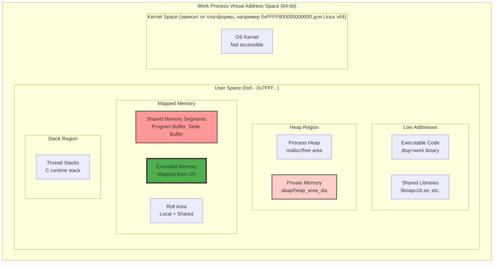
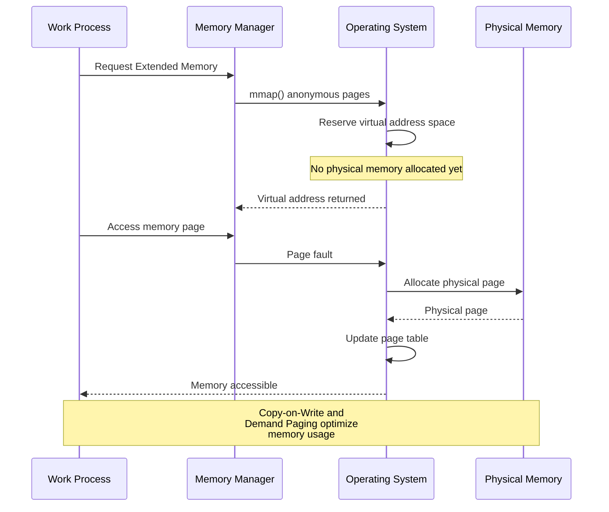
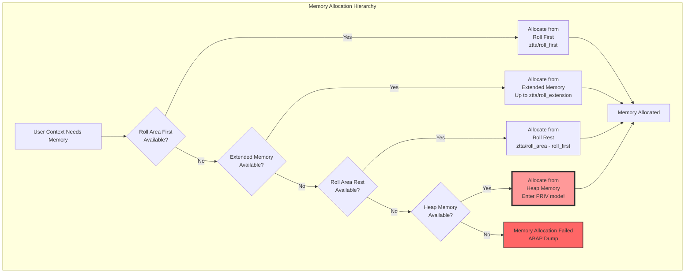
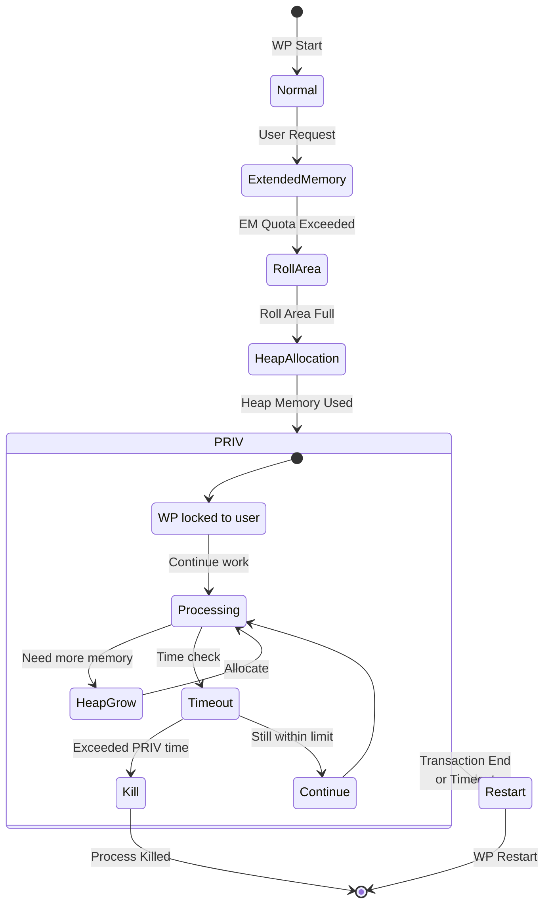
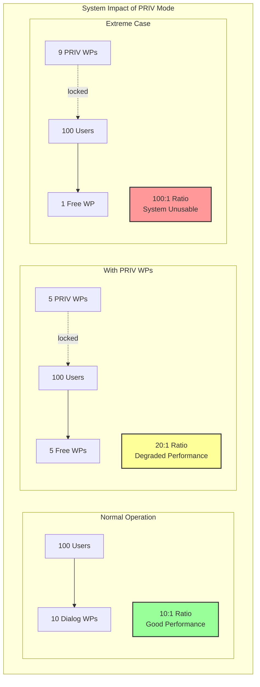
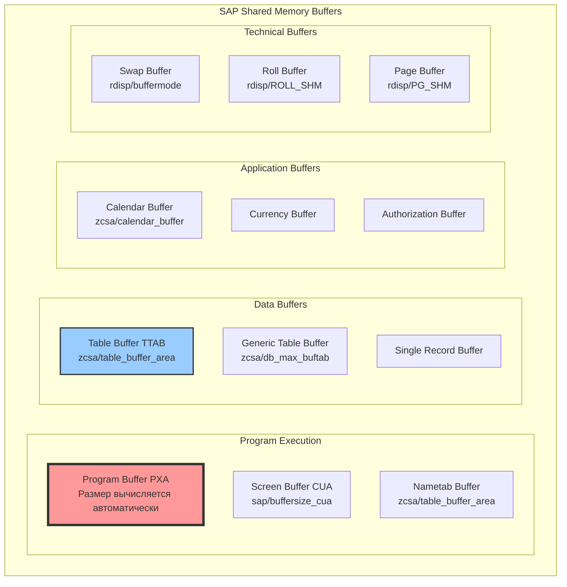

# Глава 4: Иерархия памяти - балансировка между масштабируемостью и выживанием

## 4.1. Виртуальное адресное пространство рабочего процесса

Каждый work process в SAP представляет собой отдельный процесс операционной системы с собственным виртуальным адресным пространством. Понимание структуры этого пространства критически важно для оптимизации производительности и предотвращения проблем с памятью.

### Архитектура адресного пространства



### Механизм памяти на уровне ОС
## Платформенные различия

### Unix/Linux
- Использует System V shared memory (shmat/shmdt)
- mmap для memory-mapped файлов
- /dev/shm для tmpfs

### Windows
- CreateFileMapping/MapViewOfFile для shared memory
- VirtualAlloc для heap memory
- Global heap functions
## Платформенные различия

### Unix/Linux
- Использует System V shared memory (shmat/shmdt)
- mmap для memory-mapped файлов
- /dev/shm для tmpfs

### Windows
- CreateFileMapping/MapViewOfFile для shared memory
- VirtualAlloc для heap memory
- Global heap functions

```c
// Псевдокод инициализации памяти work process
typedef struct {
    void* code_segment;        // Код программы
    void* data_segment;        // Глобальные данные
    void* heap_start;          // Начало кучи
    void* heap_current;        // Текущая позиция в куче
    void* stack_bottom;        // Дно стека
    void* stack_top;           // Вершина стека
    
    // SAP-специфичные области
    void* roll_area;           // Roll Area
    void* extended_memory;     // Extended Memory mapping
    void* shared_buffers[16];  // Массив указателей на shared memory
    
    size_t heap_size;
    size_t stack_size;
    size_t em_size;
} wp_memory_layout_t;

// Инициализация при старте WP
void initialize_work_process_memory() {
    wp_memory_layout_t* layout = malloc(sizeof(wp_memory_layout_t));
    
    // Резервирование адресного пространства для Extended Memory
    layout->extended_memory = mmap(
        NULL,                          // Пусть ОС выберет адрес
        em_initial_size_MB * 1024 * 1024,
        PROT_READ | PROT_WRITE,
        MAP_PRIVATE | MAP_ANONYMOUS,   // Приватная анонимная память
        -1, 0
    );
    
    // Подключение к shared memory сегментам
    layout->shared_buffers[0] = shmat(pxa_shmid, NULL, 0);      // PXA
    layout->shared_buffers[1] = shmat(nametab_shmid, NULL, 0);  // Nametab
    layout->shared_buffers[2] = shmat(table_shmid, NULL, 0);    // Table buffer
    
    // Инициализация Roll Area
    layout->roll_area = malloc(ztta_roll_first);
}
```

### Memory Mapping и виртуализация

SAP использует сложную систему memory mapping для эффективного управления памятью:



## 4.2. Иерархия выделения памяти: путь к режиму PRIV

SAP использует строгую иерархию при выделении памяти для пользовательских контекстов. Эта иерархия оптимизирована для максимальной производительности и масштабируемости.

### Последовательность выделения памяти



### Детальный анализ каждого уровня

#### Roll Area First

Минимальная локальная память, выделяемая каждому пользовательскому контексту:

```abap
* Параметры Roll Area First
* ztta/roll_first = 1024 (default: 1 KB)
* Это заставляет систему сразу переходить к Extended Memory

DATA: BEGIN OF ls_memory_usage,
        roll_first_used TYPE i,
        roll_first_max  TYPE i VALUE 1,  " ztta/roll_first
      END OF ls_memory_usage.

* Roll First используется для минимальных структур управления
* Реальные данные сразу идут в Extended Memory
```

#### Extended Memory (основная рабочая память)

Extended Memory — это основной пул памяти для пользовательских контекстов:

```c
// Структура управления Extended Memory
typedef struct {
    size_t total_size;         // em/initial_size_MB
    size_t block_size;         // em/blocksize_KB (обычно 1024 KB, может быть увеличен до 4096 KB)
    size_t allocated_blocks;   // Количество выделенных блоков
    size_t free_blocks;        // Количество свободных блоков
    
    // Битовая карта свободных блоков
    uint64_t* block_bitmap;
    
    // Список пользовательских квот
    struct {
        char user[12];
        size_t quota;          // ztta/roll_extension
        size_t used;
    } user_quotas[MAX_USERS];
    
} em_control_block_t;
```

```mermaid
graph TB
    subgraph "Extended Memory Structure"
        subgraph "EM Pool"
            TOTAL[Total EM Pool<br/>em/initial_size_MB = 4096]
            
            subgraph "Blocks"
                B1[Block 1<br/>4 MB]
### Важный параметр: em/address_space_MB

Ограничивает общее адресное пространство для Extended Memory:
- По умолчанию: 8192 MB (32-bit), не ограничено (64-bit)
- Рекомендация: оставить по умолчанию для 64-bit систем
- Для 32-bit: может потребоваться уменьшение при проблемах с адресным пространством
                B2[Block 2<br/>4 MB]
                B3[Block 3<br/>4 MB]
                BN[Block N<br/>4 MB]
            end
        end
        
        subgraph "User Allocations"
            U1[User 1<br/>Quota: 2 GB<br/>Used: 500 MB]
            U2[User 2<br/>Quota: 2 GB<br/>Used: 1.5 GB]
            U3[User 3<br/>Quota: 2 GB<br/>Used: 200 MB]
        end
### Важный параметр: em/address_space_MB

Ограничивает общее адресное пространство для Extended Memory:
- По умолчанию: 8192 MB (32-bit), не ограничено (64-bit)
- Рекомендация: оставить по умолчанию для 64-bit систем
- Для 32-bit: может потребоваться уменьшение при проблемах с адресным пространством
        
        B1 --> U1
        B2 --> U1
        B3 --> U2
        BN --> U3
    end
    
    style TOTAL fill:#4CAF50,stroke:#333,stroke-width:2px
```

#### Roll Area Rest

Используется после исчерпания квоты Extended Memory:

```abap
* Проверка использования Roll Area
FORM check_roll_area_usage.
  DATA: lv_roll_first    TYPE i VALUE 1,        " ztta/roll_first
        lv_roll_area     TYPE i VALUE 2097152,  " ztta/roll_area (2 MB)
        lv_roll_rest     TYPE i.
  
  lv_roll_rest = lv_roll_area - lv_roll_first.
  
  WRITE: / 'Roll Area Total:', lv_roll_area,
         / 'Roll First:', lv_roll_first,
         / 'Roll Rest:', lv_roll_rest.
  
  " Roll Rest используется для:
  " - Переполнения из Extended Memory
  " - Временных данных при roll-out
  " - Буферизации экранных данных
ENDFORM.
```

#### Heap Memory (Private Memory)

Последний уровень — выделение из приватной heap памяти процесса:

```c
// Выделение heap памяти и переход в PRIV режим
int allocate_heap_memory(wp_context_t* ctx, size_t size) {
    // Проверка лимитов
    if (ctx->heap_used + size > abap_heap_area_dia) {
        return MEMORY_LIMIT_EXCEEDED;
    }
    
    // Выделение памяти
    void* mem = malloc(size);
    if (!mem) {
        return MEMORY_ALLOCATION_FAILED;
    }
    
    // Обновление статистики
    ctx->heap_used += size;
    
    // ВАЖНО: Переход в PRIV режим
    if (!ctx->in_priv_mode) {
        ctx->in_priv_mode = TRUE;
        ctx->priv_start_time = time(NULL);
        
        // WP теперь закреплен за пользователем!
        set_wp_status(ctx->wp_id, WP_PRIV);
        
        log_event("Work process %d entered PRIV mode for user %s",
                  ctx->wp_id, ctx->user_name);
    }
    
    return SUCCESS;
}
```

## 4.3. Режим PRIV: жертвуя масштабируемостью ради выживания

Режим PRIV (Private) — это особое состояние work process, когда он становится эксклюзивно закрепленным за одним пользователем из-за использования heap памяти.

### Механизм и последствия PRIV режима



### Параметры управления PRIV режимом

```abap
* Ключевые параметры для управления PRIV
* abap/heap_area_dia     = 2000000000  " 2 GB heap для диалоговых WP
* abap/heap_area_nondia  = 0  " 0 = неограниченно для фоновых WP (по умолчанию)  
* abap/heaplimit         = 40000000    " 40 MB - порог рестарта WP
* rdisp/wppriv_max_no    = 5           " Макс. число WP в PRIV
* rdisp/max_priv_time    = 600         " 600 сек макс. время в PRIV

REPORT z_check_priv_parameters.

DATA: BEGIN OF ls_params,
        heap_area_dia    TYPE i,
        heap_area_nondia TYPE i,
        heaplimit        TYPE i,
        wppriv_max_no    TYPE i,
        max_priv_time    TYPE i,
      END OF ls_params.

* Современный способ получения параметров
DATA(lv_value) = cl_spfl_profile_parameter=>get_value( 
  name = 'abap/heap_area_dia' ).
ls_params-heap_area_dia = lv_value.
* Альтернатива: FM SAPPARAM_GET_VALUE

WRITE: / 'PRIV Mode Parameters:',
       / 'Dialog WP Heap Limit:', ls_params-heap_area_dia,
       / 'Max WPs in PRIV:', ls_params-wppriv_max_no,
       / 'Max time in PRIV:', ls_params-max_priv_time, 'seconds'.
```

### Мониторинг PRIV режима

```abap
* Программа мониторинга WP в PRIV режиме
FORM monitor_priv_mode.
  DATA: lt_wpinfo TYPE TABLE OF wpinfo.
  
  CALL FUNCTION 'TH_WPINFO'
    TABLES
      wplist = lt_wpinfo.
  
  LOOP AT lt_wpinfo INTO DATA(ls_wp) WHERE wp_status = 'PRIV'.
    WRITE: / 'WP', ls_wp-wp_no, 'in PRIV mode',
           / '  User:', ls_wp-wp_user,
           / '  Time in PRIV:', ls_wp-wp_eltime, 'seconds',
           / '  Memory used:', ls_wp-wp_heap_used, 'bytes'.
    
    IF ls_wp-wp_eltime > 300.  " Предупреждение после 5 минут
      WRITE: / '  WARNING: Long running PRIV mode!' COLOR COL_NEGATIVE.
    ENDIF.
  ENDLOOP.
ENDFORM.
```

### Влияние на производительность системы



### Стратегии предотвращения PRIV

```abap
CLASS zcl_memory_optimization IMPLEMENTATION.
  METHOD optimize_memory_usage.
    " 1. Использование внутренних таблиц с правильным размером
    DATA: lt_data TYPE STANDARD TABLE OF large_structure
                  INITIAL SIZE 100.  " Предаллокация
    
    " 2. Освобождение памяти явно
    CLEAR: lt_large_table.
    FREE: lt_temporary_data.
    
    " 3. Обработка данных блоками
    SELECT * FROM huge_table
      INTO TABLE @DATA(lt_block)
      PACKAGE SIZE 1000.
      
      process_block( lt_block ).
      CLEAR lt_block.  " Освобождаем память после каждого блока
    ENDSELECT.
    
    " 4. Использование shared memory вместо heap
    DATA: lo_area TYPE REF TO zcl_shm_area.
    
    TRY.
        lo_area = zcl_shm_area=>attach_for_write( ).
        lo_area->set_data( large_data ).
        lo_area->detach_commit( ).
      CATCH cx_shm_error.
        " Fallback to normal memory
    ENDTRY.
  ENDMETHOD.
ENDCLASS.
```

## 4.4. Разделяемые буферы и кэши

SAP использует множество разделяемых буферов для оптимизации производительности и минимизации использования памяти.

### Архитектура shared memory буферов



### Program Buffer (PXA) - самый важный буфер

```c
// Структура Program Buffer (PXA)
typedef struct {
    // Заголовок буфера
    size_t total_size;          // abap/buffersize (KB)
    size_t used_size;           // Текущее использование
    size_t object_count;        // Количество объектов
    
    // Статистика
    uint64_t hit_count;         // Попадания в буфер
    uint64_t miss_count;        // Промахи
    uint64_t swap_count;        // Вытеснения
    
    // LRU список для вытеснения
    struct pxa_entry* lru_head;
    struct pxa_entry* lru_tail;
    
    // Хэш-таблица для быстрого поиска
    struct pxa_entry* hash_table[PXA_HASH_SIZE];
    
} pxa_control_t;

typedef struct pxa_entry {
    char program_name[40];      // Имя программы
    uint32_t load_version;      // Версия load
    size_t size;                // Размер в байтах
    time_t last_access;         // Последний доступ
    uint32_t access_count;      // Счетчик обращений
    
    void* load_data;            // Указатель на ABAP load
    
    struct pxa_entry* hash_next;
    struct pxa_entry* lru_prev;
    struct pxa_entry* lru_next;
} pxa_entry_t;
```

### Table Buffer - оптимизация доступа к данным

```abap
* Настройка буферизации таблицы
* SE11 -> Technical Settings -> Buffering

* Типы буферизации:
* 1. Full buffering - вся таблица в буфере
* 2. Generic buffering - по ключевым полям
* 3. Single-record buffering - отдельные записи

* Пример таблицы с generic buffering
@AbapCatalog.sqlViewName: 'ZCUSTCONFIG'
@AbapCatalog.compiler.compareFilter: true
@AbapCatalog.preserveKey: true
@AccessControl.authorizationCheck: #NOT_REQUIRED
@EndUserText.label: 'Customer Configuration'
@AbapCatalog.buffering.status: #ACTIVE
@AbapCatalog.buffering.type: #GENERIC
### Режимы синхронизации буферов (rdisp/bufrefmode)

1. **sendon,exeauto** (по умолчанию)
   - Автоматическая синхронизация при изменениях
   - Минимальная задержка

2. **sendon,exeoff**
   - Отправка уведомлений без автоматического обновления
   - Требует ручной синхронизации

3. **sendoff,exeoff**
   - Полностью отключена синхронизация
   - Только для тестовых систем!
@AbapCatalog.buffering.numberOfKeyFields: 2
define table zcust_config {
  key client : mandt not null;
  key bukrs  : bukrs not null;    " Generic area 1
  key kunnr  : kunnr not null;    " Generic area 2
  config_type  : char10;          " Not in generic area
  config_value : char255;
}
```

### Синхронизация буферов между инстанциями

```mermaid
sequenceDiagram
    participant App1 as App Server 1
    participant Buffer1 as Local Buffer 1
    participant DB as Database
### Режимы синхронизации буферов (rdisp/bufrefmode)

1. **sendon,exeauto** (по умолчанию)
   - Автоматическая синхронизация при изменениях
   - Минимальная задержка

2. **sendon,exeoff**
   - Отправка уведомлений без автоматического обновления
   - Требует ручной синхронизации

3. **sendoff,exeoff**
   - Полностью отключена синхронизация
   - Только для тестовых систем!
    participant MSrv as Message Server
    participant Buffer2 as Local Buffer 2
    participant App2 as App Server 2
    
    App1->>Buffer1: UPDATE table
    Buffer1->>Buffer1: Invalidate local entry
    App1->>DB: Write to database
    DB-->>App1: Commit
    
    App1->>MSrv: Send buffer sync message
    MSrv->>App2: Broadcast invalidation
    
    App2->>Buffer2: Invalidate entry
    Buffer2-->>App2: Acknowledged
    
    Note over Buffer1,Buffer2: Buffers synchronized<br/>Next read will fetch<br/>from database
```

### Мониторинг буферов

```abap
* Программа анализа эффективности буферов
REPORT z_buffer_analysis.

* Структура для статистики буферов
TYPES: BEGIN OF ty_buffer_stat,
         buffer_type    TYPE char20,
         size_kb        TYPE i,
         used_kb        TYPE i,
         hit_ratio      TYPE decfloat34,
         swap_count     TYPE i,
         efficiency     TYPE char10,
       END OF ty_buffer_stat.

DATA: lt_buffer_stats TYPE TABLE OF ty_buffer_stat.

* Получение информации о буферах через системные таблицы
* или транзакцию ST02
* Прямого API для получения статистики буферов нет
* Используйте класс CL_SHMM_UTILS для работы с shared memory

* Пример использования ST02 данных
* DATA: lt_st02_data TYPE TABLE OF st02_display.
* CALL FUNCTION 'SAPWL_ST02_SNAPSHOT'
*   TABLES
*     st02_display = lt_st02_data.

* Аналогично для других буферов...

* Вывод результатов
cl_demo_output=>display( lt_buffer_stats ).
```

## 4.5. Параметры управления памятью

### Ключевые параметры и их взаимосвязь

```mermaid
graph TB
    subgraph "Memory Parameters Hierarchy"
        subgraph "Extended Memory"
            EM_INIT[em/initial_size_MB<br/>Default: 16384 MB (16 GB) для современных систем]
            EM_BLOCK[em/blocksize_KB<br/>Default: 4096]
            EM_MAX[em/max_size_MB<br/>Growth limit]
        end
        
        subgraph "User Quotas"
            ROLL_EXT[ztta/roll_extension<br/>Default: 2000000000]
            ROLL_FIRST[ztta/roll_first<br/>Default: 1]
            ROLL_AREA[ztta/roll_area<br/>Default: 2000000]
        end
        
        subgraph "Heap Limits"
            HEAP_DIA[abap/heap_area_dia<br/>Default: 2GB]
            HEAP_NONDIA[abap/heap_area_nondia<br/>Default: 4GB]
            HEAP_LIMIT[abap/heaplimit<br/>Default: 40MB]
        end
        
        subgraph "Buffer Sizes"
            PXA_SIZE[abap/buffersize<br/>Program buffer]
            TABLE_BUF[zcsa/table_buffer_area<br/>Table buffer]
            GEN_BUF[zcsa/db_max_buftab<br/>Generic buffer]
        end
        
        EM_INIT --> ROLL_EXT
        ROLL_EXT --> HEAP_DIA
        HEAP_DIA --> HEAP_LIMIT
    end
    
    style EM_INIT fill:#4CAF50,stroke:#333,stroke-width:2px
    style ROLL_EXT fill:#99ccff,stroke:#333,stroke-width:2px
    style HEAP_LIMIT fill:#ff9999,stroke:#333,stroke-width:2px
```

### Рекомендации по настройке

```abap
* Проверка и рекомендации по параметрам памяти
CLASS zcl_memory_parameter_check IMPLEMENTATION.
  METHOD check_memory_parameters.
    DATA: lv_phys_mem_mb TYPE i,
          lv_em_size_mb  TYPE i,
          lv_recommendation TYPE string.
    
    " Получение физической памяти системы
    CALL 'GET_SYSTEM_INFO' ID 'MEMORY' FIELD lv_phys_mem_mb.
    
    " Получение текущего размера EM
    CALL 'C_SAPGPARAM' ID 'NAME'  FIELD 'em/initial_size_MB'
                       ID 'VALUE' FIELD lv_em_size_mb.
    
    " Рекомендации по Extended Memory
    IF lv_em_size_mb < lv_phys_mem_mb * '0.2'.
      lv_recommendation = |EM too small. Recommend: { 
                           lv_phys_mem_mb * '0.4' } MB|.
    ELSEIF lv_em_size_mb > lv_phys_mem_mb * '0.7'.
      lv_recommendation = |EM too large. Recommend: { 
                           lv_phys_mem_mb * '0.5' } MB|.
    ELSE.
      lv_recommendation = 'EM size appropriate'.
    ENDIF.
    
    " Проверка соотношения параметров
    DATA: lv_roll_ext TYPE i,
          lv_heap_dia TYPE i.
    
    CALL 'C_SAPGPARAM' ID 'NAME'  FIELD 'ztta/roll_extension'
                       ID 'VALUE' FIELD lv_roll_ext.
    CALL 'C_SAPGPARAM' ID 'NAME'  FIELD 'abap/heap_area_dia'
                       ID 'VALUE' FIELD lv_heap_dia.
    
    IF lv_roll_ext > lv_em_size_mb * 1024 * 1024 / 10.
      MESSAGE 'Warning: roll_extension too high for EM size' TYPE 'W'.
    ENDIF.
    
    " Формирование отчета
    WRITE: / 'Memory Configuration Analysis:',
           / 'Physical Memory:', lv_phys_mem_mb, 'MB',
           / 'Extended Memory:', lv_em_size_mb, 'MB',
           / 'Recommendation:', lv_recommendation,
           / 'Roll Extension:', lv_roll_ext,
           / 'Heap Area Dia:', lv_heap_dia.
  ENDMETHOD.
ENDCLASS.
```

### Zero Administration Memory Management

С версии NetWeaver 7.40 SAP представила концепцию Zero Administration Memory Management:

```c
// Автоматическая настройка параметров памяти
void auto_configure_memory_parameters() {
    size_t phys_mem = get_physical_memory();
    int num_wp = get_configured_work_processes();
    
    // Автоматический расчет Extended Memory
    if (em_initial_size_MB == 0) {  // 0 означает auto
        em_initial_size_MB = phys_mem * 0.4;  // 40% физической памяти
    }
    
    // Автоматический расчет roll_extension
    if (ztta_roll_extension == 0) {
        ztta_roll_extension = em_initial_size_MB * 1024 * 1024 / num_wp;
    }
    
    // Автоматический расчет heap areas
    if (abap_heap_area_dia == 0) {
        abap_heap_area_dia = MIN(2GB, phys_mem * 0.1);
    }
    
    log_info("Auto-configured memory parameters:");
    log_info("  em/initial_size_MB = %zu", em_initial_size_MB);
    log_info("  ztta/roll_extension = %zu", ztta_roll_extension);
    log_info("  abap/heap_area_dia = %zu", abap_heap_area_dia);
}
```

### Практический пример оптимизации

```abap
* Реальный кейс: оптимизация для системы с 64 GB RAM
* и 20 dialog work processes

* До оптимизации (проблемы с PRIV):
* em/initial_size_MB = 8192      (слишком мало)
* ztta/roll_extension = 2000000000 (2 GB - слишком много)
* abap/heap_area_dia = 2000000000  (2 GB)
* Результат: частые PRIV, плохая производительность

* После оптимизации:
* em/initial_size_MB = 25600     (25 GB для EM)
* ztta/roll_extension = 1000000000 (1 GB на пользователя)
* abap/heap_area_dia = 500000000   (500 MB - уменьшили)
* abap/heaplimit = 20000000        (20 MB - быстрый рестарт)

REPORT z_memory_optimization_example.

CONSTANTS: gc_em_size        TYPE i VALUE 25600,
           gc_roll_extension TYPE i VALUE 1000000000,
           gc_heap_area_dia  TYPE i VALUE 500000000,
           gc_heaplimit      TYPE i VALUE 20000000.

* Проверка эффекта оптимизации
SELECT wp_no, 
       COUNT(*) AS priv_count,
       AVG( wp_eltime ) AS avg_priv_time
  FROM snapshot_wpinfo
  WHERE wp_status = 'PRIV'
    AND snapshot_date = @sy-datum
  GROUP BY wp_no
  INTO TABLE @DATA(lt_priv_stats).

IF lines( lt_priv_stats ) < 3.
  MESSAGE 'Optimization successful: Low PRIV count' TYPE 'S'.
ELSE.
  MESSAGE 'Further tuning needed' TYPE 'W'.
ENDIF.
```

### Мониторинг использования памяти

```mermaid
graph TB
    subgraph "Memory Monitoring Tools"
        subgraph "Transaction Codes"
            ST02[ST02<br/>Buffer Statistics]
            ST06[ST06<br/>OS Monitor]
            SM04[SM04<br/>User Overview]
            SM50[SM50<br/>Process Overview]
        end
        
        subgraph "Detail Analysis"
            SMEM[\"/SDF/SMEM<br/>Memory Snapshot\"]
            DPMON[\"dpmon<br/>Dispatcher Monitor\"]
            SMLG[SMLG<br/>Logon Groups]
        end
        
        subgraph "Reports"
            RSMEMORY[RSMEMORY<br/>Memory Report]
            RSHOST07[RSHOST07<br/>Memory Config]
            RSPARAM[RSPARAM<br/>Parameters]
        end
        
        ST02 --> SMEM
        ST06 --> DPMON
        SM04 --> RSMEMORY
    end
    
    style ST02 fill:#99ff99,stroke:#333,stroke-width:2px
    style SMEM fill:#99ccff,stroke:#333,stroke-width:2px
```

## Заключение

Управление памятью в SAP представляет собой сложную многоуровневую систему, оптимизированную для обеспечения максимальной производительности и масштабируемости. Ключевые выводы:

1. **Иерархия памяти** обеспечивает оптимальное использование ресурсов: от быстрой Extended Memory до аварийного Heap
2. **Режим PRIV** - необходимое зло, позволяющее системе выживать при пиковых нагрузках ценой производительности
3. **Shared Memory буферы** критически важны для производительности и должны быть правильно настроены
4. **Параметры памяти** требуют тонкой настройки под конкретную нагрузку и аппаратную конфигурацию
5. **Мониторинг** использования памяти должен быть постоянным для предотвращения проблем

Правильное понимание и настройка управления памятью может кардинально улучшить производительность SAP системы, в то время как неправильная конфигурация приводит к серьезным проблемам производительности и стабильности.

В следующей главе мы рассмотрим, как ABAP Virtual Machine использует эту сложную систему памяти для выполнения бизнес-логики.