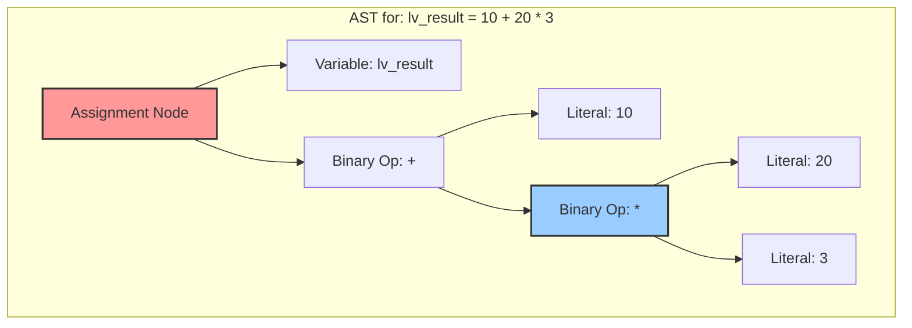
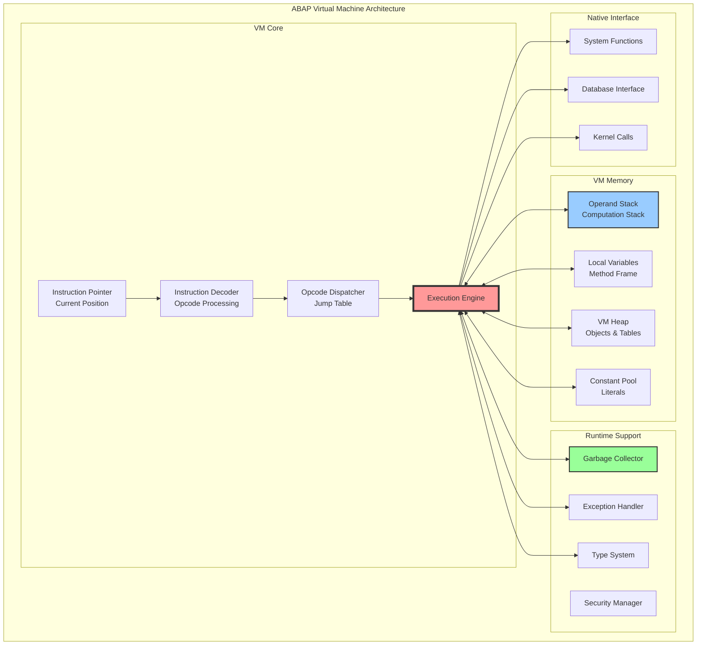
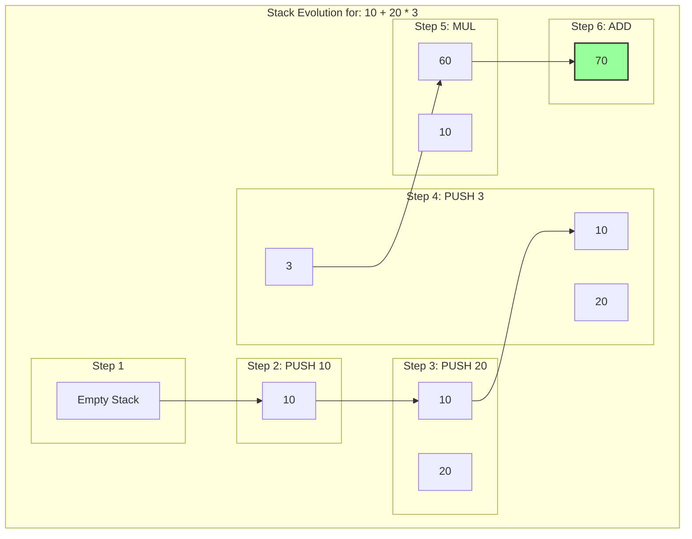
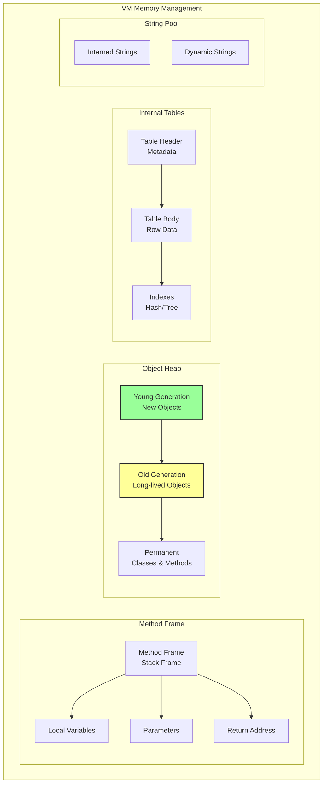
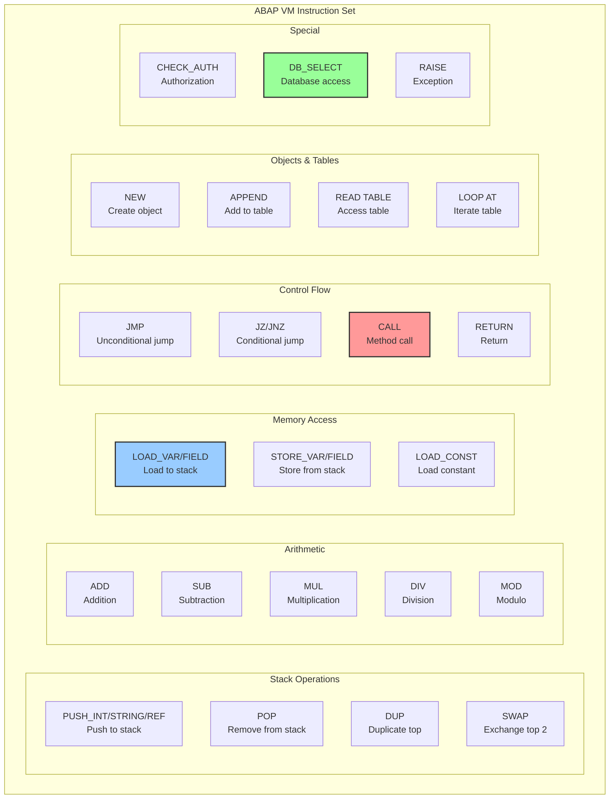
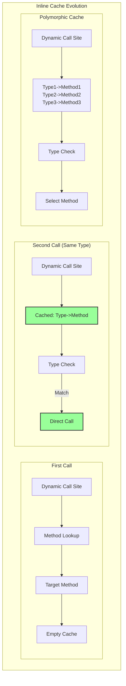

# Глава 5: ABAP Virtual Machine - от исходника к исполнению

## 5.1. От исходного кода до исполняемой загрузки

ABAP является компилируемым языком, но в отличие от C или C++, он компилируется не в машинный код целевой платформы, а в платформенно-независимый байт-код, который затем интерпретируется виртуальной машиной ABAP. Этот подход обеспечивает переносимость кода между различными операционными системами и архитектурами процессоров.

### Исторические корни и влияния

Синтаксис ABAP был сформирован под влиянием нескольких языков программирования [14]:

**COBOL** - ABAP заимствовал синтаксические конвенции, где операторы начинаются с ключевого слова и заканчиваются точкой. Это делало язык знакомым для программистов мейнфреймов, переходящих с COBOL.

**Natural (Software AG)** - Повлиял на обработку списков и подход к SQL как части языка, а не внешней библиотеки. Это позволило ABAP органично интегрировать работу с базой данных.

**Ассемблерные макросы** - Первоначальная реализация ABAP транслировалась в макросы, созданные Klaus Tschira. Эта двухфазная компиляция позже была заменена прямой интерпретацией байт-кода.

Уникальная сила ABAP заключалась в его способности управлять большими объемами данных не только на уровне базы данных, но и в приложении, используя концепцию внутренних таблиц — функциональность, которая остается ключевой и сегодня.

### Процесс компиляции

```mermaid
graph TB
    subgraph "ABAP Compilation Pipeline"
        subgraph "Source Processing"
            SRC[ABAP Source Code<br/>REPOSRC table]
            SCANNER[Scanner/Lexer<br/>Token Generation]
            PARSER[Parser<br/>Syntax Tree]
            SEMANTIC[Semantic Analyzer<br/>Type Checking]
        end
        
        subgraph "Intermediate Representation"
            AST[Abstract Syntax Tree]
            IR[Intermediate Code<br/>Three-Address Code]
            OPT[Optimizer<br/>Dead Code Elimination]
        end
        
        subgraph "Code Generation"
            CODEGEN[Code Generator]
            BYTECODE[ABAP Bytecode]
            METADATA[Debug Info<br/>Symbol Table]
        end
        
        subgraph "Storage"
            LOAD[ABAP Load<br/>REPOLOAD table]
            PXA[Program Buffer<br/>Runtime Cache]
        end
        
        SRC --> SCANNER
        SCANNER --> PARSER
        PARSER --> SEMANTIC
        SEMANTIC --> AST
        AST --> IR
        IR --> OPT
        OPT --> CODEGEN
        CODEGEN --> BYTECODE
        CODEGEN --> METADATA
        BYTECODE --> LOAD
        METADATA --> LOAD
        LOAD --> PXA
    end
    
    style CODEGEN fill:#ff9999,stroke:#333,stroke-width:4px
    style BYTECODE fill:#99ccff,stroke:#333,stroke-width:2px
    style PXA fill:#99ff99,stroke:#333,stroke-width:2px
```



### Program eXecution Area (PXA)

PXA - это shared memory область для кеширования скомпилированных программ:
- Размер: автоматически вычисляется на основе доступной памяти
- Параметр для мониторинга: abap/pxa_buffer_size (read-only)
- Алгоритм вытеснения: LRU (Least Recently Used)
- Статистика: транзакция ST02, раздел Program

При заполнении PXA старые неиспользуемые программы выгружаются.

### Дополнительные таблицы репозитория

При компиляции также используются:
- **CROSS**: Таблица перекрестных ссылок (where-used list)
- **DYNPLOAD**: Скомпилированные экраны (dynpro)
- **TEXTPOOL**: Текстовые элементы программы
- **D010SINF**: Информация о экранах
- **TRDIR**: Каталог программ и их атрибуты

### Лексический анализ (Scanner)

Первый этап компиляции - разбиение исходного кода на токены:

```abap
* Исходный ABAP код
DATA: lv_result TYPE i.
lv_result = 10 + 20 * 3.
WRITE: / 'Result:', lv_result.
```

Превращается в поток токенов:

```c
// Псевдо-структура токена
typedef struct {
    token_type_t type;    // Тип токена
    char* value;          // Значение
    int line;            // Номер строки
    int column;          // Позиция в строке
} token_t;

// Поток токенов для примера выше:
tokens[] = {
    {TOKEN_KEYWORD, "DATA", 1, 1},
    {TOKEN_COLON, ":", 1, 5},
    {TOKEN_IDENTIFIER, "lv_result", 1, 7},
    {TOKEN_KEYWORD, "TYPE", 1, 17},
    {TOKEN_TYPE, "i", 1, 22},
    {TOKEN_DOT, ".", 1, 23},
    {TOKEN_IDENTIFIER, "lv_result", 2, 1},
    {TOKEN_ASSIGN, "=", 2, 11},
    {TOKEN_NUMBER, "10", 2, 13},
    {TOKEN_PLUS, "+", 2, 16},
    {TOKEN_NUMBER, "20", 2, 18},
    {TOKEN_MULTIPLY, "*", 2, 21},
    {TOKEN_NUMBER, "3", 2, 23},
    {TOKEN_DOT, ".", 2, 24},
    // ... и так далее
};
```

### Синтаксический анализ (Parser)

Parser строит абстрактное синтаксическое дерево (AST):



### Семантический анализ

На этом этапе проверяются типы, разрешаются имена переменных, проверяются области видимости:

```abap
CLASS lcl_semantic_analyzer IMPLEMENTATION.
  METHOD analyze_expression.
    " Пример семантической проверки
    DATA: lv_string TYPE string VALUE 'ABC',
          lv_number TYPE i VALUE 123.
    
    " Это вызовет ошибку компиляции:
    " lv_number = lv_string + 10.  " Type mismatch!
    
    " Компилятор проверяет:
    " 1. Существует ли переменная lv_string
    " 2. Совместимы ли типы для операции +
    " 3. Можно ли присвоить результат lv_number
  ENDMETHOD.
ENDCLASS.
```

### Генерация промежуточного кода

При компиляции генерируется промежуточное представление кода для оптимизации.

### Поддержка отладки

Line table используется для:
- Установки breakpoints по номерам строк
- Пошагового выполнения (F5/F6/F7/F8)
- Отображения текущей позиции в исходном коде
- Watchpoints на изменение переменных

Отладочная информация всегда включена в ABAP Load.

Перед генерацией байт-кода создается промежуточное представление:

```assembly
; Three-address code для выражения lv_result = 10 + 20 * 3
t1 = 20 * 3      ; Временная переменная t1
t2 = 10 + t1     ; Временная переменная t2  
lv_result = t2   ; Присваивание результата
```

### Структура ABAP Load

ABAP Load - это бинарное представление скомпилированной программы:

```c
// Концептуальная модель структуры ABAP Load (не реальная реализация)
typedef struct {
### Поддержка отладки

Line table используется для:
- Установки breakpoints по номерам строк
- Пошагового выполнения (F5/F6/F7/F8)
- Отображения текущей позиции в исходном коде
- Watchpoints на изменение переменных

Отладочная информация всегда включена в ABAP Load.
    // Заголовок
    struct {
        uint32_t magic;              // 0x4C4F4144 ('LOAD')
        uint16_t version;            // Версия формата
        uint16_t kernel_release;     // Требуемая версия ядра
        uint32_t size;              // Полный размер
        uint32_t checksum;          // CRC32 checksum
        timestamp_t compile_time;    // Время компиляции
        char program_name[40];       // Имя программы
    } header;
    
    // Секция метаданных
    struct {
        uint32_t string_pool_offset; // Смещение пула строк
        uint32_t symbol_table_offset;// Таблица символов
        uint32_t line_table_offset;  // Таблица строк для отладки
        uint32_t type_table_offset;  // Информация о типах
    } metadata;
    
    // Секция кода
    struct {
        uint32_t entry_point;        // Точка входа
        uint32_t code_size;          // Размер байт-кода
        uint8_t* bytecode;           // Массив байт-кода
    } code;
    
    // Секция данных
    struct {
        uint32_t constant_pool_size; // Размер пула констант
        void* constant_pool;         // Константы программы
        uint32_t global_data_size;   // Размер глобальных данных
        void* global_data_template;  // Шаблон для инициализации
    } data;
    
} abap_load_t;
```

### Сохранение в базе данных

Скомпилированный код сохраняется в таблице REPOLOAD:

```abap
* Структура таблицы REPOLOAD (упрощенно)
TYPES: BEGIN OF ty_repoload,
         progname TYPE progname,      " Имя программы
         r3state  TYPE r3state,        " Статус (A=Active, I=Inactive)
         lvers    TYPE lvers,          " Load version
         ldate    TYPE datum,          " Дата генерации
         ltime    TYPE uzeit,          " Время генерации
         unam     TYPE unam,           " Кто сгенерировал
         sdat     TYPE datum,          " Дата исходника
         stim     TYPE uzeit,          " Время исходника
         " Двоичные данные LOAD
         data     TYPE lraw,           " RAW данные (BLOB)
       END OF ty_repoload.

* Чтение LOAD из базы данных
SELECT SINGLE data FROM repoload
### Управление памятью и Garbage Collection

ABAP использует reference counting для автоматического управления памятью:
- Каждый объект имеет счетчик ссылок
- При создании ссылки счетчик увеличивается
- При удалении ссылки счетчик уменьшается
- При достижении 0 объект удаляется

Это отличается от mark-and-sweep GC в Java/.NET.
Преимущество: предсказуемое время освобождения памяти.
  INTO @DATA(lv_load_data)
  WHERE progname = 'ZPROG'
    AND r3state = 'A'.
```

## 5.2. Виртуальная машина ABAP

ABAP Virtual Machine (VM) - это программный процессор, который выполняет ABAP байт-код. Она реализована как часть work process и обеспечивает изоляцию, безопасность и платформенную независимость.

### Архитектура виртуальной машины



### Управление памятью и Garbage Collection

ABAP использует reference counting для автоматического управления памятью:
- Каждый объект имеет счетчик ссылок
- При создании ссылки счетчик увеличивается
- При удалении ссылки счетчик уменьшается
- При достижении 0 объект удаляется

Это отличается от mark-and-sweep GC в Java/.NET.
Преимущество: предсказуемое время освобождения памяти.

### Размеры структур данных по платформам

| Тип | 32-bit | 64-bit |
|-----|--------|--------|
| Pointer | 4 байта | 8 байт |
| Integer | 4 байта | 4 байта |
| Float | 8 байт | 8 байт |
| Character | 2 байта (UTF-16) | 2 байта (UTF-16) |
| Reference | 4 байта | 8 байт |

### Stack-based архитектура

ABAP VM использует стековую архитектуру для вычислений:

```c
// Структура стека операндов
typedef struct {
    size_t capacity;      // Максимальный размер
    size_t top;          // Вершина стека
    value_t* values;     // Массив значений
} operand_stack_t;

// Универсальное значение в VM
typedef struct {
### Структура фрейма вызова (Call Frame)

Каждый вызов метода/функции создает фрейм:
1. **Return address** - адрес возврата в байт-коде
2. **Local variables** - локальные переменные
3. **Parameters** - входные параметры
4. **Temporary values** - промежуточные результаты
5. **Exception handler** - ссылка на обработчик исключений

Фреймы организованы в стек вызовов (call stack).
    value_type_t type;   // INTEGER, STRING, OBJECT, etc.
### Размеры структур данных по платформам

| Тип | 32-bit | 64-bit |
|-----|--------|--------|
| Pointer | 4 байта | 8 байт |
| Integer | 4 байта | 4 байта |
| Float | 8 байт | 8 байт |
| Character | 2 байта (UTF-16) | 2 байта (UTF-16) |
| Reference | 4 байта | 8 байт |
    union {
        int32_t i;       // Целое число
        double f;        // Число с плавающей точкой
        string_t* s;     // Строка
        object_t* o;     // Объект
        table_t* t;      // Внутренняя таблица
    } data;
} value_t;
```

Пример выполнения арифметического выражения:



### Структура фрейма вызова (Call Frame)

Каждый вызов метода/функции создает фрейм:
1. **Return address** - адрес возврата в байт-коде
2. **Local variables** - локальные переменные
3. **Parameters** - входные параметры
4. **Temporary values** - промежуточные результаты
5. **Exception handler** - ссылка на обработчик исключений

Фреймы организованы в стек вызовов (call stack).

### Основной цикл выполнения

**Важное замечание**: SAP не документирует внутренние опкоды ABAP VM публично. 
Приведенные ниже примеры являются концептуальной моделью для понимания принципов работы.
Реальные значения опкодов и их представление являются проприетарной информацией SAP.

```c
// Упрощенный основной цикл ABAP VM
void abap_vm_execute(vm_context_t* ctx) {
    uint8_t* code = ctx->code;
    size_t ip = ctx->ip;  // Instruction pointer
    
    while (ip < ctx->code_size) {
        uint8_t opcode = code[ip++];
        
        switch (opcode) {
            case OP_PUSH_INT: {
                int32_t value = read_int32(code, &ip);
                stack_push_int(ctx->stack, value);
                break;
            }
            
            case OP_ADD: {
                value_t b = stack_pop(ctx->stack);
                value_t a = stack_pop(ctx->stack);
                value_t result = vm_add(a, b);
                stack_push(ctx->stack, result);
                break;
            }
            
            case OP_LOAD_VAR: {
                uint16_t var_index = read_uint16(code, &ip);
                value_t value = ctx->locals[var_index];
                stack_push(ctx->stack, value);
                break;
            }
            
            case OP_STORE_VAR: {
                uint16_t var_index = read_uint16(code, &ip);
                value_t value = stack_pop(ctx->stack);
                ctx->locals[var_index] = value;
                break;
            }
            
            case OP_CALL_METHOD: {
                uint32_t method_id = read_uint32(code, &ip);
                uint8_t param_count = code[ip++];
                vm_call_method(ctx, method_id, param_count);
                break;
            }
            
            // ... другие опкоды
            
            case OP_RETURN: {
                vm_return(ctx);
                return;
            }
            
            default:
                vm_throw_exception(ctx, "Unknown opcode");
        }
        
        // Проверка прерываний и исключений
        if (ctx->exception_pending) {
            vm_handle_exception(ctx);
        }
    }
}
```

### Управление памятью в VM



**Важное замечание**: SAP не документирует внутренние опкоды ABAP VM публично. 
Приведенные ниже примеры являются концептуальной моделью для понимания принципов работы.
Реальные значения опкодов и их представение являются проприетарной информацией SAP.

### Type System и динамическая типизация

ABAP VM поддерживает как статическую, так и динамическую типизацию:

```abap
* Пример работы с типами в VM
DATA: lv_static TYPE i VALUE 42,
      lr_dynamic TYPE REF TO data.

FIELD-SYMBOLS: <fs_any> TYPE any.

* Создание переменной динамического типа
CREATE DATA lr_dynamic TYPE i.
ASSIGN lr_dynamic->* TO <fs_any>.
<fs_any> = 100.

* VM должна отслеживать реальный тип <fs_any>
* и выполнять проверки во время выполнения
```

Внутреннее представление типов:

```c
// Дескриптор типа в VM
typedef struct {
    type_kind_t kind;       // ELEMENTARY, STRUCTURED, TABLE, REF
    size_t size;           // Размер в байтах
    char name[30];         // Имя типа
    
    union {
        // Для элементарных типов
        struct {
            abap_type_t abap_type;  // I, C, N, D, T, etc.
            size_t length;          // Длина для C, N, etc.
            uint8_t decimals;       // Для packed numbers
        } elementary;
        
        // Для структур
        struct {
            uint16_t component_count;
            component_desc_t* components;
        } structure;
        
        // Для таблиц
        struct {
            type_desc_t* row_type;
            table_kind_t kind;  // STANDARD, SORTED, HASHED
            key_desc_t* keys;
        } table;
    } details;
} type_desc_t;
```

**Важное замечание**: SAP не документирует внутренние опкоды ABAP VM публично. 
Приведенные ниже примеры являются концептуальной моделью для понимания принципов работы.
Реальные значения опкодов и их представление являются проприетарной информацией SAP.
## 5.3. Структура байт-кода и опкоды

### Формат инструкций

ABAP байт-код использует переменную длину инструкций:

```c
// Базовые форматы инструкций
// Формат 1: Только опкод (1 байт)
// [opcode]
### Встроенные проверки безопасности

ABAP VM автоматически выполняет:
- AUTHORITY-CHECK при доступе к данным
- Проверки на уровне таблиц (Table Authorization Group)
- Контроль доступа к транзакциям
- Валидацию параметров для предотвращения injection

Эти проверки встроены в runtime и не могут быть отключены.
// Пример: OP_ADD, OP_RETURN

// Формат 2: Опкод + 1 байт операнд (2 байта)
// [opcode][operand8]
// Пример: OP_LOAD_LOCAL 5

// Формат 3: Опкод + 2 байта операнд (3 байта)  
// [opcode][operand16_hi][operand16_lo]
// Пример: OP_JUMP 0x0150

// Формат 4: Опкод + 4 байта операнд (5 байт)
// [opcode][operand32_b3][operand32_b2][operand32_b1][operand32_b0]
// Пример: OP_PUSH_INT 1000000
```

### Основные категории опкодов



### Встроенные проверки безопасности

ABAP VM автоматически выполняет:
- AUTHORITY-CHECK при доступе к данным
- Проверки на уровне таблиц (Table Authorization Group)
- Контроль доступа к транзакциям
- Валидацию параметров для предотвращения injection

Эти проверки встроены в runtime и не могут быть отключены.

### Пример дизассемблирования

Рассмотрим компиляцию простой ABAP программы:

```abap
REPORT z_bytecode_example.

DATA: lv_a TYPE i VALUE 10,
      lv_b TYPE i VALUE 20,
      lv_result TYPE i.

lv_result = lv_a + lv_b.
WRITE: / 'Result:', lv_result.
```

Концептуальное представление байт-кода (не реальный формат):

```assembly
; Инициализация программы
0000: ENTER          ; Вход в программу
0001: ALLOC_VAR 3    ; Выделить место для 3 переменных

; lv_a = 10
0003: PUSH_INT 10    ; Поместить 10 в стек
0008: STORE_VAR 0    ; Сохранить в переменную 0 (lv_a)

; lv_b = 20  
000A: PUSH_INT 20    ; Поместить 20 в стек
000F: STORE_VAR 1    ; Сохранить в переменную 1 (lv_b)

; lv_result = lv_a + lv_b
0011: LOAD_VAR 0     ; Загрузить lv_a в стек
0013: LOAD_VAR 1     ; Загрузить lv_b в стек
0015: ADD            ; Сложить два верхних значения
0016: STORE_VAR 2    ; Сохранить в переменную 2 (lv_result)

; WRITE: / 'Result:', lv_result
0018: NEW_LINE       ; Новая строка вывода
0019: PUSH_STRING 7  ; Индекс строки "Result:" в пуле констант
001B: WRITE          ; Вывести строку
001C: LOAD_VAR 2     ; Загрузить lv_result
001E: WRITE_INT      ; Вывести число

001F: LEAVE          ; Выход из программы
0020: END            ; Конец программы
```

### Реальный анализ байт-кода

Используя отладчик или специальные инструменты, можно увидеть реальный байт-код:

```abap
* Прямого API для работы с компилятором не существует
* Для динамической генерации кода используйте:
GENERATE SUBROUTINE POOL source_code NAME prog_name.

* Или для генерации отчетов:
INSERT REPORT prog_name FROM source_table.
GENERATE REPORT prog_name.
```

### Оптимизации на уровне байт-кода

Компилятор выполняет различные оптимизации:

```abap
* Пример 1: Constant folding
* Исходный код:
lv_result = 10 + 20 + 30.

* Наивный байт-код:
* PUSH_INT 10
* PUSH_INT 20  
* ADD
* PUSH_INT 30
* ADD

* Оптимизированный байт-код:
* PUSH_INT 60    ; Компилятор вычислил результат

* Пример 2: Dead code elimination
IF 1 = 0.
  WRITE: / 'This will never execute'.  " Не попадет в байт-код
ENDIF.

* Пример 3: Common subexpression elimination
lv_a = lv_x + lv_y * lv_z.
lv_b = lv_x + lv_y * lv_z.  " Повторное вычисление

* Оптимизированный байт-код вычислит lv_x + lv_y * lv_z только один раз
```

## 5.4. Принципы оптимизации производительности

### Just-In-Time (JIT) компиляция

Современные версии ABAP VM включают элементы JIT компиляции:

```c
// Структура для отслеживания "горячих" методов
typedef struct {
    char method_name[61];
    uint32_t call_count;
    uint32_t total_cycles;
    void* native_code;      // Указатель на скомпилированный код
    bool is_compiled;
} hot_method_info_t;

// Проверка и JIT компиляция
void check_and_compile(vm_context_t* ctx, method_info_t* method) {
    if (method->call_count > JIT_THRESHOLD && !method->is_compiled) {
        // Компиляция в native код
        void* native_code = jit_compile_method(method);
        if (native_code) {
            method->native_code = native_code;
            method->is_compiled = true;
            log_info("JIT compiled method: %s", method->method_name);
        }
    }
}
```

### Inline кэширование

Для ускорения динамических вызовов используется inline caching:



**Условия применения**:
- Только для DO циклов с константным числом итераций
- Количество итераций < 10
- Тело цикла не содержит вызовов методов
- Нет выходов из цикла (EXIT, RETURN)

### Оптимизация работы с внутренними таблицами

ABAP VM специально оптимизирована для работы с таблицами:

```abap
* Различные стратегии доступа к таблицам
DATA: lt_standard TYPE STANDARD TABLE OF scarr,
      lt_sorted   TYPE SORTED TABLE OF scarr WITH UNIQUE KEY carrid,
      lt_hashed   TYPE HASHED TABLE OF scarr WITH UNIQUE KEY carrid.

* VM выбирает оптимальный алгоритм поиска:
* - Для STANDARD: линейный поиск O(n)
* - Для SORTED: двоичный поиск O(log n)  
* - Для HASHED: хэш-поиск O(1)

READ TABLE lt_sorted WITH KEY carrid = 'LH' INTO DATA(ls_carrier).
* VM автоматически использует двоичный поиск
```

Внутренняя оптимизация:

```c
// Выбор алгоритма поиска в VM
search_result_t vm_read_table(table_t* table, key_spec_t* key) {
    switch (table->type) {
        case TABLE_STANDARD:
            if (table->row_count < LINEAR_SEARCH_THRESHOLD) {
                return linear_search(table, key);
            } else {
                // Построить временный индекс для больших таблиц
                return indexed_search(table, key);
            }
**Условия применения**:
- Только для DO циклов с константным числом итераций
- Количество итераций < 10
- Тело цикла не содержит вызовов методов
- Нет выходов из цикла (EXIT, RETURN)
            
        case TABLE_SORTED:
            return binary_search(table, key);
            
        case TABLE_HASHED:
            return hash_lookup(table, key);
    }
}
```

### Оптимизация строковых операций

```mermaid
graph TB
    subgraph "String Optimization in VM"
        subgraph "String Interning"
            STR1[String "ABC"]
            STR2[String "ABC"]
            POOL[String Pool<br/>Single Instance]
            
            STR1 --> POOL
            STR2 --> POOL
        end
        
        subgraph "Concatenation Optimization"
            CONCAT[Multiple Concatenations]
            BUILDER[String Builder<br/>Single Allocation]
            RESULT[Final String]
            
            CONCAT --> BUILDER
            BUILDER --> RESULT
        end
        
        subgraph "Substring Sharing"
            ORIG[Original String<br/>"ABCDEFGH"]
            SUB1[Substring<br/>"CDE"<br/>Offset: 2, Len: 3]
            SUB2[Substring<br/>"FGH"<br/>Offset: 5, Len: 3]
            
            SUB1 -.shares.-> ORIG
            SUB2 -.shares.-> ORIG
        end
    end
    
    style POOL fill:#99ff99,stroke:#333,stroke-width:2px
    style BUILDER fill:#99ccff,stroke:#333,stroke-width:2px
```

### Оптимизация циклов

```abap
* VM применяет различные оптимизации циклов
DATA: lt_data TYPE TABLE OF i.

* Loop unrolling для маленьких циклов
DO 4 TIMES.
  APPEND sy-index TO lt_data.
ENDDO.
* VM может развернуть в:
* APPEND 1 TO lt_data.
* APPEND 2 TO lt_data.
* APPEND 3 TO lt_data.
* APPEND 4 TO lt_data.

* Loop fusion - объединение циклов
LOOP AT lt_data INTO DATA(lv_value).
  lv_value = lv_value * 2.
  MODIFY lt_data FROM lv_value.
ENDLOOP.

LOOP AT lt_data INTO lv_value.
  WRITE: / lv_value.
ENDLOOP.
* VM может объединить в один проход
```

### Профилирование на уровне VM

```abap
## Динамическая генерация кода

ABAP поддерживает генерацию кода во время выполнения:

### GENERATE SUBROUTINE POOL
```abap
DATA: source TYPE TABLE OF string,
      prog   TYPE string.

APPEND 'FORM dynamic.' TO source.
APPEND '  WRITE: / ''Dynamic code''.' TO source.
APPEND 'ENDFORM.' TO source.

GENERATE SUBROUTINE POOL source NAME prog.
PERFORM dynamic IN PROGRAM (prog).
```

### INSERT/GENERATE REPORT
Для генерации полноценных программ.

```abap
* Для профилирования используйте транзакцию SAT
* Программный доступ через класс CL_ABAP_TRACE:

DATA: trace_ref TYPE REF TO cl_abap_trace.

* Или используйте:
SET RUN TIME ANALYZER ON.
" Код для профилирования
SET RUN TIME ANALYZER OFF.
```

## Синхронизация в многопоточной среде

ABAP VM обеспечивает потокобезопасность на уровне:
- Изоляции пользовательских контекстов между Work Processes
- Атомарных операций для shared objects (SHMA)
- Enqueue/Dequeue механизма для бизнес-блокировок

Прямого доступа к low-level синхронизации нет.

## Модель обработки исключений ABAP

ABAP использует традиционную модель с runtime проверками:
- Проверка CATCH блоков при возникновении исключения
- Раскрутка стека при поиске обработчика
- Overhead при нормальном выполнении минимален

Не используется zero-cost модель как в C++.
## Динамическая генерация кода

ABAP поддерживает генерацию кода во время выполнения:

### GENERATE SUBROUTINE POOL
```abap
DATA: source TYPE TABLE OF string,
      prog   TYPE string.

APPEND 'FORM dynamic.' TO source.
APPEND '  WRITE: / ''Dynamic code''.' TO source.
APPEND 'ENDFORM.' TO source.

GENERATE SUBROUTINE POOL source NAME prog.
PERFORM dynamic IN PROGRAM (prog).
```

### INSERT/GENERATE REPORT
Для генерации полноценных программ.

### Оптимизации по версиям SAP NetWeaver

- Loop optimizations: с версии 7.40
- Code pushdown: с версии 7.40 SP05
- String sharing: с версии 7.02, улучшено в 7.40
- Parallel cursor: с версии 7.31

```abap
* Code pushdown оптимизации
CLASS lcl_hana_optimized IMPLEMENTATION.
  METHOD get_sales_analysis.
    * Традиционный подход - данные обрабатываются в ABAP VM
    SELECT * FROM vbak INTO TABLE @DATA(lt_orders).
    LOOP AT lt_orders INTO DATA(ls_order).
      " Обработка в VM
    ENDLOOP.
    
    * Оптимизированный подход - обработка в HANA
    SELECT customer,
           SUM( netwr ) AS total_sales,
           COUNT( * ) AS order_count
      FROM vbak
      WHERE erdat BETWEEN @iv_date_from AND @iv_date_to
      GROUP BY customer
      HAVING SUM( netwr ) > 10000
      ORDER BY total_sales DESCENDING
      INTO TABLE @rt_result.
    * VM только получает готовый результат
  ENDMETHOD.
ENDCLASS.
```

## Заключение

ABAP Virtual Machine представляет собой сложную и высокооптимизированную систему выполнения кода, которая эволюционировала более 30 лет. Ключевые аспекты:

1. **Компиляция в байт-код** обеспечивает платформенную независимость и возможность оптимизации
2. **Stack-based архитектура** упрощает компиляцию и выполнение, обеспечивая эффективность
3. **Многоуровневая оптимизация** - от compile-time до runtime - обеспечивает высокую производительность
4. **Специализация для бизнес-логики** - VM оптимизирована для типичных паттернов ABAP кода
5. **Интеграция с современными технологиями** - JIT, code pushdown, векторизация

Понимание работы ABAP VM критически важно для:
- Написания эффективного кода
- Диагностики проблем производительности
- Понимания ограничений платформы
- Оптимизации критичных участков кода

В следующей главе мы рассмотрим, как ABAP VM взаимодействует с базой данных через Database Interface, обеспечивая эффективный доступ к данным.