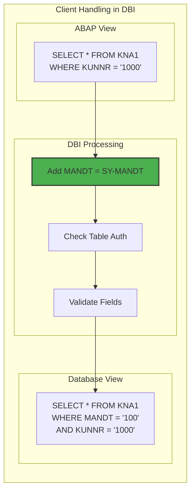
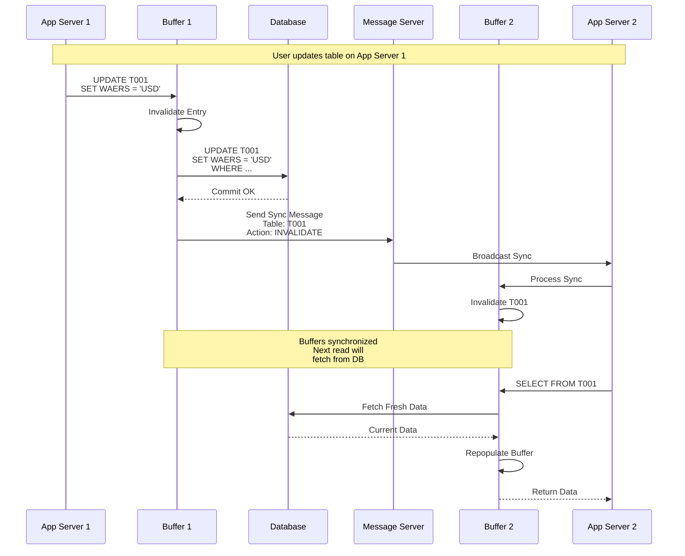
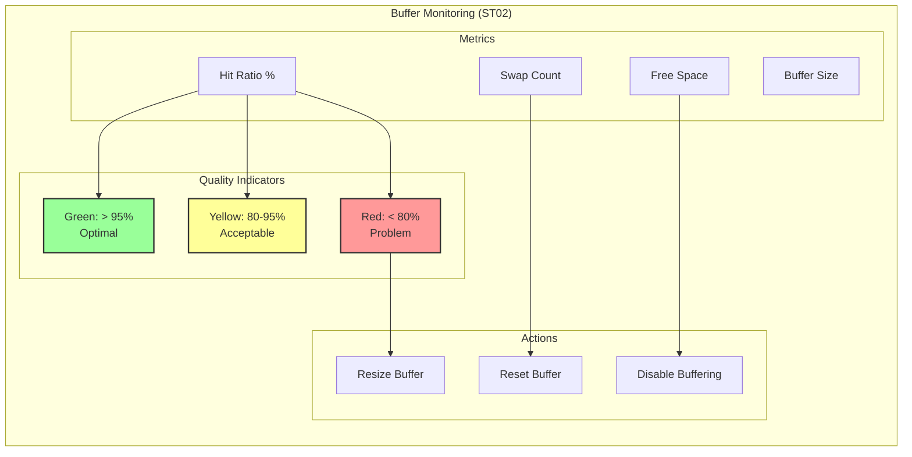

# Глава 6: Database Interface - мост между ABAP и СУБД

## 6.1. Архитектура Database Interface

Database Interface (DBI) представляет собой критически важный компонент архитектуры SAP, обеспечивающий абстракцию между ABAP-приложениями и различными системами управления базами данных. Этот уровень позволяет ABAP-коду оставаться независимым от конкретной СУБД, обеспечивая переносимость приложений между Oracle, HANA, DB2, SQL Server и другими поддерживаемыми платформами.

### Многоуровневая архитектура DBI

```mermaid
graph TB
    subgraph "Database Interface Architecture"
        subgraph "ABAP Layer"
            OSQL[Open SQL<br/>Statements]
            NSQL[Native SQL<br/>EXEC SQL]
            ADBC[ABAP Database<br/>Connectivity]
            AMDP[ABAP Managed<br/>Database Procedures]
        end
        
        subgraph "DBI Core Layer"
            subgraph "SQL Processing"
                PARSER[SQL Parser<br/>& Validator]
                OPTIMIZER[Query Optimizer]
                TRANSLATOR[SQL Translator]
            end
            
            subgraph "Buffer Management"
                BUFFER_MGR[Buffer Manager]
                TABLE_BUF[Full buffering -<br/>полная буферизация таблицы]
                SINGLE_BUF[Single-record buffering -<br/>буферизация отдельных записей]
                GENERIC_BUF[Generic buffering -<br/>буферизация по generic key]
            end
            
            subgraph "Connection Management"
                CONN_POOL[Connection Pool]
                CURSOR_MGR[Cursor Manager]
                TRANS_MGR[Transaction Manager]
            end
        end
### Дополнительные слои Database Interface:

1. **SQL Cache**: Кеширование подготовленных statements
2. **Authorization Layer**: Проверка полномочий на уровне таблиц
3. **SQL Trace Layer**: ST05 трассировка
4. **Cost-Based Optimizer Interface**: Статистика для оптимизатора БД
5. **Compression Layer**: Сжатие данных при передаче
        
        subgraph "DB-Specific Libraries"
            ORA_LIB[# Unix/Linux:<br/>dboraslib.so<br/>Oracle Interface<br/># Windows:<br/>dboraslib.dll]
            HANA_LIB[# Unix/Linux:<br/>dbhdbslib.so<br/>HANA Interface<br/># Windows:<br/>dbhdbslib.dll]
            DB2_LIB[# Unix/Linux:<br/>dbdb6slib.so<br/>DB2 Interface<br/>(не dbdb2slib.so!)<br/># Windows:<br/>dbdb6slib.dll]
            MSS_LIB[# Unix/Linux:<br/>dbmssslib.so<br/>SQL Server Interface<br/># Windows:<br/>dbmssslib.dll]
        end
        
        subgraph "Database Layer"
            ORA[(Oracle)]
            HANA[(SAP HANA)]
            DB2[(IBM DB2)]
            MSS[(SQL Server)]
        end
        
        OSQL --> PARSER
        NSQL --> TRANSLATOR
        ADBC --> CONN_POOL
        AMDP --> HANA_LIB
        
        PARSER --> BUFFER_MGR
        PARSER --> TRANSLATOR
        TRANSLATOR --> ORA_LIB
        TRANSLATOR --> HANA_LIB
        TRANSLATOR --> DB2_LIB
        TRANSLATOR --> MSS_LIB
        
        BUFFER_MGR --> TABLE_BUF
        BUFFER_MGR --> SINGLE_BUF
        BUFFER_MGR --> GENERIC_BUF
        
        ORA_LIB --> ORA
        HANA_LIB --> HANA
        DB2_LIB --> DB2
        MSS_LIB --> MSS
    end
    
    style BUFFER_MGR fill:#ff9999,stroke:#333,stroke-width:4px
    style TRANSLATOR fill:#99ccff,stroke:#333,stroke-width:2px
    style CONN_POOL fill:#99ff99,stroke:#333,stroke-width:2px
```

### Внутренняя структура DB Interface

Database Interface реализован как часть work process и включает следующие ключевые компоненты:

1. **SQL Parser и Validator**: Анализирует Open SQL statements и проверяет их корректность
2. **Query Optimizer**: Определяет оптимальную стратегию выполнения (буфер vs прямой доступ)
3. **SQL Translator**: Преобразует Open SQL в native SQL для конкретной СУБД
4. **Buffer Manager**: Управляет различными типами буферов
5. **Connection Pool**: Управляет соединениями с базой данных
6. **Transaction Manager**: Координирует транзакции и LUW

### Управление соединениями

## Управление соединениями с БД

### Стандартная модель
- Каждый Work Process имеет ОДНО постоянное соединение с БД
- Соединение создается при старте WP и сохраняется
- Нет динамического пула соединений в классическом понимании

### Параметры
- Количество DB соединений = количество Work Processes
- Исключение: параллельные операции могут создавать доп. соединения

### Оптимизации
- Connection multiplexing НЕ используется по умолчанию
- Persistent connections для минимизации overhead
- Автоматическое переподключение при разрыве

Work Process поддерживает пул соединений для минимизации overhead при создании новых подключений. Параметры управления:

- `dbs/io_buf_size` - размер I/O буфера
- `rsdb/prefer_fix_blocking` - предпочтение фиксированной блокировки
- `rsdb/prefer_in_update_task` - оптимизации для update task
- `rsdb/max_blocking_factor` - максимальный фактор блокировки (корректный)

## 6.2. Open SQL и его трансляция

Open SQL представляет собой подмножество стандарта SQL, адаптированное для нужд бизнес-приложений SAP. Ключевая особенность - автоматическое добавление клиента (MANDT) и других системных полей.

### SQL Statement Cache

Database Interface кеширует подготовленные SQL statements:

1. **Prepared statements**: Повторное использование для идентичных запросов
2. **Параметры кеша**:
   - rsdb/stmtcache_size - размер кеша (по умолчанию 500)
   - Статистика в ST04

3. **Преимущества**:
   - Избегание повторного parsing
   - Снижение нагрузки на БД
   - Улучшение response time

### Процесс трансляции Open SQL

```mermaid
graph TB
    subgraph "Open SQL Translation Process"
        subgraph "Input"
            ABAP[ABAP Code:<br/>SELECT * FROM vbak<br/>WHERE erdat = @sy-datum]
        end
        
        subgraph "Parsing"
            LEX[Lexical Analysis]
            SYNTAX[Syntax Tree]
            SEMANTIC[Semantic Check]
        end
        
        subgraph "Optimization"
            BUFFER_CHECK[Check Buffer<br/>Availability]
            ACCESS_PATH[Determine<br/>Access Path]
            JOIN_OPT[Join<br/>Optimization]
        end
        
        subgraph "Translation"
            ORACLE[Oracle SQL:<br/>SELECT * FROM VBAK<br/>WHERE MANDT = :1<br/>AND ERDAT = :2]
            
            HANA_SQL[HANA SQL:<br/>SELECT * FROM VBAK<br/>WHERE MANDT = ?<br/>AND ERDAT = ?]
            
            DB2_SQL[DB2 SQL:<br/>SELECT * FROM VBAK<br/>WHERE MANDT = ?<br/>AND ERDAT = ?]
        end
        
        subgraph "Execution"
            PREP[Prepare Statement]
            BIND[Bind Variables]
            EXEC[Execute]
            FETCH[Fetch Results]
        end
        
        ABAP --> LEX
        LEX --> SYNTAX
        SYNTAX --> SEMANTIC
        
        SEMANTIC --> BUFFER_CHECK
        BUFFER_CHECK -->|No Buffer| ACCESS_PATH
        BUFFER_CHECK -->|Buffered| BUFFER_ACCESS[Buffer Access]
        
        ACCESS_PATH --> JOIN_OPT
        
        JOIN_OPT --> ORACLE
        JOIN_OPT --> HANA_SQL
        JOIN_OPT --> DB2_SQL
        
        ORACLE --> PREP
        HANA_SQL --> PREP
        DB2_SQL --> PREP
        
        PREP --> BIND
        BIND --> EXEC
        EXEC --> FETCH
    end
    
    style BUFFER_CHECK fill:#ff9999,stroke:#333,stroke-width:2px
### Детали обработки клиентов (MANDT)

1. **Client-dependent таблицы** (большинство):
   - Автоматически добавляется WHERE MANDT = SY-MANDT
   - Поле MANDT - первое ключевое поле

2. **Client-independent таблицы**:
   - Технические таблицы без поля MANDT
   - Доступны из всех клиентов

3. **Безопасность**:
   - Параметр auth/check_mandt контролирует проверки
   - Cross-client запросы требуют специальных полномочий
   - Клиент 000 имеет особый статус

4. **CLIENT SPECIFIED**:
   - Позволяет явно указать клиента
   - Требует полномочия S_TABU_CLI
    style ACCESS_PATH fill:#99ccff,stroke:#333,stroke-width:2px
```

### Особенности трансляции для разных СУБД

Хотели бы увидеть примеры трансляции Open SQL для разных СУБД? Могу показать, как один и тот же Open SQL statement преобразуется для Oracle, HANA, DB2 и SQL Server с учетом их особенностей.

### Client handling и системные поля

Database Interface автоматически обрабатывает multi-client архитектуру SAP:



### Оптимизация FOR ALL ENTRIES

1. **Внутренняя реализация**:
   - Преобразуется в серию IN условий
   - Или в JOIN с временной таблицей

2. **Параметры оптимизации**:
   - rsdb/max_in_blocking_factor - макс. элементов в IN (по умолчанию 2000)
   - rsdb/prefer_join - предпочтение JOIN вместо IN

3. **Best practices**:
   - Удалить дубликаты из driver таблицы
   - Проверить что driver таблица не пустая
   - Использовать только необходимые поля в WHERE

### Современные расширения Open SQL

### Эволюция Open SQL по версиям:

**NetWeaver 7.40**:
- Inline declarations
- CASE expressions (базовые)
- Некоторые string функции

**NetWeaver 7.50**:
- CTE (Common Table Expressions)
- Window Functions
- Расширенные string функции
- UNION/UNION ALL

**NetWeaver 7.51+**:
- Hierarchy functions
- Session variables
- JSON функции

### Дополнительные возможности современного Open SQL:

- UNION/UNION ALL для объединения результатов
- Hierarchy functions для иерархических данных
- Session variables для хранения промежуточных значений
- Literals in SELECT list
- Array operations для массовой обработки
- Virtual elements в CDS views

### Host Variable Handling

```mermaid
sequenceDiagram
    participant ABAP as ABAP Program
    participant DBI as DB Interface
    participant PREP as Statement Prep
    participant DB as Database
    
    ABAP->>DBI: SELECT * FROM vbak<br/>WHERE kunnr = @lv_customer<br/>AND erdat IN @lt_dates
    
### Оптимизация FOR ALL ENTRIES

1. **Внутренняя реализация**:
   - Преобразуется в серию IN условий
   - Или в JOIN с временной таблицей

2. **Параметры оптимизации**:
   - rsdb/max_in_blocking_factor - макс. элементов в IN (по умолчанию 2000)
   - rsdb/prefer_join - предпочтение JOIN вместо IN

3. **Best practices**:
   - Удалить дубликаты из driver таблицы
   - Проверить что driver таблица не пустая
   - Использовать только необходимые поля в WHERE
    DBI->>DBI: Parse Host Variables
    DBI->>PREP: Prepare Statement<br/>with Placeholders
    
    PREP->>DB: Prepare:<br/>SELECT * FROM VBAK<br/>WHERE MANDT = ?<br/>AND KUNNR = ?<br/>AND ERDAT BETWEEN ? AND ?
    
    DB-->>PREP: Statement Handle
    
    PREP->>PREP: Bind Values:<br/>? = SY-MANDT<br/>? = lv_customer<br/>? = lt_dates-low<br/>? = lt_dates-high
    
    PREP->>DB: Execute with Bindings
    DB-->>PREP: Result Set
    PREP-->>DBI: Cursor
    DBI-->>ABAP: Internal Table
```

## 6.3. Буферизация таблиц и синхронизация

Буферизация таблиц является одним из ключевых механизмов оптимизации производительности в SAP. Database Interface управляет сложной системой буферов, обеспечивая баланс между производительностью и консистентностью данных.

### Типы буферизации

```mermaid
graph TB
    subgraph "Table Buffering Types"
        subgraph "Full Buffering"
### Детали синхронизации буферов
## Статистика таблиц для оптимизатора

1. **Обновление статистики**:
   - Транзакция DB20
   - Автоматическое обновление по расписанию
   - Влияет на планы выполнения

2. **Критично для**:
   - Больших таблиц
   - После массовых изменений
   - Таблиц с неравномерным распределением

3. **Проблемы без статистики**:
   - Неоптимальные планы выполнения
   - Full table scans вместо index access

1. **Задержка синхронизации**:
   - По умолчанию: 60 секунд
   - Параметр: rdisp/bufreftime

2. **Режимы (rdisp/bufrefmode)**:
   - sendon,exeauto - автоматическая синхронизация
   - sendon,exeoff - ручная синхронизация
   - sendoff,exeoff - синхронизация отключена

3. **Влияние на производительность**:
   - Частые инвалидации снижают эффективность
   - Массовые изменения требуют планирования
            FULL[Complete Table<br/>in Buffer]
            FULL_USE[Use for:<br/>- Small tables<br/>- Rarely changed<br/>- Frequently read]
### Расширенные возможности CDS

```sql
@AbapCatalog.sqlViewName: 'ZCDS_ADVANCED'
define view Z_Advanced_View as select from vbak
  association [0..*] to vbap as _Items 
    on $projection.vbeln = _Items.vbeln
{
  key vbeln,
  erdat,
  netwr,
  
  // Virtual elements
  @ObjectModel.virtualElement: true
  cast( '' as abap.char(10) ) as virtual_field,
  
  // Aggregations
  @DefaultAggregation: #SUM
  netwr as total_value,
  
  // Associations
  _Items
}
```
            FULL_EX[Examples:<br/>- T000 (Clients)<br/>- T001 (Company Codes)]
        end
        
        subgraph "Generic Buffering"
            GENERIC[Buffer by<br/>Generic Key]
            GENERIC_USE[Use for:<br/>- Medium tables<br/>- Key prefix access<br/>- Client-dependent]
            GENERIC_EX[Examples:<br/>- Customizing tables<br/>- Master data subsets]
        end
        
        subgraph "Single-Record"
            SINGLE[Individual Records<br/>Buffered]
            SINGLE_USE[Use for:<br/>- Large tables<br/>- Specific record access<br/>- Frequent key access]
            SINGLE_EX[Examples:<br/>- Material master<br/>- Customer master]
        end
        
        FULL --> FULL_USE
        FULL_USE --> FULL_EX
        
        GENERIC --> GENERIC_USE
        GENERIC_USE --> GENERIC_EX
        
        SINGLE --> SINGLE_USE
        SINGLE_USE --> SINGLE_EX
    end
    
    style FULL fill:#99ff99,stroke:#333,stroke-width:2px
    style GENERIC fill:#99ccff,stroke:#333,stroke-width:2px
    style SINGLE fill:#ffff99,stroke:#333,stroke-width:2px
```

### Алгоритм выбора между буфером и БД

```mermaid
flowchart TD
    START[SQL Statement]
    
    CHECK_TYPE{Table<br/>Buffered?}
    CHECK_FULL{Full<br/>Buffering?}
    CHECK_GENERIC{Generic<br/>Buffering?}
    CHECK_SINGLE{Single<br/>Record?}
    
    CHECK_KEY{Generic Key<br/>Complete?}
    CHECK_EXACT{Exact Key<br/>Match?}
    
    BUFFER_VALID{Buffer<br/>Valid?}
    
    USE_BUFFER[Read from<br/>Buffer]
    USE_DB[Read from<br/>Database]
    UPDATE_BUFFER[Update<br/>Buffer]
    
    START --> CHECK_TYPE
    CHECK_TYPE -->|No| USE_DB
    CHECK_TYPE -->|Yes| CHECK_FULL
    
    CHECK_FULL -->|Yes| BUFFER_VALID
    CHECK_FULL -->|No| CHECK_GENERIC
    
    CHECK_GENERIC -->|Yes| CHECK_KEY
### Детали синхронизации буферов
## Статистика таблиц для оптимизатора

1. **Обновление статистики**:
   - Транзакция DB20
   - Автоматическое обновление по расписанию
   - Влияет на планы выполнения

2. **Критично для**:
   - Больших таблиц
   - После массовых изменений
   - Таблиц с неравномерным распределением

3. **Проблемы без статистики**:
   - Неоптимальные планы выполнения
   - Full table scans вместо index access

1. **Задержка синхронизации**:
   - По умолчанию: 60 секунд
   - Параметр: rdisp/bufreftime

2. **Режимы (rdisp/bufrefmode)**:
   - sendon,exeauto - автоматическая синхронизация
   - sendon,exeoff - ручная синхронизация
   - sendoff,exeoff - синхронизация отключена

3. **Влияние на производительность**:
   - Частые инвалидации снижают эффективность
   - Массовые изменения требуют планирования
    CHECK_GENERIC -->|No| CHECK_SINGLE
    
### Расширенные возможности CDS

```sql
@AbapCatalog.sqlViewName: 'ZCDS_ADVANCED'
define view Z_Advanced_View as select from vbak
  association [0..*] to vbap as _Items 
    on $projection.vbeln = _Items.vbeln
{
  key vbeln,
  erdat,
  netwr,
  
  // Virtual elements
  @ObjectModel.virtualElement: true
  cast( '' as abap.char(10) ) as virtual_field,
  
  // Aggregations
  @DefaultAggregation: #SUM
  netwr as total_value,
  
  // Associations
  _Items
}
```
    CHECK_KEY -->|Yes| BUFFER_VALID
    CHECK_KEY -->|No| USE_DB
    
    CHECK_SINGLE -->|Yes| CHECK_EXACT
    CHECK_SINGLE -->|No| USE_DB
    
    CHECK_EXACT -->|Yes| BUFFER_VALID
    CHECK_EXACT -->|No| USE_DB
    
    BUFFER_VALID -->|Valid| USE_BUFFER
    BUFFER_VALID -->|Invalid| USE_DB
    
    USE_DB --> UPDATE_BUFFER
```

### Механизм синхронизации буферов



### Параметры управления буферизацией

Ключевые параметры для настройки буферов:

- `zcsa/table_buffer_area` - размер области table buffer (KB)
- `zcsa/db_max_buftab` - макс. количество буферизованных таблиц
- `rsdb/ntab/entrycount` - количество записей в Nametab
- `rsdb/obj/buffersize` - размер буфера объектов (KB)
- `rsdb/obj/max_objects` - макс. количество объектов в буфере
- `rsdb/obj/large_object_size` - порог для больших объектов
### Полный набор классов ADBC

- CL_SQL_CONNECTION - управление соединениями
- CL_SQL_STATEMENT - выполнение SQL
- CL_SQL_PREPARED_STATEMENT - prepared statements
- CL_SQL_RESULT_SET - работа с результатами
- CX_SQL_EXCEPTION - обработка ошибок

### Пример с обработкой ошибок:
```abap
TRY.
    DATA(lo_sql) = NEW cl_sql_statement( ).
    DATA(lo_result) = lo_sql->execute_query( |SELECT * FROM { table }| ).
  CATCH cx_sql_exception INTO DATA(lx_sql).
    MESSAGE lx_sql->get_text( ) TYPE 'E'.
ENDTRY.
```
- `rsdb/obj/buffersize` - размер буфера для объектов

### Ограничения и требования AMDP

1. **Платформа**: Только SAP HANA (не работает на других БД)
2. **Транспорт**: Особые требования к транспортировке
3. **Отладка**: Ограниченные возможности debug
4. **Авторизация**: Требуются права на создание процедур
5. **Производительность**: Overhead для простых операций
### ⚠️ КРИТИЧЕСКИЕ предупреждения о Native SQL

1. **SQL Injection**: НИКОГДА не конкатенируйте пользовательский ввод!
2. **Авторизация**: Обходит стандартные проверки SAP
3. **Портируемость**: Привязка к конкретной БД
4. **Апгрейд**: Может сломаться при обновлении
5. **Клиент**: Нужно вручную обрабатывать MANDT

❌ ИЗБЕГАЙТЕ Native SQL в продуктивном коде!
6. **Версионность**: Минимум NetWeaver 7.40 SP05

⚠️ Используйте AMDP только для сложных вычислений!
### Мониторинг эффективности буферов



## 6.4. AMDP и code pushdown в HANA
## Ключевые транзакции для Database Interface

| Транзакция | Назначение |
|------------|------------|
| ST04 | Database Performance Monitor |
| ST05 | SQL Trace |
| STAD | Workload Statistics (SQL statements) |
| DB02 | Tables and Indexes Monitor |
| DB20 | Update Statistics |
| DBACOCKPIT | DBA Cockpit |
| ST12 | Combined trace (ABAP + SQL) |

ABAP Managed Database Procedures (AMDP) представляют собой революционный подход к обработке данных, позволяющий выполнять SQLScript непосредственно в HANA из ABAP-кода.

### Архитектура AMDP

```mermaid
graph TB
    subgraph "AMDP Architecture"
        subgraph "ABAP Layer"
            AMDP_CLASS[AMDP Class<br/>IF_AMDP_MARKER_HDB]
            AMDP_METHOD[AMDP Method<br/>SQLScript Code]
            CALLER[ABAP Caller]
        end
        
        subgraph "Compilation"
            ANALYZER[AMDP Analyzer]
            GENERATOR[Procedure Generator]
            DEPLOY[Deploy to HANA]
        end
        
        subgraph "HANA Layer"
            CATALOG[System Catalog]
            PROC[Database Procedure<br/>в схеме ABAP системы<br/>(например, SAPABAP1),<br/>НЕ в _SYS_BIC]
            ENGINE[Calculation Engine]
            RESULT[Result Set]
        end
        
        subgraph "Runtime"
            INVOKE[Procedure Call]
            PARAM[Parameter Binding]
            EXEC_H[HANA Execution]
        end
        
        CALLER --> AMDP_METHOD
        AMDP_METHOD --> ANALYZER
        ANALYZER --> GENERATOR
        GENERATOR --> DEPLOY
        DEPLOY --> CATALOG
        CATALOG --> PROC
        
        AMDP_METHOD --> INVOKE
        INVOKE --> PARAM
        PARAM --> PROC
        PROC --> ENGINE
        ENGINE --> RESULT
        RESULT --> CALLER
    end
    
    style AMDP_METHOD fill:#ff9999,stroke:#333,stroke-width:4px
    style ENGINE fill:#4CAF50,stroke:#333,stroke-width:2px
```

### Жизненный цикл AMDP

```mermaid
sequenceDiagram
    participant DEV as Developer
    participant SE80 as ABAP Editor
    participant COMPILER as ABAP Compiler
    participant AMDP_RT as AMDP Runtime
    participant HANA as HANA DB
    participant CATALOG as DB Catalog
    
    DEV->>SE80: Create AMDP Class
    DEV->>SE80: Implement Method<br/>with SQLScript
    
    SE80->>COMPILER: Activate Class
    COMPILER->>COMPILER: Validate AMDP
    COMPILER->>AMDP_RT: Register AMDP
    
    Note over AMDP_RT,HANA: First Call
    
### Полный набор классов ADBC

- CL_SQL_CONNECTION - управление соединениями
- CL_SQL_STATEMENT - выполнение SQL
- CL_SQL_PREPARED_STATEMENT - prepared statements
- CL_SQL_RESULT_SET - работа с результатами
- CX_SQL_EXCEPTION - обработка ошибок

### Пример с обработкой ошибок:
```abap
TRY.
    DATA(lo_sql) = NEW cl_sql_statement( ).
    DATA(lo_result) = lo_sql->execute_query( |SELECT * FROM { table }| ).
  CATCH cx_sql_exception INTO DATA(lx_sql).
    MESSAGE lx_sql->get_text( ) TYPE 'E'.
ENDTRY.
```
### Полная картина LUW

1. **SAP LUW vs Database LUW**:
   - SAP LUW может включать несколько DB транзакций
   - DB LUW = одна database транзакция

2. **Типы Update Task**:
   - V1 - критические синхронные обновления
   - V2 - некритические асинхронные обновления  
   - V3 - фоновые обновления (устарело)

3. **Enqueue в LUW**:
   - Блокировки удерживаются до конца SAP LUW
   - Автоматическое освобождение при COMMIT/ROLLBACK

4. **Обработка ошибок**:
   - ROLLBACK WORK откатывает всю DB транзакцию
   - Update termination откатывает V1/V2 обновления
   - Сохранение в VBLOG для анализа
    AMDP_RT->>CATALOG: Check Procedure<br/>Exists?
    CATALOG-->>AMDP_RT: Not Found
### Ограничения и требования AMDP

1. **Платформа**: Только SAP HANA (не работает на других БД)
2. **Транспорт**: Особые требования к транспортировке
3. **Отладка**: Ограниченные возможности debug
4. **Авторизация**: Требуются права на создание процедур
5. **Производительность**: Overhead для простых операций
### ⚠️ КРИТИЧЕСКИЕ предупреждения о Native SQL

1. **SQL Injection**: НИКОГДА не конкатенируйте пользовательский ввод!
2. **Авторизация**: Обходит стандартные проверки SAP
3. **Портируемость**: Привязка к конкретной БД
4. **Апгрейд**: Может сломаться при обновлении
5. **Клиент**: Нужно вручную обрабатывать MANDT

❌ ИЗБЕГАЙТЕ Native SQL в продуктивном коде!
6. **Версионность**: Минимум NetWeaver 7.40 SP05

⚠️ Используйте AMDP только для сложных вычислений!
    
    AMDP_RT->>AMDP_RT: Generate CREATE<br/>PROCEDURE
    AMDP_RT->>HANA: Deploy Procedure
    HANA->>CATALOG: Store Procedure
    CATALOG-->>AMDP_RT: Created
    
    Note over AMDP_RT,HANA: Subsequent Calls
    
    AMDP_RT->>CATALOG: Check Version
    CATALOG-->>AMDP_RT: Current
    AMDP_RT->>HANA: CALL Procedure
    HANA-->>AMDP_RT: Result Set
```

### AMDP vs классический подход

Хотели бы увидеть сравнительный пример обработки данных классическим способом и через AMDP? Могу показать, как одна и та же бизнес-логика выглядит в обоих подходах и какой выигрыш в производительности это дает.

### Code Pushdown паттерны

```mermaid
graph TB
    subgraph "Code Pushdown Patterns"
        subgraph "CDS Views"
            CDS_SIMPLE[Simple Projections]
            CDS_CALC[Calculated Fields]
            CDS_ASSOC[Associations]
            CDS_FUNC[Table Functions]
        end
        
        subgraph "AMDP"
            AMDP_PROC[Procedures]
            AMDP_FUNC[Functions]
            AMDP_COMPLEX[Complex Logic]
        end
        
        subgraph "Native SQL"
            EXEC_SQL[EXEC SQL]
            ADBC_N[ADBC]
## Ключевые транзакции для Database Interface

| Транзакция | Назначение |
|------------|------------|
| ST04 | Database Performance Monitor |
| ST05 | SQL Trace |
| STAD | Workload Statistics (SQL statements) |
| DB02 | Tables and Indexes Monitor |
| DB20 | Update Statistics |
| DBACOCKPIT | DBA Cockpit |
| ST12 | Combined trace (ABAP + SQL) |
        end
        
        subgraph "Best Practices"
            USE_CDS[Use CDS for:<br/>- Simple queries<br/>- Reusable views<br/>- Annotations]
            
            USE_AMDP[Use AMDP for:<br/>- Complex algorithms<br/>- Loops/Cursors<br/>- Native HANA features]
            
            USE_NATIVE[Use Native for:<br/>- Admin tasks<br/>- System procedures<br/>- Special cases]
        end
        
        CDS_SIMPLE --> USE_CDS
        CDS_CALC --> USE_CDS
        CDS_ASSOC --> USE_CDS
        
        AMDP_PROC --> USE_AMDP
        AMDP_COMPLEX --> USE_AMDP
        
        EXEC_SQL --> USE_NATIVE
        ADBC_N --> USE_NATIVE
    end
    
    style USE_CDS fill:#99ff99,stroke:#333,stroke-width:2px
    style USE_AMDP fill:#99ccff,stroke:#333,stroke-width:2px
```

### Оптимизация производительности с AMDP

```mermaid
graph LR
    subgraph "Performance Comparison"
        subgraph "Traditional ABAP"
            T1[SELECT to ABAP]
            T2[Loop Processing]
            T3[Multiple Queries]
            T4[Return Result]
            T_TIME[Total: зависит от сценария]
        end
        
        subgraph "AMDP Approach"
            A1[Call AMDP]
            A2[HANA Processing]
            A3[Return Result]
            A_TIME[Total: см. ниже]
        end
        
        subgraph "Performance Gain"
            NETWORK[Less Network<br/>Round-trips]
            PARALLEL[Parallel<br/>Processing]
            MEMORY[In-Memory<br/>Speed]
            PUSHDOWN[Data stays<br/>in DB]
        end
        
        subgraph "Пример улучшения производительности (зависит от сценария):"
            SIMPLE[Простой SELECT: 10-50% улучшение]
            COMPLEX[Сложные JOIN: 10x-100x улучшение]
            ANALYTICS[Аналитические запросы: 100x-1000x улучшение]
            WARNING[⚠️ Реальные результаты зависят от:<br/>- Объема данных<br/>- Сложности запроса<br/>- Сетевой задержки<br/>- Типа БД (HANA vs традиционные)]
        end
        
        T1 --> T2
        T2 --> T3
        T3 --> T4
        
        A1 --> A2
        A2 --> A3
        
        A_TIME --> NETWORK
        A_TIME --> PARALLEL
        A_TIME --> MEMORY
        A_TIME --> PUSHDOWN
    end
    
    style A_TIME fill:#99ff99,stroke:#333,stroke-width:4px
    style T_TIME fill:#ff9999,stroke:#333,stroke-width:2px
```

### Транзакционная обработка и LUW

```mermaid
sequenceDiagram
    participant ABAP as ABAP Program
    participant DBI as DB Interface
    participant TM as Transaction Manager
    participant DB as Database
    
    Note over ABAP,DB: SAP LUW Start
    
    ABAP->>DBI: UPDATE table1
    DBI->>TM: Register Change
    TM->>TM: Buffer Update
    
    ABAP->>DBI: INSERT table2
    DBI->>TM: Register Change
    TM->>TM: Buffer Insert
    
    ABAP->>DBI: CALL AMDP
### Полная картина LUW

1. **SAP LUW vs Database LUW**:
   - SAP LUW может включать несколько DB транзакций
   - DB LUW = одна database транзакция

2. **Типы Update Task**:
   - V1 - критические синхронные обновления
   - V2 - некритические асинхронные обновления  
   - V3 - фоновые обновления (устарело)

3. **Enqueue в LUW**:
   - Блокировки удерживаются до конца SAP LUW
   - Автоматическое освобождение при COMMIT/ROLLBACK

4. **Обработка ошибок**:
   - ROLLBACK WORK откатывает всю DB транзакцию
   - Update termination откатывает V1/V2 обновления
   - Сохранение в VBLOG для анализа
    DBI->>DB: Execute Procedure
    DB-->>DBI: Result
    
    ABAP->>DBI: COMMIT WORK
    DBI->>TM: Commit Request
    
    TM->>DB: BEGIN TRANSACTION
    TM->>DB: Execute Updates
    TM->>DB: Execute Inserts
    TM->>DB: COMMIT
    
    DB-->>TM: Success
    TM->>TM: Clear Buffers
    TM-->>DBI: Committed
    DBI-->>ABAP: Success
    
    Note over ABAP,DB: SAP LUW Complete
```

## Заключение

Database Interface представляет собой сложный и высокооптимизированный компонент архитектуры SAP, который эволюционировал от простого транслятора SQL до интеллектуальной системы управления данными. Ключевые архитектурные достижения:

1. **Абстракция от СУБД**: Единый интерфейс для различных баз данных обеспечивает переносимость приложений
2. **Интеллектуальная буферизация**: Многоуровневая система буферов минимизирует обращения к БД
3. **Автоматическая оптимизация**: DBI выбирает оптимальный путь доступа к данным
4. **Code Pushdown**: AMDP и CDS позволяют переносить вычисления в базу данных
5. **Транзакционная целостность**: Управление LUW обеспечивает консистентность данных

Понимание работы Database Interface критически важно для:

- Оптимизации производительности приложений
- Правильного проектирования доступа к данным
- Эффективного использования возможностей HANA
- Диагностики проблем с производительностью БД

В следующей главе мы рассмотрим, как архитектура SAP эволюционировала от эпохи мейнфреймов R/2 до современной in-memory платформы S/4HANA.