# Глава 7: От R/2 до S/4HANA - архитектурные революции

## 7.1. R/2 и эпоха мейнфреймов

## Пути миграции к S/4HANA

### 1. Greenfield (новая установка)
- Чистая установка S/4HANA
- Переопределение процессов
- Селективная миграция данных

### 2. Brownfield (конвертация)
- Техническая конвертация ECC → S/4HANA
- Сохранение настроек и данных
- Требует подготовки (SI checks)

### 3. Bluefield (селективная)
- Комбинация подходов
- Выборочный перенос данных
- Реинжиниринг процессов
## Пути миграции к S/4HANA

### 1. Greenfield (новая установка)
- Чистая установка S/4HANA
- Переопределение процессов
- Селективная миграция данных

### 2. Brownfield (конвертация)
- Техническая конвертация ECC → S/4HANA
- Сохранение настроек и данных
- Требует подготовки (SI checks)

### 3. Bluefield (селективная)
- Комбинация подходов
- Выборочный перенос данных
- Реинжиниринг процессов
SAP R/2, выпущенная в 1979 году, представляла собой эволюцию системы RFM (также известной как "R/1"), которая была создана основателями SAP в 1973 году. Как отмечает Karl Kessler в своей исторической статье [14], первое упоминание ABAP появилось в функциональной брошюре системы RFM в 1976 году, где ABAP описывался как инструмент для создания отчетов на основе транзакционных данных.

### Исторический контекст

**1972** - Основание SAP пятью основателями: Dietmar Hopp, Hasso Plattner, Klaus Tschira, Hans-Werner Hector, Claus Wellenreuther. Компания насчитывала 9 сотрудников.

**1973** - Выпуск системы RF (позже известной как RFM или "R/1") - первой real-time системы для финансов и материального учета.

**1976** - Первое документированное упоминание ABAP в брошюре RFM. На тот момент SAP имела около 30 сотрудников и обслуживала 50 клиентов.

**1979** - Официальный релиз R/2, полноценной ERP системы для мейнфреймов.

**Начало 1980-х** - Gerd Rodé изобретает ABAP синтаксис (RSYN = Report Syntax) для R/2, создавая основу современного ABAP [14].

Понимание архитектуры R/2 важно не только с исторической точки зрения — многие концептуальные решения той эпохи до сих пор влияют на современные системы SAP. Например, концепция Dynpro (динамической программы) была создана еще до ABAP и остается фундаментальной частью архитектуры.

### Архитектура R/2

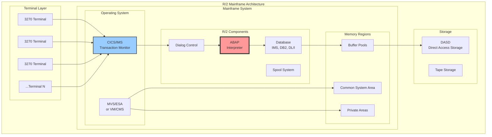

### Ключевые характеристики R/2

**Монолитная архитектура**: Все компоненты выполнялись в едином адресном пространстве мейнфрейма. Это обеспечивало высокую производительность за счет отсутствия сетевых задержек, но ограничивало масштабируемость.

**Терминальная модель**: Пользователи работали через "глупые" терминалы IBM 3270, VT100 и другие совместимые, которые могли отображать только текст в формате 24×80 символов. Вся логика выполнялась на мейнфрейме.

**ABAP**: Язык программирования для R/2 был создан в начале 1980-х годов. Согласно Karl Kessler [14], Klaus Tschira (один из основателей SAP) создал набор ассемблерных макросов для ввода данных и работы с БД, а также для форматирования списков. Для упрощения повторяющихся задач создания отчетов Gerd Rodé изобрел собственный синтаксис отчетов и среду программирования для системы R/2. Первоначально новый синтаксис ABAP (RSYN = Report Syntax) транслировался в макросы, что приводило к двухфазной компиляции ABAP (генерация макросов и выполнение). Позже компилятор ABAP стал генерировать управляющие блоки для прямой интерпретации — так родился процессор ABAP.

### Управление транзакциями в R/2

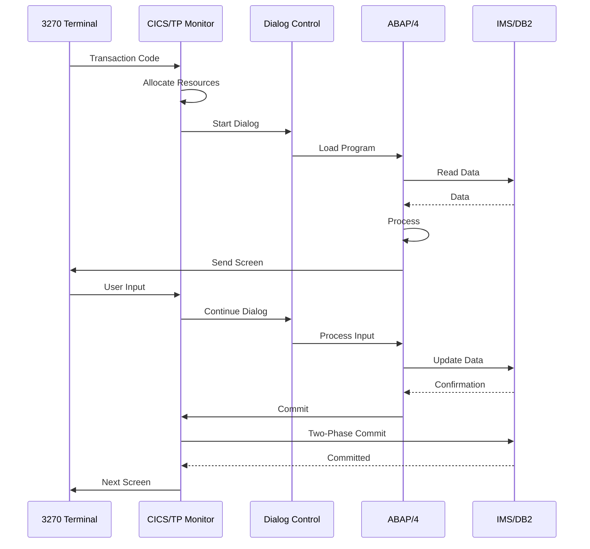

### Ограничения R/2

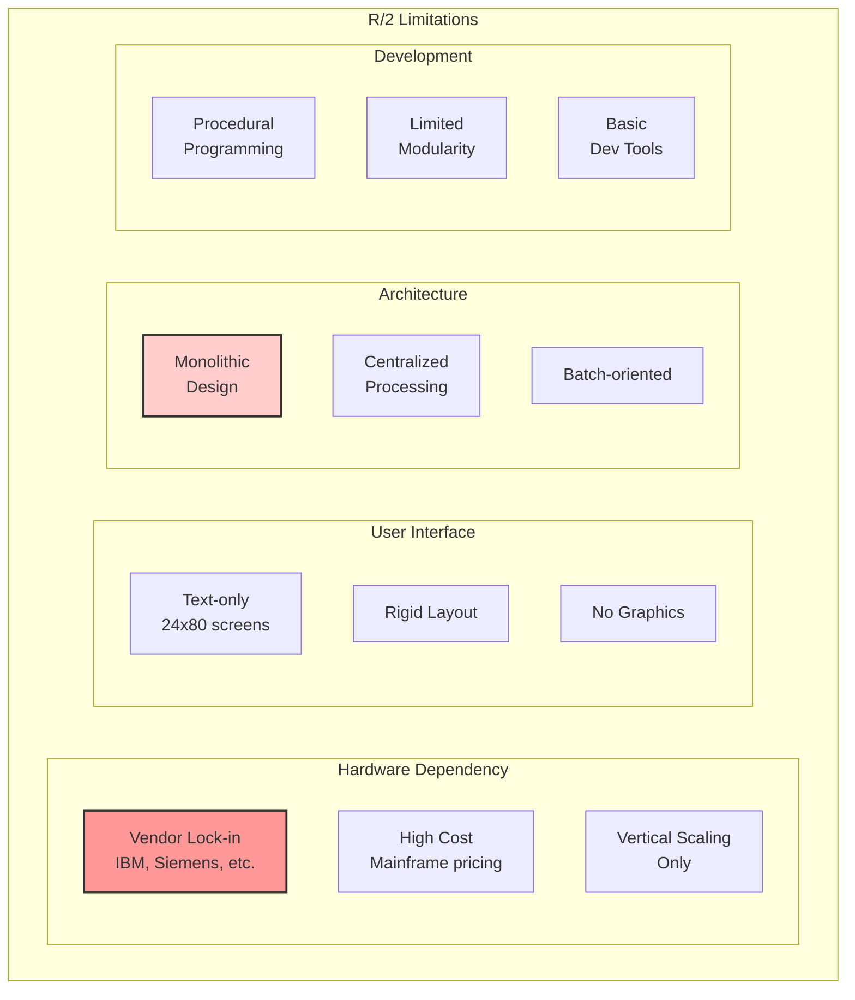

### Пример кода R/2 ABAP

Следующий пример демонстрирует аутентичный код R/2 ABAP из отчета RFBILA00 [14]:

```abap
* R/2 ABAP - пример использования FIELD-GROUPS и логических БД
REPORT RFBILA00
       LINE-COUNT  65(0)
       LINE-SIZE   132
       NO STANDARD PAGE HEADING.

SEGMENTS: SA, SB, SC.

TABLES:   BHDGD, SELC, T001, T010, T011, T013,
          T001G.

FIELD-GROUPS:
             HEADER,
             KONTEN,
             TRIGGER.
INSERT
  SORT-BUK1                            " Buchungskreis
  SORT-GSB1                            " Geschaeftsbereich
  SORT-LIST                            " Listenteil
  SORT-BIL1                            " Stufe 1
  SORT-BIL2                            " Stufe 2
  SORT-KTNR                            " Sachkonto
INTO HEADER.

GET SA.
  CHECK SELECT-OPTIONS.
  CLEAR:  GTAB.
  REFRESH GTAB.

GET SB.
  CHECK SELECT-OPTIONS.
* Bilanz-Steuerung (Unterkonten auslassen)
  CHECK SB-BSTEU NE 'U'.
```

Этот код демонстрирует характерные особенности R/2 ABAP:
- Использование SEGMENTS для работы с логическими базами данных
- FIELD-GROUPS для эффективной обработки больших объемов данных
- GET операторы для навигации по иерархическим структурам данных
- Процедурный стиль с фокусом на пакетную обработку

## 7.2. R/3 и трёхуровневая революция

В июле 1992 года SAP выпустила R/3 — систему, которая кардинально изменила ландшафт корпоративного ПО. Переход от мейнфреймов к клиент-серверной архитектуре был не просто технологическим обновлением, а фундаментальной сменой парадигмы. 

Как вспоминает Karl Kessler [14], когда он присоединился к SAP в начале 1992 года, компания насчитывала около 2500 сотрудников и обслуживала 2000 клиентов R/2. R/3 еще не был представлен на рынке, но ранние последователи, такие как Würth (первый клиент R/3), уже активно тестировали новое "клиент-серверное" корпоративное ПО.

Решение о разработке R/3 было принято в ответ на инициативу IBM SAA (Systems Application Architecture), которая требовала фокуса на реляционных базах данных и использования языка программирования C для системной разработки. Успех операционной системы UNIX и упадок мейнфреймов IBM значительно ускорили этот процесс трансформации.

### Драйверы перехода к R/3

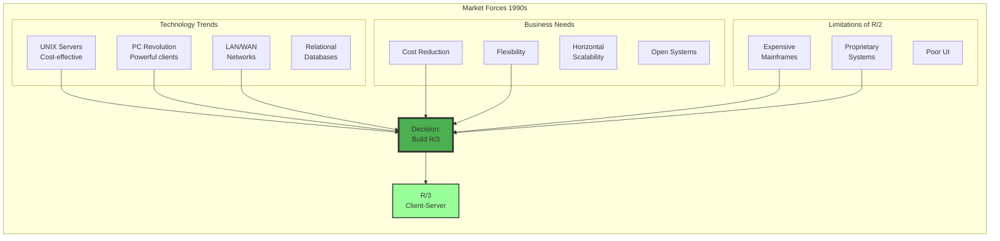

### Революционная трёхуровневая архитектура

```mermaid
graph TB
    subgraph "R/3 Three-Tier Architecture"
        subgraph "Presentation Tier"
            SAPGUI[SAP GUI<br/>Windows/Java/HTML]
            LOCAL[Local Processing<br/>Screen Rendering]
            DIAG_PROT[DIAG Protocol<br/>Optimized]
        end
        
        subgraph "Application Tier"
            subgraph "Application Server 1"
                DISP1[Dispatcher]
                WP_D1[Dialog WPs]
                WP_B1[Background WPs]
                WP_U1[Update WPs]
            end
            
            subgraph "Application Server N"
                DISP2[Dispatcher]
                WP_D2[Dialog WPs]
                WP_B2[Background WPs]
            end
            
            subgraph "Central Services"
                MS[Message Server]
                ENQ[Enqueue Server]
            end
        end
        
        subgraph "Database Tier"
            RDBMS[Relational Database<br/>Oracle, DB2, Informix (изначально). SQL Server добавлен в 1996]
            DATA[Application Data]
            REPO[ABAP Repository]
        end
        
        SAPGUI --> DISP1
        SAPGUI --> DISP2
        
        DISP1 --> WP_D1
        DISP1 --> WP_B1
        DISP1 --> WP_U1
        
        WP_D1 --> RDBMS
        WP_B1 --> RDBMS
        
        MS <--> DISP1
        MS <--> DISP2
Стандартные порты:
- 32NN - Dispatcher
- 33NN - Gateway  
- 36NN - Message Server
- 80NN - ICM HTTP
где NN - номер инстанса
        
        ENQ <--> WP_D1
        ENQ <--> WP_D2
    end
    
    style MS fill:#ff9999,stroke:#333,stroke-width:4px
    style DISP1 fill:#99ccff,stroke:#333,stroke-width:2px
```

### Инновации R/3

**SAP GUI и DIAG протокол**: Первоначальный пользовательский интерфейс R/3 назывался saptemu и, как следует из названия, был по сути эмулятором терминала [14]. Saptemu работал на рабочих станциях UNIX и подключенных X-терминалах. Позже была разработана SAP GUI, которая произвела революцию в пользовательском опыте с графическими возможностями, такими как флажки, радиокнопки, кнопки и фреймы. DIAG протокол минимизировал сетевой трафик, передавая только изменения экрана.

**Work Process концепция**: Из архитектурной перспективы ядро R/3 унаследовало многое от своего предшественника R/2, включая task handler, DYNP, процессор ABAP и интерфейс базы данных. Однако ядро R/2 было реализовано на ассемблере, поэтому ядро R/3 пришлось переписать на C. После первых тестов производительности стало ясно, что каждой сессии нельзя выделять собственный Work Process. Был введен диспетчер для распределения работы пользователей между доступными Work Process [14].

**ABAP Objects**: Решение о добавлении объектной ориентации в ABAP/4 было принято в конце 1990-х. Подход был прагматичным: классы ABAP должны были использовать все существующие элементы языка ABAP/4, такие как внутренние таблицы. Объекты последовательно рассматривались как ссылки, следуя дизайну Java. Это позволило разработчикам ABAP постепенно осваивать объектно-ориентированные принципы [14].
Стандартные порты:
- 32NN - Dispatcher
- 33NN - Gateway  
- 36NN - Message Server
- 80NN - ICM HTTP
где NN - номер инстанса

### Масштабируемость R/3

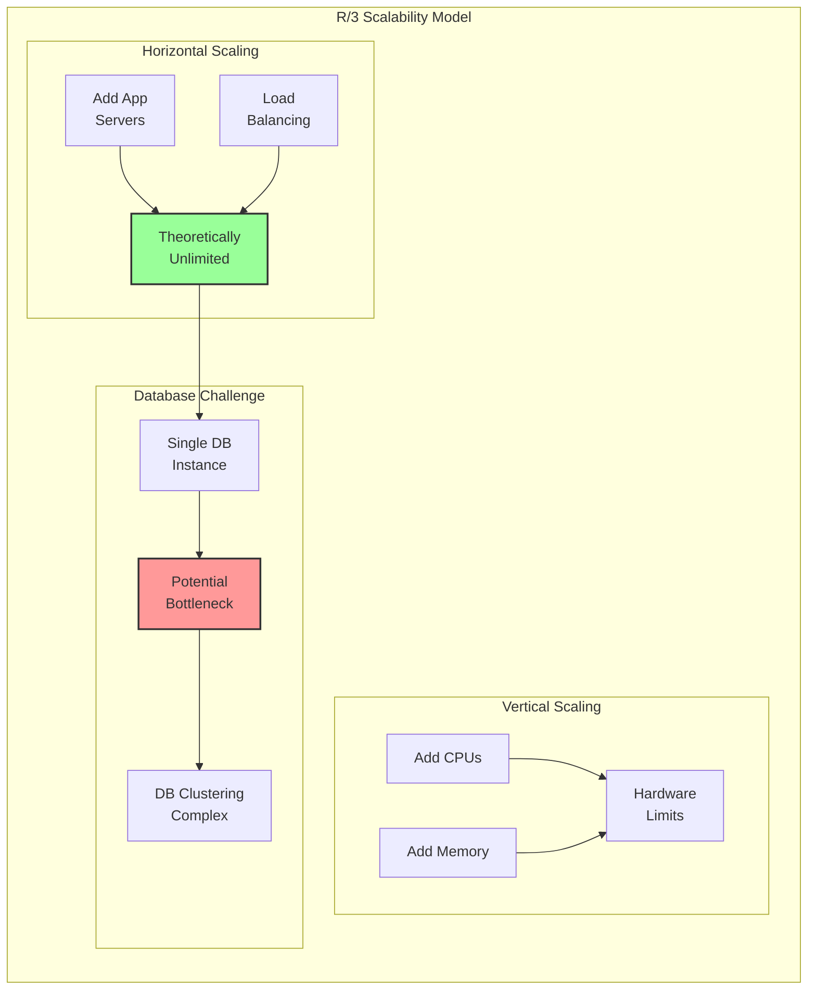

### Пример кода R/3 ABAP/4

```abap
* R/3 ABAP/4 (модульность)
FUNCTION Z_CALCULATE_PRICE.
  price = quantity * unit_price.
ENDFUNCTION.
```

## 7.3. NetWeaver и интеграция Java

В 2003 году SAP анонсировала NetWeaver, первый релиз (NetWeaver '04) вышел в 2004 — технологическую платформу, которая должна была объединить ABAP и Java миры. Это была амбициозная попытка создать универсальную платформу для всех типов приложений.

### Архитектура NetWeaver Dual-Stack

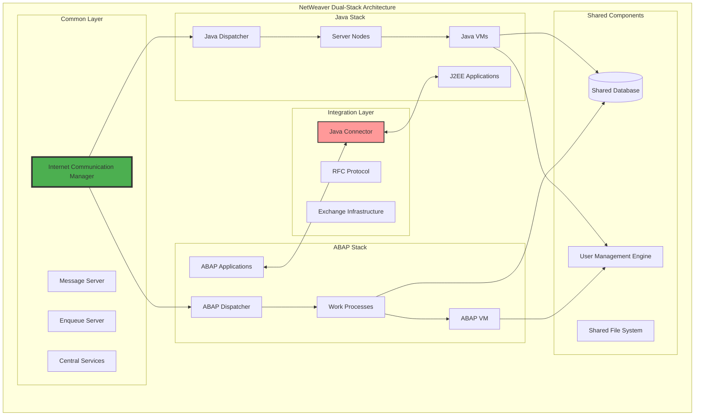

**Важное замечание об ICM**: Начиная с Web AS 6.40, ICM (Internet Communication Manager) интегрирован в процесс disp+work и не является отдельным процессом. Это упрощает архитектуру и управление системой.

### Проблемы Dual-Stack подхода

```mermaid
graph TB
    subgraph "Dual-Stack Challenges"
        subgraph "Operational Complexity"
            ADMIN[Double Administration<br/>ABAP + Java]
            PATCH[Complex Patching<br/>Dependencies]
            MONITOR[Separate Monitoring<br/>Tools]
        end
        
        subgraph "Resource Overhead"
            MEMORY[Требования к памяти: dual-stack требует 2x память (мин. 16GB для малых систем)]
            CPU[CPU Overhead<br/>Two Runtimes]
            STARTUP[Long Startup<br/>Times]
        end
        
        subgraph "Integration Issues"
            PERF[JCo Performance<br/>Overhead]
            TRANS[Transaction<br/>Handling]
            DEBUG[Complex<br/>Debugging]
        end
        
        subgraph "Development"
            SKILLS[Two Skill Sets<br/>Required]
            TOOLS[Different<br/>Tool Chains]
            DEPLOY[Complex<br/>Deployment]
        end
    end
    
    style ADMIN fill:#ff9999,stroke:#333,stroke-width:2px
    style MEMORY fill:#ffcccc,stroke:#333,stroke-width:2px
    style PERF fill:#ff9999,stroke:#333,stroke-width:2px
```

### Эволюция к раздельным стекам

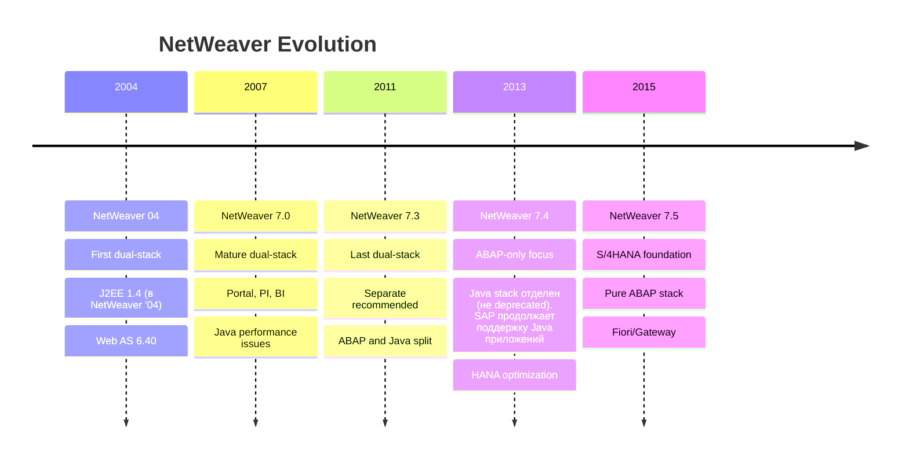

### Уроки NetWeaver эры

**Технологический долг**: Попытка объединить две принципиально разные платформы привела к значительному усложнению архитектуры.

**Производительность**: JCo (Java Connector) создавал дополнительный overhead при коммуникации между стеками.

**Эволюция рынка**: Появление легковесных микросервисов и REST API сделало тяжеловесную J2EE архитектуру устаревшей.

### Пример кода NetWeaver ABAP Objects

```abap
* NetWeaver ABAP Objects
CLASS lcl_price_calculator DEFINITION.
  PUBLIC SECTION.
    METHODS: calculate_price.
ENDCLASS.
```

## 7.4. S/4HANA и in-memory парадигма

S/4HANA, анонсированная в феврале 2015 и выпущенная в ноябре 2015, представляет собой не просто обновление ERP-системы, а фундаментальную переархитектуру, использующую возможности in-memory вычислений SAP HANA.

### Архитектурная трансформация

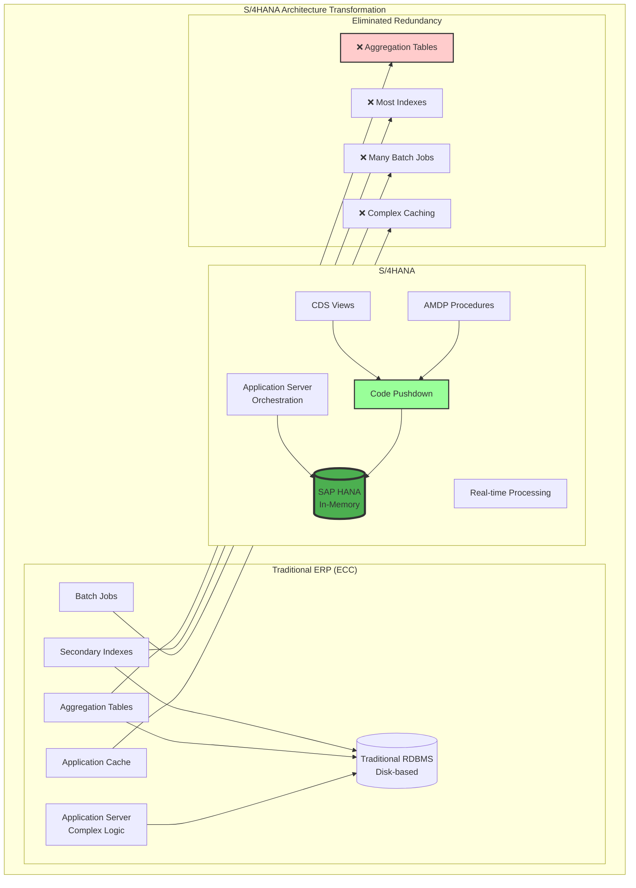

### Упрощение данных модели

```mermaid
graph LR
    subgraph "Data Model Simplification"
        subgraph "ECC Model"
            BKPF[BKPF<br/>Header]
            BSEG[BSEG<br/>Line Items]
            BSIS[BSIS<br/>Open Items GL]
            BSAS[BSAS<br/>Cleared Items GL]
            BSIK[BSIK<br/>Open Items Vendor]
            BSAK[BSAK<br/>Cleared Items Vendor]
            MORE[...12 more tables]
        end
        
        subgraph "S/4HANA Model"
            ACDOCA[Universal Journal<br/>(таблица ACDOCA)]
            BKPF_S4[BKPF<br/>CDS Compatibility View]
            BSEG_S4[BSEG<br/>CDS Compatibility View]
        end
        
        BKPF --> ACDOCA
        BSEG --> ACDOCA
        BSIS --> ACDOCA
        BSAS --> ACDOCA
        BSIK --> ACDOCA
        BSAK --> ACDOCA
        MORE --> ACDOCA
        
        ACDOCA --> BKPF_S4
        ACDOCA --> BSEG_S4
    end
    
    style ACDOCA fill:#4CAF50,stroke:#333,stroke-width:4px
```

### Code-to-Data парадигма в действии

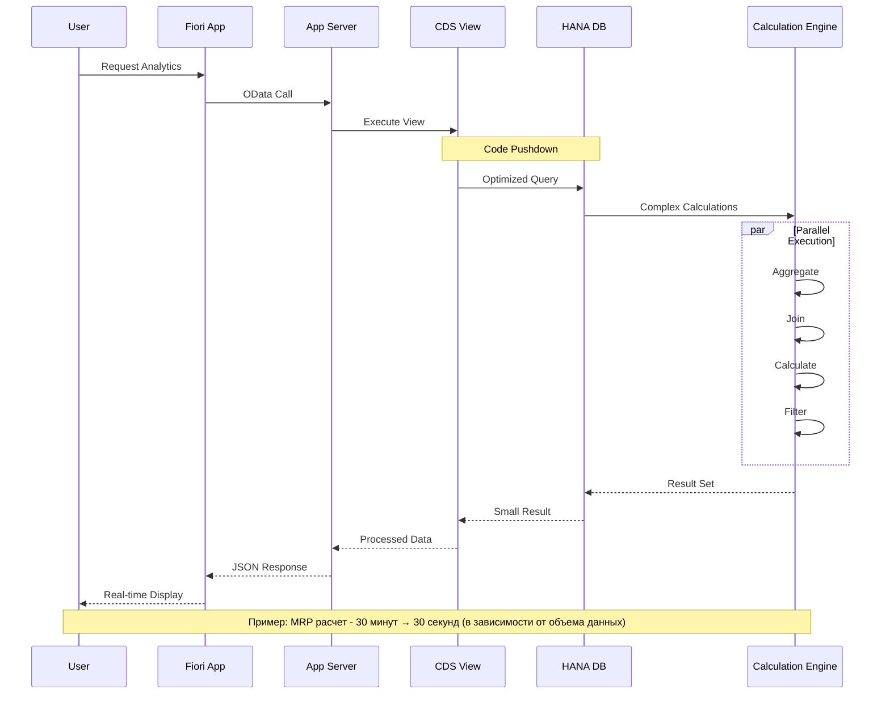

### Инновации S/4HANA

**Fiori UX**: Современный пользовательский интерфейс, построенный на HTML5/SAPUI5, работающий на любых устройствах.

**Embedded Analytics**: Аналитика в реальном времени без отдельных БД или кубов.

**Simplified Data Model**: Устранение избыточности через использование возможностей HANA.

**Digital Core**: Готовность к интеграции с IoT, ML, блокчейн и другими современными технологиями.

### Пример кода S/4HANA (CDS + ABAP)

```abap
* S/4HANA (CDS + ABAP)
@AbapCatalog.sqlViewName: 'ZPRICE_CALC'
define view Z_Price_Calculation as select from mara
{
  key matnr,
  @Semantics.quantity.unitOfMeasure: 'meins'
  quantity * unit_price as total_price
}
```

### Сравнение архитектурных эпох

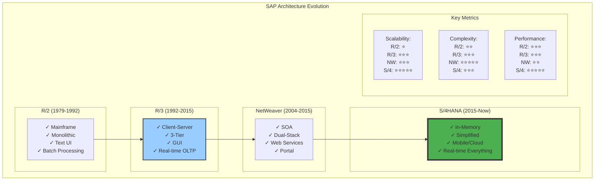

### Будущее: Intelligent Enterprise

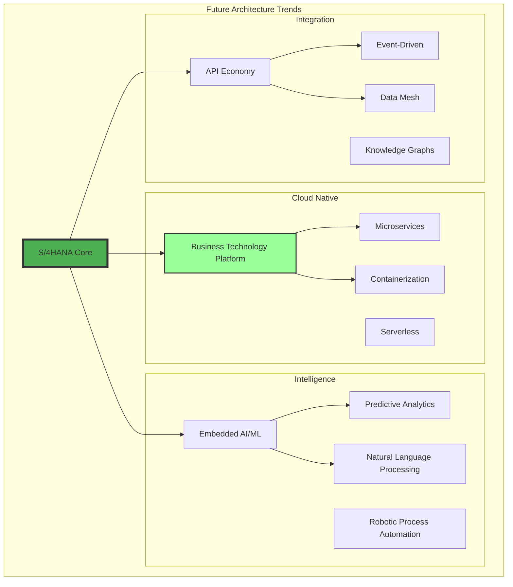

## Полный исторический Timeline развития SAP и ABAP

### 1970-е: Рождение SAP
- **1972** - Основание SAP (Systems, Applications & Products in Data Processing) пятью основателями
- **1973** - Выпуск RF/RFM ("R/1") - первая real-time система финансового учета
- **1976** - Первое документированное упоминание ABAP в брошюре RFM
- **1979** - Релиз SAP R/2 для мейнфреймов

### 1980-е: Эра мейнфреймов и развитие ABAP
- **Начало 1980-х** - Gerd Rodé создает ABAP синтаксис (RSYN) для R/2
- **1985** - ABAP/4 становится основным языком разработки в R/2
- **Конец 1980-х** - Около 50% транзакций R/2 написаны на ABAP, остальные на ассемблере

### 1990-е: Клиент-серверная революция
- **1992** - Релиз SAP R/3 (июль) - переход на трехуровневую архитектуру
- **1992** - SAP имеет 2500 сотрудников, 2000 клиентов R/2
- **1993** - Würth становится первым продуктивным клиентом R/3
- **1996** - Поддержка Microsoft SQL Server добавлена в R/3
- **1999** - Проект enjoySAP - внедрение новых GUI контролов
- **Конец 1990-х** - Введение ABAP Objects (объектно-ориентированное расширение)

### 2000-е: Эра интеграции и веб-технологий
- **2001** - SAP Web Application Server 6.10 - первая независимая поставка базиса
- **2003** - Анонс SAP NetWeaver
- **2004** - NetWeaver '04 - первый dual-stack (ABAP + Java)
- **2004** - Введение Web Dynpro для структурированной веб-разработки
- **2006** - Unicode-поддержка становится обязательной

### 2010-е: In-Memory Computing и облако
- **2010** - Анонс SAP HANA
- **2011** - NetWeaver 7.3 - последняя версия с полной поддержкой dual-stack
- **2012** - ABAP Development Tools (ADT) для Eclipse - 10 лет в 2022
- **2013** - NetWeaver 7.4 - фокус на ABAP-only стек
- **2015** - Релиз SAP S/4HANA - новая эра с HANA как платформой
- **2015** - Core Data Services (CDS) становятся основой моделирования данных

### 2020-е: Облачная трансформация
- **2018** - SAP BTP ABAP Environment (Steampunk) - ABAP в облаке
- **2019** - ABAP RESTful Application Programming Model (RAP)
- **2020** - Embedded Steampunk для S/4HANA Cloud
- **2022** - 50 лет SAP, 30 лет R/3, 10 лет ADT

### Ключевые персоналии в истории ABAP
- **Klaus Tschira** - Создатель первых ассемблерных макросов для работы с данными
- **Gerd Rodé** - Изобретатель ABAP синтаксиса, руководитель команды ABAP до конца 1990-х
- **Karl Kessler** - Product Manager ABAP, автор исторических обзоров

## Заключение

История архитектурной эволюции SAP — это история адаптации к меняющимся технологическим возможностям и бизнес-требованиям:

1. **R/2** отражала эпоху централизованных вычислений, где мейнфреймы были единственным способом обработки корпоративных данных

2. **R/3** революционизировала индустрию, демократизировав доступ к ERP через клиент-серверную архитектуру

3. **NetWeaver** представлял амбициозную, но в конечном счете неудачную попытку объединить ABAP и Java миры

4. **S/4HANA** использует прорыв в технологиях памяти для фундаментального переосмысления обработки данных

Каждая архитектурная эпоха решала проблемы предыдущей, создавая при этом новые вызовы. Понимание этой эволюции критически важно для:

- Архитекторов, проектирующих современные решения
- Разработчиков, работающих с legacy системами
- Руководителей, принимающих решения о модернизации
- Всех, кто хочет понять, куда движется платформа SAP

В следующей главе мы детально рассмотрим SAP HANA — технологию, которая сделала возможной трансформацию S/4HANA и определяет будущее корпоративных вычислений.