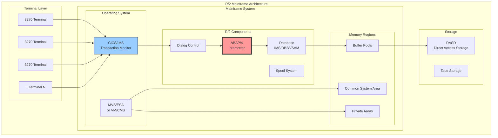
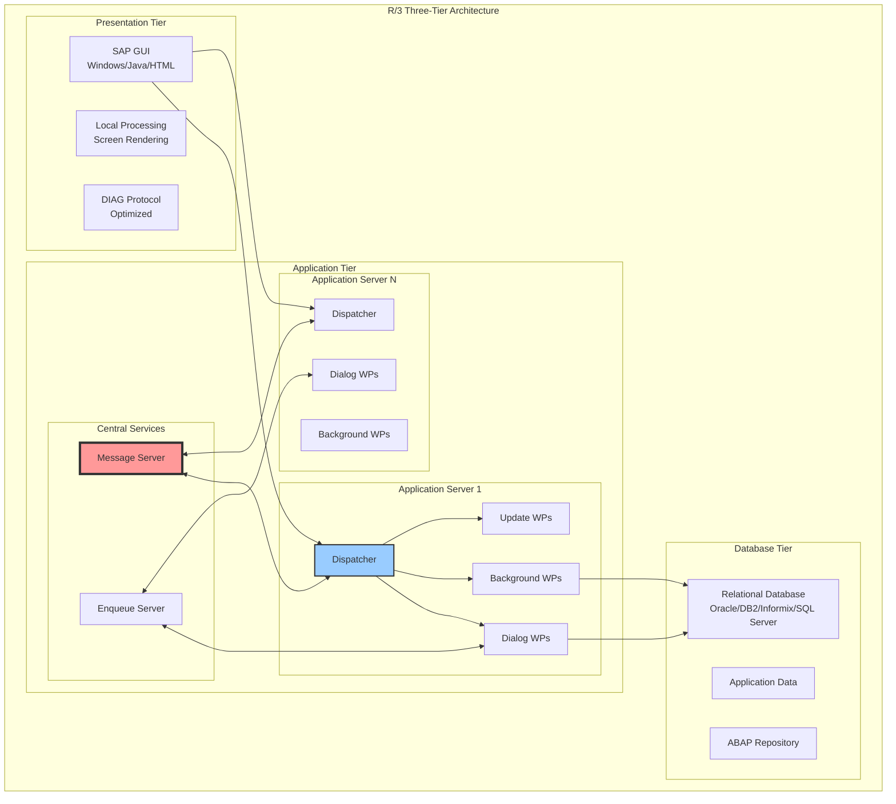
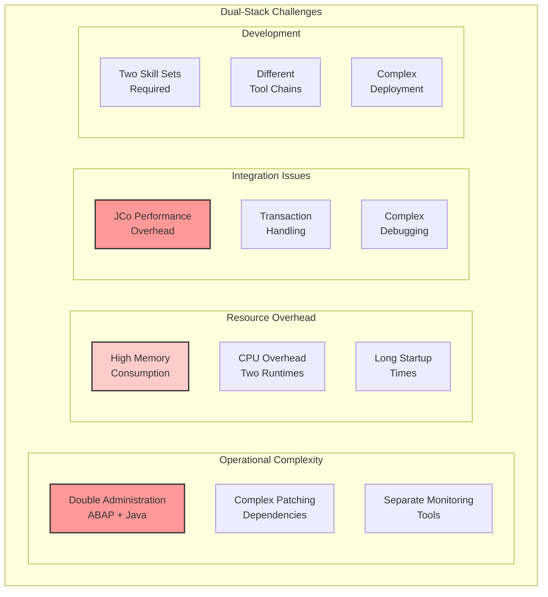
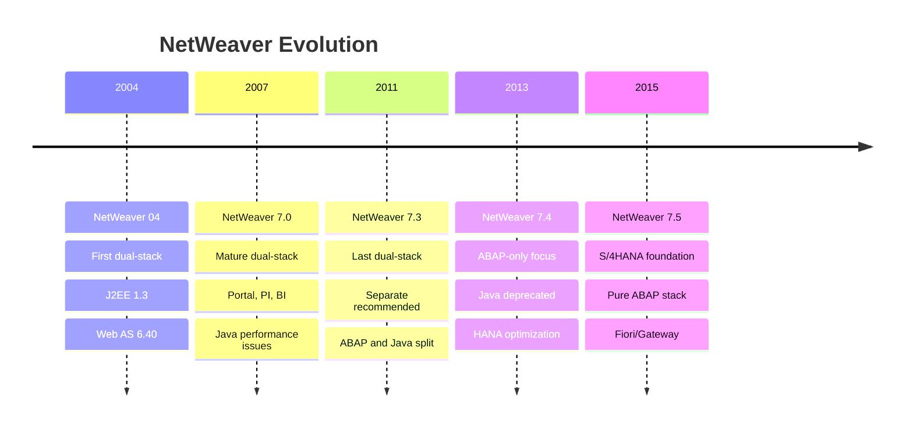
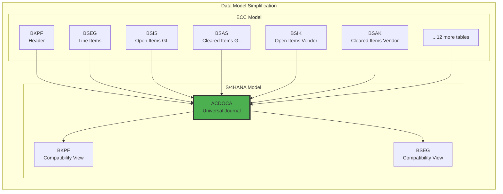
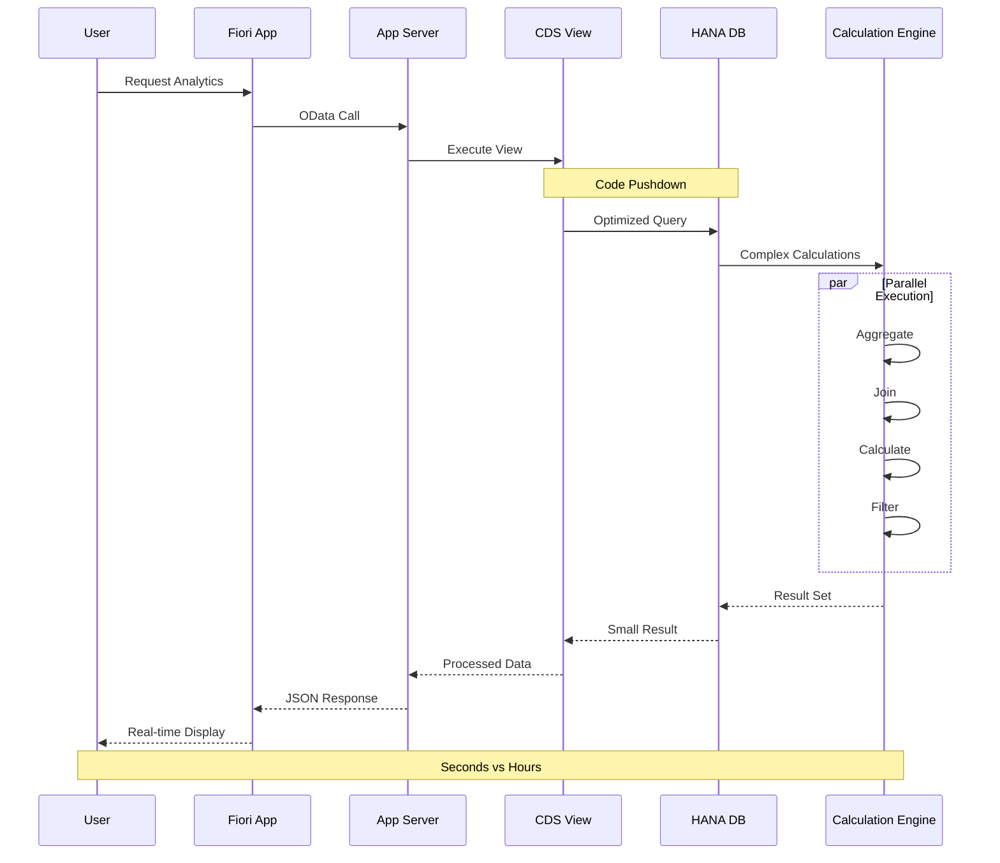

# Глава 7: От R/2 до S/4HANA - архитектурные революции

## 7.1. R/2 и эпоха мейнфреймов

SAP R/2, выпущенная в 1979 году, представляла собой революционную для своего времени систему управления предприятием, работающую на мейнфреймах IBM, Siemens и других производителей. Понимание архитектуры R/2 важно не только с исторической точки зрения — многие концептуальные решения той эпохи до сих пор влияют на современные системы SAP.

### Архитектура R/2

### Ключевые характеристики R/2

**Монолитная архитектура**: Все компоненты выполнялись в едином адресном пространстве мейнфрейма. Это обеспечивало высокую производительность за счет отсутствия сетевых задержек, но ограничивало масштабируемость.

**Терминальная модель**: Пользователи работали через "глупые" терминалы 3270, которые могли отображать только текст в формате 24×80 символов. Вся логика выполнялась на мейнфрейме.

**ABAP/4**: Ранняя версия языка ABAP была процедурной и оптимизированной для batch-обработки больших объемов данных.

### Управление транзакциями в R/2

### Ограничения R/2

## 7.2. R/3 и трёхуровневая революция

В 1992 году SAP выпустила R/3 — систему, которая кардинально изменила ландшафт корпоративного ПО. Переход от мейнфреймов к клиент-серверной архитектуре был не просто технологическим обновлением, а фундаментальной сменой парадигмы.

### Драйверы перехода к R/3

### Революционная трёхуровневая архитектура

### Инновации R/3

**SAP GUI и DIAG протокол**: Графический интерфейс революционизировал пользовательский опыт, при этом DIAG протокол минимизировал сетевой трафик, передавая только изменения экрана.

**Work Process концепция**: Введение специализированных процессов (Dialog, Background, Update, Spool) позволило оптимизировать обработку различных типов задач.

**ABAP Objects**: С версии 4.6 ABAP получил объектно-ориентированные возможности, что кардинально расширило возможности разработки.

### Масштабируемость R/3

## 7.3. NetWeaver и интеграция Java

В 2004 году SAP представила NetWeaver — технологическую платформу, которая должна была объединить ABAP и Java миры. Это была амбициозная попытка создать универсальную платформу для всех типов приложений.

### Архитектура NetWeaver Dual-Stack

### Проблемы Dual-Stack подхода

### Эволюция к раздельным стекам

### Уроки NetWeaver эры

**Технологический долг**: Попытка объединить две принципиально разные платформы привела к значительному усложнению архитектуры.

**Производительность**: JCo (Java Connector) создавал дополнительный overhead при коммуникации между стеками.

**Эволюция рынка**: Появление легковесных микросервисов и REST API сделало тяжеловесную J2EE архитектуру устаревшей.

## 7.4. S/4HANA и in-memory парадигма

S/4HANA, анонсированная в 2015 году, представляет собой не просто обновление ERP-системы, а фундаментальную переархитектуру, использующую возможности in-memory вычислений SAP HANA.

### Архитектурная трансформация

### Упрощение данных модели

### Code-to-Data парадигма в действии

### Инновации S/4HANA

**Fiori UX**: Современный пользовательский интерфейс, построенный на HTML5/SAPUI5, работающий на любых устройствах.

**Embedded Analytics**: Аналитика в реальном времени без отдельных БД или кубов.

**Simplified Data Model**: Устранение избыточности через использование возможностей HANA.

**Digital Core**: Готовность к интеграции с IoT, ML, блокчейн и другими современными технологиями.

### Сравнение архитектурных эпох

### Будущее: Intelligent Enterprise

## Заключение

История архитектурной эволюции SAP — это история адаптации к меняющимся технологическим возможностям и бизнес-требованиям:

1. **R/2** отражала эпоху централизованных вычислений, где мейнфреймы были единственным способом обработки корпоративных данных

2. **R/3** революционизировала индустрию, демократизировав доступ к ERP через клиент-серверную архитектуру

3. **NetWeaver** представлял амбициозную, но в конечном счете неудачную попытку объединить ABAP и Java миры

4. **S/4HANA** использует прорыв в технологиях памяти для фундаментального переосмысления обработки данных

Каждая архитектурная эпоха решала проблемы предыдущей, создавая при этом новые вызовы. Понимание этой эволюции критически важно для:

- Архитекторов, проектирующих современные решения
- Разработчиков, работающих с legacy системами
- Руководителей, принимающих решения о модернизации
- Всех, кто хочет понять, куда движется платформа SAP

В следующей главе мы детально рассмотрим SAP HANA — технологию, которая сделала возможной трансформацию S/4HANA и определяет будущее корпоративных вычислений.