# Глава 8: SAP HANA - больше чем база данных

## 8.1. Архитектура in-memory database

SAP HANA представляет собой революционную платформу, которая переосмысливает традиционные подходы к управлению данными. В отличие от классических СУБД, оптимизированных для дискового хранения, HANA изначально спроектирована для работы с данными в оперативной памяти, что обеспечивает радикальное увеличение производительности.

### Многоуровневая архитектура HANA

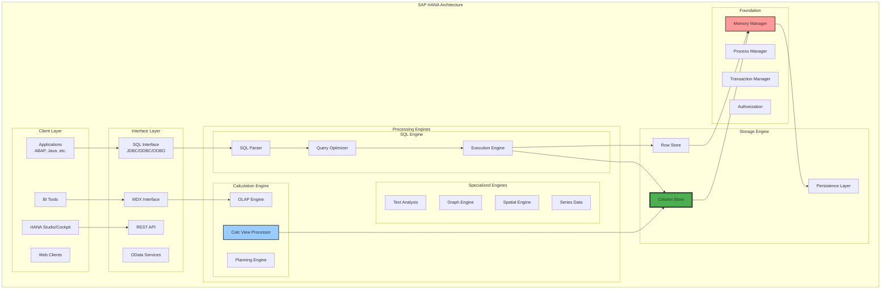

### Процессная модель HANA

HANA использует многопроцессную архитектуру для обеспечения стабильности и производительности:

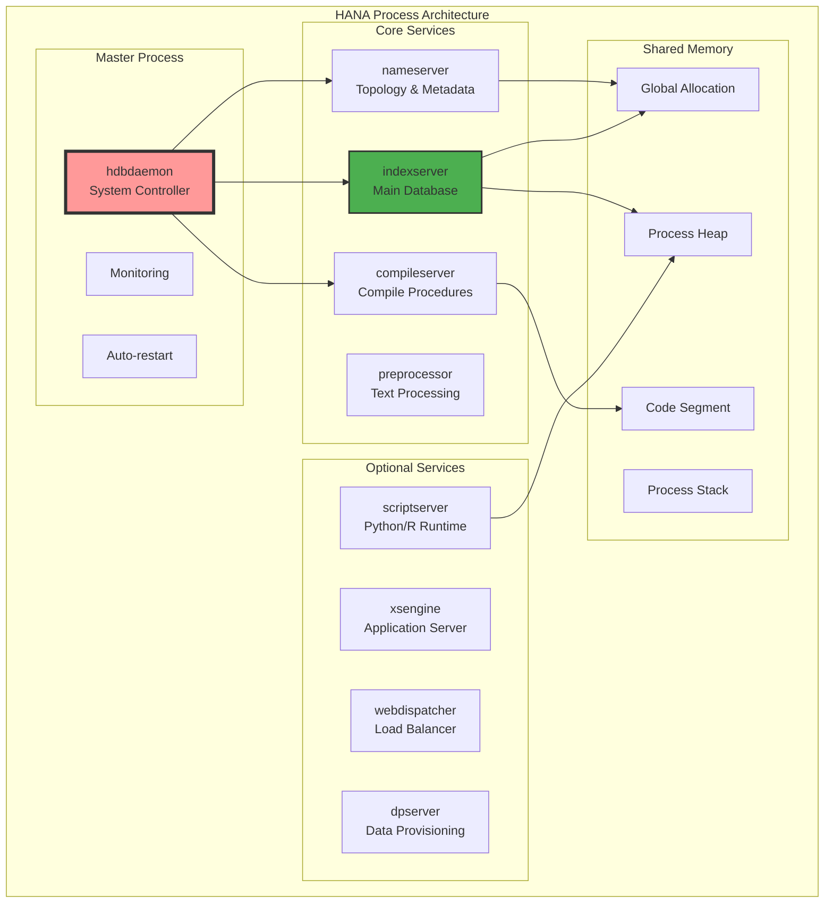

### Управление памятью в HANA

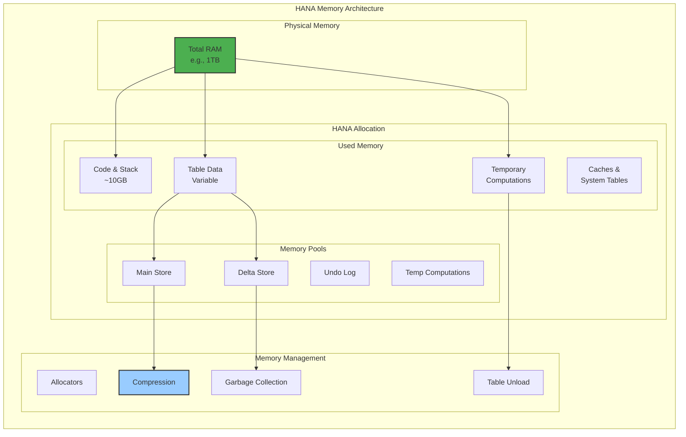

### Persistence Layer

Несмотря на in-memory природу, HANA обеспечивает полную durability через sophisticated persistence layer:

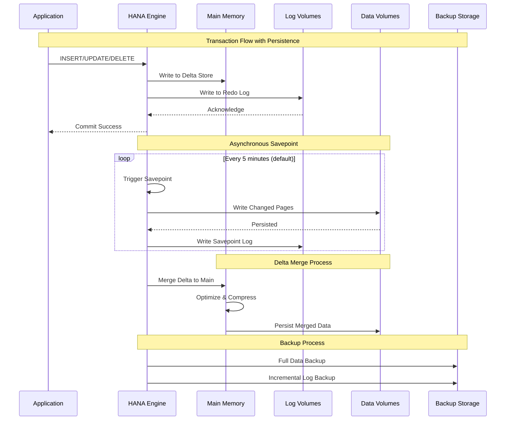

## 8.2. Колоночное хранение и сжатие

Колоночное хранение является фундаментальной инновацией HANA, особенно эффективной для аналитических нагрузок.

### Row Store vs Column Store

```mermaid
graph TB
    subgraph "Storage Comparison"
        subgraph "Row Store"
            ROW1[|ID|Name|Dept|Salary|<br/>|1|Alice|IT|5000|]
            ROW2[|2|Bob|HR|4500|]
            ROW3[|3|Carol|IT|5500|]
            ROW_USE[✓ OLTP workloads<br/>✓ Full row access<br/>✗ Analytics<br/>✗ Compression]
        end
        
        subgraph "Column Store"
            COL_ID[ID<br/>1<br/>2<br/>3]
            COL_NAME[Name<br/>Alice<br/>Bob<br/>Carol]
            COL_DEPT[Dept<br/>IT<br/>HR<br/>IT]
            COL_SAL[Salary<br/>5000<br/>4500<br/>5500]
            COL_USE[✗ Single row access<br/>✓ Analytics<br/>✓ Compression<br/>✓ Parallel processing]
        end
        
        subgraph "Query: SELECT AVG(Salary) WHERE Dept='IT'"
            ROW_SCAN[Row: Scan all rows<br/>Read unnecessary data]
            COL_SCAN[Column: Scan only<br/>Dept and Salary columns]
        end
        
        ROW1 --> ROW_SCAN
        ROW2 --> ROW_SCAN
        ROW3 --> ROW_SCAN
        
        COL_DEPT --> COL_SCAN
        COL_SAL --> COL_SCAN
    end
    
    style COL_SCAN fill:#4CAF50,stroke:#333,stroke-width:2px
    style ROW_SCAN fill:#ff9999,stroke:#333,stroke-width:2px
```

### Механизмы сжатия в Column Store

```mermaid
graph TB
    subgraph "HANA Compression Techniques"
        subgraph "Dictionary Encoding"
            RAW_DEPT[Raw Values:<br/>IT<br/>HR<br/>IT<br/>IT<br/>HR<br/>Sales<br/>IT]
            DICT[Dictionary:<br/>0: HR<br/>1: IT<br/>2: Sales]
            ENCODED[Encoded:<br/>1<br/>0<br/>1<br/>1<br/>0<br/>2<br/>1]
            
            RAW_DEPT --> DICT
            DICT --> ENCODED
        end
        
        subgraph "Run Length Encoding"
            RAW_STATUS[Status:<br/>Active<br/>Active<br/>Active<br/>Active<br/>Inactive]
            RLE[RLE:<br/>(Active, 4)<br/>(Inactive, 1)]
            
            RAW_STATUS --> RLE
        end
        
        subgraph "Bit-Vector Encoding"
            VALUES[Values:<br/>1<br/>5<br/>1<br/>3<br/>1]
            BITVEC[BitVectors:<br/>1: 10101<br/>3: 00010<br/>5: 01000]
            
            VALUES --> BITVEC
        end
        
        subgraph "Advanced"
            PREFIX[Prefix Encoding]
            CLUSTER[Cluster Encoding]
            INDIRECT[Indirect Encoding]
        end
    end
    
    style DICT fill:#4CAF50,stroke:#333,stroke-width:2px
    style RLE fill:#99ccff,stroke:#333,stroke-width:2px
```

### Delta Store и Main Store

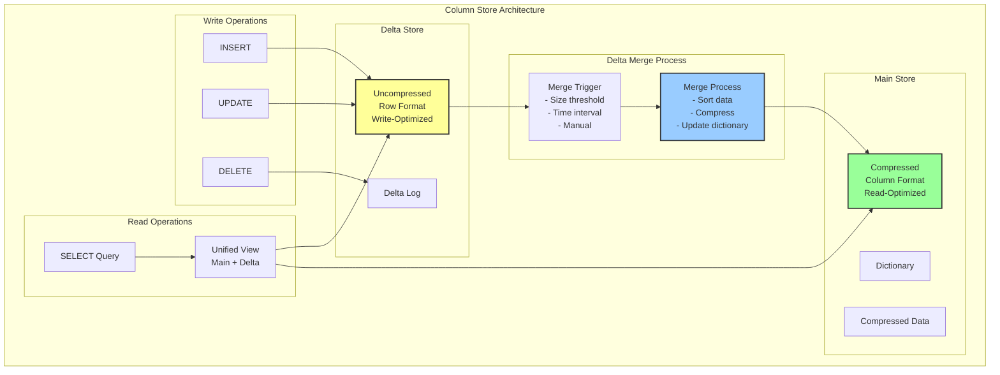

### Эффективность сжатия

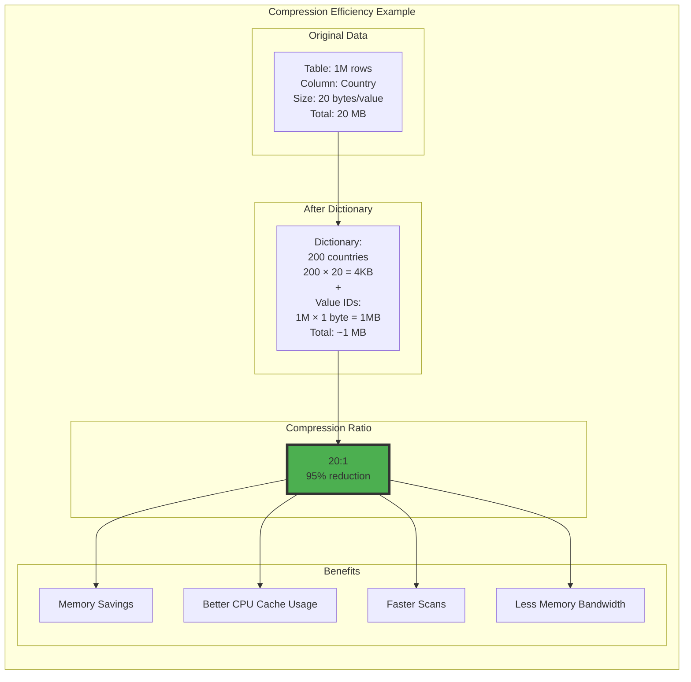

## 8.3. Вычислительный движок и SQLScript

### Calculation Engine Architecture

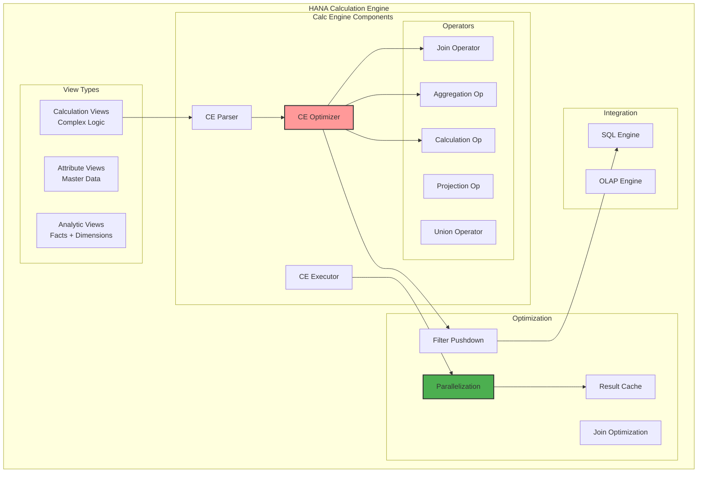

### SQLScript - процедурный язык HANA

SQLScript расширяет стандартный SQL процедурными возможностями, оптимизированными для in-memory обработки:

```sql
-- Пример SQLScript процедуры
CREATE PROCEDURE calculate_customer_value (
    IN ip_date DATE,
    OUT ot_results TABLE (
        customer_id NVARCHAR(10),
        total_orders DECIMAL(15,2),
        avg_order_value DECIMAL(15,2),
        customer_score INTEGER
    )
)
LANGUAGE SQLSCRIPT
SQL SECURITY INVOKER
READS SQL DATA AS
BEGIN
    -- Декларативная часть: использование CE функций
    lt_orders = CE_CALC_VIEW("_SYS_BIC"."sap.demo/OrdersView", 
                            ["CUSTOMER_ID", "ORDER_VALUE", "ORDER_DATE"]);
    
    -- Фильтрация с pushdown
    lt_filtered = APPLY_FILTER(:lt_orders, 
                              "ORDER_DATE" >= ADD_MONTHS(:ip_date, -12));
    
    -- Императивная логика
    DECLARE lv_threshold DECIMAL(15,2) := 10000;
    DECLARE CURSOR c_customers FOR
        SELECT DISTINCT customer_id FROM :lt_filtered;
    
    -- Table variable для результатов
    DECLARE lt_temp TABLE LIKE :ot_results;
    
    -- Параллельная обработка через PARALLEL EXECUTION
    FOR cur_row AS c_customers DO
        PARALLEL EXECUTION
        lt_customer_orders = SELECT * FROM :lt_filtered 
                            WHERE customer_id = cur_row.customer_id;
        
        INSERT INTO :lt_temp
        SELECT customer_id,
               SUM(order_value) as total_orders,
               AVG(order_value) as avg_order_value,
               CASE 
                   WHEN SUM(order_value) > :lv_threshold * 2 THEN 100
                   WHEN SUM(order_value) > :lv_threshold THEN 75
                   ELSE 50
               END as customer_score
        FROM :lt_customer_orders
        GROUP BY customer_id;
    END FOR;
    
    -- Возврат результата
    ot_results = SELECT * FROM :lt_temp;
END;
```

### Оптимизация выполнения SQLScript

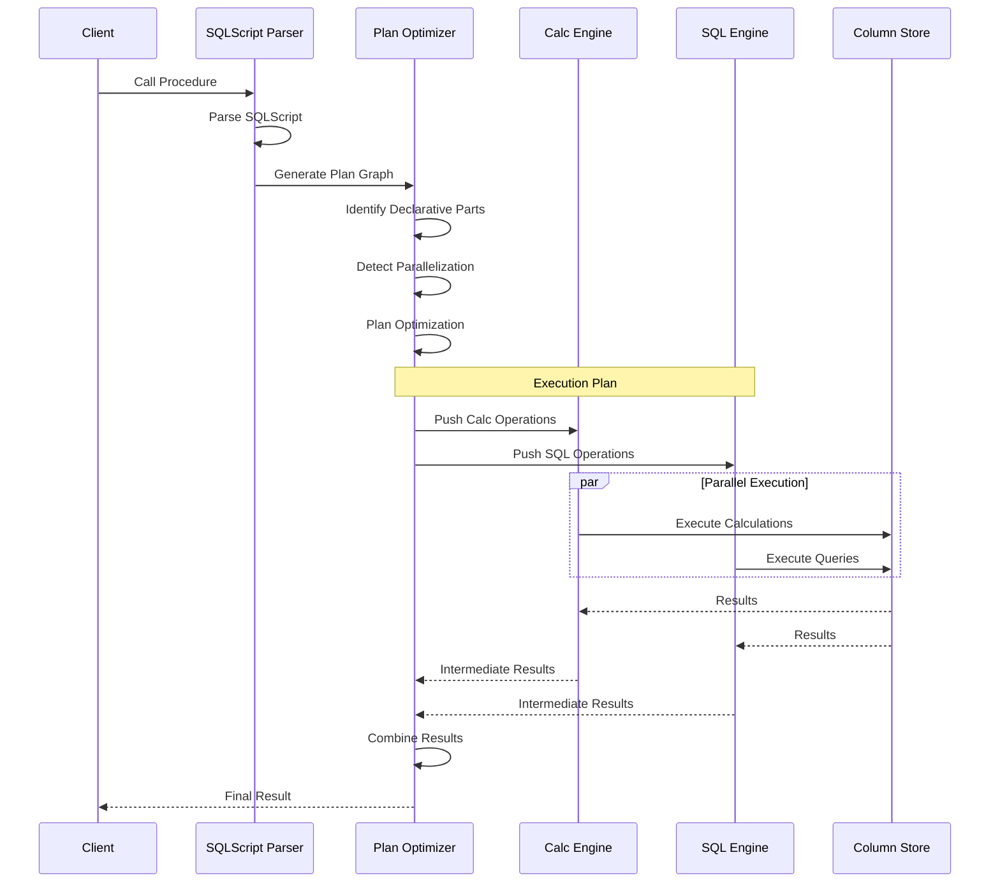

### Векторизация и SIMD

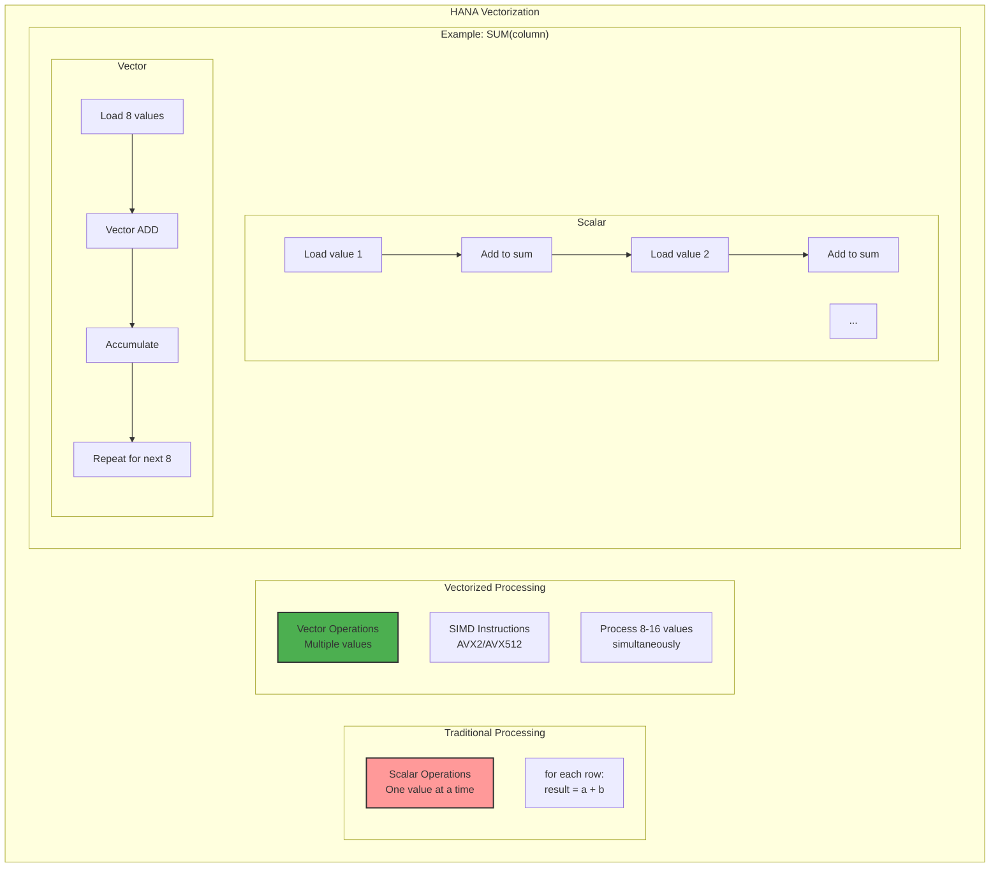

## 8.4. Интеграция с ABAP: CDS и AMDP

### CDS Views в контексте HANA

Core Data Services (CDS) в контексте HANA обеспечивают семантически богатое моделирование данных с автоматической оптимизацией для in-memory обработки:

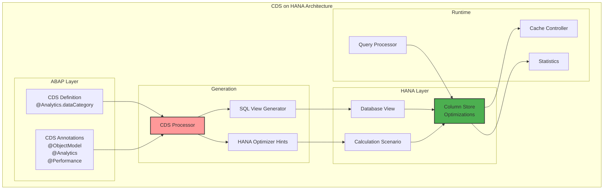

### AMDP - прямой доступ к мощи HANA

ABAP Managed Database Procedures позволяют писать SQLScript прямо в ABAP классах:

```abap
CLASS zcl_amdp_example DEFINITION
  PUBLIC
  FINAL
  CREATE PUBLIC .

  PUBLIC SECTION.
    INTERFACES: if_amdp_marker_hdb.
    
    TYPES: BEGIN OF ty_customer_analytics,
             customer_id TYPE kunnr,
             total_revenue TYPE wrbtr,
             order_count TYPE i,
             avg_order_value TYPE wrbtr,
             days_since_last_order TYPE i,
             churn_probability TYPE decfloat34,
           END OF ty_customer_analytics.
    
    TYPES: tt_customer_analytics TYPE TABLE OF ty_customer_analytics.
    
    CLASS-METHODS: analyze_customers
      IMPORTING
        VALUE(iv_date_from) TYPE dats
        VALUE(iv_date_to) TYPE dats
      EXPORTING
        VALUE(et_analytics) TYPE tt_customer_analytics.
        
ENDCLASS.

CLASS zcl_amdp_example IMPLEMENTATION.
  METHOD analyze_customers BY DATABASE PROCEDURE
                          FOR HDB
                          LANGUAGE SQLSCRIPT
                          OPTIONS READ-ONLY
                          USING vbak vbap kna1.
    
    -- Использование HANA-специфичных функций
    DECLARE lv_current_date DATE;
    lv_current_date = CURRENT_DATE;
    
    -- Window functions для аналитики
    lt_customer_orders = 
      SELECT 
        h.kunnr as customer_id,
        h.vbeln,
        h.erdat as order_date,
        SUM(i.netwr) as order_value,
        -- Window function для последнего заказа
        MAX(h.erdat) OVER (PARTITION BY h.kunnr) as last_order_date,
        -- Running total
        SUM(SUM(i.netwr)) OVER (
          PARTITION BY h.kunnr 
          ORDER BY h.erdat 
          ROWS BETWEEN UNBOUNDED PRECEDING AND CURRENT ROW
        ) as running_total
      FROM vbak as h
      INNER JOIN vbap as i ON h.vbeln = i.vbeln
      WHERE h.erdat BETWEEN :iv_date_from AND :iv_date_to
      GROUP BY h.kunnr, h.vbeln, h.erdat;
    
    -- Использование HANA ML функций
    lt_churn_prediction = 
      SELECT 
        customer_id,
        -- Predictive функция (simplified)
        CASE 
          WHEN days_since_last > 180 THEN 
            0.8 + (days_since_last - 180) * 0.001
          WHEN days_since_last > 90 THEN
            0.5 + (days_since_last - 90) * 0.003
          ELSE
            days_since_last * 0.005
        END as churn_probability
      FROM (
        SELECT 
          customer_id,
          DAYS_BETWEEN(MAX(order_date), :lv_current_date) as days_since_last
        FROM :lt_customer_orders
        GROUP BY customer_id
      );
    
    -- Финальная агрегация с использованием параллелизма
    et_analytics = 
      SELECT 
        co.customer_id,
        SUM(co.order_value) as total_revenue,
        COUNT(DISTINCT co.vbeln) as order_count,
        AVG(co.order_value) as avg_order_value,
        DAYS_BETWEEN(MAX(co.order_date), :lv_current_date) as days_since_last_order,
        COALESCE(cp.churn_probability, 0) as churn_probability
      FROM :lt_customer_orders as co
      LEFT JOIN :lt_churn_prediction as cp
        ON co.customer_id = cp.customer_id
      GROUP BY co.customer_id, cp.churn_probability
      ORDER BY total_revenue DESC;
      
  ENDMETHOD.
ENDCLASS.
```

### Оптимизация ABAP для HANA

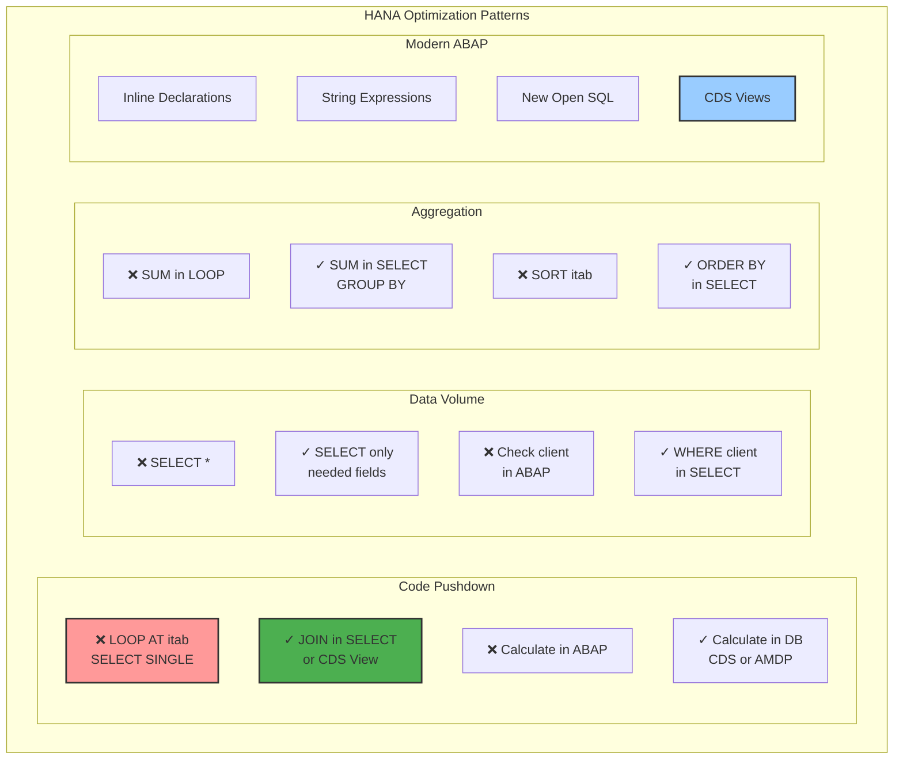

### Мониторинг производительности HANA

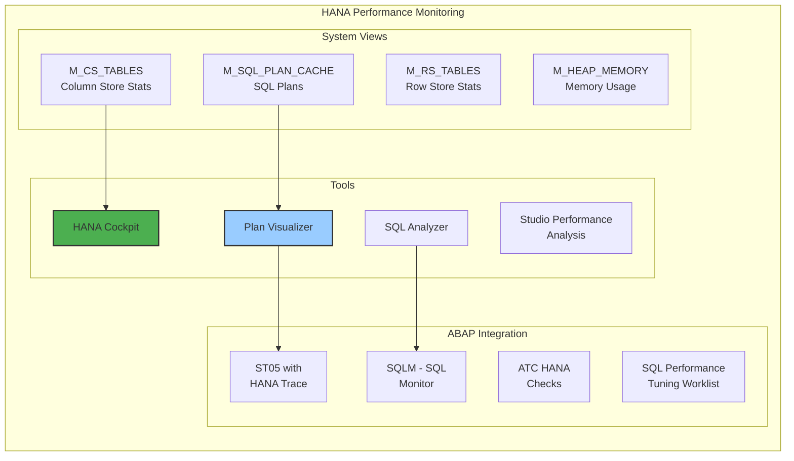

### Best Practices для ABAP на HANA

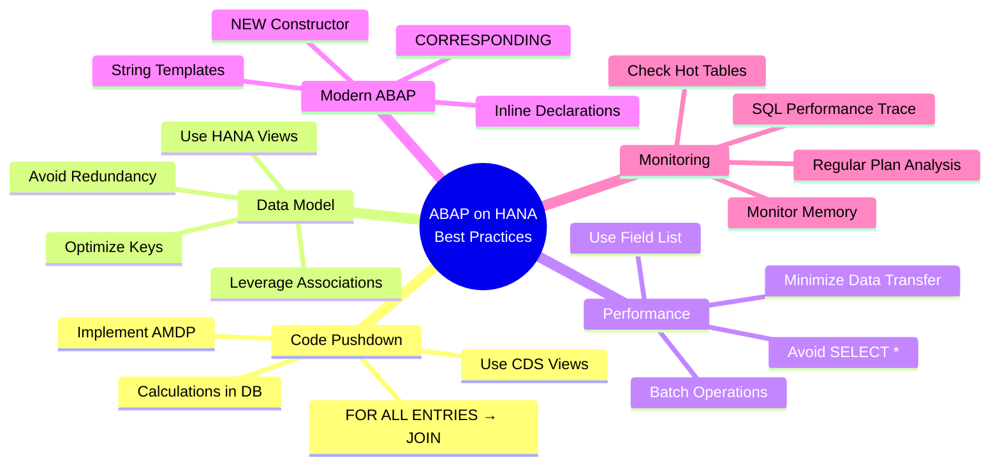

## Заключение

SAP HANA представляет собой не просто базу данных, а комплексную платформу для обработки данных, которая фундаментально меняет подход к разработке корпоративных приложений:

1. **In-Memory Architecture** обеспечивает производительность, недостижимую для традиционных СУБД
2. **Column Store** с продвинутым сжатием позволяет обрабатывать огромные объемы данных
3. **Calculation Engine** переносит вычисления к данным, минимизируя движение данных
4. **SQLScript и AMDP** дают разработчикам прямой доступ к мощи платформы
5. **Тесная интеграция с ABAP** через CDS и современные конструкции языка

Ключевые преимущества для разработчиков:
- Радикальное упрощение кода за счет переноса логики в БД
- Реальная аналитика в реальном времени
- Новые возможности, недоступные в традиционных БД

Понимание архитектуры HANA критически важно для создания современных, высокопроизводительных приложений в экосистеме SAP. В следующей главе мы рассмотрим, как эти возможности используются в современных фреймворках для создания REST API и веб-сервисов.