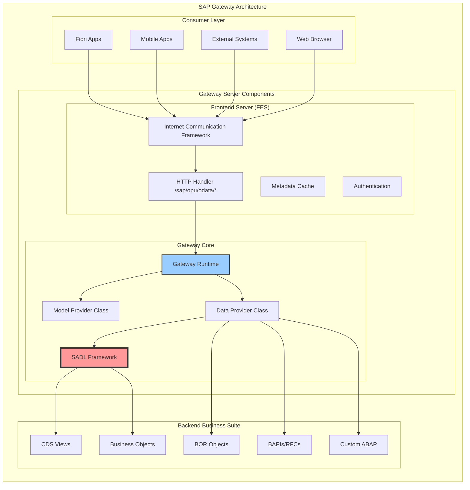
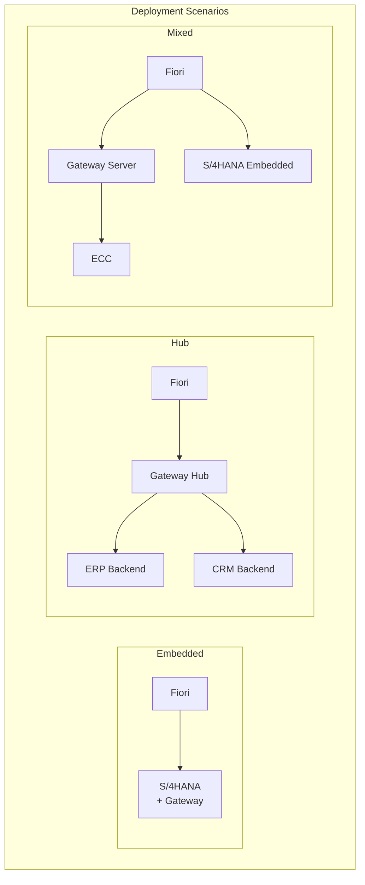
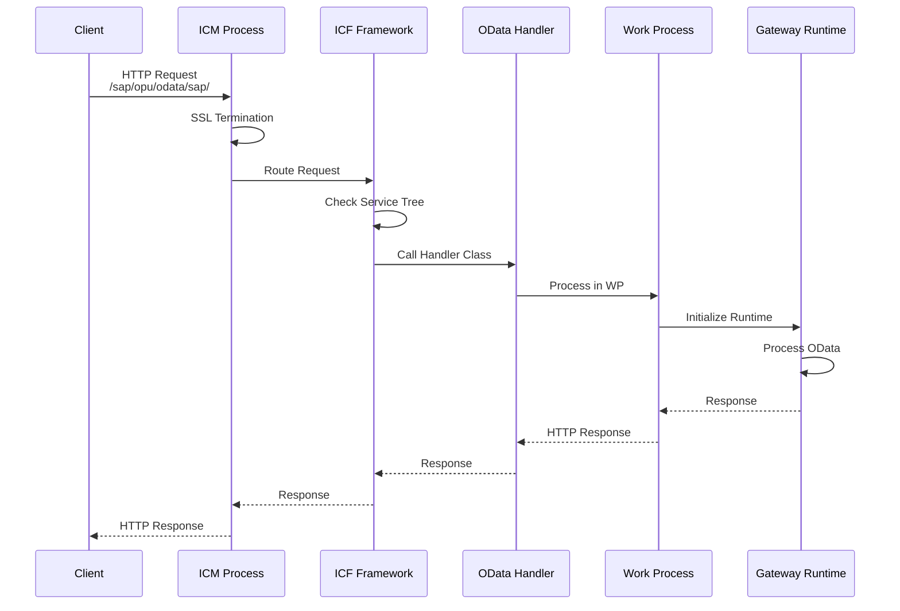
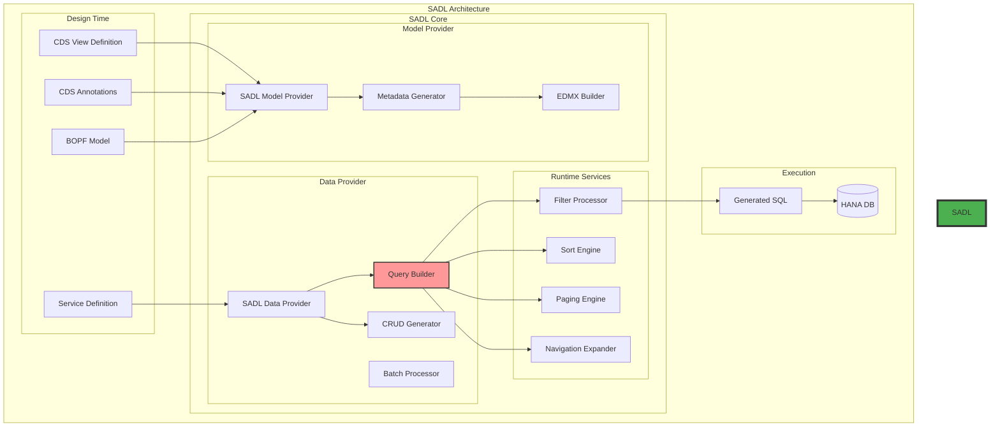
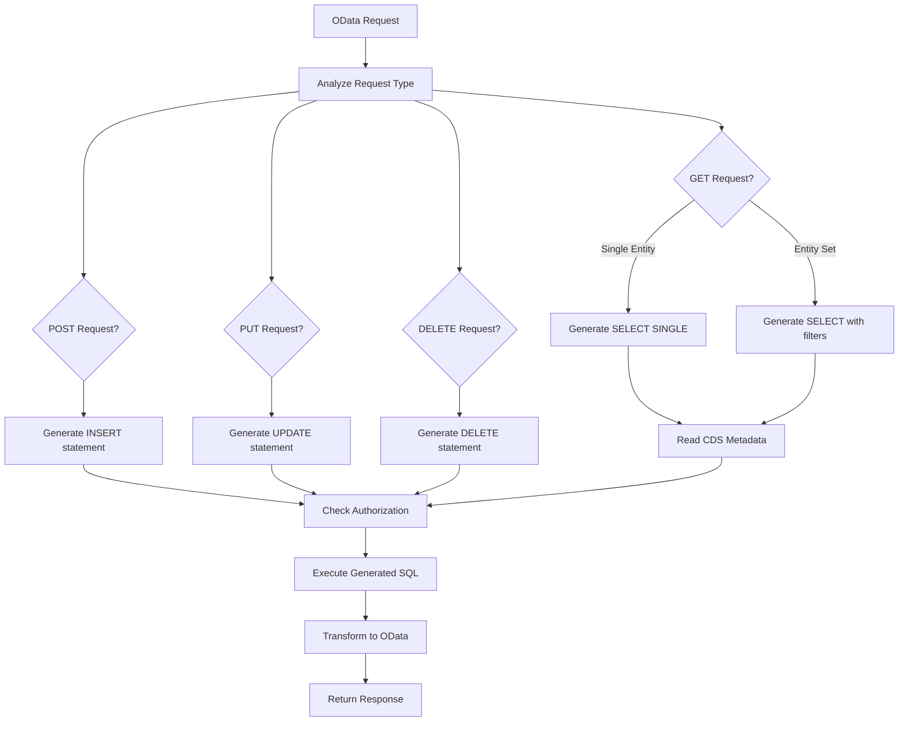
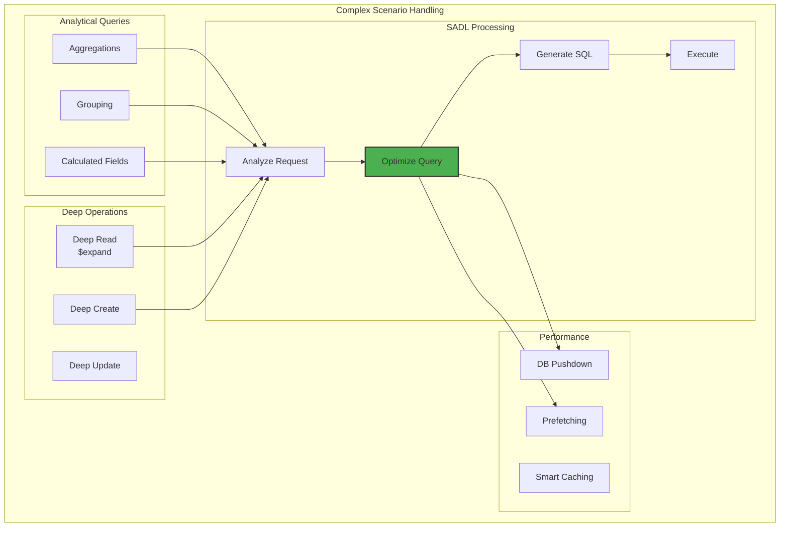
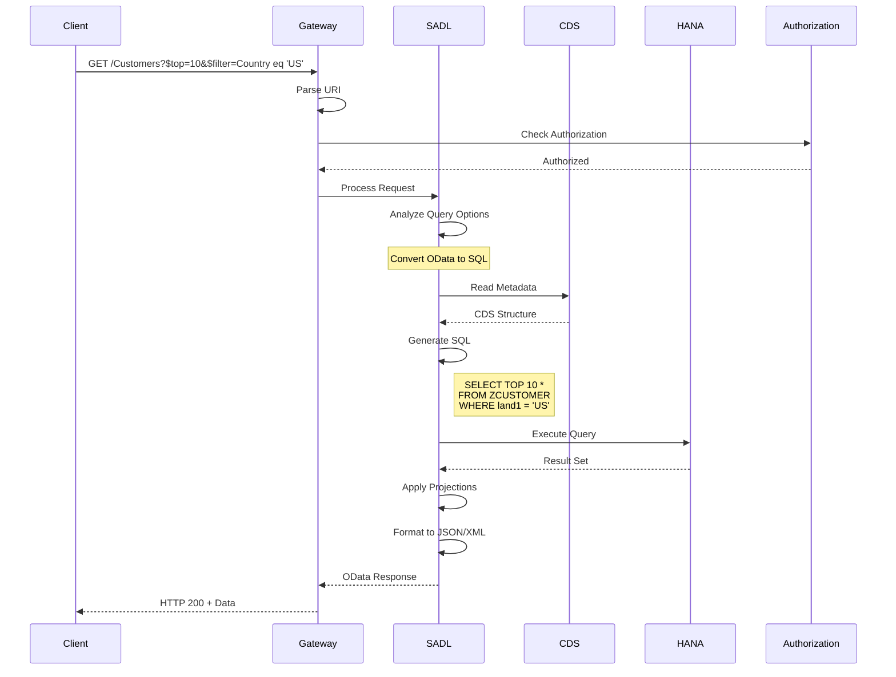
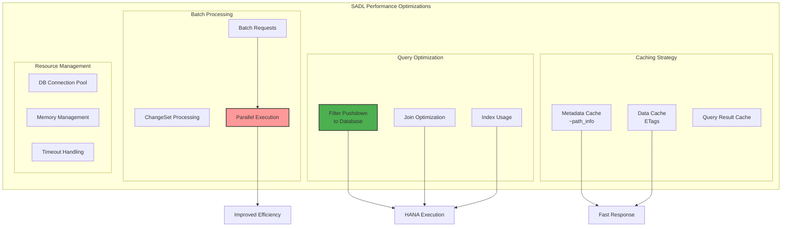
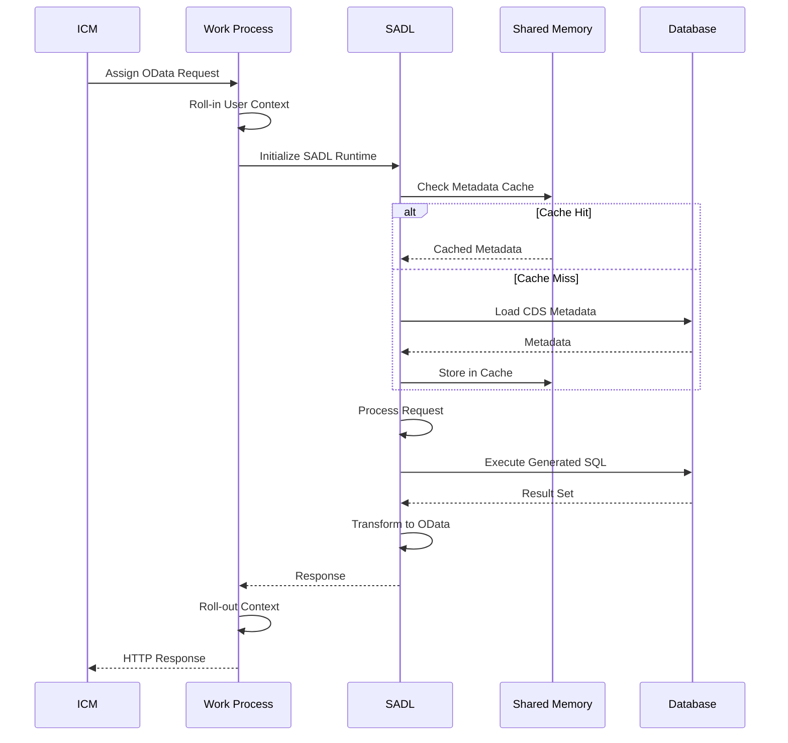
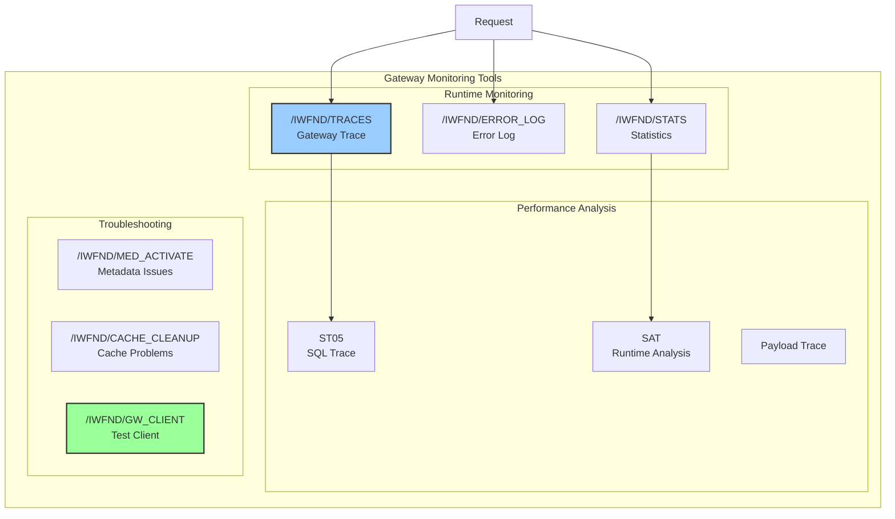

# Глава 9: SADL и Gateway - автоматизация REST API

## 9.1. Архитектура SAP Gateway

SAP Gateway представляет собой технологическую платформу, которая обеспечивает простой и стандартизированный доступ к бизнес-данным и процессам SAP через REST-based сервисы. В основе архитектуры лежит идея предоставления SAP функциональности через открытые протоколы, понятные современным веб-приложениям и мобильным устройствам.

### Компонентная модель Gateway



### Развертывание Gateway

Gateway может быть развернут в нескольких конфигурациях:

1. **Embedded Deployment**: Gateway компоненты установлены на том же сервере, что и бизнес-система
2. **Hub Deployment**: Центральный Gateway hub обслуживает несколько backend систем
3. **Mixed Deployment**: Комбинация embedded и hub подходов



### ICF и обработка HTTP запросов

Internet Communication Framework (ICF) — это основа для всех HTTP-based коммуникаций в SAP:



Конфигурация ICF сервиса для Gateway:

```abap
* Handler class for OData services
CLASS cl_http_handler_odata IMPLEMENTATION.
  METHOD if_http_extension~handle_request.
    DATA: lo_server TYPE REF TO if_http_server.
    lo_server = server.
    
    " Extract service details from URL
    DATA(lv_service) = lo_server->request->get_header_field( '~path_info' ).
    
    " Initialize Gateway runtime
    DATA(lo_gateway) = /iwfnd/cl_mgw_runtime=>create(
      iv_service_id = extract_service_id( lv_service )
    ).
    
    " Process request
    lo_gateway->process_request(
      io_request  = lo_server->request
      io_response = lo_server->response
    ).
  ENDMETHOD.
ENDCLASS.
```

## 9.2. SADL как слой автоматизации

Service Adaptation Definition Language (SADL) представляет собой революционный подход к созданию OData сервисов. Вместо ручного кодирования CRUD операций, SADL автоматически генерирует необходимую логику на основе метаданных.

### Архитектура SADL Framework



### Как SADL генерирует CRUD операции

SADL использует метаданные для автоматической генерации операций:

```abap
* Пример CDS View с SADL аннотациями
@AbapCatalog.sqlViewName: 'ZSALESORDER'
@OData.publish: true
@ObjectModel.semanticKey: ['SalesOrder']
@ObjectModel.representativeKey: 'SalesOrder'
define view Z_C_SalesOrder 
  as select from vbak
  association [0..*] to Z_C_SalesOrderItem as _Items
    on $projection.SalesOrder = _Items.SalesOrder
{
  key vbeln as SalesOrder,
      erdat as CreationDate,
      ernam as CreatedBy,
      netwr as NetValue,
      waerk as Currency,
      
      @ObjectModel.association.type: [#TO_COMPOSITION_CHILD]
      _Items
}
```

SADL автоматически генерирует:

1. **CREATE (POST)**: Вставка новой записи
2. **READ (GET)**: Чтение одной записи или списка
3. **UPDATE (PUT/PATCH)**: Обновление существующей записи
4. **DELETE (DELETE)**: Удаление записи

### Внутренний механизм генерации



### SADL Runtime класс

```abap
* Псевдокод SADL runtime обработки
CLASS /iwbep/cl_sadl_runtime IMPLEMENTATION.
  METHOD process_request.
    " 1. Определение типа операции
    DATA(lv_method) = io_request->get_method( ).
    
    " 2. Извлечение метаданных
    DATA(lo_model) = get_sadl_model( iv_service ).
    
    " 3. Генерация SQL на основе OData запроса
    CASE lv_method.
      WHEN 'GET'.
        DATA(lv_sql) = generate_select_statement(
          io_request = io_request
          io_model   = lo_model
        ).
        
      WHEN 'POST'.
        lv_sql = generate_insert_statement(
          io_request = io_request
          io_model   = lo_model
        ).
        
      WHEN 'PUT' OR 'PATCH'.
        lv_sql = generate_update_statement(
          io_request = io_request
          io_model   = lo_model
        ).
        
      WHEN 'DELETE'.
        lv_sql = generate_delete_statement(
          io_request = io_request
          io_model   = lo_model
        ).
    ENDCASE.
    
    " 4. Выполнение с учетом авторизации
    DATA(lo_auth) = check_authorization( lo_model ).
    IF lo_auth->is_authorized( ).
      execute_generated_sql( lv_sql ).
    ENDIF.
  ENDMETHOD.
ENDCLASS.
```

## 9.3. Генерация OData из CDS

CDS (Core Data Services) views являются предпочтительным источником для SADL-based OData сервисов. Аннотации CDS предоставляют богатые метаданные для автоматической генерации.

### Поток генерации сервиса

```mermaid
graph TB
    subgraph "CDS to OData Generation Flow"
        subgraph "Development"
            DEV[Developer creates<br/>CDS View]
            ANNO[Add OData<br/>Annotations]
            ACT[Activate CDS]
        end
        
        subgraph "Generation Phase"
            PARSE[Parse CDS<br/>Annotations]
            GEN_MPC[Generate MPC<br/>(Model)]
            GEN_DPC[Generate DPC<br/>(Data Provider)]
            REG[Register Service]
        end
        
        subgraph "Runtime Artifacts"
            MPC[Model Provider Class]
            DPC[SADL Data Provider]
            SRV[Service Metadata]
            CACHE[Metadata Cache]
        end
        
        subgraph "Consumption"
            META["/$metadata"]
            DATA["/EntitySet"]
        end
        
        DEV --> ANNO
        ANNO --> ACT
        ACT --> PARSE
        
        PARSE --> GEN_MPC
        PARSE --> GEN_DPC
        GEN_MPC --> MPC
        GEN_DPC --> DPC
        
        MPC --> REG
        DPC --> REG
        REG --> SRV
        SRV --> CACHE
        
        CACHE --> META
        CACHE --> DATA
    end
    
    style PARSE fill:#ff9999,stroke:#333,stroke-width:2px
    style DPC fill:#99ff99,stroke:#333,stroke-width:2px
```

### Аннотации CDS для OData

```abap
@AbapCatalog.sqlViewName: 'ZCUSTOMER'
@AbapCatalog.compiler.compareFilter: true
@AbapCatalog.preserveKey: true
@AccessControl.authorizationCheck: #CHECK

@EndUserText.label: 'Customer Master Data'

@OData.publish: true
@OData.entity.name: 'Customer'
@OData.entity.set.name: 'Customers'

@ObjectModel.semanticKey: ['CustomerID']
@ObjectModel.representativeKey: 'CustomerID'
@ObjectModel.usageType.serviceQuality: #A
@ObjectModel.usageType.sizeCategory: #L
@ObjectModel.usageType.dataClass: #MASTER

define view Z_C_Customer
  as select from kna1
  association [0..*] to Z_C_CustomerAddress as _Address
    on $projection.CustomerID = _Address.CustomerID
  association [0..*] to Z_C_SalesOrder as _Orders  
    on $projection.CustomerID = _Orders.CustomerID
{
      @UI.facet: [{
        id: 'CustomerHeader',
        type: #IDENTIFICATION_REFERENCE,
        label: 'Customer Information',
        position: 10
      }]
      
  key @EndUserText.label: 'Customer ID'
      @UI.lineItem: { position: 10 }
      @UI.identification: { position: 10 }
      @Search.defaultSearchElement: true
      kunnr as CustomerID,
      
      @EndUserText.label: 'Customer Name'
      @UI.lineItem: { position: 20 }
      @UI.identification: { position: 20 }
      @Search.defaultSearchElement: true
      @Search.fuzzinessThreshold: 0.8
      name1 as CustomerName,
      
      @EndUserText.label: 'Country'
      @UI.lineItem: { position: 30 }
      @Consumption.valueHelpDefinition: [{
        entity.name: 'I_Country',
        entity.element: 'Country'
      }]
      land1 as Country,
      
      @EndUserText.label: 'Created On'
      @UI.lineItem: { position: 40 }
      @Semantics.systemDate.createdAt: true
      erdat as CreatedOn,
      
      /* Associations */
      @ObjectModel.association.type: [#TO_COMPOSITION_CHILD]
      _Address,
      
      _Orders
}
```

### Генерация метаданных сервиса

SADL автоматически создает EDMX метаданные:

```xml
<?xml version="1.0" encoding="utf-8"?>
<edmx:Edmx Version="4.0">
  <edmx:DataServices>
    <Schema Namespace="CustomerService">
      
      <EntityType Name="Customer">
        <Key>
          <PropertyRef Name="CustomerID"/>
        </Key>
        <Property Name="CustomerID" Type="Edm.String" MaxLength="10" Nullable="false"/>
        <Property Name="CustomerName" Type="Edm.String" MaxLength="35"/>
        <Property Name="Country" Type="Edm.String" MaxLength="3"/>
        <Property Name="CreatedOn" Type="Edm.Date"/>
        
        <NavigationProperty Name="Address" 
                           Type="Collection(CustomerService.CustomerAddress)"/>
        <NavigationProperty Name="Orders" 
                           Type="Collection(CustomerService.SalesOrder)"/>
      </EntityType>
      
      <EntityContainer Name="CustomerService">
        <EntitySet Name="Customers" EntityType="CustomerService.Customer">
          <NavigationPropertyBinding Path="Address" Target="CustomerAddresses"/>
          <NavigationPropertyBinding Path="Orders" Target="SalesOrders"/>
        </EntitySet>
      </EntityContainer>
      
    </Schema>
  </edmx:DataServices>
</edmx:Edmx>
```

### Обработка сложных сценариев



## 9.4. Runtime обработка запросов

### Жизненный цикл OData запроса



### Query Options обработка

SADL поддерживает все стандартные OData query options:

```abap
CLASS lcl_sadl_query_processor IMPLEMENTATION.
  METHOD process_query_options.
    " $filter обработка
    IF io_request->get_filter( ) IS BOUND.
      DATA(lo_filter) = io_request->get_filter( ).
      rv_where = convert_filter_to_sql( lo_filter ).
    ENDIF.
    
    " $orderby обработка
    IF io_request->get_orderby( ) IS BOUND.
      DATA(lt_orderby) = io_request->get_orderby( ).
      rv_order = convert_orderby_to_sql( lt_orderby ).
    ENDIF.
    
    " $top и $skip для пагинации
    DATA(lv_top) = io_request->get_top( ).
    DATA(lv_skip) = io_request->get_skip( ).
    
    " $expand для навигации
    IF io_request->get_expand( ) IS BOUND.
      DATA(lt_expand) = io_request->get_expand( ).
      handle_expand_navigation( lt_expand ).
    ENDIF.
    
    " $select для проекции
    IF io_request->get_select( ) IS BOUND.
      DATA(lt_select) = io_request->get_select( ).
      rv_fields = convert_select_to_fields( lt_select ).
    ENDIF.
  ENDMETHOD.
ENDCLASS.
```

### Оптимизация производительности



### Обработка на уровне Work Process



### Server-side пагинация

```abap
METHOD implement_server_side_paging.
  DATA: lv_offset TYPE i,
        lv_limit  TYPE i.
  
  " Извлечение параметров пагинации
  lv_offset = io_request->get_skip( ).
  lv_limit  = io_request->get_top( ).
  
  " Значения по умолчанию
  IF lv_limit IS INITIAL OR lv_limit > 1000.
    lv_limit = 100. " Защита от больших запросов
  ENDIF.
  
  " Генерация SQL с LIMIT и OFFSET
  DATA(lv_sql) = |SELECT * FROM { mv_table_name } |.
  
  " Добавление WHERE условий
  IF mv_where_clause IS NOT INITIAL.
    lv_sql = |{ lv_sql } WHERE { mv_where_clause }|.
  ENDIF.
  
  " Добавление сортировки
  IF mv_order_clause IS NOT INITIAL.
    lv_sql = |{ lv_sql } ORDER BY { mv_order_clause }|.
  ENDIF.
  
  " Пагинация для HANA
  lv_sql = |{ lv_sql } LIMIT { lv_limit } OFFSET { lv_offset }|.
  
  " Подсчет общего количества для $count
  IF io_request->is_count_requested( ).
    DATA(lv_count_sql) = |SELECT COUNT(*) FROM { mv_table_name }|.
    IF mv_where_clause IS NOT INITIAL.
      lv_count_sql = |{ lv_count_sql } WHERE { mv_where_clause }|.
    ENDIF.
    " Execute count query
  ENDIF.
ENDMETHOD.
```

### Обработка $expand (навигация)

```mermaid
graph LR
    subgraph "$expand Processing"
        subgraph "Request Analysis"
            REQ[GET /Orders?$expand=Items,Customer]
            PARSE[Parse Expand]
            PATHS[Extract Paths]
        end
        
        subgraph "Query Generation"
            MAIN[Main Query:<br/>SELECT * FROM Orders]
            SUB1[Sub Query 1:<br/>SELECT * FROM Items<br/>WHERE OrderID IN (...)]
            SUB2[Sub Query 2:<br/>SELECT * FROM Customer<br/>WHERE CustomerID IN (...)]
        end
        
        subgraph "Result Assembly"
            JOIN[Join Results<br/>in Memory]
            NEST[Create Nested<br/>Structure]
            JSON[Format as JSON]
        end
        
        REQ --> PARSE
        PARSE --> PATHS
        PATHS --> MAIN
        PATHS --> SUB1
        PATHS --> SUB2
        
        MAIN --> JOIN
        SUB1 --> JOIN
        SUB2 --> JOIN
        
        JOIN --> NEST
        NEST --> JSON
    end
    
    style JOIN fill:#ff9999,stroke:#333,stroke-width:2px
```

### Обработка ошибок

```abap
CLASS lcl_sadl_error_handler IMPLEMENTATION.
  METHOD handle_error.
    DATA: ls_error TYPE /iwbep/s_mgw_error.
    
    CASE ix_exception->if_t100_message~t100key.
      WHEN /iwbep/cx_mgw_not_impl_exc=>method_not_implemented.
        ls_error-code = '501'.
        ls_error-message = 'Method not implemented'.
        
      WHEN /iwbep/cx_mgw_busi_exception=>business_error.
        ls_error-code = '400'.
        ls_error-message = ix_exception->get_text( ).
        
      WHEN /iwbep/cx_mgw_tech_exception=>technical_error.
        ls_error-code = '500'.
        ls_error-message = 'Internal server error'.
        
      WHEN cx_sy_open_sql_db=>sql_error.
        ls_error-code = '500'.
        ls_error-message = 'Database error'.
    ENDCASE.
    
    " Формирование OData error response
    DATA(lo_response) = create_error_response( ls_error ).
    
    " Логирование
    /iwfnd/cl_mgw_logger=>log_error( ls_error ).
  ENDMETHOD.
ENDCLASS.
```

### Мониторинг и трассировка



## Заключение

SAP Gateway с SADL представляет собой мощную платформу для автоматизации создания REST API. Ключевые архитектурные преимущества:

1. **Автоматизация**: SADL устраняет необходимость ручного кодирования CRUD операций
2. **Производительность**: Оптимизация запросов и pushdown к базе данных
3. **Стандартизация**: Полная поддержка OData протокола
4. **Масштабируемость**: Эффективное использование ресурсов через кэширование и пулинг

Понимание внутренней архитектуры Gateway и SADL критически важно для:

- Разработчиков, создающих Fiori приложения
- Архитекторов, проектирующих интеграционные решения
- Администраторов, оптимизирующих производительность
- Всех, кто работает с современным SAP стеком

В следующей главе мы рассмотрим эволюцию от BOPF к RAP — современному подходу к созданию бизнес-объектов в SAP.