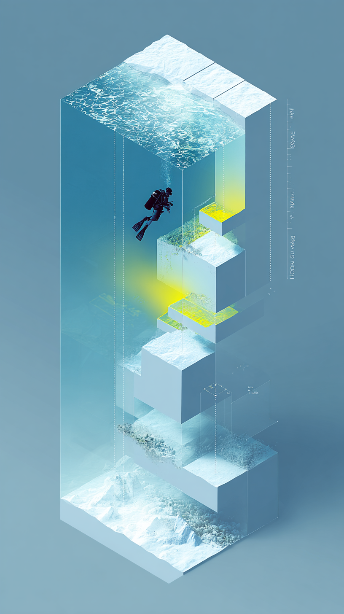

# ABAP Deep Dive: Архитектура, ядро и эволюция SAP

## О проекте

Это техническая книга-исследование внутренней архитектуры SAP ABAP, от фундаментальных концепций до современных облачных технологий. Проект представляет собой глубокое погружение в механизмы работы платформы SAP, написанное на уровне детализации, сравнимом с классическими трудами по компьютерным системам.

## Содержание

### Часть I: Фундаментальная архитектура
- [Глава 1: Анатомия SAP системы](ADD%20-%20Глава%201%20%20Анатомия%20SAP%20системы.md) - Трёхуровневая архитектура, ASCS, балансировка нагрузки
- [Глава 2: Ядро SAP](ADD%20-%20Глава%202%20Ядро%20SAP%20-%20операционная%20система%20бизнес-приложений.md) - Исполняемые файлы ядра, disp+work, обновление ядра
- [Глава 3: Work Process](ADD%20-%20Глава%203%20Work%20Process%20-%20микрокосм%20выполнения.md) - Внутренняя структура WP, жизненный цикл запроса

### Часть II: Управление памятью и исполнение кода
- [Глава 4: Иерархия памяти](ADD%20-%20Глава%204%20Иерархия%20памяти%20-%20балансировка%20между%20масштабируемостью%20и%20выживанием.md) - Roll Area, Extended Memory, режим PRIV
- [Глава 5: ABAP Virtual Machine](ADD%20-%20Глава%205%20ABAP%20Virtual%20Machine%20-%20от%20исходника%20к%20исполнению.md) - Компиляция в байт-код, структура Load объектов
- [Глава 6: Database Interface](ADD%20-%20Глава%206%20Database%20Interface%20-%20мост%20между%20ABAP%20и%20СУБД.md) - Open SQL, буферизация, LUW концепция

### Часть III: Эволюция платформы
- [Глава 7: От R/2 до S/4HANA](ADD%20-%20Глава%207%20От%20R2%20до%20S4HANA%20-%20архитектурные%20революции.md) - История архитектурных революций
  - [Приложение: Протоколы SAP](ADD%20-%20Глава%207%20Приложение%20Протоколы%20SAP%20-%20открытость%20и%20внутреннее%20устройство.md) - DIAG, RFC, APC протоколы
- [Глава 8: SAP HANA](ADD%20-%20Глава%208%20SAP%20HANA%20-%20больше%20чем%20база%20данных.md) - In-memory архитектура, code pushdown

### Часть IV: Современные фреймворки и облако
- [Глава 9: SADL и Gateway](ADD%20-%20Глава%209%20SADL%20и%20Gateway%20-%20автоматизация%20REST%20API.md) - Автоматизация REST API
- [Глава 10: От BOPF к RAP](ADD%20-%20Глава%2010%20От%20BOPF%20к%20RAP%20-%20эволюция%20бизнес-объектов.md) - Эволюция бизнес-объектов
- [Глава 11: ABAP Daemons и Channels](ADD%20-%20Глава%2011%20ABAP%20Daemons%20и%20Channels%20-%20реактивная%20архитектура.md) - Реактивная архитектура

### Часть V: Отладка и анализ производительности
- [Глава 12: Инструменты анализа](ADD%20-%20Глава%2012%20Инструменты%20анализа%20-%20заглядываем%20внутрь.md) - ST05, ST12, Memory Inspector

## Ключевые темы

### Архитектура
- **SAP Instance** = disp+work процесс + общая память + конфигурация
- **Work Process** = Task Handler + Screen Processor + ABAP Processor + DB Interface
- **ASCS** = Message Server + Enqueue Server + высокая доступность

### Управление памятью
- Иерархия выделения памяти: Roll → Extended → Heap
- Shared Memory: буферы программ (PXA), словарь (Nametab), таблицы
- Shared Objects (SHMA) с версионированием

### Эволюция
- R/2 (мейнфрейм) → R/3 (клиент-сервер) → NetWeaver → S/4HANA
- От пассивной БД к активным вычислениям в HANA
- Code pushdown: CDS Views, AMDP, Native procedures

### Современные технологии
- RAP (RESTful ABAP Programming Model)
- ABAP в облаке (BTP Steampunk)
- Реактивная архитектура (Daemons, AMC/APC)

## Целевая аудитория

- Архитекторы SAP систем
- Разработчики ABAP с опытом
- Системные администраторы SAP Basis
- Исследователи корпоративных платформ

## Особенности

- **Глубина изложения**: Детальное исследование внутренних механизмов
- **Актуальность**: Покрытие современных технологий S/4HANA и BTP
- **Практичность**: Лабораторные работы и примеры для каждой главы
- **Визуализация**: Mermaid-диаграммы для иллюстрации архитектуры

## Полное оглавление

Детальное оглавление с аннотациями всех глав доступно в файле [ADD - ABAP Deep Dive.md](ADD%20-%20ABAP%20Deep%20Dive.md)

## Статус проекта

Проект находится в активной разработке. Главы 1-3 и 9-10 содержат полный материал, остальные главы дополняются. Приложение к главе 7 о протоколах SAP также включено.

## Лицензия

Материалы предназначены для образовательных целей в области изучения архитектуры SAP систем.

---

*"Понимание внутренней архитектуры - ключ к построению эффективных решений"*